### 전송계층

#### 1. UDP

✅ **User Datagram Protocol / 사용자 데이터그램 프로토콜 **

✅ 컴퓨터가 다른 컴퓨터와 `데이터 통신`을 하기 위한 규약(프로토콜)의 일종 / 통신 프로토콜

- UDP의 특징
  - 비연결형 서비스를 제공
  - 헤더와 전송 데이터에 대한 체크썸 기능을 제공(보통은 사용하지 않음)
  - Best Effort 전달 방식을 지원
    - **최선 노력 네트워크** : 빠른 시간내의 데이터 전송을 최우선으로 하는 전달 방식
    - 전송한 데이터가 제대로 도착했는지 확인을 하지 않음 -> 신뢰성이 상대적으로 낮음
    - 데이터 처리가 빠르므로 데이터 전송시간에 민감한 환경에서는 유리
  - 멀티미디어 전송/ 실시간 전송 등에서 UDP 선호

- UDP 헤더

  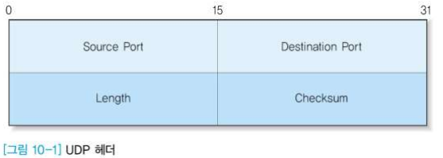

  - Source Port / Destination Port
    - 송수신 프로세스에 할당된 네트워크 포트 번호
  - Length
    - 헤더를 포함한 UDP 데이터그램 크기
    - 이론적으로 2^16(65,535)까지 가능하나, 일반적으로 8,192 바이트를 넘지 않게 사용
  - Checksum
    - 헤더와 데이터에 대한 체크썸
    - IP의 경우 헤더에 대한 체크썸만 수행
    - 옵션이므로 0으로 처리하는 경우도 있음(체크썸 계산하지 않음)

- UDP의 데이터 전송

  - `비연결형 서비스`

    - 각 데이터그램이 독립적으로 전송되고, 독립적으로 중개
      - 도착 순서가 바뀌어 도착할 수 있음
    - 흐름 제어가 없으므로 `버퍼 부족`으로 인한 데이터 분실 가능성 -> 응용에서 처리 필요
    - 응용에서 `순서번호`와 유사한 기능을 구현해야 할 필요성

  - UDP에서의 데이터그램 분실

    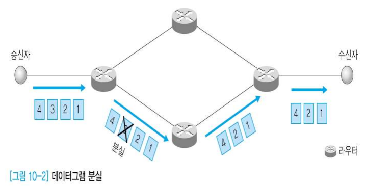

  - UDP에서의 데이터그램 도착 순서 변경

    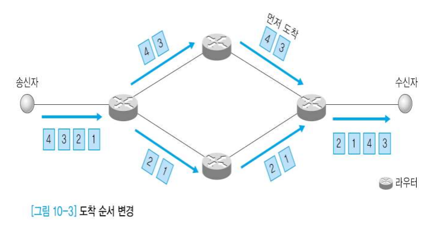

#### 2. RTP

✅ **Real-time Transport Protocol / 실시간 전송 프로토콜**

✅  IP 네트워크 상에서 `오디오`와 `비디오`를 전달하기 위한 통신 프로토콜

- 멀티미디어 서비스 환경의 변화
  - 기존 : 비디오, 오디오 파일 전체를 다운 받은 후 서비스
  - 실시간 스트리밍 서비스 등장
    - 데이터 변형/분실 오류를 복구하는 기능이 상대적으로 덜 중요
      - "데이터 변형된 걸 수정하기보다 차라리 다음 것을 빨리 받는게 중요하다!"
    - 도착 순서, 패킷의 지연 간격, 데이터 압축 등이 중요
    - TCP
      - 패킷의 순서와 신뢰성이 지나치게 강조
      - 패킷 재전송 기능과 복잡한 프름제어로 부적합
    - UDP
      - 기능이 단순하여 빠른 전송 가능
      - 순서를 보장하지 못함
    - **가장 현실적인 대안은 UDP에 순서번호 기능을 추가하는 것**
      - **RTP(Real Time Protocol)**

- RTP의 특징
  - IETF의 `오디오`, `비디오` 트랜스포트 작업반에서 작업
    - RFC 1990(1996)
    - RFC 3550, 3551(2003)
    - 관련 RFC : 6184(H.264 Video) , 4103(Text Conversation), 3640(MPEG4 Elementary Streams), 3016(MPEG4 Audio/Video Streams), 2250(MPEG1/MPEG2), 4175(Uncompressed Video), 4695(MIDI), 4696
  - 데이터 순서 정렬을 위해 `타임스탬프(time stamp) 방식` 사용
    - **타임스탬프** : 특정 시점까지 얼마나 많은 초(second) 단위의 시간이 지났는지를 통해 `특정 시점을 표기`하는 방식
  - 프로토콜 동작이 응용프로그램의 라이브러리 형태로 구현되는 ALF(Application Level Function) 사용으로 응용마다 별도의 버퍼 크기 조절 및 관리 가능
  - 실시간 응용 서비스에 유용
    - 자원 예약이나 QoS 보장 기능이 없어서 실시간 동영상 서비스 제공에는 부족

- 실시간 요구 사항
  - 일반 데이터 서비스 환경
    - 파일 전송, 전자 메일 등
    - 신뢰성이 중요
    - 성능과 지연 문제는 덜 중요
  - 실시간 데이터 서비스 환경
    - 정해진 시간 내에 도착하는지의 여부가 중요
      - 특정 시간 내에 도착하지 못하면 무용지물
    - 신뢰성은 덜 중요 => 실시간성이 더 중요!

- 버퍼의 역할

  - 버퍼 : 데이터를 한 곳에서 다른 한 곳으로 전송하는 동안 일시적으로 그 데이터를 보관하는 메모리의 영역

    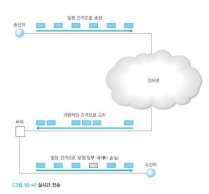

  - 시간 간격이 가변적인 데이터를 즉시 전송하지 않고 지연 버퍼를 사용하여 간격을 일정하게 `보정`

    - 제한시간을 넘기는 경우 폐기

  - 지연(Latency)

    - 송신 프로세스에서 전송한 데이터의 출발시간과 수신 프로세스에 도착한 시간의 차이
    - 대역폭, 네트워크 구조, 라우팅 방식, 전송 프로토콜 종류 등에 영향

- 지터(Jitter)

  - 데이터그램의 도착 지연 시간의 분포

    - 도착시간이 일정하지 않고 불규칙적으로 도착하는 정도

      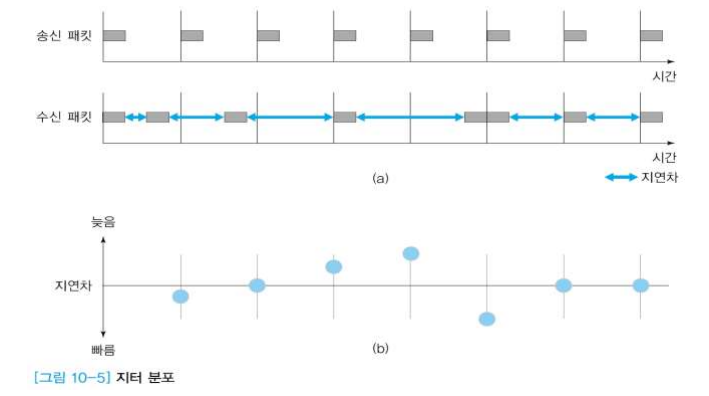

- RTP의 데이터 전송

  - RTP의 동작 원리

    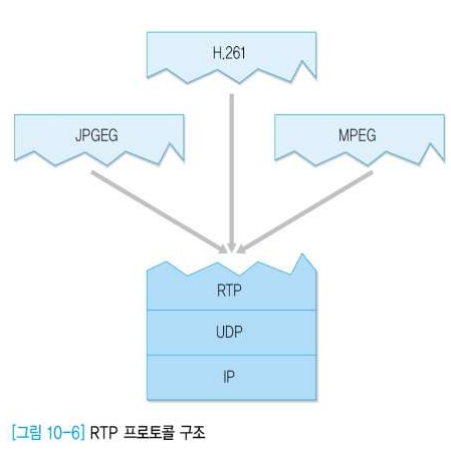

    - 작고 빠른 전송 기능을 지원하는 UDP 프로토콜 위에서 구현
    - 데이터그램 분실이나 도착 순서 변경 등의 오류는 RTP에서 해결
    - 포트주소 기능을 이용하여 송수신 프로세스간 연결 관리
    - 프로그램 하나를 단위로 하지 않고, 일부 기능이 개별적으로 구현됨
      - 응용서비스의 종류에 따라 요구 조건이 다른 기능들이 추가되는 형식
    - 다수의 사용자가 하나의 세션을 사용하여 실시간 데이터 전송 가능

  - 두 종류의 RTP 릴레이(Relay) 지원

    - 릴레이 : 데이터 전송 과정에서 송수신 프로세스가 직접 데이터를 전송할 수 없는 상황에서 데이터를 `중개`하는 기능
      - ex : 방화벽 사용, 데이터 형식 상이

  - **믹서**

    - 여러 송신 프로세스의 데이터그램을 적절히 조합하여 새로운 데이터그램 생성
    - 믹싱 과정에서 데이터그램 스트림에 대한 시간 정보 제공

  - **트랜슬레이터**

    - 입력된 각 RTP 데이터그램을 하나 이상의 출력용 데이터그램으로 만들어 줌(데이터 형식 변화 가능)
    - ex : 고해상도의 비디오 신호를 저해상도로 변환, 멀티캐스트 RTP 데이터그램을 복사하여 다수의 유니캐스트 수신 프로세스에게 전송

- RTP 헤더
  - 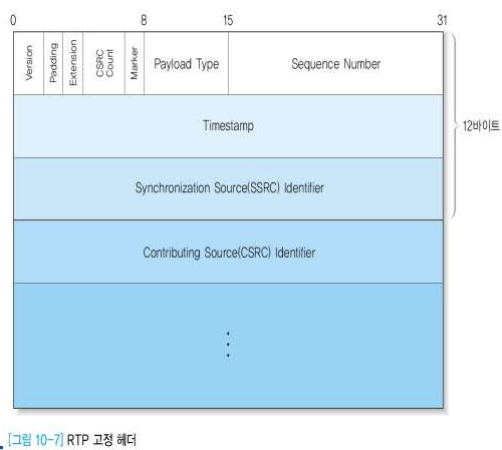
  - 응용 환경과 관련된 가변 크기의 헤더 추가 가능
  - 처음 12 바이트는 모든 RTP 패킷에 존재
  - CSRC 구분자는 믹서에 의해 추가된 경우 사용
  - 음성과 영상 데이터의 동기에 필요한 시간 정보, 데이터그램 분실이나 도착순서 변경 
  - 오류를 검출하는 기능 제공
  - 멀티캐스트 전송도 지원
    - 그룹에서 누가 전송했는지 확인을 위해 송신 구분자 필드 존재
  - 주요 필드
    - Version(2비트) : 현재 2
    - Padding : 패딩 바이트 존재 여부 표시
    - Extension : 고정 헤더 뒤에 확장 헤더가 이어지는지 여부
    - CSRC Count(4비트) : CSRC 구분자 개수
    - Marker(1비트)
      - 임의의 표식을 위해 사용
      - 보통 데이터 스트림의 경계점을 표시
    - Payload Type(7비트) : 페이로드 유형(RFC 3551)
    - Sequence Number
      - 분실, 순서 번호 변경 오류 검출
    - Timestamp
      - 데이터그램의 생성 시기
    - SSRC(Synchronization SRC) Identifier
      - Source 구분
      - 랜덤하게 생성된 32비트 숫자
    - CSRC(Contributing SRC) Identifier
      - 여러 개 존재 가능(믹서에서 제공)
    - 각 미디어가 별도의 RTP 세션 이용
      - 오디오와 비디오가 별도의 세션으로 전송
      - RTP 헤더에서 동기화에 필요한 시간 정보 제공
      - 페이로드 유형 지정 방식을 통해 다양한 종류의 데이터와 압축 형식 지원
- RTP 제어 프로토콜
  - RTCP(RTP Control Protocol)
  - 제어와 관련된 기능 수행
  - UDP를 하부 계층으로 사용
  - 세션 참가자는 다른 멤버에게 RTCP 패킷을 주기적으로 전송
  - 주요 기능
    - QoS와 혼잡 제어	
      - 데이터 분배 과정에서 발생하는 서비스 품질에 관한 피드백 기능을 지원
      - 멀티캐스팅 과정에서의 송수신 진행 여부 판단을 위한 보고서 작성
        - 송신 프로세스의 전송률, 수신 프로세스의 패킷 분실, 지터 등
      - Identification
        - RTCP 패킷에는 RTCP 송신 프로세스에 관한 정보가 포함됨
      - 세션 크기
        - 세션 참가자가 증가할 수록 RTP 데이터 전송률 감소
        - RTCP 데이터그램의 최대 전송률은 5초당 1 데이터그램
      - 세션 제어 : 최소한의 세션 제어 정보를 옵션으로 제공
- RTCP 데이터그램 종류
  - SR(Sender Report)
    - 보내는 쪽에서의 품질 관련 정보
  - RR(Receiver Report)
    - 데이터 전송 품질 피드백
    - 받는 쪽에서의 품질 관련 정보
  - SDES(Source Description)
    - 송신 프로세스가 자세한 정보 제공
  - BYE(Goodbye)
    - 송신 프로세스가 더 이상 존재하지 않음
    - 수신 프로세스가 무한정 기다리지 않게 함
  - Application Defined Packet
    - 응용 환경에 따른 기능 점검 용도

#### 3. OSI TP(Transport Protocol)

- TP가 지원하는 서비스 클래스
  - 클래스 0 : 기본 기능
  - 클래스 1 : 기본 오류 복구 기능
  - 클래스 2 : 멀티플렉싱
  - 클래스 3 : 오류 복구, 멀티플렉싱
  - 클래스 4 : 오류 검출, 오류 복구, 멀티플렉싱
- 클래스 0과 1은 단일 포트 지원 용도
- 클래스 2,3,4는 멀티플렉싱 기능 포함

- OSI TP 서비스 프리미티브
  - 연결설정
    - T-CONNECT.request
    - T-CONNECT.indication
    - T-CONNECT.response
    - T-CONNECT.confirm
  - 연결해제
    - T-DISCONNECT.request
    - T-DISCONNECT.indication
  - 데이터전송
    - T-DATA.request
    - T-DATA.indication
  - 긴급데이터전송
    - T-EXPEDITED-DATA.request
    - T-EXPEDITED-DATA.indication
  - 비연결형 데이터 전송
    - T-UNITDATA.request
    - T-UNITDATA.indication

- OSI TP 전송 과정

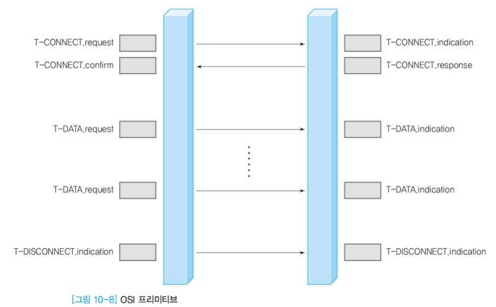

- 그외 전송계층 프로토콜

  - **SCTP(Stream Control Transmission Protocol)**

    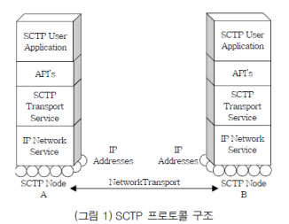

    - 스트림 제어 전송 프로토콜
    - ✅ 데이터의 안정적인 시퀀스 전송을 보장하는 전송 계층 프로토콜
    - 차세대 전송계층 프로토콜 중 하나
    - 기존 TCP 및 UDP의 단점 극복을 목표
      - UDP의 메시지 지향 특성 + TCP의 연결형 신뢰성 제공 특성
    - Multi-straming 특성 제공
      - TCP의 HOL(Head-of-Line) 블로킹 문제를 해결
        - HOL 블로킹 : 첫 번째 패킷에 의해 대기열에서 패킷 라인이 보류될 때 발생하는 성능 제한 현상
    - Multi-homing 특성 제공
      - IP 경로 장애에 대한 복구(fail-over) 기능
      - **멀티 호밍(Multihoming)** : 호스트 또는 컴퓨터 네트워크를 둘 이상의 네트워크에 연결하는 방식
    - 용도:
      - VolP(Voice over IP) 신호 전달
      - 다중 미디어를 전송하는 웹 응용
      - AAA(Authentication, Authorization, Accounting) 등의 고도의 신뢰성을 요구하는 보안 응용
      - 실시간 신뢰성을 요구하는 mission-critical 응용서비스 등
    - 프로토콜 번호 : 132
    - SCTP Peer간 응용 데이터를 API로 전달받아 IP 망을 통해 전송하는 기능 수행
    - SCTP 단말은 하나의 SCTP 세션에서 여러 개의 IP 주소를 사용

    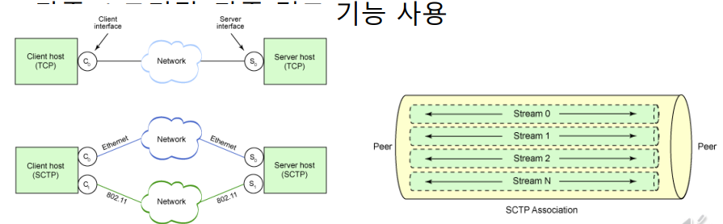

  - MPTMP(Multipath TCP)

    - IETF에 의해 2013년 표준화
    - TCP 프로토콜을 확장하여 단말과 TCP 서버 간에 다수의 TCP 경로를 구성하고 다수의 경로로 동시에 데이터를 송수신
    - 기본적으로 2개의 계층으로 구성
      - MPTCP
        - 연결 관리
        - 응용 단에 보내지는 패킷 순서 재조정
      - 다수 개의 서브플로우
        - 신뢰성 있는 패킷 전송
        - 네트워크 혼잡 제어
    - MPTCP 초기 연결 설정 과정 + 서브플로우 추가 과정

- TCP, UDP, SCTP 비교

  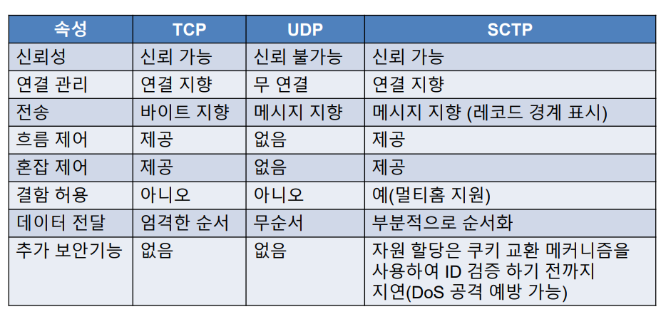

