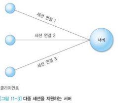
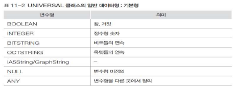

### 상위계층

OSI 7계층에서 5,6,7 단계를 상위 계층으로 분류한다

▶️ 사용자를 위한 계층

#### 1. 세션계층

- 상위 계층에 제공하는 서비스
  - 세션 연결 설정과 해제
  - 세션 메시지 전송
- 동기 기능
  - 통신 양단끼리 서로 동의하는 논리적인 공통 시점, 즉 `동기점`을 지정
  - 설정 이유 : 오류 복구를 위하여 필수적으로 요구됨
  - 동기점 설정 이전까지는 서로 처리가 완료되었음을 합의했다는 의미
  - 동기점 이전 과정은 복구가 필요가 없고, 동기점 이후 처리과정에 대한 복구 절차 진행
- 대화
  - 데이터 전송 과정을 의미
  - 시간 경과에 따라 순차적으로 동기점을 부여하여 신뢰성 보장 기능을 단계적으로 구현 가능
  - 의도적으로 일시 정지하여 나중에 이어서 작업 가능

##### 토큰(Token)

- 통신 양단의 대화를 관리하기 위한 특수 메시지
- 토큰의 보유는 해당 토큰에 부여된 특정 권리를 배타적으로 소유한다는 의미
- 토큰 종류
  - **데이터 토큰** : `데이터를 전송`할 수 있는 권한
  - **해제 토큰** : 통신 양단 사이의 `연결 해제를 제어`하는 목적으로 사용
  - **동기 토큰** : `동기 처리`가 필요한 시점에 사용

##### 동기점

- 큰 파일 전체를 하나의 단위로 하는 것보다 논리적으로 작은 단위로 나누어서 전송하는 것이 오류 발생 시 유리
- 동기점의 부여
  - 큰 파일을 작은 파일로 구분하는 과정
  - 큰 파일을 전송하는 과정의 중간 중간에 동기점을 부여
  - 동기점이 부여되었다는 의미는 해당 내용까지는 전송이 완료되었다는 의미
  - 따라서 전송 과정에 오류가 발생해도 동기점 이후의 과정만 복구하면 됨
- 동기 토큰 종류
  - **주동기 토큰(Major Token, or Activity Token)** : 특정 대화 단위를 구분
  - **부동기 토큰(Minor Token)** : 대화 단위를 세분화시켜서 구분

##### 동기

- 동기(Synchronization)
- 재동기(Resynchronization)
  - 전송 오류가 발생했을 때 동기점을 이용한 일련의 복구 과정
  - 동기점은 임의의 시점에, 특정 지점에서 복구할 수 있도록 통신 양단 간의 합의로 지정
  - 세션 계층 상위에서 적절한 구간으로 나누어 동기점을 지정하는 기능과 오류 발생 시 해당 지점으로 돌아가 복구하는 기능이 구현되어야 함

- 주동기점과 부동기점 구분 설정 이유
  - **주동기점**
    - 주동기점이 설정된 곳은 완벽히 처리되었다는 의미
    - 따라서 주동기점 이전의 복구 과정은 필요하지 않음
  - **부동기점**
    - 복구에 필요한 백업 정보가 상대적으로 적음 => 복구에 필요한 부담 최소화
    - 오류 복구가 완벽히 이루어지지 않을 수 있음
    - 이전 부동기점에서 복구가 불가능하면 직전 부동기점으로 이동하는 과정을 반복
- **액티비티**
  - 주동기점의 다른 말
  - 논리적으로 설정하는 단위(내용이 상호독립적)
  - 독립적인 여러 파일을 구분하는 목적으로 사용
  - 액티비티의 설정은 주동기점의 설정과 동일한 효과

##### 세션 연결

- 다중 세션을 지원하는 서버
  
  
  
  - 하나의 서버 프로세스가 다수의 클라이언트를 동시에 지원
  - 서비스 시간이 짧은 경우에 유리
  - 서비스 시간이 길면 클라이언트의 대기 시간이 무한정 증가할 수 있음

- 단일 세션을 지원하는 서버
  
  
  
  - 하나의 서버 프로세스가 하나의 클라이언트만 지원
  - 대표 서버
    - 클라이언트의 연결 요청을 처리
    - 하위 서버 프로세스를 생성
    - Well-known 포트
  - 단점
    - 클라이언트 개별 요구마다 하나의 프로세스 생성
      - 초기 서비스 환경 구축에 따른 오버헤드 증가
        - 오버헤드 : 어떤 처리를 하기 위해 들어가는 간접적인 처리 시간 · 메모리 등
        - 프로세스를 새로 생성하고 실행 상태로 만들어주는데 걸리는 시간 소요
        - ❓그렇다면? 
          - 슬라이더를 이용해서 묶어주는 방식
          - 아예 제한된 개수의 프로세스를 미리 만들어놓고 그 안에서 서비스를 이용하도록 하는 방법도 있음
  - 각 클라이언트의 경우 다른 클라이언트와 독립적으로 서비스를 받을 수 있음

----

#### 2. 표현 계층

##### 데이터 표현

- 추상 문법과 전송 문법
  - **추상 문법** : `각 컴퓨터`에서 사용하는 데이터 표현 규칙
  - **전송 문법** : `네트워크 전체`에서 일관성을 지니는 데이터 표현 규칙
- 특정 컴퓨터에 독립적이면서 네트워크 전체에서 일관성을 가지는 `새로운 표현 규칙(전송문법)`으로 변환하여 전송
- 수신 측에서는 자신의 컴퓨터에서 이해하는 `추상문법` 형태로 변환하는 과정 필요

##### ASN.1

​	Abstract Syntax Notation One / 추상 구문 기법

- 분산 환경에서 표현되는 데이터를 정의하기 위한 일반적인 추상 문법
- 다양한 언어용 코드를 생성하는 `컴파일러` 존재
- 응용계층에서의 문법규칙 뿐만 아니라 PDU 구조도 정의

- ASN.1 규약에서 지원하는 클래스 유형

  

- ASN.1의 UNIVERSAL 클래스

  - 일반 데이터형을 정의

    - 기본형(Primitive)

      

    - 구조형(Constructured) : 새로운 클래스를 만들어내는 형태

      

- ASN.1의 태그

  - 태깅(Tagging) : 구조형에 선언된 변수를 개별적으로 사용

  - 태그 선언

    - CONTEXT-SPECIFIC : 태그의  범위가 `현재 구조형에 한정`되어 적용됨
    - APPLICATION : 태그의 범위가 `전체 응용 컨텍스트`에 적용됨
    - PRIVATE : 태그의 범위가 `해당 사용자`에게 적용됨

  - 태그 사용 예

    

##### 데이터 압축

- 데이터 압축과 보안

  - 압축 : 전송 데이터의 양을 줄이는 목적으로 사용
  - 암호화 : 전송 데이터의 내용을 해석하지 못하도록 하기 위하여 사용

- 대용량 데이터를 `압축`하여 크기를 줄인 후 전송하는 것이 전송 속도 면에서 유리

  - 연산 면에선 불리할지언정 압축하면 얻는 속도 이점이 크다!
  - 원래 데이터의 패턴에 영향을 받음
    - 중복이 많으면 압축률이 높음
  - 알고리즘에 따라 압축률이 달라짐
    - 데이터 특성에 맞는 알고리즘 선택이 중요

- 연속 문자 압축의 예

  

  - 원본 데이터 : 18 * 10 = 180 바이트
  - 압축 알고리즘
    - 특정 문자가 연속해서 몇 번 나타나는지를 표현
  - 압축 데이터
    - 3*19 = 57 바이트
  - 압축 해제(Decompression)
    - 반대의 과정
  - 동일 패턴이 반복되는 환경에서 유리, 그렇지 않으면 오히려 더 커질 가능성

- 손실/비손실 압축

  

  - **비손실(lossless) 압축**
    - 압축 과정에서 원래 데이터의 내용을 분실하지 않음
    - 압축 해제 과정을 통해 원래의 데이터를 100% 복원
  - **손실(lossy) 압축**
    - 압축 과정에서 원래 데이터의 내용을 부분적으로 분실
    - 압축 해제 과정을 통해 원래의 데이터를 100% 복원할 수 없음
    - 압축 효율을 높이기 위하여 사용

---

#### 3. 응용 계층

- 응용 계층 하부의 기본 역할
  - 신뢰성 있는 데이터 전송 보장
- 응용 계층
  - 하부 계층의 서비스를 이용하여 사용자에게 편리한 응용 환경/서비스 제공
  - 사용자 프로그램 환경에서 구현
  - 일반적으로 운영체제에서 제공하는 계층 4 인터페이스를 사용하여 통신 기능 구현
  - 필요에 따라 세션, 표현 계층의 기능 포함

##### 클라이언트-서버 모델

- 서버가 반드시 먼저 대기 상태에 있어야 함
- 클라이언트가 서버에게 연결 요청을 시도

- 연결형/ 비연결형 서비스
  - UDP
    - 속도는 빠르지만, 신뢰성에 문제가 있음
  - TCP
    - 신뢰성이 높지만, 상대적으로 속도가 느림
  - RTP
  - SCTP

- 상태 정보
  - 상태 : 특정 상황에 대하여 통신 양단이 바라보는 관점
  - 오류 발생시 서로 합의할 수 있는 상태로 되돌아 가는 과정이 복구 과정임
  - 비상태(stateless) 서비스
    - 상태가 없으므로 복구 과정이 간단함
    - 파일 공유 서비스는 대표적인 비상태 서비스의 예
    - 파일 전송 요청마다 파일 이름, 위치, 크기 포함
  - 한때 더 안정적인 서비스 구현이 가능해서 비상태 서비스가 선호되었으나 보안이 강화되는 환경에서는 상태 서비스를 선호함

- 동시성 제어

  - 동시성(Concurrency)

    - 임의의 여러 동작이 외형상 동시에 진행되는 것처럼 보이는 현상
    - 여러 동작의 선후 진행 속도가 실행 결과에 영향을 미치지 않음
    - ex: 단일 CPU가 장착된 컴퓨터에서 여러 프로세스가 실행되는 경우

  - 반복 서비스 방식

    

  - 동시성 서비스 방식

    - 여러 클라이언트를 동시에 지원

      