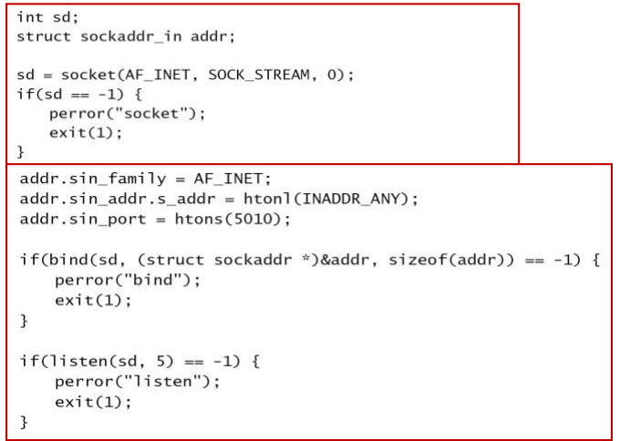

# 소켓시스템

> 학습 목표
>
> 1. 소켓의 주소 체계와 서비스를 이해한다.
> 2. 소켓 기본 함수의 문법과 사용법을 익힌다.
> 3. 소켓을 이용한 연결형 서버-클라이언트 구조를 이해한다.
> 4. 소켓을 이용한 비연결형 서버-클라이언트 구조를 이해한다.

## 소켓의 주소 체계와 서비스

### 개요

- 소켓에 대한 역사
  - 1983년 BSD 4.2 에 포함된 네트워크 프로그램용 API (Bill Joy)
  - AT&T의 경우 1986년 TLI(Transport Layer Interface) 발표
  - X/Open에서 1988년 TLI를 개선하여 XTI(X/Open Transport Interface) 발표
  - SUN W/S에 socket 라이브러리를 추가한 BSD UNIX 탑재
  - PC용 WinSock 등장

### 바이트 순서(Byte Order)

- 어떤 값을 메모리에 저장할 때 어떤 방식으로 저장하는가에 따라서 big endian, little endian으로 나누어짐

  

  little-endian : 작은 단위가 먼저 메모리에 저장됨

  big-endian: 큰 단위가  먼저 메모리에 저장

- 기계별 적용 방식

  

- 각 방식의 장단점

  - Little endian 사용시 수학적 연산(형 변환)이 쉬움
  - Big endian 사용시 숫자 비교가 빠르고, 디버깅 용이

- 통신에서는 ?

  - **Big endian**이 네트워크 바이트 순서임
  - Host byte order <-> Network byte order 변환 필수 (다를 수 있기 때문)

- 바이트 순서 변환 관련 함수

  - htons(Host to Network Short) 2byte
  - htonl(Host to Network Long) 4byte
  - ntohs(Network to Host Short)
  - ntohl(Network to Host Long)

- **IP 주소, Port 번호**는 반드시 바이트 순서 변환을 해서 사용

### 소켓 주소

- 프로토콜의 종류에 따라 사용하는 주소 체계가 다름

  - AF_UNIX: <u>한 호스트에 존재</u>하는 프로세스 사이의 통신을 지원
  - AF_INET: <u>다른 호스트에 존재</u>하는 프로세스 사이의 통신을 지원

- **유닉스 주소 체계**

  - **AF_UNIX**

    - <u>한 호스트</u>에 존재하는 프로세스 사이의 통신을 지원
    - **주소 체계**는 <u>파일 시스템의 경로명</u>을 기반으로 함

  - 주소 체계

    

    un -> unix

- **인터넷 주소 체계**

  - **AF_INET**

    - <u>다른 호스트</u>에 존재하는 프로세스 사이의 통신을 지원
    - 주소 체계는 <u>32비트 IP 주소와 16 비트 포트 번호</u>를 기반으로 함

  - 주소 체계

    

  - IPv6에 사용되는 소켓 주소 구조체

    

- 통합 주소 체계 필요성

  - <u>프로토콜마다 주소 체계를 지원하는 문법 구조가 다름</u>
  - 문법 구조상 하나의 함수에서 다양한 주소 체계를 지원하는데 어려움이 있음
  - 따라서 모든 주소 체계를 수용할 수 있는 공통 주소 체계가 필요함

- 통합 주소 체계

  

  - 사용 예

    - addr: 주소 공간 자체는 해당 프로토콜의 주소 체계로 선언 (인터넷 주소 체계)

    - bind() 함수의 두 번째 매개 변수는 문법적으로 공통 주소 체계만 수용

      - 해당 소켓과 주소를 묶어주는 역할
      - sockadd_in -> sockaddr로 typecasting해서 넘겨

      

### DNS로 부터 주소 얻기

- Domain Name System

  - 장점
    - 읽기, 쓰기, 기억의 편의성
      - 인터넷에서 호스트는 IP 주소로 구분이 가능
      - 숫자 형태보다, 계층화된 이름 주소가 더 좋은 사용 편의성을 제공
    - 고정된 주소 값 제공
      - IP 주소는 특성상 위치 이동 시 변경되나 <u>네임 주소는 이를 클라이언트에 숨겨주어 다른 사람에게 항상 같은 주소를 제공</u>한다
    - 부하 분배(load balancing)
      - 하나의 네임주소에 <u>여러 개의 IP 주소 매핑이 가능</u>하며 결과적으로 서로 다른 물리적인 서버가 클라이언트의 요청에 대응하게 할 수 있다
  - 특징
    - DNS가 TCP/IP 프로그래밍의 필수요소는 아님

- IPv4, IPv6 통합 네임 서비스 API

  

  - 기능 : 프로토콜 버전에 상관없이 **네임 주소 -> IP 주소 해석**을 해주는 함수
  - 호스트 주소(IP 혹은 도메인 네임)와 서비스(서비스 이름 혹은 port 번호)을 전달하면 위 정보에 <u>연결 가능한 주소 정보(addrinfo) 리스트를 반환</u>한다
  - 호스트 연결 시 도메인 네임, IPv4 주소, IPv6 주소를 모두 사용가능
    - hostStr: 네임 주소 혹은 IP 주소
    - serviceStr: 서비스 이름 혹은 port 번호
    - hints: 반환을 원하는 주소 정보의 형태
      - IPv4 및 IPv6 선택, 프로토콜 종류 등의 선택이 가능
    - results: 반환되는 주소들의 결과 리스트

- addrinfo 구조체

  

  linked-list 형

- Getaddrinfo 활용 예제

  

### 소켓서비스

- 소켓 유형
  - SOCK_STREAM
    - <u>연결형 서비스</u>를 지원
    - AF_INET에서는 <u>TCP 프로토콜</u>을 사용
  - SOCK_DGRM
    - <u>비연결형 서비스</u>를 지원
    - AF_INET에서는 <u>UDP 프로토콜</u>을 사용
  - SOCK_RAW
    - IP 프로토콜을 직접 사용
  - SOCK_SEQPACKET
  - SOCK_RDM
- 소켓 함수(다음 절에서 더 자세히 나옴)
  - s = socket (int domain, int type, int protocol)
    - 매개 변수로 지정된 유형을 지원하는 소켓을 생성
    - 생성된 소켓을 가리키는 파일 디스크립터를 리턴
  - bind (int s, struct sockaddr *name, socklen_t *namelen)
    - <u>s가 가리키는 소켓에 소켓 주소를 부여</u>함
    - name: 소켓 주소
  - listen (int s, int backlog)
    - <u>소켓을 활성화</u> 시킴
  - accept (int s, struct sockaddr *addr, socklen_t *addrlen)
    - 클라이언트/서버 환경에서 <u>서버가 대기</u>하는 역할을 함
    - 클라이언트의 connect() 함수와 만나면 소켓 연결을 설정함
  - connect (int s, struct sockaddr *name, socklen_t namelen)
    - 클라이언트/서버 환경에서 <u>클라이언트의 연결 설정 요청</u>을 수행함
    - <u>서버의 accept() 함수와 만나면 소켓 연결을 설정</u>함
  - send (int s, void *msg, size_t len, int flags)
    - 연결이 설정된 소켓에 <u>데이터를 송신</u>
    - 전송 데이터는 msg가 가리킴
  - recv (int s, void *buf, size_t len, int flags)
    - 연결이 설정된 소켓에서 데이터를 수신
    - 수신 데이터는 buf가 가리키는 공간에 저장됨

## 소켓 시스템콜

### socket() 함수

- **소켓을 생성**하며, 생성된 **소켓의 디스크립터** (descriptor)를 반환

- socket() 함수 사용법

  - 문법

    

  - 설명

    - domain: 사용할 도메인을 지정
    - type: 서비스 유형을 지정
    - protocol: 보통 0으로 지정

- socket() 함수 예제

  

### bind() 함수

- **생성된 소켓에 주소를 부여**

- bind() 함수 사용법

  - 문법

    ***

  - 설명

    - **s**: socket() 함수가 리턴한 디스크립터
    - **name**: <u>바인드할 소켓 주소</u>를 표기
    - **namelen**: name에 보관된 주소 공간의 크기

- AF_UNIX 예제

  

- AF_INET 예제

  

### 주소(정수) 변환

- 컴퓨터마다 정수형 데이터를 처리하는 방법이 다를 수 있음

  - ‘개별 호스트 ->네트워크’ 변환: htonl(), htons() 
  - ‘네트워크 -> 개별 호스트’ 변환: ntohl(), ntohs()

- 문법

  

### listen() 함수

- 소켓에서 대기할 수 있는 연결 요청의 개수를 지정

- 사용법

  - 문법

    

  - 설명

    - s: socket() 함수가 생성한 연결형 서비스용 소켓
    - backlog: 일반적인 환경에서 5로 지정
      - 이미 클라이언트 요청이 들어와있고 새로운 요청이 들어왔을 때, 커널 내부 buffer에 보관하는데, 그 공간을 확보해야 함. 

- listen() 함수 예제

  

### accept() 함수

- <u>서버 프로그램에서 클라이언트의 연결 요청을 대기</u>

  - 사용법

    - 문법

      

    - 설명

      - s: socket() 함수가 생성한 연결형 서비스용 소켓
      - addr: 연결을 요청한 <u>클라이언트의 소켓 주소</u>를 반환

- accept() 함수 예제

  

  fork() 가 0이면 자식 프로세스임.

  부모 프로세스가 accept로 기다리고 있다가 클라이언트 요청이 들어오면 재빨리 자식을 하나 포크하고 new 소켓을 가지고 통신하는 것은 자식 프로세스.

### connect() 함수

- **클라이언트 프로그램에서 서버에게 연결 요청을 수행**

- 사용법

  - 문법

    

  - 설명

    - s: socket() 함수가 생성한 연결형 서비스용 소켓
    - name: 연결하고자 하는 서버의 소켓 주소

- connect() 함수 예제

  

### 주소 변환

- IP 주소의 표기 방식

  - 10진수 표기 방식: 사람들의 편의를 위하여 211.223.201.30 등의 형식을 사용
  - 2진수 표기 방식: IP 프로토콜에서 사용

- inet_addr(): 10진수 형식 문자열을 2진수 형식으로 변환

- inet_ntoa(): 2진수 형식을 10진수 형식 문자열로 변환

- 문법

  

### send() 함수

- 연결형 서비스에서 데이터를 송신

- sendto() : 비연결형 서비스에서 데이터를 송신(UDP)

- 함수 사용법

  - 문법

    

    udp 는 매번 누구한테 보내야할 지 알려줘야함.(연결 X)

  - 설명

    - s: socket() 함수가 생성한 소켓
    - msg: 송신할 데이터
    - to: 비연결형 서비스에서 수신자 주소

- send() 함수 예제

  

### recv() 함수

- 연결형 서비스에서 데이터를 수신

- recvfrom() : 비연결형 서비스에서 데이터를 수신

- 사용법

  - 문법

    

  - 설명

    - s: socket() 함수가 생성한 소켓
    - buf: 수신할 데이터를 저장할 공간
    - from: 비연결형 서비스에서 송신자 주소

- recv() 함수 예제

  

  

## 서버-클라이언트 프로그래밍

### 연결형 서비스

- **소켓**: 네트워크 통신을 위한 소프트웨어 교신점

- 두 개의 독립 프로세스가 네트워크를 통해 통신하려면 논리적인 연관관계를 맺어주는 소켓 필요

- 서버의 동작

  - Well-known 포트에서 대기
  - 동작 과정 
    1. 서비스 교신점 (호스트의 IP 주소, 포트 번호) 공개 
    2. 클라이언트로부터 발생하는 서비스 요구 대기
    3. 클라이언트에 서비스 제공
    4. 해당 클라이언트에 서비스 제공 완료
    5. 단계 2로 이동

- 클라이언트의 동작

  - 서버의 Well-known 포트로 접속을 시도
  - 동작 과정
    1. 원하는 서비스를 제공하는 서버 확인
    2. 해당 서버와 연결 시도
    3. 서버에 서비스 요청
    4. 서버에 서비스 요구 완료

  

- 소켓 함수의 컴파일

  - 소켓 관련 라이브러리를 추가 (과거 solaris)

    

  - 서버를 먼저 실행하고, 이어서 클라이언트를 실행

- 클라이언트 예제

  

- 서버 예제

  

  accept로 만든 새로운 소켓을 가지고 통신.

### 비연결형 서비스

서버와 클라이언트 둘다 바인딩.

이 포트번호로 온 것은 내꺼다 라고 커널에 알림

- 클라이언트 예제

- 서버 예제

  

  

  