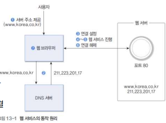
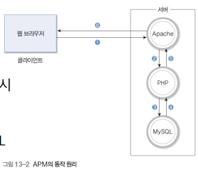
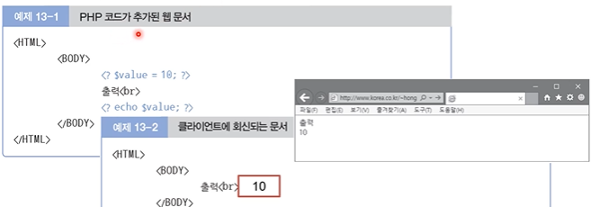
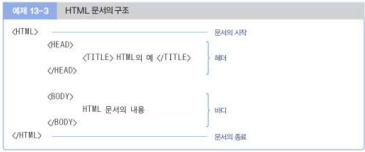
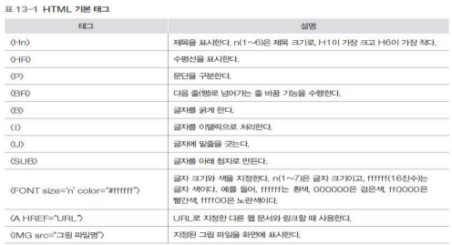
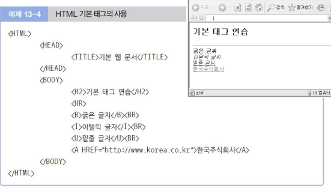
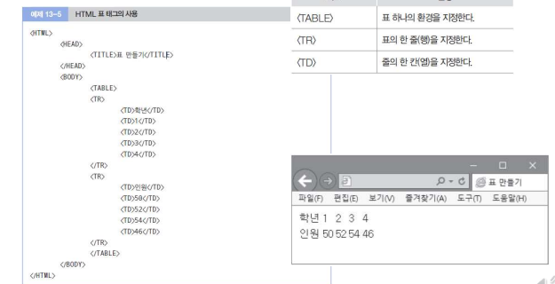
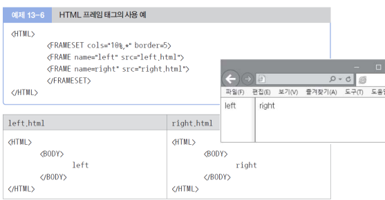
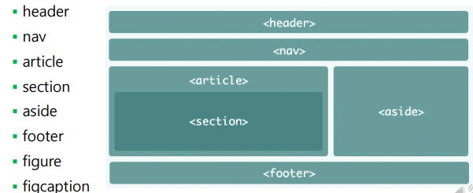
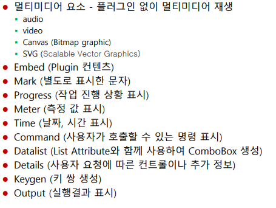

### 13-1 웹 서비스

#### 웹 서비스 개요

- 전세계적으로 TCP, UDP, SCTP 포트 80으로 지정
  - 보안을 위해 8000, 8080 등을 이용하기도 함
  - 보안이 강화된 HTTPS(HTTP over TLS/SSL)의 경우 TCP, UDP, SCTP 포트 443 이용
- 웹 브라우저는 http 또는 https 서비스에 지정된 포트를 통해 서버와 연결 시도
  - 다양한 웹 브라우저 존재
- 웹 서버와 연결이 되면 클라이언트의 정보 요구에 대해 서버가 웹 문서 회신
- 사용자 요구마다 연결 설정과 해제 반복

#### 클라이언트-서버 모델

- **URL(Uniform Resource Locator)**

  - ✅인터넷에서 웹 페이지, 이미지, 비디오 등 리소스의 위치를 가리키는 문자열
  - 관련 용어 : URI(Uniform Resource Identifier)
    - 식별자의 개념. URI의 하위개념으로 URL 존재
    - ✅인터넷에 있는 자원을 나타내는 유일한 주소. **통합 자원 식별자**
  - 서버의 자원 명칭
  - 사용하는 프로토콜, 서버의 호스트 이름, 서버 내부의 파일 경로명으로 구성
  - 예 : http://www.korea.co.kr/welcom.html
  - UNIX/Linux 시스템
    - 로그인 이름 hong
    - 개인 홈 디렉토리/public_html/index.html
    - http://www.korea.co.kr/~hong

- **HTTP(HyperText Transfer Protocol)**

  - HyperText : 그 위치를 찾으면 바로 갔으면 좋겠다!! 라는 도서관 사서의 개념이었다.

- 연결 설정과 해제

  

  1. 사용자가 웹 브라우저에게 웹 서버의 URL 주소 입력
  2. 웹 브라우저가 DNS 서버에게 웹 서버의 호스트 이름을 IP 주소로 변경 요청
  3. 웹 브라우저가 <IP 주소 + 포트 80번>의 웹 서버와 TCP 접속 시도
  4. 웹 브라우저가 웹 서버에게 최초 화면을 위한 GET 명령 전송
  5. 웹 서버가 웹 브라우저에게 요청한 웹 문서를 회신
  6. 웹 브라우저와 웹 서버 사이의 연결 해제
  7. 웹 브라우저가 사용자 화면에 웹 문서를 출력

#### APM

- Apache
  
  - ✅  아파치 소프트웨어 재단에서 관리하는 오픈 소스, 크로스 플랫폼 HTTP 웹 서버 소프트웨어
  - 웹 서버 프로그램
  - 대응되는 프로그램 : Microsoft의 IIS(Internet Information Services)
  
- PHP
  - 유닉스/리눅스 환경에서 지원되며, HTML 언어의 기능을 보강
  - `서버단`에서 사용하는 스크립트 언어
  - 대응되는 언어 : Microsoft의 ASP(Active Server Page), Java 언어 기반 JSP(Java Server Pages) 등
  
- MySQL
  - 데이터베이스 기능 지원
  - 대응되는 DB : Oracle DB, MariaDB

- APM의 동작 원리

  

  - 웹 브라우저가 Apache에 웹 문서 요청
  - PHP 코드 처리 필요 시 PHP에 요청
  - 데이터베이스 처리 필요 시 MySQL에 요청
  - 데이터베이스 결과 회신
  - PHP가 실행 결과인 HTML 코드 회신
  - 웹 문서를 웹 브라우저에 회신
  - 하나의 서버처럼 보이지만 그 안에 다양한 동작 방식들이 유기적으로 행해주고 있다! 바로 연결해주는 것이 아니라 Apache를 거쳐 처리를 단계적으로 거쳐간다.

- PHP 코드의 처리
  - PHP 코드는 HTML 문서에 Embedded 형식으로 작성 : < ?와 ? >이 구분자
    - PHP 코드가 포함된 문서의 확장자는 .php
  - 웹 브라우저에 회신되는 내용 : PHP 코드는 서버에서 실행되고 결과만 회신

----

### 13-2 HTML

- HTML(HyperText Markup Language)

  - ✅ `웹 페이지 표시`를 위해 개발된 지배적인 `마크업 언어`
  - 웹 브라우저에서 `데이터를 어떻게 표시`하는지 나타냄
  - HTML 로 작성한 문서는 서버에 보관
  - 클라이언트는 그 문서를 받아 화면에 표시

- HTML 문서 구조

  

  - <HTML>로 시작하고, </HTML>로 종료
  - 헤더 : <HEAD>로 시작하고, </HEAD>로 종료
  - 바디 : <BODY>로 시작하고, </BODY>로 종료

- 기본 태그

  

  - 태그 이름 좌우에 ' < ' 와 ' > ' 문자를 표기

  - 시작 위치에는 태그 이름, 종료 위치에는 '/' 문자와 태그 이름을 함께 표시

    

    

  - 표 태그

    

  - 프레임 태그

    

#### 웹 표준 개요

- W3C(World Wide Web Consortium)
  - ✅월드 와이드 웹을 위한 표준을 개발하고 장려하는 조직 / 웹 표준을 개발하는 국제 컨소시엄
  - http://www.w3.org
  - Open Standards Principles
    - 공개적으로 공유할 수 있도록 하자!
  - Design Principles
    - Web for All
    - Web on Everything
  - Vision
    - Web for Rich Interaction
    - Web of Data and Services
  - Web of Trust
- 웹 표준
  - XHTML(eXtensible HTML)
    - 정보의 구조를 표현
  - CSS(Cascading Style Sheet)
    - 디자인을 담당
  - Cross browsing
- 웹 표준으로 자리잡는 HTML5
  - HTML5 = HTML + CSS + JavaScript API

#### HTML5의 주요 기능

- SEMANTICS
  - 웹 자료에 의미를 부여하여 사용자 의도에 맞는 맞춤형 검색 제공
- MULTIMEDIA
  - 비디오 및 오디오 기능을 자체적으로 지원
- 3D, GRAPHICS & EFFECTS
  - 다양한 2차원 및 3차원 그래픽 기능을 지원
- Styling Effects(CSS3)
  - 글씨체, 색상, 배경 등 다양한 스타일 및 이펙트 기능 제공

- CONNECTIVITY(Web Socket)
  - 웹(클라이언트)에서 서버 측과 직접적인 양방향 통신 가능
- OFFLINE & STORAGE
  - 네트워크 미지원 환경에서도 웹 이용을 가능하게 함
- Geo-Location
  - GPS 없이도 단말기의 지리적인 위치 정보를 제공
- Device Access
  - 카메라, 동작센서 등의 H/W(하드웨어) 기능을 웹에서 직접적으로 제어

#### HTML4와의 차이점

- 새로운 요소 추가

  - 시맨틱(semantic) 요소 - 구역을 나누는 블록 요소인 div 요소를 대신

    - 각각의 요소들을 넣어 `의미있게 구분`할 수 있도록 함

    

    

- 변경된 요소

  - a(href 속성이 없이 사용하면 "placeholder link")
  - address
    - sectioning의 새로운 개념으로 범위 표시
    - 어떤 Contents 부분에 대한 관련된 연락처 정보인지 알 수 있음
  - hr(단락 수준의 주제 바꿈)
  - i(italic 체)
    - 문자의 기울임 뿐만이 아니라 음성, 분위기, 분류명, 기술용어, 다른 언어의 숙어구, 생각, 선박명 등을 표현할 때 사용
  - menu(툴바와 Context Menu 용으로 사용)
  - strong(더 중요한 것을 표시)

- 새로운 속성(Attribute) 추가
  - data -*
    - 접두사 "data-"를 가진 속성
    - 추후 HTML 버전 충돌 없이 사용자 태그로 이용하거나 추후 브라우저가 지원하게 되었을 때 사용
  - role, area-* (보조 기능)
  - contenteditable(편집 가능한 영역 표시)
  - contextmenu(작성자가 제작한 Context Menu 지정)
  - draggable(새로운 Drag & Drop API에서 사용)
  - hidden(element가 아직 없을 떄 사용)
  - spellcheck(맞춤법 검사 기능을 제공할지 여부를 지정)

- 문서 선언
  - < !DOCTYPE html >으로 간소화
    - 이전 HTML4에는 3줄 정도로 표시된 부분을 한 줄로 표현하도록 간소화

- 제거된 요소
  - 거의 사용하지 않거나, 비슷한 기능의 다른 태그로 대체 가능한 태그들
    - acronym, applet, dir, isindex
  - 디자인적인 기능(CSS로 대체 가능)
    - basefront, big, center, font, strike, tt
  - 웹 접근성 향상을 위해 사용을 지양하는 태그들
    - frame, frameset, noframes

#### 시맨틱 마크업

- 시맨틱 검색
  - `검색 로봇`이 검색어 의미를 스스로 분석하고 추리해 사람이 원하는 정보를 정교하게 찾아주는 검색 방법
  - 일반 검색 방식
    - 사용자가 입력한 단어 위주로 찾으면서 가장 검색빈도수가 높은 순으로 제시
    - 사용자의 검색어 입력 후 다시 입력하는 검색어를 기록하여 연관 검색어를 만들어냄
  - 검색 로봇이 정보를 잘 추출할 수 있도록 구조적인 홈페이지 작성이 중요
- 시맨틱 마크업과 디자인 분리
  - 내용의 의미 표현에 집중
  - HTML 대신 CSS를 사용하여 `구조`와 `표현`을 구분
    - 대표적인 혼동 : 

#### 기본적인 HTML5 마크업 사용

- 앨리먼트와 태그
  - **앨리먼트(element)**
    - HTML 문서의 개별적인 구성 요소
    - ex) p(paragraph), img(Image)
  - **태그(tag)**
    - 부등호(<>)로 둘러싸인 앨리먼트를 조합해서 부르는 이름
    - ex) 
, 

- 블록 레벨 앨리먼트와 인라인 레벨 앨리먼트
  - **블록 레벨 앨리먼트**
    - 항상 새로운 줄바꿈을 하여 표시됨
    - 너비값은 브라우저 화면에 100%로 꽉 차게 표시됨
    - ex) 
 문단 1
 
문단 2

  - **인라인 레벨 앨리먼트**
    - 같은 줄 안에서 이어서 표시됨
    - 너비값은 요소가 가지고 있는 값 자체로 표시됨
    - ex) <em>강조1 < /em> 
    - 인라인 레벨 앨리먼트는 반드시 블록 레벨 앨리먼트 안에 있어야 함
  - 시맨틱 마크업 방법
    - Heading : <h1> , <h2> , ...<h6>
      - 가장 중요한 정보는 <h1>
      - 문서의 구조와 내용의 `중요도`를 표시(폰트가 크다는 의미가 아님)
      - < h1 >은 가장 중요한 제목에 사용, 페이지 안에 반드시 나타나야 함 
      - 순서대로 사용 - 중간 단계를 건너뛰면 안됨
      - 건너뛰면 로봇은 더 이상 중요한 내용이 없다고 판단
    - 시맨틱 마크업은 앨리먼트가 가지고 있는 본래 목적에 맞게 사용하는 것
- 주요 태그 사용 제안
  - p, em, strong, address는 각각의 목적에 맞게 의미 전달시 꼭 사용
  - 태그를 그룹으로 묶을 때 블록 레벨에서는 div, 인라인 레벨에서는 span을 사용
  - 그룹핑할 때 header, nav, article, footer, section의 앨리먼트를 목적에 맞게 사용
    - header : 문서의 머리말 지정
    - nav : 메뉴 영역 지정
    - article : 콘텐츠 영역 지정
    - section : 문서 내용 구분
    - footer : 꼬리말 영역 지정