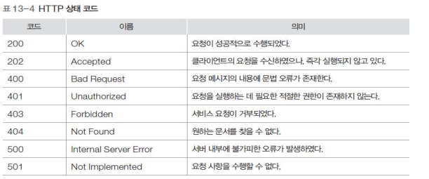
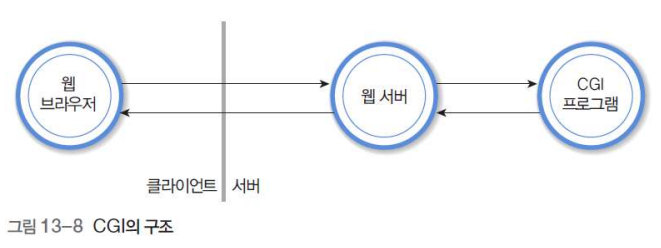

### HTTP

#### 요청과 응답

- HTTP(HyperText Transfer Protocol)
  - ✅ **서버/클라이언트 모델을 따라 데이터를 주고 받기 위한 프로토콜**
  - 웹브라우저는 URL을 이용, 원하는 자원 표현
  - HTTP 메소드(method)를 이용하여 데이터를 `요청`(GET)하거나, `회신`(POST)

- 요청과 응답
  - RFC 2616으로 발표된 HTTP 1.1 버전
    - 클라이언트의 요청과 서버의 응답에 의해 동작하는 간단한 프로토콜
  - **요청**
    - HTTP 클라이언트가 서버에 요청을 전송
    - 요청 메소드, URL, HTTP 버전과 기타 부가 정보 포함
  - **응답**
    - HTTP 서버가 요청의 결과인 응답 코드가 포함된 정보를 회신

- 비상태(stateless) 연결
  - 요청과 응답 이후, (자동으로) 연결이 끊어지므로 비상태 프로토콜
    - 연락이 끊긴 후 자동으로 이전 것을 기억하지 않는다!

#### MIME 유사 메시지

- Multipurpost Internet Message Extentsions
- ✅ ASCII가 아닌 문자 인코딩을 이용해 영어가 아닌 다른 언어로 된 전자 우편을 보낼 수 있는 방식 + `그림, 음악, 영화, 컴퓨터 프로그램`과 같은 8비트짜리 이진 파일 역시 전송 가능
- 기존 ASCII 문자로 구성된 텍스트만이 전송 가능했던 전자우편을 `멀티미디어 데이터 전송`도 가능하도록 확장한 것
  
  - 기존 E-mail Header 뒤에 MIME header를 추가적으로 붙여서 추가적으로 멀티미디어 데이터도 전송하도록 했다!
- MIME Header
  - MIME-Version
  - Content-Type
  - Content-Transfer-Encoding
  - Content-Id
  - Content-Description

- 데이터 타입

  - 하늘색 : 기존의 데이터 타입
  - 흰색: MIME에서 추가적으로 전송 가능한 데이터 타입

  

- Content-Transfer-Encoding

  - 메시지를 0과 1로 인코딩하는 방법 정의

  - Content-Transfer-encoding : < type >

    

  - Base64

    - 최상위 비트가 0일 필요가 없을 때 byte data 전송 해결책
    - 연속된 비트(bin)데이터를 24비트 블록으로 분할
    - 각 블록은 네 개의 단락(각 6비트)으로 분리
    - 각 6비트 단락은 하나의 문자로 해석하여 ASCII 변환
    - 24비트가 네 개의 문자가 되어 최종적으로 32비트가 전송 25%의 오버헤드

- 차이점
  - HTTP에서 사용하는 MIME 유사메시지는 content-Length 필드 존재
  - Content-Transfer-Encoding 대신 Content-Encoding, Transfer-Encoding 필드 사용
  - 완전 MIME은 아니고, MIME과 유사하다!!

#### 요청 메시지

- 요청 메시지(Request Message) 구성

  

  - 요청문(Request Line)
  - 헤더
  - 공백
    - 공백 한 줄 반드시 있어야 한다!!!!!
  - 바디

- 요청 메소드의 명령

#### 응답 메시지

- 응답 메시지 구성

  - 요청메시지와 유사하나, 요청문 대신 `상태문(Status line)` 사용

    

- 상태문의 구성
  - HTTP 버전
  - 상태 코드
  - 상태 이름
- 주요 상태 코드와 이름

#### HTTP의 동작 과정

- 요청 메시지

  

  - 요청 메서드 : GET
  - URL : /index.php
  - HTTP 버전 : HTTP/1.1
  - 서버 주소 : uu.ac.kr

- 응답 메시지

- 시뮬레이션

  - HTTP 서버 : uu.ac.kr

  - HTTP 클라이언트

    - kihyun.uu.ac.kr

    - telnet 프로그램이 대행

      

      1. telnet 명령으로 연결을 시도
      2. 텔넷 프로그램의 메시지 3줄이 출력, 80번 포트에서 HTTP 서버와 연결
      3. 사용자가 GET/index.php, HTTP/1.1, Host:uu.ac.kr 두 줄과 공백 한 줄을 입력
      4. 요청 메시지를 수신한 HTTP 서버는 HTTP/1.1 200 OK를 시작으로 ,응답 메시지를 회신하고 HTTP 동작을 완료

      

----

### 13-4 CGI

#### CGI 구조

- 웹 서버단 뒤 쪽에 CGI 프로그램이 위치해있다.

#### CGI 개념

- Common Gateway Interface                                                                                                                                                                                                     
- ✅서버와 애플리케이션 간에 데이터를 주고 받는 `방식` 또는 `컨벤션`
- CGI 필요성
  - HTML로만 웹문서를 작성하는 경우 서버의 정보만을 일방적으로 받아들이는 단방향 정보 흐름
  - 사용자가 입력하는 정보에 따른 처리 기능 제공 필요
- C, C++과 같은 고급언어로도 작성 가능하나, 독립된 개발과 컴파일, 개별 프로세스로 처리하는 부담 때문에 스크립트(Script) 언어 선호
  - PHP, Ruby, ...
- Java를 이용한 웹 응용 개발도 하나의 흐름
  - MVC 개념, Spring

#### FORM 태그

- 사용자의 입력을 서버에 전달

- FORM 태그 사용 예

  

웹브라우저에서는 JavaScript 언어로 입력해서 받을 수 있도록 하고, 승인 버튼을 눌러서 전달될 때는 CGI가 처리해준다.

----

### HTTPS

- ✅ HTTP에 `데이터 암호화`가 추가된 프로토콜
- **H**yper **T**ext **T**ransfer **P**rotocol **S**ecure

- HTTPS는 HTTP와 다르게 443번 포트를 사용하며, 네트워크 상에서 중간에 제3자가 정보를 볼 수 없도록 암호화를 지원
  - 기존의 HTTP는 비밀번호, 주민번호 등을 보내면 제3자가 정보를 조회할 수 있기 때문에 HTTPS가 탄생!

- SSL 위에 HTTP를 얹어서 보안이 보장된 통신을 하는 프로토콜 => **SSL 암호화 통신**
  - SSL 암호화 통신은 **공개키 암호화 방식** 알고리즘을 통해 구현됨

