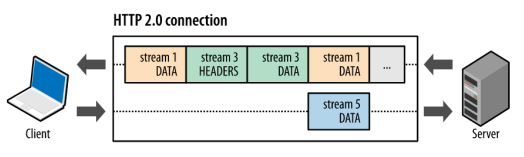

### 웹(www)

#### HTTP 프로토콜 역사

- **HTTP/0.9(원 라인 프로토콜)**

  - 초기 버전에는 버전 번호가 없었음

  - 이후에 차후 버전과 구별하기 위해 0.9로 명명

  - 요청은 단일 라인으로 구성하고, 가능한 메서드는 `GET`이 유일

    

  - 응답 또한 극도로 `단순(파일 내용 자체)`

    

- **HTTP/1.0 - 확장성 만들기**
  
  - 버전 정보가 각 요청 사이에 전송
  - 상태 코드 라인 또한 응답의 시작 부분에 붙어 전송
  - HTTP 헤더 개념은 요청과 응답 모두를 위해 도입
    - 메타데이터 전송을 허용
    - 프로토콜을 극도로 유연하고 확장 가능하게 함
  - 다른 문서들을 전송하는 기능이 추가(Content-Type)
- RFC 1945로 발표
  
- **HTTP/1.1 - 표준 프로토콜**

  - 1997년 초 발표(RFC 2068)
  - 개선 내용
    - 연결 재사용
    - 파이프 라이닝
    - 청크된 응답 지원
    - 추가적인 캐시 제어 메커니즘 도입
    - 언어, 인코딩 혹은 타입을 포함한 콘텐츠 협상이 도입
    - Host 헤더를 이용하여 동일 IP 주소에 다른 도메인을 호스트하는 기능 가능
  - 1999년 6월(RFC 2616)
  - 2014년 6월(RFC 7230 ~ 7240)
    - HTTP/1.1 : Message Syntax and Routing
    - ...
    - HTTP/1.1 : Authentication

- 이후의 개선 노력

  - 보안 전송을 위한 **HTTPS**

    - SSL/TLS 상에서 HTTP 동작

      - SSL/TLS 위에 위치하여 더 기능이 강화되었음

      

  - 복잡한 어플리케이션을 위한 HTTP 사용

    - 1996년 저작을 허용하도록 확장 : WebDAV
      - CardDAV, CalDAV
    - 2000년 REST(REpresentational State Transfer)
      - 브라우저나 서버의 갱신없이 데이터 탐색과 수정을 허용하는 API 제공
      - 필요로 하는 모든 것은 표준 HTTP/1.1을 통해 웹 사이트에 의해 서브되는 파일 내로 임베드됨
      - 단점 : 웹 사이트마다 비표준 RESTful API를 정의하고 그에 대한 전권을 가지게 됨
        - ✅**RESTful API** :  두 컴퓨터 시스템이 인터넷을 통해 정보를 안전하게 교환하기 위해 사용하는 인터페이스
      - 2010년 이후 일반화됨
    - 복잡한 어플리케이션을 위한 HTTP 사용
      - 2005년부터, 웹 페이지에서 사용 가능한 API 집합들이 급격히 늘어남
        - 서버 전송 이벤트(Push)
        - 웹 소켓(Web Socket)
    - 웹의 보안 모델 완화
      - 원래는 Same-origin policy
        - 동일한 소스 내로 자원들의 상호 작용 제한
      - CORS(Cross-ORigin Resource Sharing), CSP(Content Security Policy)에서 확실한 제약 아래에서 허용

- **SPDY 프로토콜**
  
  - ✅웹 콘텐츠를 전송할 목적으로 구글이 개발한 비표준 개방형 네트워크 프로토콜
  - 2009년 중반 Google 발표
  - "make the web faster"Initiative
  - 과거 : 1996년 Yahoo 페이지 - 3 Requests 34KB
  - 2015년 Yahoo 첫 페이지 - 73 Requests, 658.4KB
  - 당초 설계 : 하나의 연결로 하나의 요청 처리
  - 압축을 해서 전송 속도를 높이는 개념
    - HTTP + SSL로도 39~55% 향상
  - SPDY의 Server Push 개념
    - 클라이언트가 요청하기도 전에 필요한 자원을 미리 전달
  - 클라이언트와 서버 간의 데이터 교환을 대체할 수단을 실증
  - 응답성 증가 능력을 입증
  - 전송된 데이터 중복에 관한 문제를 해결

#### SSL/TLS

- Security Socket Layer / Transport Layer Security

- 연결/세션

  - 매 연결시 보안 매개변수 협상을 새로 하지 않기 위해 도입

- 2가지 서비스 제공

  - **기밀성(Confidentiality)**
    - SSL 페이로드 암호화에 쓸 공유 비밀키 정의
  - **메시지 무결성(Message Integrity)**
    - 메시지 인증 코드(MAC) 생성에 사용할 공유 비밀키 정의

- SSL Record PRotocol

  

#### HTTP/2

- 이전에 애플리케이션 내에서 수행되던 사당수의 HTTP/1.1 임시 방편을 실행 취소하고, 이러한 문제를 전송 계층 내에서 해결할 수 있도록 함으로써 애플리케이션을 더 빠르고, 단순하고, 강력하게 만듦

- 2015년 5월 공식 표준화 발표(RFC 7540, 7541)

- 특징

  - `이진 프로토콜`(바이너리 프레이밍)
    - 더 이상 읽을 수도 없고 수작업을 만들어낼 수 없음 -> 새로운 최적화 기술 구현 가능
  - `병렬 요청`이 동일한 커넥션 상에서 다루어질 수 있는 `다중화 프로토콜`
  - 전송된 데이터의 분명한 중복과 그런 데이터로부터 유발된 불필요한 `오버헤드를 제거`, 연속된 요청 사이의 매우 유사한 내용으로 존재하는 헤더들을 `압축` => `최적화`
  - 서버 푸쉬라고 불리는 메커니즘에 의해, 서버로 하여금 사전에 클라이언트 캐시를 필요하게 될 데이터로 채워넣도록 허용

- 웹 브라우저와 서버의 진화로 바로 효과를 볼 수 있어서 급속한 확산

- 바이너리 프레이밍 계층

  - HTTP 메시지가 `캡슐화`되어 클라이언트와 서버 사이에 전송되는 방식을 규정

  - HTTP 의미 체계는 영향을 받지 않지만 전송 중에 의미 체계가 인코딩되는 방식에 변화

    - 모든 HTTP/2 통신은 더 작은 메시지와 프레임으로 분할되며, 각각은 바이너리 형식으로 인코딩

      

- 스트림, 메시지 및 프레임
  - **스트림**
    - 구성된 연결 내에서 전달되는 바이트의 `양방향 흐름`이며, 하나 이상의 메시지가 전달될 수 있음
  - **메시지**
    - 논리적 요청 또는 응답 메시지에 매핑되는 프레임의 전체 시퀀스
  - **프레임**
    - HTTP/2에서 통신의 최소 단위이며 각 최소 단위에는 하나의 프레임 헤더가 포함
    - 프레임 헤더는 최소한으로 프레임이 속하는 스트림을 식별
  - 스트림, 메시지 및 프레임의 관계
    - 모든 통신은 `단일 TCP 연결`을 통해 수행되며 전달될 수 있는 양방향 스트림의 수는 제한이 없음
    - 각 스트림에는 양방향 메시지 전달에 사용되는 고유 식별자와 우선순위 정보(선택 사항)가 있음
    - 프레임은 통신의 최소 단위이며 특정 유형의 데이터(ex. HTTP 헤더, 메시지 페이로드 등)를 전달

- 요청 및 응답 다중화

  - HTTP/1.x에서 성능 개선을 위해 클라이언트가 여러 병렬 요청을 수행하려는 경우, 여러 TCP 연결 사용

    - 연결당 한 번에 하나의 응답만 전달되도록 보장
    - HOL(Head-of-Line) 차단
    - 기본 TCP 연결의 비효율적인 사용 초래

  - HTTP/2의 새 바이너리 프레이밍 계층

    - 이러한 제한을 없애고 `전체 요청 및 응답 다중화 지원`

      

  - HTTP 메시지를 독립된 프레임으로 세분화하고 이 프레임을 인터리빙한 다음, 다른 쪽에서 다시 조립

    - 다음과 같은 작업 가능
      - 여러 요청을 하나도 차단하지 않고 병렬로 인터리빙할 수 있음
      - 여러 응답을 하나도 차단하지 않고 병렬로 인터리빙할 수 있음
      - 단일 연결을 사용하여 여러 요청과 응답을 병렬로 전달할 수 있음
      - 연결된 파일, 이미지 스프라이트(image sprites), 도메인 분할과 같은 불필요한 HTTP/1.x 임시 방편을 제거
      - 불필요한 지연 시간을 제거하고 가용 네트워크 용량의 활용도를 개선하여 페이지 로드 시간을 줄임

  - 기대 효과

    - 애플리케이션이 더 빠르고 단순해지고 배포 비용이 절감

- 스트림 우선순위 지정
  - 프레임이 클라이언트와 서버에 의해 인터리빙되고 전달되는 순서가 중요한 성능 고려사항이 됨
  - 각 스트림이 연관된 가중치와 종속성을 갖도록 허용
    - 각 스트림에는 1~256 사이의 정수 가중치가 할당될 수 있음
    - 각 스트림에는 다른 스트림에 대한 명시적 종속성이 부여될 수 있음
  - 스트림의 종속성 및 가중치 조합을 이용하여 클라이언트가 '우선순위 지정 트리'를 구성하고 통신할 수 있음
    - 클라이언트가 선호하는 응답 수신 방식을 나타낼 수 있음
    - 서버가 이 정보를 사용하여 CPU, 메모리 및 기타 리소스의 할당을 제어함으로써 스트림 처리의 우선순위를 지정
    - 응답 데이터가 있는 경우, 서버는 우선순위가 높은 응답이 클라이언트에 최적으로 전달되도록 대역폭을 할당
  - 
  - 스트림 종속성은 또 다른 스트림의 고유 식별자를 상위 요소로 참조하는 방식으로 선언
    - 가능하면 상위 요소 스트림에 종속성보다 리소스가 먼저 할당되어야 함을 나타냄(C보다는 D가 먼저)
    - 동일한 상위 요소를 공유하는 스트림(즉, 동위 요소 스트림)은 그 가중치에 비례하여 리소스가 할당
  - 스트림의 종속성과 가중치는 전송 기본 설정을 표현하는 것
    - 서버에게 강요하거나, 서버가 보장하지는 않음

- 출처당 하나의 연결
  - 스트림을 병렬로 다중화하는 여러 개의 TCP 연결이 더 이상 HTTP/2에 필요 없음
  - HTTP/2에서는 동일한 연결을 재사용하여 각 TCP 연결을 더 효율적으로 사용할 수 있으며 또한 전반적인 프로토콜 오버헤드를 대폭 줄일 수 있음
  - 연결 수가 적다는 것은 HTTPS 배포의 성능을 개선하는데 특히 중요

- 흐름 제어
  - HTTP/2 스트림은 단일 TCP 연결 내에서 다중화되기 때문에 TCP 흐름 제어로는 불충분
    - 개별 스트림의 전달을 제어하는데 필요한 API 미제공
  - 빌딩 블록 세트를 제공하여 스트림 수준과 연결 수준에서 흐름 제어 제공
    - 양방향
      - 각 수신기는 각 스트림과 전체 연결에 원하는 창 크기를 설정하도록 선택
    - 크레딧 기반
      - 각 수신기는 자체의 초기 연결과 스트림 흐름 제어 창(바이트 단위)을 알림
      - 송신기가 DATA 프레임을 방출할 때마다 감소
      - 수신기가 WINDOW_UPDATE 프레임을 보낼 때마다 증가
    - 비활성화될 수 없음
    - 종단간(End-to-End) 방식이 아니라 홉(Hop-by-Hop) 방식
  - 실제 구현은 클라이언트와 서버의 몫

- 서버 푸시

  - 서버가 단일 클라이언트 요청에 대해 여러 응답을 보낼 수 있음

    - 원래 요청에 응답할 뿐만 아니라 클라이언트가 명시적으로 요청하지 않아도 서버가 추가적인 리소스를 클라이언트에 푸시할 수 있음

      

  - 모든 서버 푸시 스트림은 PUSH_PROMISE 프레임을 통해 시작

    - 설명된 리소스를 클라이언트에 푸시하라는 신호를 서버 인텐트에 보냄
    - 푸시된 리소스를 요청하는 응답 데이터보다 먼저 전달됨

  - 클라이언트가 PUSH_PROMISE 프레임을 수신한 후에 (RST_STREAM 프레임을 통해) 해당 스트림을 거부할 수 있는 옵션이 있음

    - ex) 리소스가 이미 캐시에 있는 상황

- 헤더 압축
  - 각 HTTP 전송에서는 전송되는 리소스와 그 속성을 설명하는 헤더 세트를 전달
    - HTTP/1.x의 경우 이 메타데이터는 항상 일반 텍스트로 전송되고, 전송당 500~800 바이트의 오버헤드가 추가되며, HTTP 쿠키를 사용할 경우 수 KB가 추가
    - HTTP/2에서는 HPACK 압축 형식을 사용하여 요청 및 응답 헤더 메타데이터를 압축
      - 전송되는 헤더 필드를 정적 Huffman 코드로 인코딩하도록 허용
      - 이전에 표시된 헤더 필드의 색인 목록을 클라이언트와 서버가 유지하고 업데이트하도록 요구
        - 이 목록을 참조로 사용하여 이전에 전송된 값을 효율적으로 인코딩
  - Huffman 코딩을 사용하면 전송 시에 개별 값을 압축할 수 있으며, 이전에 전송된 값의 인덱스 목록을 사용하면 중복 값을 인코딩

#### HTTP/3

- Active Internet-Draft
  - Hypertext Transfer Protocol Version 3 (HTTP/3)
  - QPACK:Header Compression for HTTP/3
  - HTTP/3 and QPACK event definitions for qlog

----

### Java Script

✅ 웹 브라우저 내에서 주로 사용되는 객체(Object) 기반의 스크립트 프로그래밍 언어. 

#### Java Script 역사

- Java Script의 탄생
  - 1995년 당시 약 90%의 시장 점유율로 웹 브라우저 시장을 지배하고 있던 Netscape 에서 정적인 HTML을 동적으로 표현하기 위해 경량의 프로그래밍 언어를 도입하기로 결정
  - 브렌던 아이크(Brendan Eich)가 개발한 자바스크립트
  - 1996년 3월 넷스케이프 커뮤니케이션즈의 웹 브라우저인 Netscape Navigator 2에 탑재 (“Mocha”로 명명)
  - 1996년 9월 “LiveScript”로 이름이 변경
  - 1996년 12월 “JavaScript”로 최종 명명
- Java Script 파편화
  - 1996년 8월, 마이크로소프트는 자바스크립트의 파생 버전인 “JScript”를 Internet Explorer 3.0에 탑재
  - JScript와 Java Script 가 표준화되지 못하고 적당히 호환됨

- Java Script 표준화 시작
  - 1996년 11월 비영리 표준화 기구인 ECMA 인터내셔널에 자바스크립트의 표준화를 요청
- Java Script 표준화
  - 1997년 7월, ECMA-262라 불리는 표준화된 자바스크립트 초판(ECMAScript 1)의 명세(specification)가 완성
    - 상표권 문제로 자바스크립트는 ECMAScript로 명명
  - 1999년 ES3
  - 2009년 ES5
  - 2015년 ES6(ECMAScript 2015)
  - 2020년 6월 ES11(ECMAScript 2020)

#### Java Script의 확장

- Ajax
  
  - **A**synchronous **J**avaScript **a**nd **X**ML
  
  - ✅자바스크립트의 라이브러리 중 하나이며, 브라우저가 가지고 있는 XMLHttpRequest 객체를 이용해서 전체 페이지를 새로 고치지 않고 페이지의 일부만을 로드하는 기법 => 자바스크립트를 사용한 **비동기 통신**이며, **클라이언트와 서버간에 XML 데이터를 주고받는 기술**
  
    
  
  - 1999년 서버와 클라이언트가 비동기적으로 데이터를 교환할 수 있는 Ajax(Asynchronous Javascript And XML)가 XMLHttpRequest라는 이름으로 등장
  
  - 웹 페이지 전체 랜더링 -> 필요한 부분만 받아 한정적으로 랜더링
  
  - ex) 2005년 등장한 Google Maps
  
- JQuery
  
  - ✅ HTML의 클라이언트 사이드 조작을 단순화 하도록 설계된 크로스 플랫폼의 자바스크립트 라이브러리
  - ✅ 웹사이트에 자바스크립트를 쉽게 활용할 수 있도록 도와주는 오픈소스 기반의 자바스크립트 라이브러리
  - 2006년 등장
  - DOM을 더욱 쉽게 제어
    - ❗BUT! 당시에 당면한 문제를 해결하기 위한 임시방편 라이브러리여서 현재는 잘 쓰지 않는다.
    - ❗DOM을 직접적으로 다루는 기능이 너무 많아서 안티패턴의 위험이 높다
  
- V8 자바스크립트 엔진
  
  - ✅웹 브라우저를 만드는 데 기반을 제공하는 오픈 소스 자바스크립트 엔진
  - 2008년 구글에서 발표
  - 데스크탑 애플리케이션과 유사한 UX(User eXperience) 제공 가능
  - 서버에서만 수행되던 로직이 클라이언트로 이동
  
- Node.js
  
  - ✅확장성 있는 네트워크 애플리케이션 개발에 사용되는 소프트웨어 플랫폼
  - 2009년 라이언 달(Ryan Dahl) 발표
  - V8 자바스크립트 엔진으로 빌드된 자비스크립트 런타임 환경
  - 자바 스크립트가 브라우저 이외의 환경에서도 동작할 수 있도록 함  서버 사이드 애플리케이션 개발에 주로 사용 (파일, HTTP 등 Built-in API 제공)
  - Front-end와 Back-end에서 동일한 언어로 개발이 가능해짐
- 비동기 I/O 지원, 단일 스레드 이벤트 루프 방식
    
  - 실시간 처리를 위한 요청-응답이 많은 SPA(Single Page Application)에 적합
  
- SPA(Single Page Application) 프레임워크
  
  - ✅ "한 개의 페이지로 구성된 웹서비스!"
  - ✅  서버에 요청이 있을때마다 신규페이지를 불러와 그리는 MPA 방식이 아닌, 기존페이지에 컴포넌트화된 서브 페이지나 적절한 자원, 데이터 등 만을 넘겨주어 Client 상에 Rendering이 이루어지는(**CSR**) 방식으로 동작
  - 모던 웹 애플리케이션은 데스크탑 애플리케이션에 손색없는 성능과 UX 제공 -> 개발 규모와 복잡도 상승 -> 필요에 따라 많은 패턴과 라이브러리 출현 -> 프레임워크 등장
  - CBD(Component based Development) 방법론을 기반으로 한 SPA(Single Page Application) 대중화
  - 다양한 SPA 프레임워크 등장
    - Angular
    - React
    - Vue.js
    - Svelte

#### Java Script와 ECMA Script

- ECMAScript
  - ECMA-262 : 프로그래밍 언어의 값, 타입, 객체와 프로퍼티, 함수, 표준 빌트인 객체 등 핵심 문법 규정
- 각 브라우저 제조사는 ECMAScript 사양을 준수해서 브라우저에 내장하는 자바스크립트 엔진 구현
- 자바스크립트라고 지칭하면 ECMAScript + 클라이언트 사이드 Web API(DOM(Document Object Model), BOM(Browser Object Model), Canvas, XMLHttpRequest, fetch, requestAnimationFrame, SVG, Web Storage, Web Component, Web Worker 등)를 아우르는 개념
  - Web API는 W3C에서 관리

#### 2020년과 이후 JavaScript

- 2020년, 새로운 전환점의 시작

  - CommonJS/AMD(RequireJS)와 같은 비표준적 모듈 사용에 의존하는 수많은 생태계가 ECMAScript 모듈로 전환될 것으로 예측

  - 다양한 JavaScript 도구가 언어적으로 빌트인되어야 한다는 관점에서의 접근도 희미해질 것

    - 'JavaScript를 위한 JavaScript'(JavaScript 도구는 JavaScript로 개발되어야 한다는 접근 방법)와 같은 이상적 접근 방식은 포기

  - 웹 엔진의 다양성 감소

    - Chromium 기반의 Edge 브라우저를 제공  2020. 10 IE11 종료
    - WebKit (iOS, GNOME의 Epiphany, SONY의 PS4) 
    - 서로 다른 렌더링/JavaScript 엔진의 서로 다른 표준 지원에 따른 크로스브라우징 문제 감소

  - TypeScript의 보편화

    - ✅ 자바스크립트(JavaScript)를 기반으로 정적 타입 문법을 추가한 프로그래밍 언어

    - JavaScript의 슈퍼셋으로, 새로운 ECMAScript 명세들의 도입은 공식 릴리스 이전에 이루어짐

      

    - 프런트엔드 주요 프레임워크인 Vue.js는 Vue.js 3.0에서 TS로의 전환을 일찍이 발표했고, Angular는 이미 오래 전부터 2.0을 통해 TS를 기본적으로 사용
    
    - 타입에 대한 언어적 특성에 대한 부족함에 대한 단점 보완