>  **학습 목표**
>
>  - 도메인 이름과 IP 주소를 변환하는 과정이 필요한 이유를 이해한다.
>  - 계층 구조의 네임 스페이스, 도메인, 존의 개념을 이해한다.
>  - 도메인 정보를 관리하기 위한 자원 레코드를 알아본다.
>  - 이름 관리를 위한 해석기와 네임 서버의 동작 원리를 이해한다.
>  - DNS 클라이언트와 서버가 전송하는 DNS 메시지를 살펴본다.

# 1절 도메인 서비스

## IP 주소

- 32 비트 크기(IPv4)

- 편의를 위해 8 비트 크기의 10진수 4 개로 표현

  - aaa.bbb.ccc.ddd
  - ex. 211.223.201.30
    - 211이면 클래스 C
    - 211.223.201 => 네트워크 영역 / 30 => 호스트 IP

- 주소 클래스

  - 클래스 구분

    | 클래스 | IP 주소 범위 |                      네트워크 주소 크기                      |                       호스트 주소 크기                       |
    | :----: | :----------: | :----------------------------------------------------------: | :----------------------------------------------------------: |
    |   A    |   0 ~ 127    |         7 비트(나머지) => 2^7-1 개, 127은 제외라 -1          |                     24 비트 => 2^24-2 개                     |
    |   B    |  128 ~ 191   | 14 비트 (앞의 2 비트는 B를 표현, 남은 6 비트 + 8 비트) => 2^14 개의 네트워크 주소 | 16 비트 => 2^16-2만큼 호스트 주소 부여 가능(모두 1인 경우 브로드캐스트 주소로 사용, 모두 0일 때 네트워크 주소로 사용가능) |
    |   C    |  192 ~ 223   | 21 비트 (앞의 3 비트 제외, 나머지 5 비트 + 뒤의 16 비트) => 2^21 개의 네트워크 주소 부여 가능 |                      8 비트 => 2^8-2 개                      |

    - 반비례 관계 : 네트워크 범위가 커질수록 호스트 주소 범위는 작아짐

    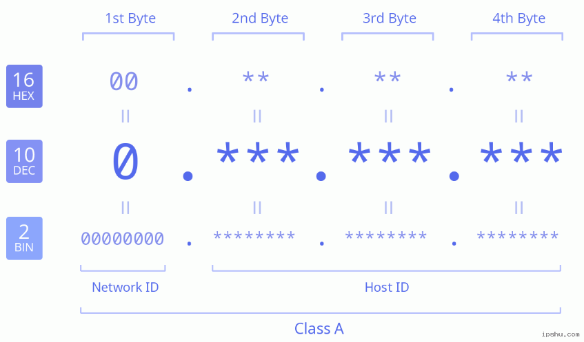

    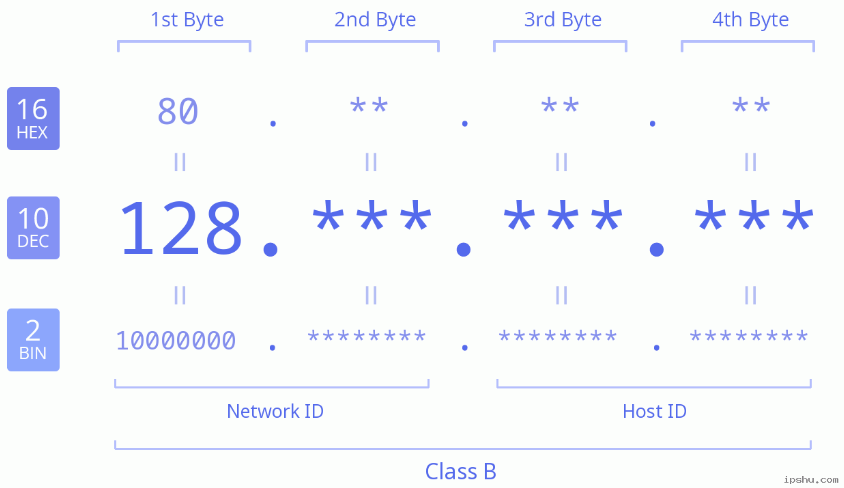

    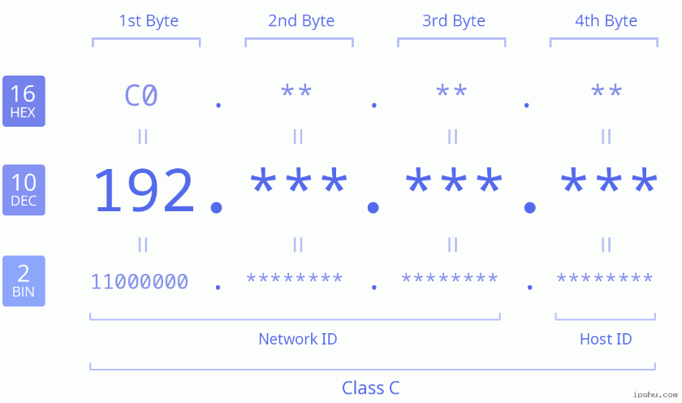

    

  - 클래스 A : 2^24개의 호스트 수용

  - 클래스 B : 2^16개

  - 클래스 C : 2^8개

  - 클래스 D : 멀티캐스팅 지원 (방송보다 선박에서 쓰임, 특수목적)

## DNS

- Domain Name System (Service가 아니라 System!!)

- 도메인 이름 (인간)

  - 문자형으로 표기되는 호스트 이름 (사용자가 선호)

- IP 주소 (기계)

  - IP 프로토콜에서 호스트 구분을 위하여 반드시 필요

- 도메인 이름을 IP 주소로 매핑시켜주는(변환) 서비스가 필요함

- DNS 도입 전

  - 인터넷 초기에 수작업(파일로 관리)

  - /etc/hosts 파일

    - 파일 내용 : (도메인 이름, IP 주소) 쌍으로 구성

      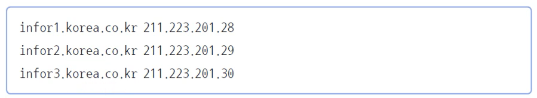

    - 주기적으로  ftp 서비스 이용하여 수정된 파일 다운로드

- 컴퓨터 보급에 따른 기존 방법의 한계

  - 한 시스템에서 모든 호스트의 이름과 주소를 관리하는 것이 불가능
  - 도메인 이름 중복

- 해결방안

  - 위임과 계층적 도메인 이름
    - ROOT에서 하부로 위임(ex. com, edu, kr)
    - TLD(Top Level Domain)에서 하위로 위임(ex. co.kr, ac.kr)
    - 위임 받은 기관에서 자신의 도메인에 속한 호스트 이름, IP 주소 관리(ex. korea.co.kr에서 info1 관리)
  - 분산 데이터베이스
    - 각 기관에서 독립적으로 관리하고 있는 것들을 다 묶으면 전체가 되는 구조

- 해석기 (Resolver)

  - IP 주소를 얻고자 하는 응용 프로그램이 호출
  - **클라이언트** 쪽에 붙어있는 프로그램
  - 응용 프로그램은 **직접X**, 해석기에게 도메인 이름을 매개변수로 제공
  - 해석기는 DNS 프로토콜을 이용하여 **DNS 서버에 변환을 요청**

- nslookup(dig) 명령어 

  - nslookup : 옛날
  - dig : 요즘 / 더 자세함

  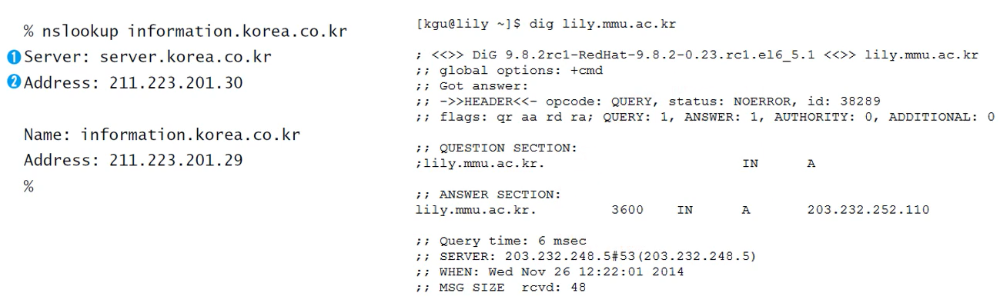

- DNS 구성 요소

  - 도메인 네임 스페이스(domain name space)
    - 트리 구조의 네임 스페이스를 비롯해 데이터에 대한 이름 관련 규칙을 정의
    - 트리에 연결된 호스트는 자원 레코드(Resource Records)로 표현
    - DNS 서비스는 자원 레코드의 특정 유형 정보를 얻는 과정
    - 공간에 대한 논리적 개념
  - 네임 서버(name server)
    - 도메인 트리 구조와 트리에 보관된 자원 레코드를 관리하는 프로그램
    - 분산 데이터베이스
    - 여러 네임 서버가 구역을 분할해 전체 도메인 관리
    - 하나의 도메인을 관리하는 네임서버들은 반드시 2 개 이상 같도록 되어 있음
    - 분할한 구역을 담당하는 주(primary) 네임서버와 백업 용도의 부(secondary) 네임서버가 있음 => 위임주는 기관에서 주, 부 네임서버 정상작동 확인 후 위임함
    - 캐시에 다른 서버로부터 얻어온 정보 임시 보관 <= 같은 질의가 올 것을 대비해
  - 해석기(resolver)
    - 클라이언트의 요청을 받아 네임 서버로부터 정보를 얻어냄
    - 하나 이상의 네임 서버와 접촉 가능
    - 캐시에 얻어온 정보(네임서버에서 받아온 정보) 임시 보관

# 2절 도메인 네임 스페이스

## 도메인 네임스페이스

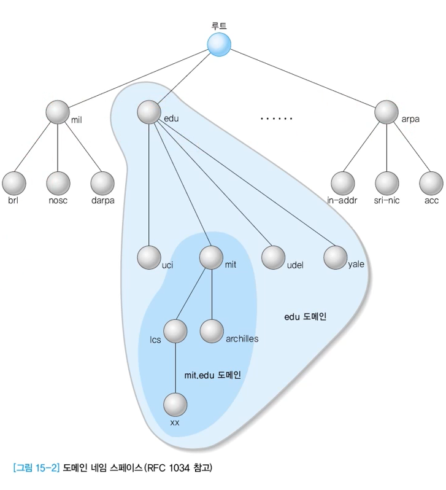

- DNS가 저장, 관리하는 계층적 데이터베이스

- 최상위에 루트 존재, 그 밑으로 트리 구조

- 레이블(각각의 이름들)

  - 최대 63 바이트

- 도메인 이름

  - 점(.)으로 구분한 레이블의 연속

- 루트

  - 크기가 0인 Null 레이블 가짐

- 공식 표기(fully qualified domain name)할 때 마지막에 점(.)을 붙여야 함

  - www.korea.co.kr.
  - .이 없는 경우 호스트의 deault domain이 기본적으로 붙게 됨

- 도메인

  - 계층적 구조
  - 같은 레벨에서 레이블이 유일해야
  - 도메인 이름
    - 최하위 레이블을 왼쪽에, 상위로 이동하면서 레이블 표기
    - ex. xx.lcs.mit.edu
  - TLD (최상위 도메인)
    - Top Level Domain
    - 루트 바로 밑에 위치한 레이블
    - ex. mil, edu
  - 도메인 : 
    - ex. edu 도메인, mit.edu 도메인

- 최상위 도메인

  - 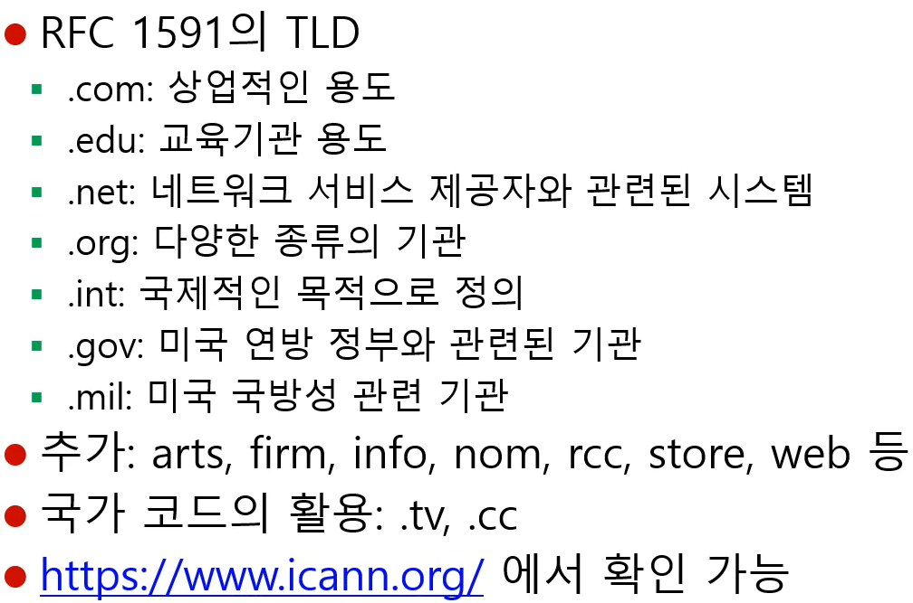

- 도메인 이름

  - 하위 레이블부터 시작
  - 레이블 이름을 점(.)으로 연결

  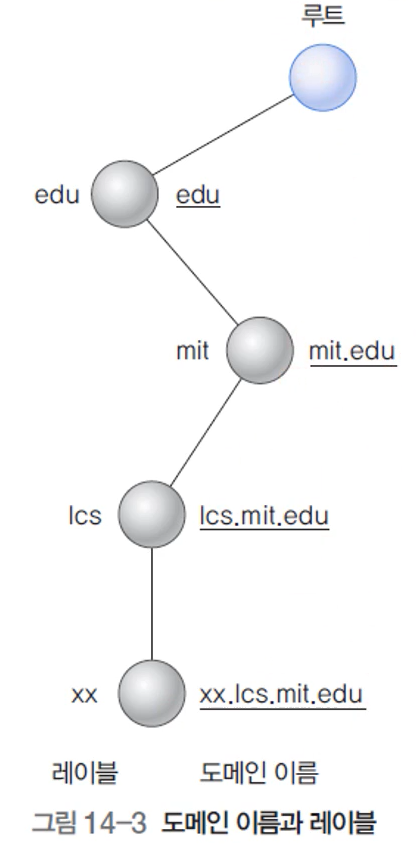

- 인터넷 도메인 네임 스페이스를 **계층구조**로 분할

- **하나의 개념**적인 저장장소를 갖지만, 실제로는 각 하부 도메인을 관리하는 호스트에 이름, 주소 관리 **권한 위임**

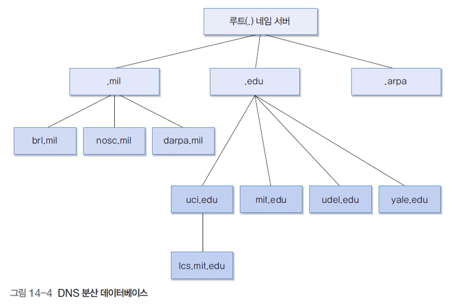

- **권한을 위임 받은 도메인 관리 서버**는 **본인 밑에 있는 모든 레이블**에 대한 정보를 적절하게 유지해야

- 다른 도메인에 대한 정보가 필요하다면 해당 도메인을 관리하는 네임 서버로부터 얻어내야

- 존(zone)

  - 임의의 네임 서버가 관리하는 영역
  - 도메인과 유사 but 다름

  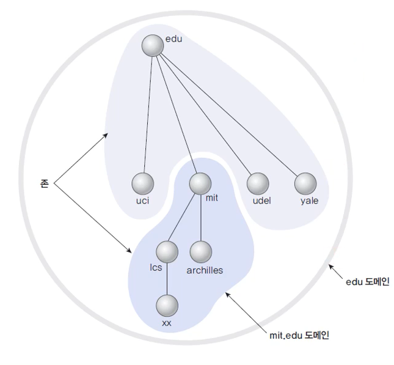

## 자원 레코드

- 자원 레코드
  - 이름과 주소 정보 등을 저장하기 위한 레코드
  - 각 호스트의 정보는 자원 레코드와 관계됨
  - DNS 네임 서버가 해석기에 반환하는 것은 자원 레코드 정보
- 질의 레코드
  - DNS 클라이언트가 DNS 서버에 정보를 요청하는 용도

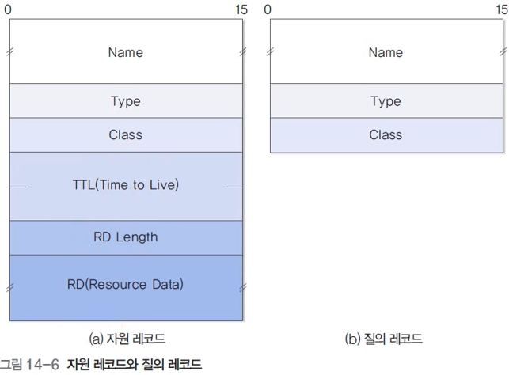

- 질의 레코드에 해당 데이터, 그 데이터가 언제까지 유효한지 저장한 TTL을 붙여서 자원 레코드 만듦
- 각 필드의 의미
  - 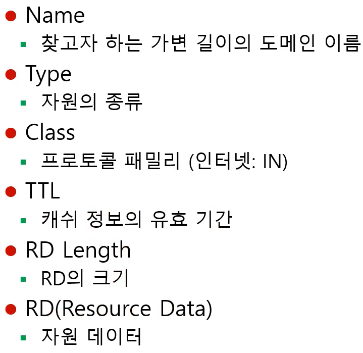
- Type
  - A(Address)
    - 호스트 IP 주소 (도메인 이름과 IP 주소 변환)
  - NS(Name Server)
    - 도메인을 관장하는 인증된 네임 서버
  - CNAME(Canonical Name)
    - 호스트 별명
  - SOA(Start of Authority)
    - 존의 시작 표시
  - WKS(Well-Known Services)
    - 호스트가 제공하는 네트워크 서비스 (IP 주소, 포트번호 알 수 있음)
  - PTR(Pointer)
    - IP 주소를 도메인 이름으로 변환
  - HINFO(Host Information)
    - 호스트 정보
  - MX(Mail eXchange)
    - 메일 교환 (특정 메일 주소로 전송된 메일을 다른 주소로 재전송(redirect))
  - 기타 : SIG(Security Signature), NXT(Next Domain), AAAA(IPv6 주소), TXT(text) 등

# 3절 네임 서버와 해석기

## 변환 과정

- 응용 프로그램이 해석기(DNS 클라이언트 역할)에게 정보 제공 요청

- 해석기(resolver)

  - **해석기가** DNS 메시지 형식의 **질의 생성** -> **질의를 네임서버에 전달** ->  **네임서버는 resource record 되돌려줌**

- 똑같은 주소를 계속 질의하고 응답하는 오버헤드를 줄의기 위해 캐시 정보 활용

  - 인증(authoritative) 데이터
    - 직접 네임 서버로부터 그 순간에 가서 얻어온 정보
  - 캐시 데이터
    - 비슷한 질의한 것이 있어 바로 보내줌
  - TTL 동안 유효하며, 이 시간을 넘어가면 캐시 정보 삭제

- 존(zone)

  - 자원 레코드에 포함된 인증 데이터의 집합체

  - 관리하는 정보

    - 존에 속하는 모든 호스트의 전체 자원 레코드 집합체(존에 포함된 모든 호스트 관리)
    - 존에 포함된 최상위 호스트
    - 위임 서브 존
      - 자신의 존에 속하지만 인증이 위임된 경우
    - 위임된 서버 존에 관한 글루(glue) 데이터
      - 서브 존의 네임 서버에 접근할 수 있도록 해줌

    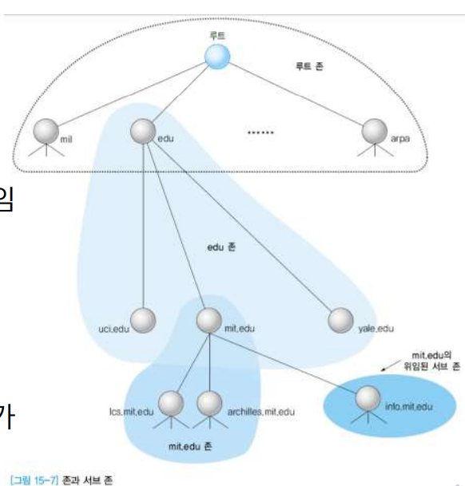

    - 호스트 정보 얻고자 할 때 서버의 IP 주소 알면 됨
    - 네임 서버가 서브 존 도메인 내부에 위치하여 IP 주소 얻기 어려울 때, 글루 데이터 필요(위임된 서브 존에 있는 네임서버로 찾아감)

## 요청의 처리

- 호스트가 A가 호스트 B의 정보를 원할 때, 호스트 A, B가
  - **같은** 도메인에 위치하면 이 도메인의 네임 서버가 바로 인증 데이터 회신
  - **다른** 도메인에 위치하면 인근 네임 서버에게 요청 호스트(A)를 중개해 줌
- 해당 네임 서버를 찾는 작업은 인증 정보 찾을 때까지 반복
- 질의 요청이 처리되는 과정
  - 인증 데이터가 반드시 필요한지 명시
  - 해석기는 질의 요청을 재귀적 or 비재귀적으로 처리할건지 명시
- 재귀적 요청
  - 해석기가 처음 요청했을 때 처음 받은 네임 서버가 또다른 네임 서버에게 요청. 그 요청을 또다른 서버로~ (질의 요청을 추적, 관리)
  - 해석기가 한번만 요청하면 뒤에 몇번의 네임 서버를 거치든 한번의 응답으로 끝남
- 비재귀적(반복적)
  - 처음에 네임 서버가 없을 때 (본인이 다른 네임서버에게 요청 X) 해당 정보를 가진, 다음 네임 서버의 정보를 처음 요청했던 클라이언트에게 되돌려줌 -> 그 클라이언트가 다시 다음 네임 서버로 가서 질의(반복)
  - (해석기가 요청하면 다음 네임 서버의 주소) * n => 해석기가 여러번 질의 & 응답하는 상황, 네임서버는 할 일 적음
- 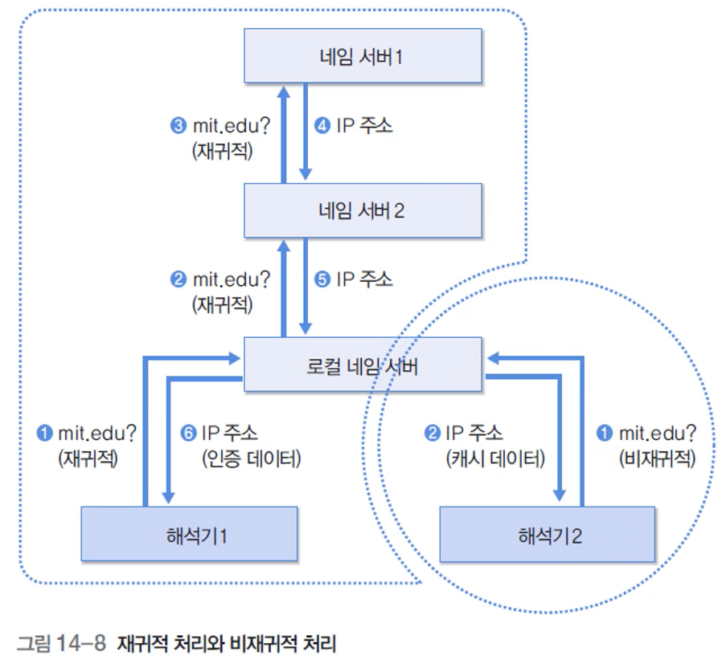
  - 비재귀적이면 3번의 요청 & 응답 받아야 함

# 4절 DNS 프로토콜

## DNS 메시지

- 메시지 구성

  - 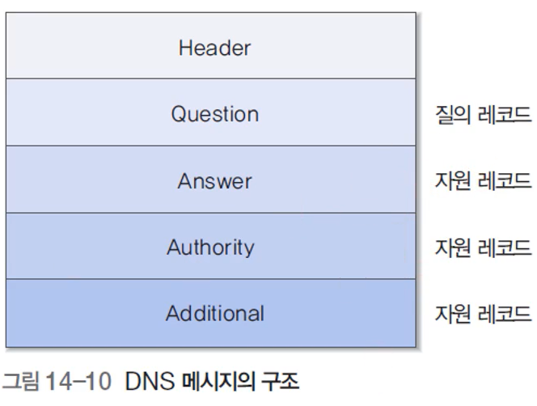
  - Header
    - 12 바이트
    - 헤더 값에 따라 메시지 각 필드의 사용 결정
  - Question
    - 질의 메시지, 응답 메시지에서 모두 사용
    - 질의 레코드
  - Answer, Authority, Additional
    - 정보가 더 담겨올 수 있음

- DNS 헤더

  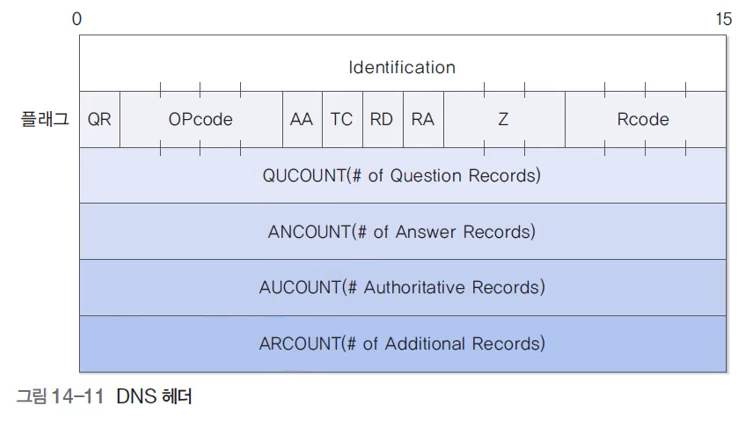

  - Identification
    - 2 바이트
    - 질의 때 임의의 값 채워 보내면 응답할 때 같은 값을 채워 확인하는 용도
  - QR (Query Response)
    - 질의 메시지(0)
    - 응답 메시지(1)
  - OPCODE
    - 질의, 응답 세세하게 구분하게끔
    - 표준(0), 반대(1), 서버상태요청(2)
  - AA (Authoritative Answer)
    - 제대로 질의해서 가져온건지, 캐시된 응답인지
  - TC (Truncated)
    - DNS는 UDP를 통해 질의&응답하도록 되어 있음
    - 데이터 양이 많은 경우 UDP에 다 채워넣지 못하면 넘쳐서 잘렸다는 걸 표시(1) -> TCP로 재요청 필요
  - RD (Recursive Desired)
    - 재귀적으로 처리해서 응답 달라
  - RA (Recursion Available)
    - 재귀적으로 응답 가능 여부
  - RCODE
    - 0이면 정상, 그외 응답 오류
  - QCOUNT, ANCOUNT, AUCOUNT, ARCOUNT
    - 각 자원 레코드 갯수

## UDP 패킷 크기로 인한 제약

- 해석기와 네임 서버는 기본적으로 UDP 53번 포트로 DNS 메시지 전송
- UDP 프로토콜의 최대 전송 크기 : 512 바이트
- TCP 53 번 포트 사용하는 경우
  - 미리 512 바이트보다 크다고 인지하면 처음부터 TCP 사용
  - 인지 못한 경우, TC=1로 지정되어서 TCP 재연결함
- IPv4의 경우 UDP 사용 일반적
- IPv6는 보안이 강화된 DNSSEC을 이용하는 경우 UDP 크기 제한을 넘어갈 수 있음

## DNS 프로토콜의 동작 과정

- 질의 메시지

  - www.korea.co.kr 호스트의 IP 주소를 원하는 경우

    - Header의 Identification : 메시지 식별자, 임의의 값이 부여됨
    - 플래그 값은 0x0100이므로 QR=0은 질의 메시지, OPcode=0은 표준 질의, RD=1은 재귀적 응답임

    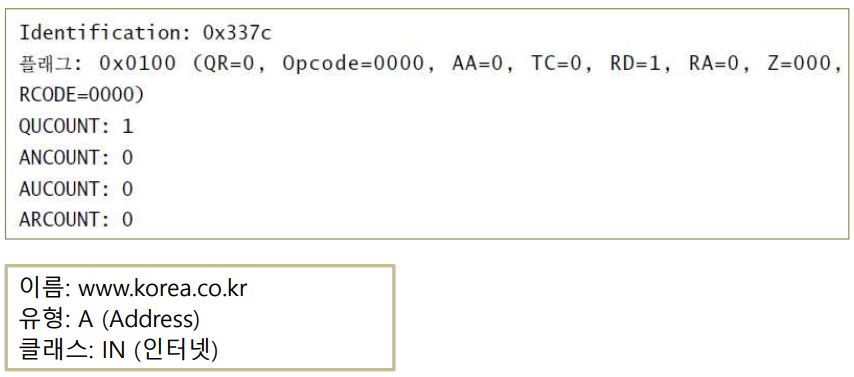

    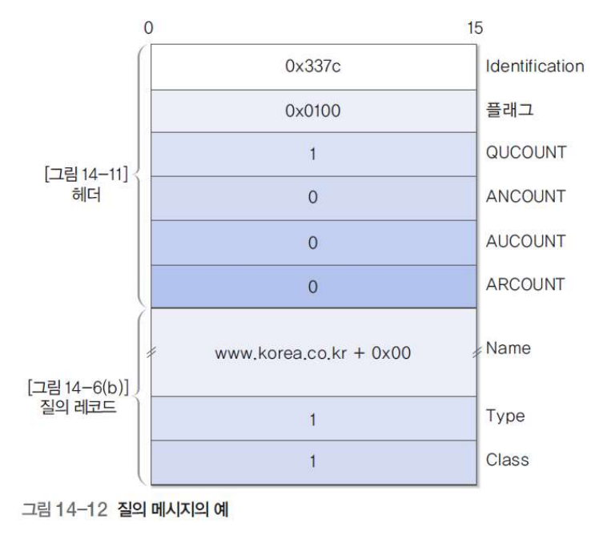

- 응답 메시지

  - DNS 헤더

    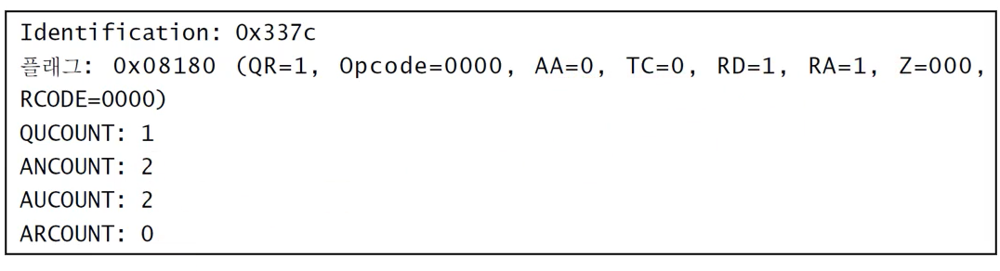

  - QUESTION : 질의와 동일

  - ANSWER : 2 개

    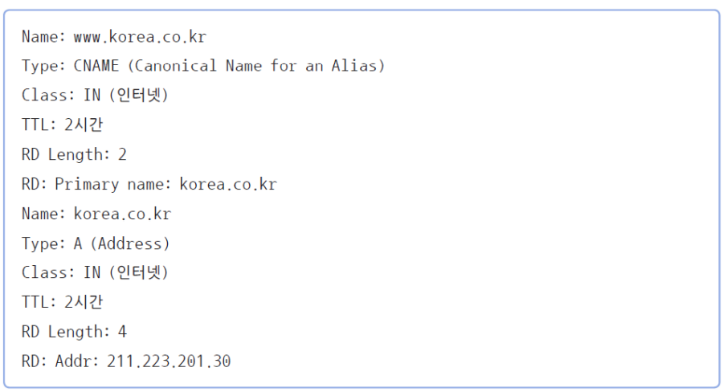

  - Authority 자원 레코드 내용

    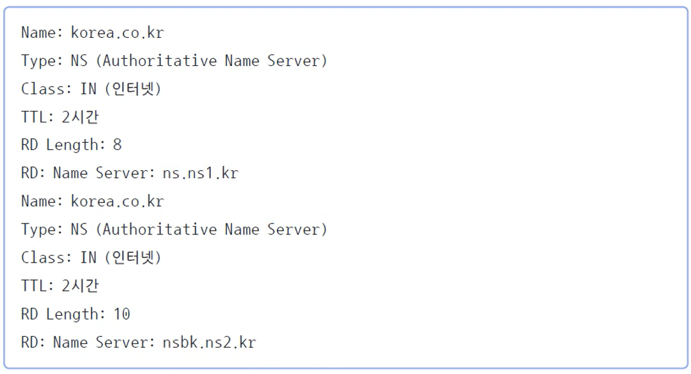

    

    

    

