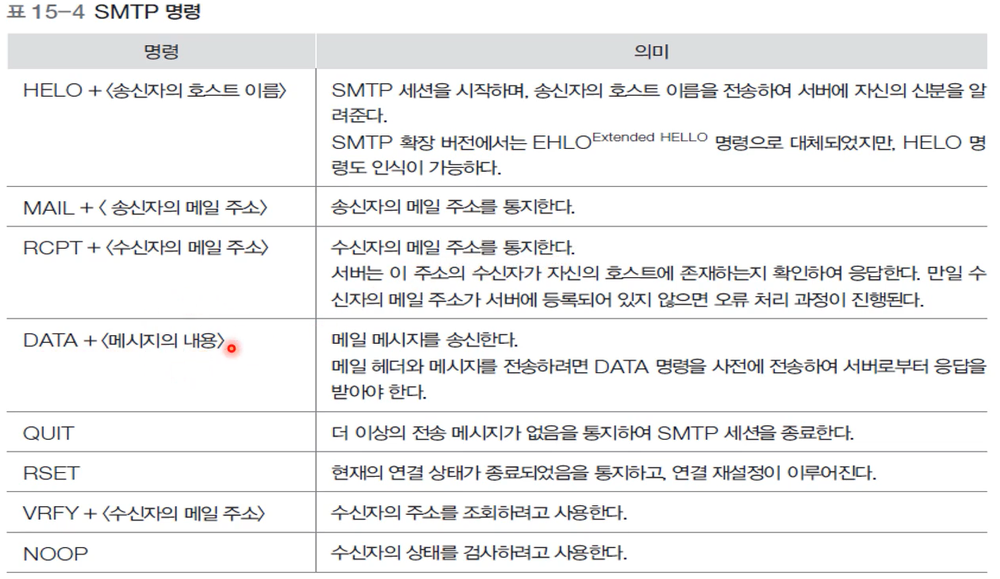

**이번 장은 강의 PPT를 적극 권장드립니다.** 

> **학습 목표**
>
> - 메일 시스템의 사용자 환경을 이해한다.
> - 헤더, 메시지, MIME 같은 메일 내용의 구성을 이해한다.
> - 일반적인 전자 메일의 시스템 구조를 파악하고, 동작 원리를 이해한다.
> - SMTP의 개념과 동작 원리를 이해한다.
> - POP 서비스의 개념과 동작 원리를 이해한다.

# 1절 전자메일 사용자 환경

## 전자 메일 기능

## 메일 메시지

- 출발은 멀티미디어 데이터를 수용하기 위한 기능 확장이지만 여러가지 용도로 확장시킴(MIME : Multipurpose Internet Mail Extensions)
- 구성
  - 헤더
  - 반드시 빈 줄
  - 본문(마지막 줄은 마침표만)
- 메시지 헤더
  - BCC : 수신자 숨김

## MIME

- Multipurpose Internet Mail Extensions

- 실행 파일, 음성, 영상 등 멀티미디어 데이터를 수용하기 위한 기능 확장

- MIME 처리

  - 송신 전 비-ASCII 데이터를 ASCII 데이터로
  - 수신 전 ASCII 데이터를 비-ASCII 데이터로

- MIME 헤더

  

- MIME 데이터 종류

# 2절 전자메일 시스템 구성

- 사용자 환경 : 메일 응용 프로그램, 사용자쪽에서 바라봄
- 네트워크 환경 : 메일을 중개하고 송수신하는 메일 전송 에이전트 (MTA)

## 사용자 에이전트

- 메일을 송수신하는 용도의 응용 프로그램
- 사용자 작업환경 제공 -> 다양한 응용 가능

## 메일 전송 에이전트

- MTA 정보 설정 예
  - 받는 메일 서버 : POP(Post Office Protocol) 프로토콜
  - 보내는 메일 서버 : SMTP(Simple Mail Transfer Protocol) 프로토콜
  - SMTP로 받은 것을 끌어오기 위해서 POP 필요

## SMTP와 POP 서비스의 관계

- RELAY할 때 SMTP, MTA로부터 UA로 끌어올 때 POP 사용

# 3절 SMTP

## SMTP 이용 과정

- 메일을 보내는 과정
  - 클라이언트에서 가까운 MTA 보내는 단계
  - MTA에서 다른 MTA에 보내는 단계
  - MTA 도착마다 다 받고 설정 후 연결 진행하는 방식

- 서버와의 직접 연결이 불가능하면
  - 근처에 있는 다른 서버에 저장
  - 그 서버가 나중에 전달할 수 있도록 함

## SMTP의 명령과 응답

- SMTP 명령

  

- SMTP 응답
  - 3자리 코드와 추가정보로 구성
    - 

## 연결 설정

- Well-known 포트 : TCP 25번

- 서버응답

  - 200번대는 정상적인 응답이 온 것
  - 준비가 안된 경우 : 421

- 클라이언트 : HELO

- 서버 응답 : 250

  

  

- 시뮬레이션

  - 클라이언트 : telnet 프로그램
  - 서버 : information.uu.ac.kr

  

220, 250 => 돌아오는 메시지

1. 연결 시도
2. 연결 성공 -> 명령과 결과 출력
3. 응답 메시지 수신
4. 키보드로 입력
5. 응답 메시지 회신, SMTP 세션의 성공 알림

## 데이터 전송

- 명령과 응답

## 연결 해제

- 명령과 응답
  - 클라이언트 QUIT 요청
  - 서버로부터 211 회신

# 4절 POP

- POP
  - 전자 메일 서버에 보관된 메일을 개인용 PC로 **다운로드**하는 프로토콜
  - Well-known 포트 : TCP 110번
  - 다운로드 과정에서 사용자 인증 허가 반드시 필요

## POP 명령과 응답

- POP 명령
  - RETR + <일련번호> : 일련번호 생략시 가장 가까운 것부터 읽어 들임

## POP 동작 시나리오

- Telnet을 이용한 시뮬레이션

  

​	

