# 파일전송

>  학습 목표
>
>  1. FTP 프로그램의 사용법과 익명 FTP의 기능을 이해한다.
>  2. FTP의 제어 채널과 데이터 채널의 필요성을 이해한다.
>  3. FTP 명령과 응답의 동작 원리를 이해한다.
>  4. TFTP의 필요성을 이해한다.
>  5. TFTP에서의 데이터 송수신 과정을 이해한다.

## 파일 전송을 위한 사용자 환경

### 개요

- **FTP(File Transfer Protocol)** : FTP 클라이언트와 FTP 서버 사이의 <u>파일 송수신 기능</u>을 제공
- FTP 로그인
  - 원격 시스템에 접속하려면 FTP 서버에 등록된 로그인 계정과 암호가 필요
  - 익명 FTP 로그인
    - 다중 사용자를 위한 로그인 계정
      - 로그인 계정 : anonymous
      - 암호 : 관례상 자신의 메일 주소

### 익명 FTP 로그인

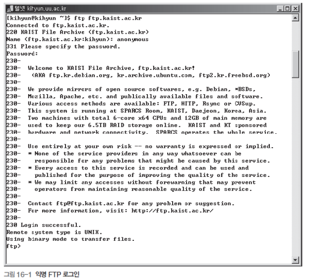

 익명으로 로그인. 

### FTP 로그인

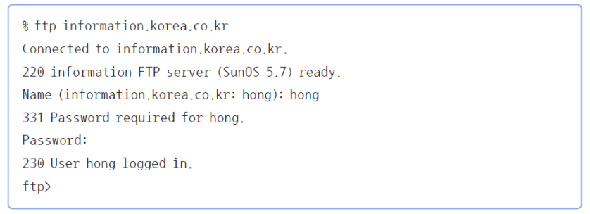

익명 로그인이 제공되지 않는 서버의 경우 따로 계정이 필요함.

### 사용자 파일 전송 명령

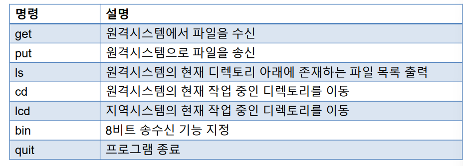

클라이언트에서 제공하는 명령

get- 파일 다운로드

put - 파일 업로드

### 파일 전송 명령 실행 예

- **ls** 명령 : <u>원격 디렉토리 목록</u>을 검색

  - README, Book, hong12.Dec00.tar.Z라는 파일 세 개가 존재

    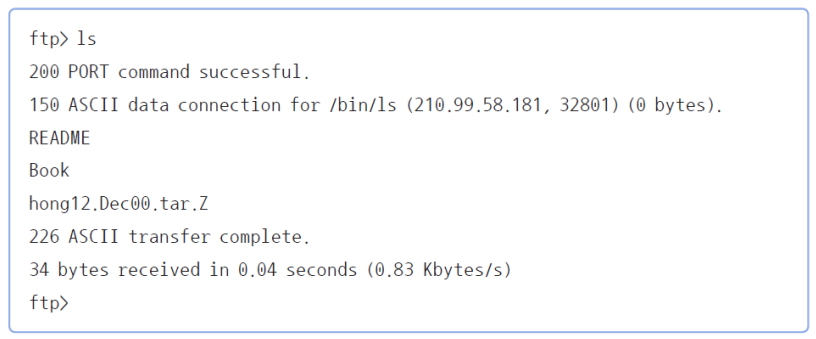

- **get** 명령 : 임의의 <u>파일을 가져옴</u>

  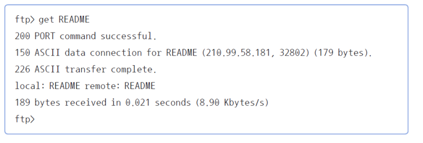

- **put** 명령 : 원격 시스템으로 <u>파일을 송신</u>

- **cd**, **lcd** 명령 : 복사되는 파일의 위치를 조정하여 <u>디렉토리를 이동</u>함

## FTP 원리

### FTP 구조

- 2개의 채널 존재

  - **제어 채널**
    - FTP 프로토콜의 명령과 응답 전송
  - **데이터 채널**
    - 복사하려는 파일의 내용 전송

- 구성 요소

  - 사용자 인터페이스 모듈
  - 명령 송수신 모듈
  - 파일 송수신 모듈
  - Well-known 포트

  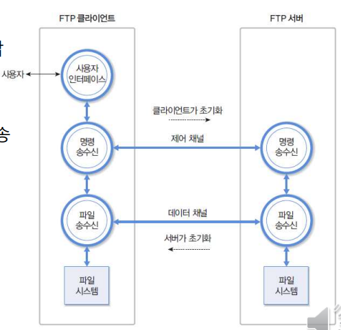

- 요소별 기능

  - **사용자 인터페이스 모듈**
    - 사용자 <u>명령을</u> 해석하여 <u>명령 송수신 모듈에 전달</u>
  - **명령 송수신 모듈**
    - <u>사용자 명령을 FTP 명령으로 전환하여 제어 채널로 전송</u>
    - <u>제어 채널 설정</u> (클라이언트가 초기화)
  - **파일 송수신 모듈**
    - <u>파일 송수신 요구가 발생할 때마다 데이터 채널 설정</u> (서버가 초기화)
    - 데이터 채널을 통하여 파일 복사, 파일 목록 전송 기능 수행
  - Well-known 포트
    - 제어 채널: TCP 21번
    - 데이터 채널: TCP 20번

### 데이터 채널의 설정

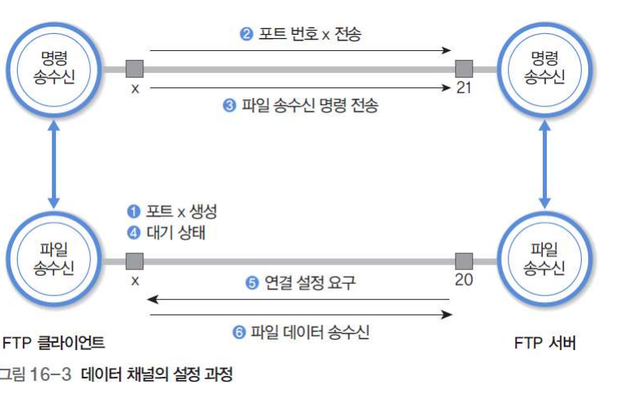

### FTP 명령과 응답

- 제어 채널을 이용하여 FTP 명령과 응답을 전송

  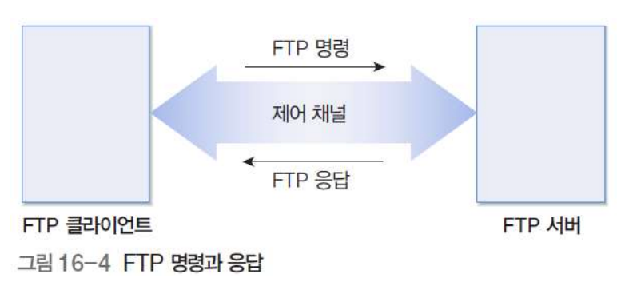

### FTP 명령

사용자가 직접 내리는 명령과 클라이언트가 서버에 내리는 명령은 서로 다름에 유의.

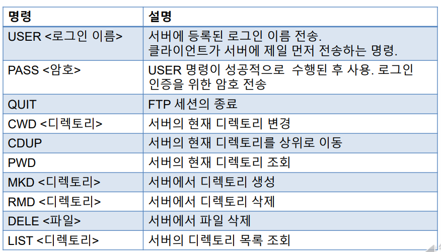

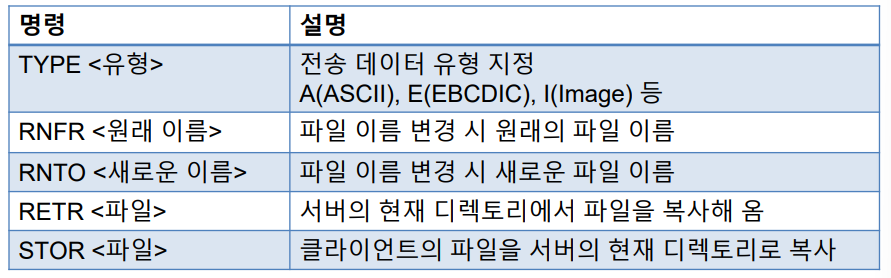

### FTP 응답

- **3자리 응답 코드**와 **설명문**으로 구성

  - 첫 번째 숫자가 2인 경우 : 성공
  - 첫 번째 숫자가 5인 경우 : 실패
  - 그 외는 연속 동작 지원 용도

  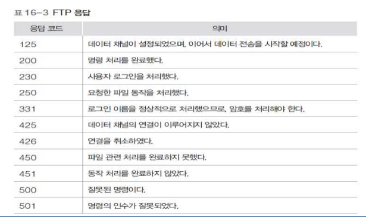

### FTP 로그인 과정

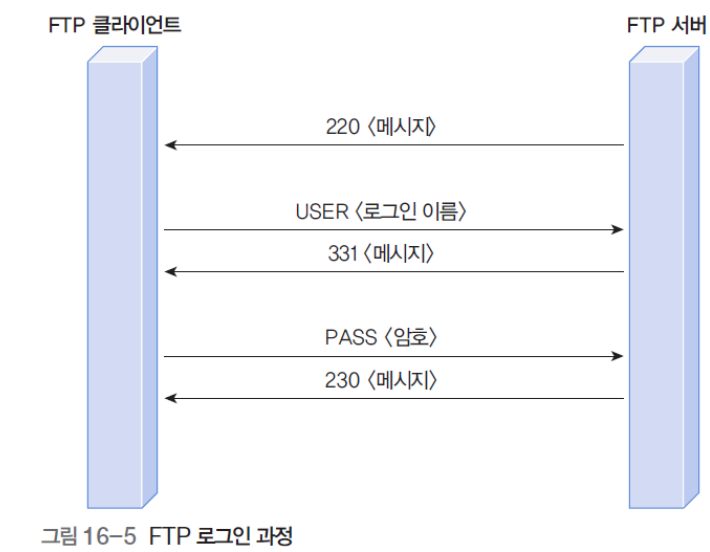

- FTP 로그인 예

  - 텔넷 프로그램을 이용한 FTP 로그인 과정

    - FTP 서버는 uu.ac.kr 호스트라고 가정
      1. telnet uu.ac.kr 21 명령을 입력
      2. USER, PASS 명령
      3. FTP 서버의 현재 디렉토리 이름인 /export/faculty/kihyun의 메시지를 서버가 회신함
      4. FTP 세션을 종료하기 위한 QUIT 명령

    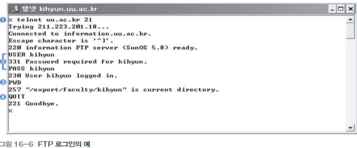

### FTP 파일 송수신

- FTP 파일 송수신 절차

  - 클라이언트에서 데이터 채널 생성
  - PORT 명령
    - 생성한 포트 번호(x) 전달
  - RETR/STOR (파일 송수신 명령) 전달
  - 데이터 채널 연결
  - 데이터 전송
  - 데이터 채널 종료
  - 서버에서 응답 코드 전송

  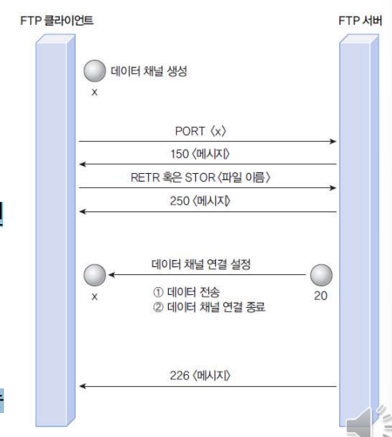

## TFTP

### TFTP 개요

- Trivial File Transfer Protocol
  - 기능이 축소된 FTP
- 임의의 시스템이 원격시스템으로부터 부팅(booting) 코드를 다운로드할 때 사용하는 프로토콜
  - 자체적으로 하드디스크를 보유하지 못한 X-terminal과 같은 장치
  - ARP, RARP / 하드 디스크가 없는 시스템에서 하드웨어 주소를 통해 IP 주소를 안 다음 본인의 부팅이미지를 다운받아야 함. -> 이 때 필요한 프로토콜. 
- 기존 FTP 
  - **TCP/IP** 전체 프로토콜 스택
  - 2개의 채널(제어, 데이터)
  - 디렉토리/파일 관리
- FTP 기능 대폭 축소하여 경량화
  - TCP대신 **UDP**사용
  - 복잡한 디렉토리, 파일 관리 기능 제거 (cd, ls 등 없)
  - 오직 **하나의 파일 복사**
- UDP **69번 포트**

### TFTP 명령

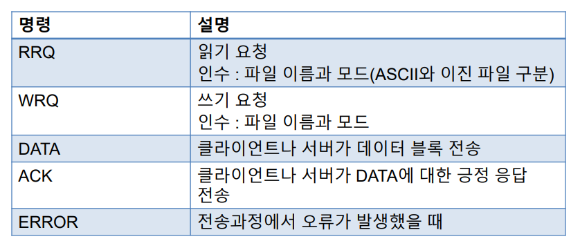

### 세션의 설정과 데이터 읽기

- **UDP**에는 연결 기능이 없으므로, 각 데이터 블록을 <u>독립적으로 전송</u>
- RRQ 를 보내면 세션 설정
- DATA 를 이용해 데이터를 전송하면 그대로 유지
- 마지막 DATA 는 512 바이트보다 작은 데이터 블록을 보내면 세션 해제
- 파일을 보내는 서버는 DATA, 클라이언트는 ACK 만 사용

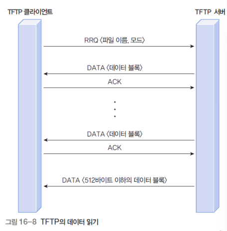

### 데이터 쓰기

- WRQ를 보내면 세션 설정
- 파일을 보내는 클라이언트는 DATA, 서버는 ACK만 사용

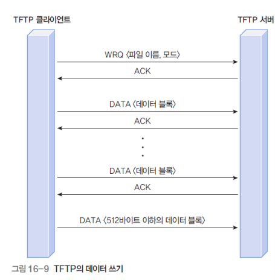

### 데이터 전송

- 데이터 블록 전송을 **하나씩 처리**하는 흐름 제어 방식
  - 데이터 도착 순서가 바뀔 수 없음
- 데이터가 **분실**되는 경우
  - **송신 측의 타이머** 이용
  - 아래 사진에서는 서버
- **ACK가 분실**되는 경우
  - **송신 측의 타이머** 이용
  - 아래 사진에서는 클라이언트
  - ACK를 보낸 후 주어진 시간 내에 다음 데이터가 도착해야만 계속 진행
- TFTP 는 NAK 를 지원하지 않음

​	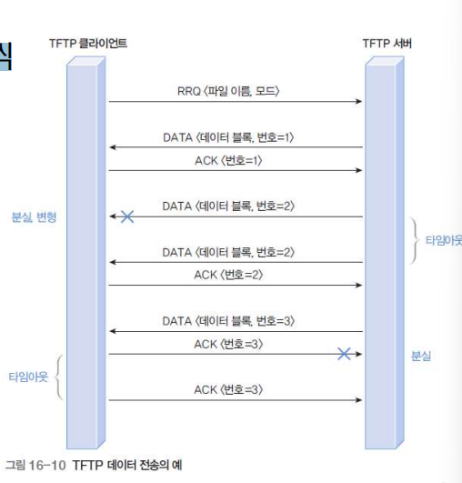

