# 네트워크 보안

> 학습 목표
>
> 1. 암호화 원리를 바탕으로 대체 암호화와 위치 암호화를 알아본다.
> 2. 암호화 알고리즘인 DES, RSA의 구조를 이해한다.
> 3. 전자 서명의 필요성과 방법을 이해한다.
> 4. 네트워크 보안의 개념과 관련 이슈를 살펴본다.
> 5. 라우터와 프록시로 구현한 방화벽의 원리를 이해한다.

## 암호화의 이해

### 개요

- <u>문서의 내용을 암호화(encryption</u>)하여 전달함으로써 외부 침입자로부터 문서 내용 보호
- 문서를 <u>암호화하고 복호화하는 과정</u>에 자신들만이 아는 **비밀키** 사용
- 컴퓨터 네트워크에서는 중간 전송매체를 통해 메시지 송수신
- 외부 침입자의 전송 메시지에 가하는 위해
  - 메시지 읽기
    - 전송 선로의 신호를 도청
    - 암호화 기법으로 해결
  - 전송 방해
    - 메시지가 수신자에게 도착하지 못하도록 방해
    - 방화벽의 불법 사이트 차단 기능도 여기에 해당
    - DoS (Denial of Service) 공격
  - 메시지 수정
    - 전송 메시지를 수정하여 메시지 의미를 왜곡

### 암호화 용어

- **암호화**: 메시지의 내용을 변형하여 원래의 의미를 알 수 없도록 변형

- **해독**(**복호화**): 암호화된 문서를 원래의 원문서로 복원

- **원문서**(Plain Text): 암호화되기 전의 원본 문서

- **암호문**(Cipher Text): 암호화된 문서

- **암호키**(k): 암호문을 작성하는 과정에서 사용하는 임의의 패턴

  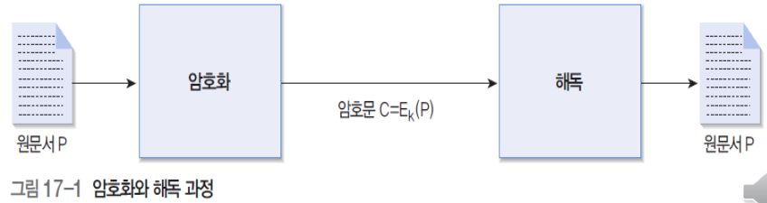

  C = Ciper Text

  E = Encryption

  k = key

  P = Plain Text

### 암호화 알고리즘

- **암호키**(k𝐸): 암호화 과정에서 사용하는 키

- **해독키**(k𝐷): 해독 과정에서 사용하는 키

- **대칭키**(Symmetric Key) 방식: <u>암호키 = 해독키</u>

- **비대칭키**(Asymmetric Key) 방식: <u>암호키 ≠ 해독키</u>

  - 공개키 방식이라고도 불

  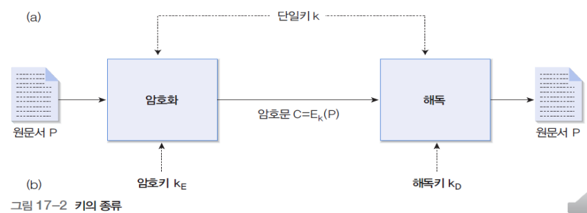

### 대체 암호화

- 특정 문자를 다른 문자로 <u>1:1 대응</u>

- **시저 암호화**

  - 알파벳 문자를 순차적으로 세 문자씩 오른쪽으로 이동

  - 암호키

    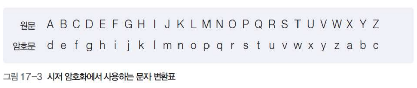

  - 예

    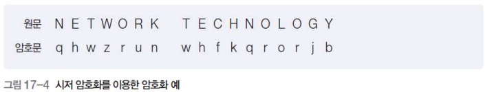

- **키워드 암호화**

  - 키워드로 지정된 단어의 문자를 먼저 적고, 나머지 문자를 알파벳 순으로 기술

  - 암호키: seoul

    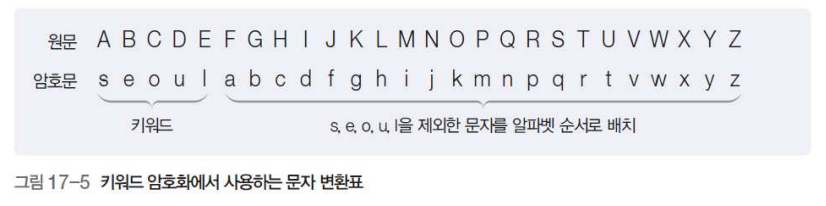

  - 시저 암호화에 비해 대체 문자표 추출이 어려워지나, 오른쪽으로 갈수록 원문과 암호문의 문자가 같을 확률이 높아짐

- **복수개의 문자표**

  - 둘 이상의 문자표를 사용
  - 예: 홀수 위치와 짝수 위치의 문자표를 다르게 사용

  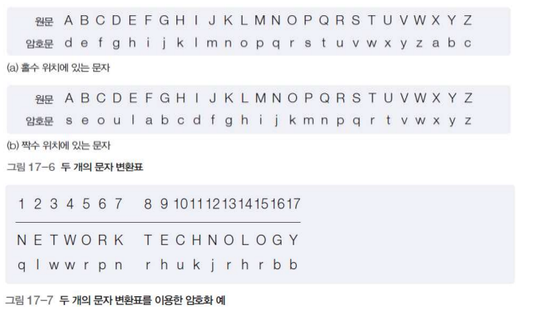

### 위치 암호화

- <u>문자들의 배열 순서를 변경</u>하여 암호화하는 위치 암호화(Transposition Cipher)

- 각 문자의 모양은 그대로 유지한 채 문자의 배열 위치를 임의로 변경

- **컬럼 암호화** 

  - 전체 문장을 컬럼(열)을 기준으로 다시 배치
    - 예: 컬럼의 길이가 7 인 경우
    - 예: 컬럼의 길이가 7이며, 공백에 Z 문자를 강제로 채운 경우
  - 컬럼암호화를 두 번 수행하는 이중 컬럼암호화

  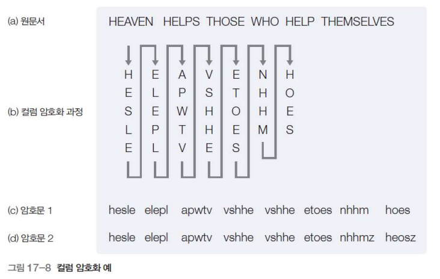

- **키워드 암호화**

  - 임의의 단어를 이용하여 컬럼의 순서를 결정

  - 예: NETWORK

    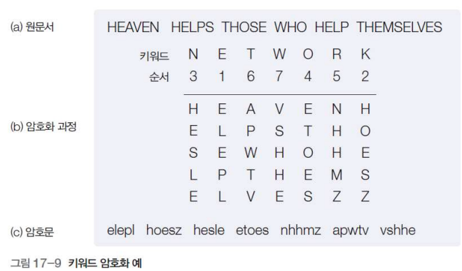

## 암호화 시스템

### 대칭키 암호 방식

- **암호화와 복호화에 하나의 키를 이용**

- **공통키** 또는 대칭키 암호방식이라고 지칭

- 이때의 키를 **비밀키(secret key)**라고 지칭

  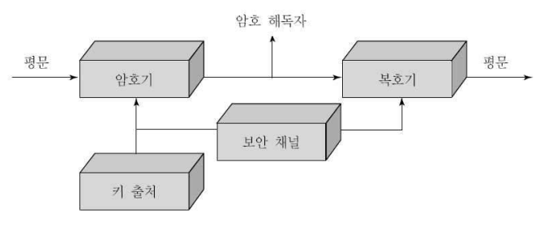

- 암호화 복호화를 수행하는 <u>두 사용자가 동일한 키</u>를 가지고 있어야 함

  - Pre-shared key
    - 사전에 공유하고 있는 키
  - 온라인 상에서 구두 또는 메일, 전화로 교환 : 수동키

- **블록 암호**와 **스트림 암호**로 분류

- 대표적 알고리즘 : **DES**, 3DES, **SEED**, RC2, RC5, **AES**(Rijndael)

- **블록 암호**

  - 일정한 블록으로 잘라낸 다음 블록 안에서 열심히 섞는다. 
  - <u>특정 블록 크기로 암호화/복호화를 수행</u>하여 스트림 암호에 비해 속도가 빠름
  - 블록 간의 연관성 때문에 <u>오류 발생시 전체 데이터에 영향</u>을 미침

- **스트림 암호**

  - 1970년대 초 유럽에서 연구
  - 원래 있던 데이터가 흘러가면서 암호화를 한다.
  - 비밀키를 상호 공유하고, 사용한 비밀키는 재사용되지 않는 특징
  - 비트열에 <u>오류가 발생해도 오류 확산이 없다</u>는 장점
  - 1비트씩 연산을 하므로 <u>수행속도가 느리다</u>는 것과 <u>비밀키를 안전하게 전송</u>해야 하는 단점

### DES 알고리즘

- Data Encryption Standard

- 대칭키 알고리즘

- 동작 방식

  - 암호키: 56 비트
  - 64 비트 단위로 암호화
  - 16단계의 암호화 과정
    - 총 16 + 2 단계

  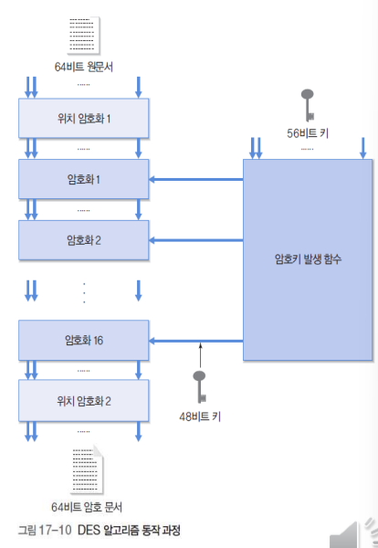

- 16단계의 암호화 과정

  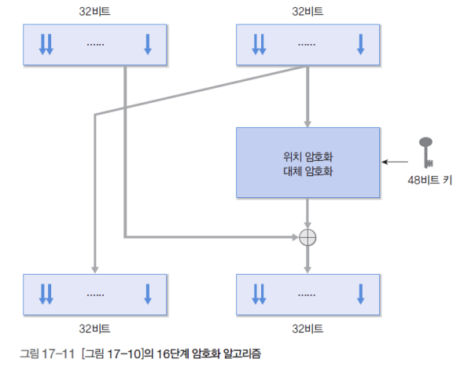

### DES의 안전성

- 키가 56비트이므로 2^56^개 키 존재
- 1977년 Diffe-Hellman에 의해 1,000,000대의 병렬 컴퓨터로, 1usec(micro sec)에 1번 encryption이 가능하다면 10시간 이내 찾을 수 있다고 제안
- Wiener에 의해 Known Plain-text Attack으로 정확히 분석
- 1997년 DES 키를 찾는 프로젝트에서 96일만에 키를 찾아냄
- 3DES로 키 길이와 라운드 수를 3배로 증가시킴

### 3DES

- 세 번의 DES 알고리즘을 수행하는 3단계 DES 알고리즘

- 구현이 쉬우나 DES 알고리즘에 비하여 3배 이상 속도가 느린 단점이 있음

- 전체적으로 168비트의 키를 지원하여 보안 기능이 한층 강화됨

  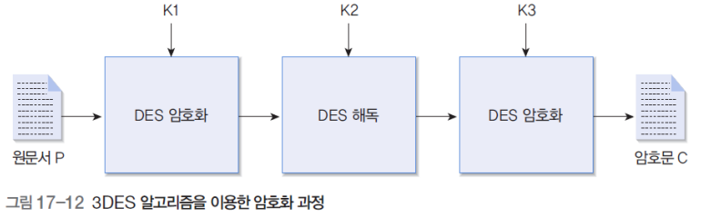

- DES 키(K1, K2, K3)

  - 키 K1으로 DES 암호화, 키 K2으로 DES 해독, 키 K3으로 DES 암호화 기능을 수행
    - K1 == K2로 보내서 기존의 DES 시스템과 연동할 수 있도록.

  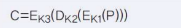

- 키 K3으로 DES 해독, 키 K2으로 DES 암호화, 키 K1으로 DES 해독 기능을 수행

  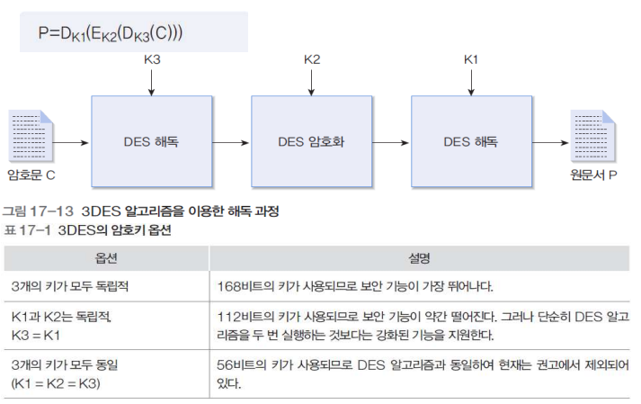

### SEED

- **국내** 대표적인 암호화 알고리즘

  - DES와 같은 Feistel 구조
    - 파이스텔 구조는 **데이터를 두부분으로 나누어 좌, 우 두부분에 교대로 비선형 변환을 적용시키는 구조**를 말함

  - **128비트 키**
  - 128비트 고정 길이 입출력
  - Known Attack에 강한 라운드 기능
  - 4개의 8x8 S -Box
  - XOR 과 Modular 의 혼합된 연산
    - *XOR 연산*이란 배타적 논리합(exclusive OR)이라고도 불리며, 두 개의 피연산자 중 하나만이 1일 때 1을 반환
    - 모듈로 연산(Modulo Operation)이란? **어떤 한 숫자를 다른 숫자로 나눈 나머지를 구하는 연산**

  - 16 라운드 수행

  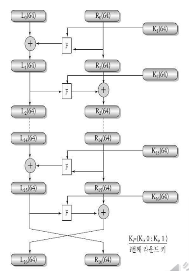

### AES(Advanced Encryption Standard)

- 1998년 사용기한이 만료된 **DES를 대체할 알고리즘**으로 공모
- 벨기에에서 개발한 ‘Rijndael’이 선정되어 2000년 10월 표준으로 선정
- 특징
  - 가변 블록길이(128, 192, 256) 지원 
  - 키도 128, 192, 256비트 사용
  - 키 길이에 의해 라운드 결정
  - Feistel 구조가 아닌 레이어(layer)로 구성
    - 선형 혼합(Linear mixing) : 라운드
    - 비선형(Non-linear) : S-Box
    - 키 추가(Key addition) : 라운드 키의 XOR

### 대칭키 알고리즘 비교

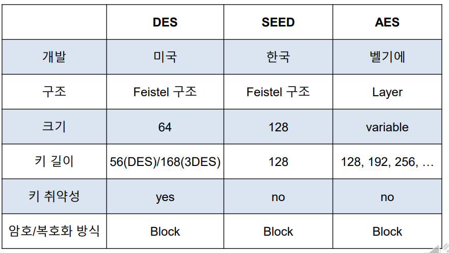

### 비대칭키 암호

- 1976년 Diffie와 Hellman에 의해 키 분배 방식알고리즘 발표 이후 많은 알고리즘이 제안됨

- <u>두 키가 서로 다르므</u>로 ‘**비대칭**’이라고 부르며, 두 키가 <u>**공개키**와 비밀키(**개인키**)</u>로 명명되어 ‘공개키 암호’라고 부름

- 비밀키(개인키) 보관에 따라 안전도가 좌우되고, <u>통신 상대의 확인에 디지털 서명 사용이 가능</u>하고, 키 관리에 뛰어남

- 상대적으로 <u>암호화 속도가 느려</u> 직접 데이터를 암호화하는 데에는 사용되지 않음

  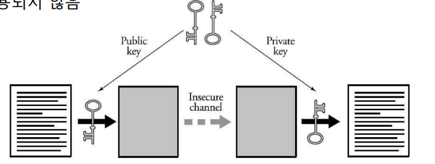

### RSA 알고리즘

- **RSA**(Rivest, Shamir, Adelman)

  - 1978년 MIT의 Rivest, Shamir, Adelman에 의해 제안
    - 비대칭키의 공개키 알고리즘
      - 공개키: 원문서를 암호화하는 용도로 사용 (모든 사람이 암호화 과정 수행)
      - 비공개키: 암호문을 해독하는 용도로 사용 (특정인만 해독 과정 수행)

  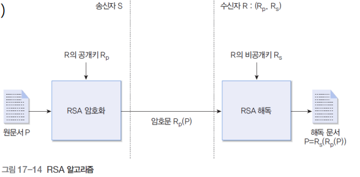

- 암호화 과정

  - **소인수 분해의 복잡성**을 이용하여 구현

  - 가입자는 두 개의 소수 p, q 선택하여 n = p q 계산

  - p, q를 알고 있는 사용자는 n을 계산하기 쉽지만, n만 가지고는 p, q를 유추하기 어려움

    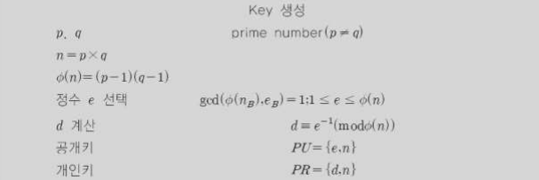

- 암호화

  

- 복호화

  

- RSA 암호의 안전성

  - 소수 p와 n에 달려있음
  - 공개키 e와 n으로 비밀키 d를 찾을 수 있으면 쉽게 해독됨
  - n으로부터 p,q를 찾을 수 있으면 n의 소인수 분해가 가능하고, 오일러 함수를 찾게 되어 e로부터 d를 찾아낼 수 있음
  - 부가 조건
    - p와 q는 거의 같은 크기의 소수
    - p - 1과 q – 1은 큰 소수를 인수로 가져야 함
    - p – 1과 q – 1의 최대공약수는 작아야 함
  - 현재까지 p, q의 크기가 100자리이고, n이 200자리인 합성수의 경우 n의 소인수분해가 거의 불가능한 것으로 알려짐
  - e와 d의 크기가 너무 작아도 안되지만, 지나치게 크면 연산 양이 많아져서 속도가 저하됨
  - 상용 장비의 경우 512비트의 n, 약 155자리 수
  - 연산 부하 증가로 상용화에 어려움이 있음

### 그 외 비대칭키 알고리즘

- **ElGamal**
  - **이산대수 문제**를 근간으로 만들어진 공개키 기반 암호 알고리즘
- **ECC**
  - ElGamal의 이산대수 문제 대신 **타원곡선 이산대수 문제**를 응용한 것
  - 경량화
  - 라이센스 비용이 있

### 비대칭키 알고리즘 비교

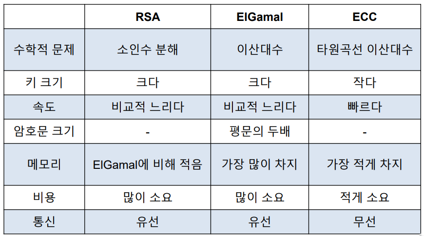

### 대칭키와 비대칭키 알고리즘 비교

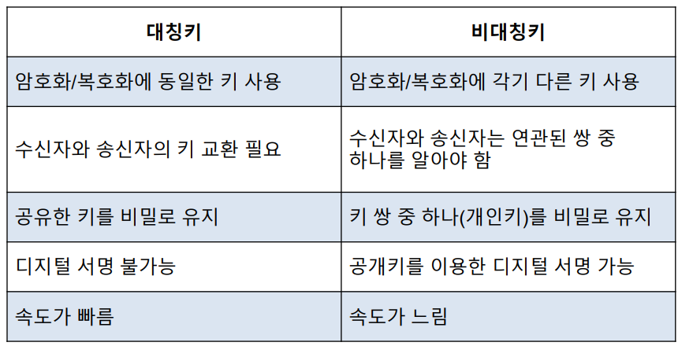

### 전자서명

서명자를 확인하고 서명자가 당해 전자문서에 서명했다는 사실을 나타내는 데 이용하려고, 특정 전자문서에 첨부되거나 논리적으로 결합된 전자적 형태의 정보를 말한다.

공인인증서..

- 전자서명의 조건

  - **위조 불가**
    - 서명자만이 서명 생성 가능
  - **서명자 인증**
    - 서명자의 신분 확인 가능
  - **재사용 불가**
    - 다른 문서의 서명으로 사용 불가능
  - **변경 불가**
    - 서명된 문서 내용 변경 불가
  - **부인 불가**
    - 서명한 사실 부인 불가

- 전자서명 알고리즘

  - **공개키 암호방식**을 이용한 서명 방식
  - 서명자가 <u>개인키로 서명을 생성</u>하고, <u>검증자가 공개키로 확인</u>하는 시스템
  - 직접 서명 방식
    - 송신자와 수신자 간에 직접 서명 및 검증
  - 중계 서명 방식
    - 중재자를 통해 확인
  - 통신 전에 정보 공유가 필요 없고, 외부로부터 공격에 강하며, 시간 확인까지 가능

- **해쉬함수와 비대칭키 알고리즘 결합**하여 사용

  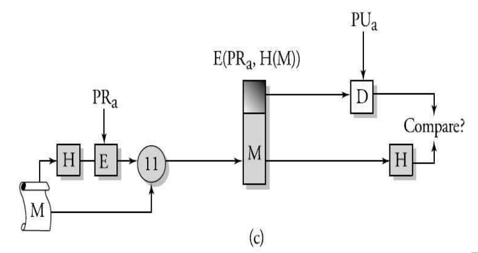

  H: hash function

  1. 메세지를 해시함수에 넣으면 고정된 크기의 값이 나옴
  2. 그 값을 a의 private key(개인키)로 암호화한다.
  3. 그 값과 메세지는 OR 연산한다.(암호화한 값을 앞에 붙인다)
  4. 그 결과가 E(PRa, H(M))이 된다.
  5. 수신 측에서는 해당 메세지를 해쉬함수에 처리한 값과 이미 암호화된 값을 public key(공개키)로 복호화한다.
  6. 그 두 값은 일치해야한다.

-> 일치한다면, 1. 메세지가 변형이 일어나지 않았다. 2. 공개키a로 풀어냈다면 상대방은 개인키 a를 소유하고 있다.(인증)

### 해쉬함수

- MD5 (Message Digest Version 5)
  - 512비트 입력 128비트 출력
  - 충돌회피성에 대한 문제로 인해 기존 응용과 호환으로만 사용 제한
- MD4 (Message Digest Version 4)
  - 1990년 Rivest가 개발
  - 메시지를 128비트로 압축
  - MD5보다 약간 빠르고, 안전성 측면에서는 다소 떨어짐
- SHA (Secure Hash Algorithm)
  - NIST에 의해 1993년 FIPS PUB 180으로 표준화
  - MD4와 유사하게 설계
  - 512비트 단위로 메시지를 입력하여 160비트 해쉬값 출력 (입력 전 메시지 길이를 512 비트 정수배로 조정)
- 일반적으로 MD5가 많이 사용되고 있음
  - 취약성이 발견되어 제한적 사용 권고
- SHA-1은 디지털 서명에 사용하도록 제안됨
- AES의 128, 192, 256비트에 적용하도록 SHA256, SHA382, SHA512로 확장
- RIPE-MD-128, RIPE-MD-160, RIPE-MD-256, RIPEMD-320은 MD5를 대신할 수 있도록 제안
  - RIPE-MD-128은 충돌저항성 문제가 있음
  - RIPE-MD-160은 효율성은 낮지만 높은 안전성으로 널리 사용 중

## 보안 프로토콜

### 전형적인 공격 유형

- 정상적

  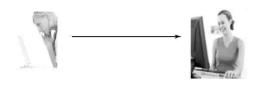

- 방해(interruption)

  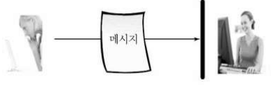

  메세지가 도착하지 못하도록 막는다.

  - 대표적 예
    - DoS(Denial of Service)
  - 대응책
    - 장애 감지 시 연결 단절 후 다른 통신 수단으로 대체
    - 침입차단시스템을 통한 1차 방어
    - 2차적으로 고가용성 기능을 이용하여 서비스 지속 및 연결 유지

- 가로채기 (interception)

  

  - 통신의 일부를 엿듣는 행태(도청)
  - 대표적인 예
    - Sniffing
  - 대응 방안
    - 기밀성을 패킷에 부여 (암호화)

- 변조(modification)

  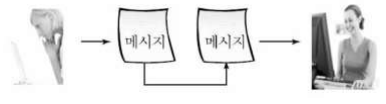

- 위조(fabrication)

  

  보낸 적이 없는데 보낸 것처럼 위조.

  - 대응 방안
    - 암호 및 서명을 통한 기밀성과 무결성

### 보안 프로토콜의 개요

- 보안 문제 위협 요소
  - 전송 데이터를 중간에서 <u>감청하거나 임의로 변경</u>하는 경우
  - 호스트 데이터에 위해를 가하는 등 직접적으로 <u>호스트 내부에 침입</u>하는 경우
  - 과도한 트래픽을 발생시켜 특정 호스트의 <u>통신을 방해</u>하는 경우
- 감청
  - 허가 받지 않은 자가 전송 중인 데이터를 얻어내는 것
  - 유선의 통신 선로에서 패킷 감청
  - 무선 통신 환경에서는 감청이 더욱 용이

### 암호화

- **데이터링크 계층** 암호화
  - 전송 선로상의 감청으로부터 보호
  - 단점: 라우터 등 <u>호스트 내부에서는 보호가 안됨</u>

​	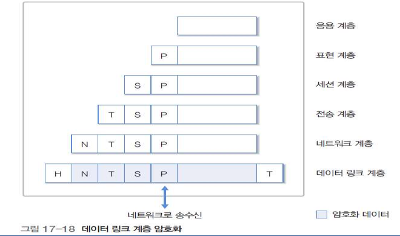

- **응용 계층** 암호화

  - <u>호스트 내부에서 보안을 지원</u>

  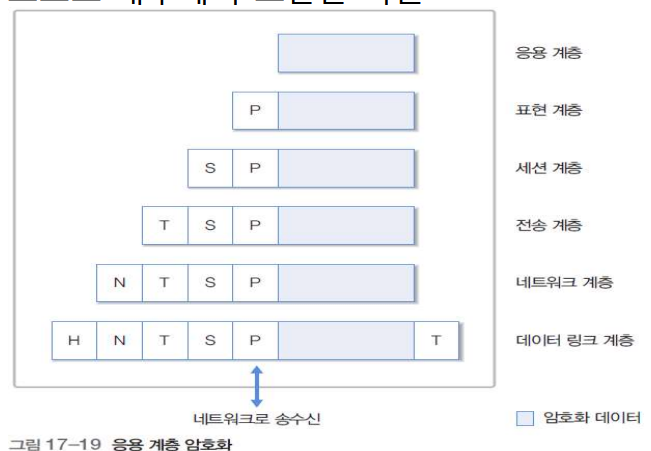

### VPN(Virtual Private Network)

- 가상사설망

  - 공중망을 사설망처럼 이용할 수 있도록 사이트 양단 간 암호화통신을 지원하는 장치
    - 공중망을 쓰지만 사설망처럼 데이터를 보호하도록 암호화를 한다.
  - 원격사용자가 공중망 및 인터넷을 통해 내부망의 시스템 사용 시, 공중망 구간에서의 도청으로 인한 정보유출을 방지하기 위해 사용자와 내부망간 암호화 통신을 지원

- 가상 사설망의 장점

  - 저비용으로 광범위한 사설 네트워크의 구성이 가능
  - 기업 네트워크 관리 및 운영비용이 절감 됨
  - 재택근무자 등 개별 사용자 지원 및 무선 이동 환경의 사용자 지원, 기업
  - 네트워크의 유동성 지원이 가능

- 가상 사설망의 단점

  - 인터넷 상황에 따라 네트워크 성능이 종속적
  - 전용선보다는 신뢰성 및 보안성 수준이 낮음
  - 서비스에 문제가 발생하면 책임소재가 불분명 함(망에서 문제인지 끝단에서 문제인지)

- 가상 사설망의 기능

  - 암호화 기능
  - 사용자 인증 기능
  - 무결성 기능
  - 터널링 기능

- 관련 프로토콜

  - L2TP(Layer 2 Tunneling Protocol)
  - IPSec(IP Security Protocol)

  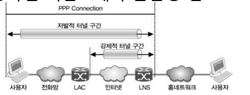

  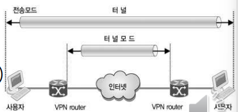

### 트레픽 제어

- 특정 호스트의 <u>트래픽 량 자체가 중요한 정보가 될 수 있음</u>
- 예: 특정 군부대의 통화량이 많으면 모종의 군사 작전의 가능성
- 무의미한 가공 데이터를 추가적으로 발생시켜 통계 자료에 혼란을 줄 필요가 있음
  - 자료의 통신량, 송신자, 수신자 랜덤하게 생성

### 방화벽

- **방화벽(Firewall)**

  - 개방적인 공중 인터넷망과 제한된 그룹의 사설망 사이에서 보안 기능 제공
  - 공중 인터넷망에 문제가 발생하더라도 내부로 들어올 수 없도록 막는 역할.
    - **패킷 필터링**
      - 패킷의 헤더 또는 내용을 검색하여 차단 여부 결정
      - 일반적으로 라우터에서 제공
    - **트래픽 관찰**을 통한 의심스러운 사용자 감시

  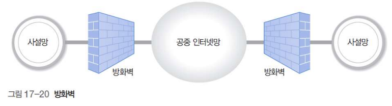

### 라우터를 이용한 방화벽 구현

- 외부망과의 중개 기능을 수행하므로 간단하면서도 매우 효과적

  - **IP 주소 기반**
    - 위장 IP 주소의 차단
      - 인터넷으로부터 211.223.201.X를 발신자로 하는 패킷은 입력될 수 없음
    - 스팸 메일을 발송하는 외부 호스트 차단
    - 내부 사용자가 유해 사이트로 접속하는 것 차단
  - **포트 번호 기반**: 특정 서비스 이용을 차단
    - Web, FTP 등 서비스별로 허용/차단 설정

  

### 프록시를 이용한 방화벽 구현

직접 연결하는 것이 아닌 거쳐가는.. 프록시

- 라우터 기반

  - 네트워크 계층과 전송 계층의 헤더에 기초하여 방화벽 기능 수행

- 프록시 기반

  - 응용 환경에서 적절하게 처리할 수 있는 정보만 수신하도록 가상의 응용 프로그램을 시뮬레이션하는 방화벽
  - 내부에서는 외부 연결로 보이고, 외부 네트워크에서는 내부의 응용 연결로 보임

  

  