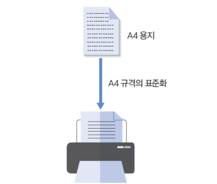
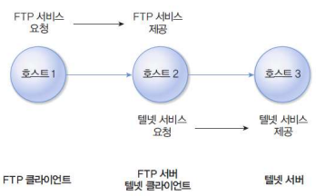

### 네트워크 관련 기초 용어

#### 인터넷 (Internet)

- internet : internetworking에서 유래. 네트워크와 네트워크 사이의 뭔가를 묶어서 표준화시켜주는 개념

- Internet : TCP(전송 제어 프로토콜)/ IP(인터넷 프로토콜)를 기반으로 한 네트워크. 

  - 온라인상의 안전하고 효율적인 데이터 전송의 필수 요건을 정의.
  - 일반인들이 흔히 사용하고 있는 네트워크를 지칭할 때 대문자 사용한 Internet 사용.

  

#### 네트워크 / 망 (network)

- `전송매체(transmission media)`로 서로 연결해 데이터를 교환하는 `시스템(system)`의 모음

#### 전송매체 (transmission media)

- 시스템끼리 데이터를 전달하기 위한 물리적인 전송 수단
- ex) 동축케이블, 광케이블, 공기, 전파
- 인터페이스에 정해진 규칙은 매체를 통해 전송됨으로써 구현되고 동작함

#### 시스템 (system)

- 체제 / 체계
  - 필요한 기능을 실현하기 위하여 관련 요소를 어떤 법칙에 따라 조합한 집합체
- 내부 규칙에 따라 능동적으로 동작하는 대상
- 예 :
  - 물리적 대상 : 컴퓨터, 자동차, 커피 자판기, 마이크로 프로세서, 하드 디스크
  - 논리적 대상 : 교통신호제어시스템, 컴퓨터 운영체제, 프로세스(프로그램 실행 상태)
- 외부 입력, 내부 정보와 외부 입력 처리를 통한 외부 출력 가능
- 작은 시스템이 모여 더 큰 시스템 구성 가능

----

#### ✅ 네트워크(network)

- 통신용 매체를 공유하는 여러 시스템이 `프로토콜`을 사용하여 데이터를 교환할 때 이들을 하나로 통칭
- 일반적 네트워크에서는 물리적 전송 매체를 공유하는 컴퓨터들이 `동일한 프로토콜을 이용`
- 네트워크끼리 `라우터(router)`라는 중계장비를 이용하여 연결

#### ✅ 인터넷(Internet)

- 전세계의 네트워크가 유기적으로 연결되어 동작하는 `통합 네트워크`
- 다양한 시스템, 인터페이스, 전송매체, 프로토콜이 사용되지만 공통적으로 `IP(Internet Protocol) 사용`

---

#### 인터페이스 (interface)

- 시스템과 전송매체의 연결 지점에 대한 규칙
- 층과 층 사이
- 시스템과 전송매체(시스템)를 연결하기 위한 표준화된 접근방법
- ex) 논리적 규격(블루투스, USB), 물리적 규격(크기, 모양)
- 대등한 관계, 상하 관계

#### 프로토콜 (protocol)

- 시스템이 데이터를 교환할 때 따르는 임의의 통신 규칙
- 원래 의미 : 의전 절차
  - ex) 대통령이 한 나라를 방문했을 때 어떻게 맞이를 할 것인가 차이를 두지 않기 위해 국제적인 의전 절차를 설립함
- 상호 연동되는 시스템이 전송 매체를 통해 데이터를 교환할 때 따르는 특정 규칙
- 일반적으로 `동등한 관계`에 있는 시스템 사이의 규칙이라는 측면 강조
  - 일반적으로 대등한 관계에서 직접 묶여있는 시스템 사이면 인터페이스라는 단어를 쓰기도 하지만, 직접 묶여있지 않는 경우에 프로토콜이라는 단어를 쓰기도 한다.
- 주고받는 정보의 형식과 그 과정에서 발생하는 일련의 절차에 무게를 둠

#### 표준화 (standardization)

- 서로 다른 시스템이 상호연동하기 위해 형식(규칙)을 통일하는 것
- 상호연동(interoperable)
- 표준이 갖는 의미
  - 자국 시장 보호 ?
    - 미국 시장 표준, 유럽 시장 표준을 따르지 않고 일본만의 고유 시장 표준을 만들면 일본에 수출하기 위해서 일본 시장 표준에 따른 물품을 따로 만들어야 한다 -> 일본 자국 시장 보호 = 갈라파고스화 되었다
  - 글로벌화(globalization)
    - 기술 선도 / 시장 선점
    - 자국 회사의 물품이 먼저 출시되어 먼저 표준화를 선점하게 되면 시장에서 먼저 들어갈 수 있는 장점이 있다.

#### 시스템의 구분

- 노드(node)
  - 인터넷에 연결된 시스템의 가장 일반적인 용어
  - 데이터를 주고 받을 수 있는 모든 시스템
  - 노드 안에 호스트, 라우터가 있을 수도 있다.
- 호스트(host)
  - 컴퓨터 기능이 있는 시스템 : 서버, PC
  - 일반 사용자가 있는 응용 프로그램을 실행할 수 있어 사용자가 네트워크에 접속하는 `창구 `역할

- 클라이언트(client)
  - 서비스를 요청하는 시스템
  - 호스트의 경우 클라이언트가 될 수도 있고, 서버가 될 수도 있음(상대적 용어)
- 서버(server)
  - 특정 서비스를 제공하는 시스템
  - 일반적으로 클라이언트보다 먼저 실행되어 대기 상태, 계속 살아 있으면서 요청이 오면 서비스 제공