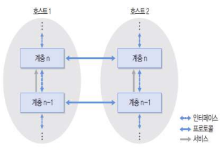
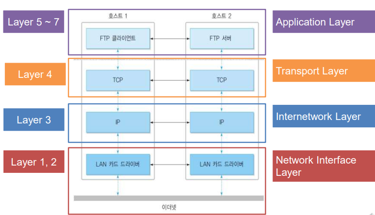
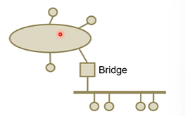
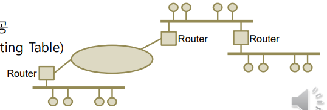
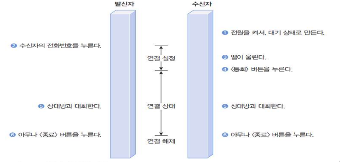
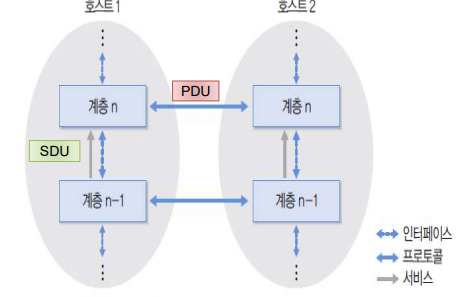

### 계층 모델

#### 계층(Layer)

- N 계층과 다른 노드의 N 계층과의 관계
- 같은 노드의 N 계층과 N-1, N+1 계층간의 관계
- 통신을 위한 전반적인 소프트웨어 및 하드웨어적인 사항의 여러 관련된 부분을 모아서 수직적 구조를 갖도록 한 것

#### 프로토콜과 인터페이스

- 프로토콜
  - 서로 다른 노드(호스트)에 위치한 동일 계층끼리의 통신 규칙
  - 호스트 1의 N 계층과 호스트 2의 N 계층 간의 사이
- 인터페이스
  - 같은 노드(호스트)에 위치한 상하위 계층 사이의 규칙
  - N 계층과 N-1 계층 간의 사이
- 서비스
  - 하위 계층이 상위 계층에 제공하는 인터페이스

#### OSI 7계층 모델

- ISO(International Standard Organization) 

- IEC(International Electrotechnical Commission) 

- OSI(Open System Interconnection)

- ISO에서 제안한 OSI 7 Layers

- 모든 네트워크 통신에서 생기는 여러가지 충돌 문제를 완화하기 위하여, `국제표준기구(ISO)`에서 표준화된 `네트워크 구조`를 제시한 기본 모델

  - ##### ❤️물리 (Physical) 계층

    - 노드(호스트)를 전송매체와 연결하기 위한 인터페이스 규칙과 전송매체의 특성을 다룸
    - `물리적/ 전기적/ 기계적` 약속
    - ex) 동축케이블 규격, 신호의 전압, 라인은 몇 가닥이 있는지 등 

  - ##### 🧡 데이터 링크 (Date link) 계층

    - 물리적 전송 오류(ex. 잡음)를 해결
    - `오류 제어(Error control)`
      - 전송 오류 감지 -> `재전송 기능`
    - `흐름 제어(Flow control)` : 일반적으로 수신받는 쪽(수신단)에서 많은 양을 처리할 때 버퍼를 사용하는데, 버퍼를 사용하고도 과부하가 되면 일시적으로 송신을 멈춰줄 것을 요구

  - ##### 💛 네트워크 (Network) 계층

    - `주소 (address) 개념`
    - 호스트와 호스트 사이의 올바른 `전송 경로를 선택`(혼잡 제어 포함)
    - 라우터(router) : 길을 찾아가는 장비

  - ##### 💚 전송 (Transport) 계층

    - 송수신 프로세스 사이(`종단간` : `end-to-end)`연결 기능을 지원
    - 안전한 데이터 전송
      - 오류 제어
      - 흐름 제어
    - 데이터 링크 계층에서는 직접 연결된(물리적으로) 둘 사이의 흐름을 제어하는 것이라면 전송 계층에서는 전체적인 종단간(끝과 끝) 사이에서 제어를 하는 것이다.

  - ##### 💙 세션 (Session) 계층

    - `대화(dialog) 개념`을 지원하는 상위의 논리적 연결을 지원
    - `동기화 (synchronization)` : 이미 설정된 값들은 다시 세팅 번복하지 않아도 됨
      - ex) 철수와 영희가 대화를 하다가 전화가 끊어진다고 해서 이미 정한 약속을 처음부터 다시 정하지 않아도 됨

  - ##### 💜 표현 (Presentation) 계층

    - 데이터의 `표현 방법`
      - ex) 한 쪽은 한국어를 사용하는데 한 쪽은 영어를 쓴다 => 통역시스템 필요!
    - 압축 (Compression)
    - 암호화 (Encryption / Decryption)

  - ##### 🤎 응용 (Application) 계층

    - 다양한 응용 서비스 지원
    - 앞서 나와있는 모든 내용 이외의 모든 것들

#### 인터넷 계층 구조

#### 인터네트워킹

- 인터네트워킹(internetworking)
  - 네트워크와 네트워크의 연결
  - ex. 인터넷(Internet)
- 네트워크의 연결

- 게이트웨이 (Gateway)
  - 인터네트워킹 기능을 수행하는 시스템을 일반적으로 지칭
  - OSI 계층 중 Transport 계층 이상 상위 계층에서 프로토콜 변환 기능 수행
- 리피터 (Repeater)
  - 전송거리가 멀어지면서 약해진 신호 증폭
  - 전송 도중에 생긴 잡음까지 같이 증폭되므로 물리적 한계 존재

- 브리지 (Bridge)

  

  - 논리적으로 분리된 세그먼트(segment) 사이에서
    - 같은 프로토콜을 이용하는 경우 동일 세그먼트에 속한 것인지 아닌지를 구분하여 처리
    - 서로 다른 프로토콜을 사용하는 경우 `프로토콜 변환 기능` 제공 가능

- 라우터 (Router)

  

  - 물리계층, 데이터링크 계층, 네트워크 계층 기능 제공
  - 주소를 가지고 경로 선택 기능 제공
  - 라우팅 테이블 (Routing Table)

#### 프로토콜

- 통신시스템이 데이터를 교환하기 위해 사용하는 통신 규칙
  - ex) 전화
- 계층 모델에서는 각 계층 포로토콜이 독립적
- 데이터 단위
  - PDU(Protocol Data Unit)
  - SDU(Service Data Unit)

