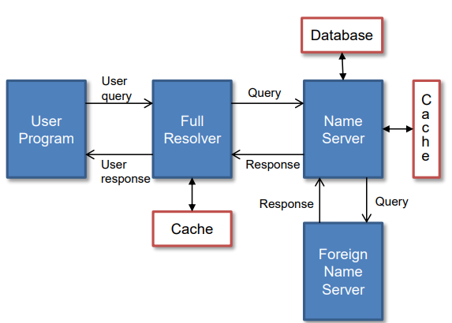

### 네트워크 주소의 표현

#### 식별자

##### 식별자(identifier)의 4가지 특징

- 유일성
  - 서로 다른 시스템은 같은 식별자를 가질 수 없음
- 확장성
  - 시스템의 최대 수용 규모의 예측과 이를 지원할 수 있는 최대 한계 설정
- 편리성
  - 내부 처리를 효율적으로 할 수 있어야 함
  - 숫자로 구성된 주소와 문자로 구성된 이름 사이의 매핑(mapping) 필요
- 정보의 함축
  - 다양한 정보 내포
  - ex) 주민등록번호 - 생년월일, 성별, 지역 정보 내재

##### 주소와 이름

- 주소 (Address)
  - 기계가 처리하기 쉬운 구조
  - 식별자의 일종
- 이름 (Name)
  - 사용자의 `편의성`을 위해 인간이 기억하기 쉬운 문자열로 구성
  - 일반적인 이름은 식별자가 아님
    - Why ? 
      - 동명이인
  - 호스트 이름은?  이름이지만 주소의 성격을 가지고 있기도 하다.

##### IP 주소

- 컴퓨터 네트워크에서 장치들이 서로를 인식하고 통신을 하기 위해서 사용하는 특수한 번호

- IPv4 예
  - 32비트 크기의 주소 체계
  - IP 주소의 표현
    - 4개의 십진수와 .(dot)으로 표현
    - ex) 211.233.201.30
- IPv6에서는 128 비트 주소 체계로 확장
- IPv4 주소 클래스
  - 한정된 43억 개의 IP 주소를 효과적으로 쓰기 위해 보유할 수 있는 호스트 수에 따라 클래스를 나눔
  - A ~ C class는 각각 정해진 숫자 구간이 있음
  - D class : 멀티캐스팅용
  - E class : 연구/ 개발용

- Reserved address 
  - 0.0.0.0 : this host. 해당 시스템 자체를 뜻함(본인)
  - x.y.z.255 : x.y.z 서브망(해당 망)의 모든(255) 호스트
  - 127.0.0.1 : loopback. 나간 쪽의 라인을 다시 들어오는 쪽으로 연결.
    - why? 연결해놓으면 나가는 기능이 제대로 되는지, 수신이 제대로 되는지 테스트 확인 가능하다. 

- 라우터에서의 경로 선택
  - IP 주소를 기반으로 경로 선택

#### 호스트 이름

- 인간이 기억하기 어려운 IP 주소 대신 호스트 이름을 주로 이용
- 호스트 이름 규칙
  - 사람이 이해하기 쉽도록 .(dot)로 구분된 레이블(label)들로 구성
  - 레이블은 1에서 63개까지 영문자와 숫자, 하이픈으로 구성될 수 있는데, 시작은 반드시 영문자이어야 함
  - 호스트 이름은 대소문자 구분이 없음
- 호스트 이름과 IP 주소의 변환

- 일반적인 TLD(top-level domain)
  - 3글자 혹은 그 이상의 길이를 갖는 일반적인 도메인
  - 국제적으로 합의된 조항

- 일반적인 국가 도메인 호스트 이름 구성
  - <호스트>.<단체>.<단체 종류>.<국가 도메인>
    - ex) zebra.korea.co.kr
  - 국가 도메인
    - ISO 3166에서 정의한 2글자 국가 코드 이용
    - ex) 아랍 에미레이트 : ae / 짐바브웨 : zw
  - 두 번째 단체종류에 일반적인 TLD에 대응하는 종류를 가지고 있음
    - ex) ac.kr(edu) / co.kr(com)
- ".한국"과 같은 자국어로 구성된 호스트 이름도 가능

#### 주소 정보의 관리

- 도메인 이름(domain name)
  - 인간이 지칭하는 호스트 이름
- FQDN(fully qualified domain name)
  - 도메인 이름의 마지막이 .(dot)로 끝나는 경우 이를 (Root까지 명확히 드러난) `완전한 도메인 이름`이라 지칭
  - ex) lily라고 지칭하는 경우 lily 뒤에 mmu.ac.kr을 붙여 FQDN을 만듦
- 호스트 파일
  - 호스트 이름과 주소를 관리하는 가장 간단한 방법으로 파일에 해당 정보 보관
  - 초창기에 이용했으나 현재는 일부 흔적만 남아있음
  - 점점 관리해야할 수가 많아지면서 DNS가 탄생함
- DNS(Domain Name System)
  - 사람이 읽을 수 있는 도메인 이름(ex)www.amazon.com)을 머신이 읽을 수 있는 IP 주소(ex)192.0.2.44)로 변환
  - DNS를 Domain Name Service로 오인하는 경우가 많음
  - IETF RFC 1034, RFC 1035에 정의
  - 웹 브라우저에 특정 호스트 이름을 입력하면 DNS 서비스가 요청되어 일련의 과정 진행
  - 분산 데이터베이스 시스템
  - 네임서버(name server), 리졸버(resolver), 위임(delegation)

#### 그 외 주소

- MAC(Medium Access Control) 주소
  - 계층 2(Data link layer)에서 사용하며, 보통 LAN 카드 (H/W)에 내장 - H/W 주소로 지칭하기도 함
  - IP 주소를 MAC 주소로 변환하는 과정 필요 (ARP : Address Resolution Protocol)
- 포트(port) 번호
  - 전송 계층에서 사용하며 서비스(프로세스 구분)
  - TCP, UDP가 별도로 port 번호를 관리
  - Well-known port : 표준에서 정의한 포트 번호
  - UNIX의 경우 /etc/services에서 확인 가능
- 메일 주소
  - 일반적으로 호스트 이름 앞에 사용자 이름과 @를 붙여 사용
  - ex) psj@mmu.ac.kr 

