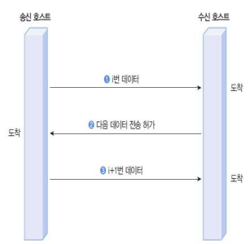

### 모듈화

#### 모듈

- 컴퓨터 시스템에서, 부품을 떼 내어 교환이 쉽도록 설계되어 있을 때의 각 부분

- 독립적으로 동작하면서 상호유기적으로 통합 가능해야 함(적절한 인터페이스 필요)
- 모듈화의 예
  - 자동차
    - ex) 범퍼, 엔진, 헤드라이트 => 최종적으로 결합해서 자동차를 완성!
  - 컴퓨터 하드웨어
  - 소프트웨어의 함수, 객체지향 개념

#### 계층화된 모듈 구조

- 상위 계층이 하위 계층에서 제공하는 서비스를 요구하는 방식으로 동작
- 모듈화된 계층 프로토콜 구조의 장점
  - 크고 복잡한 시스템을 작고 간단한 시스템들로 재구성 가능
    - 이해하기 쉽고, 설계 및 구현 용이
  - 모듈이 연동할 수 있는 인터페이스 제공
  - 전송 매체 양단의 호스트가 수행하는 프로토콜은 상호 대칭 관계
  - 각 계층의 오류를 수정하거나 개선하는 경우 전체 시스템의 교체 없이 해당 모듈의 교체로 가능

- 단점은 없을까??
  - 일각에서는 예를 들어 5 계층이 있으면 정보 전달을 위해 5번의 복사 과정이 일어나서 번거로운 것이 아니냐, 라는 비판이 있지만 계층화가 가진 장점이 워낙 크기 때문에 통신할 때 일반적으론 계층 구조를 가진다!

#### 프로토콜 설계 시 주요 고려 사항

- 주소 표현
  - 상대방을 구분할 수 있는 방법 필요
    - 주소 체계
  - 호스트 주소
  - 그룹 주소
    - 브로드캐스트 (방송: broadcast)
    - 멀티캐스트 (multicast) : 망 안에 100명의 사람이 있으면, 구독해준 특정 30명에게 쏘는 방식
- `(고전적인) `통신의 주 목표
  - No error
  - No loss
  - No duplication

- 오류 제어(Error control)

  

  - 각 경우에 대한 해결 방안은?

    - B. 도착하지 않았다는 것을 누가 어떻게 알 수 있는가?

      - ❓수신단에서 주기적으로 데이터를 보낸다는 프로토콜이 있었다면 알 수 있을 것
      - ❓만일 이런 프로토콜이 없다면 분실되었다는 것을 수신단에서 판단할 방법 x 그러므로 송신단에서 생각을 해야할 것이다
      - ✅응답 (Acknowledgement)  : 송신 받으면 받았다고 보내는 응답. Negative Acknowledgement(송신받은 데이터에 뭔가 오류가 있다고 판단될 경우 하는 응답)도 가능
      - ✅타임아웃(Timeout) : 주어진 시간 안에 응답이 안돌아오면 분실이 생겼음을 판단 가능
      - ✅재전송(Retransmission)

    - C. 변형이 일어났다는 사실은 어떻게 알 수 있는가?

      - ❓판단할 방법 x. 또 다른 해결방안이 있어야할 것.
      - ✅추가 정보
        - 오류 확인
        - 오류 정정 : 오류 확인 정보보다 더 많은 정보가 포함되어 있다(수정내용도 있기 때문). 여러 비트는 불가하지만 한 비트에서 오류가 발생할 경우 찾아낼 수 있음

    - D. "ABCD"가 두 번이나 보내진 것을 어떻게 알 수 있는가? 

      

      - ❓의도인지 오류로 인한 것인지 판단 척도가 필요함
      - ✅ 순서번호(Sequence number)
        - 데이터를 보낼 때마다 순번을 메겨서 중복 도착이 오더라도 헷갈리지 않도록 한다.

- 흐름제어 (flow control)
  - 송수신 호스트의 데이터 처리 속도 차이에서 데이터 분실 발생
    - 일반적으로 수신단의 부하가 더 큼
  - 버퍼(buffer)를 이용하여 완화가 가능하나, 버퍼 크기에 제한이 있음
  - 송신 호스트의 전송 속도 조절 필요
  - Ready(준비되었으니 보내라!) / Not-ready(준비되지 않았으니 아직 보내지 마라!)

- 데이터 전달 방식
  - 단방향(Simplex) : 한쪽 방향으로만 송신
  - 전이중(Full duplex) : 양쪽이 동시에 송신 가능
  - 반이중(Half deplex) : 양방향 전송이 가능하나 동시 송신은 불가능. 데이터 전송 시점 관리 필요
- 그 외
  - 데이터의 전송 우선순위
  - 긴급데이터 처리

#### 서비스의 종류

- 연결형(connection-oriented)
  - 전달경로를 설정하는 연결 설정과정 필요
    - 한 번 정해진 경로가 있다면 이후부터는 설정 필요 없이 바로 전달이 가능하다.
  - 데이터 전송 단계
  - 연결 해제 과정 필요
- 비연결형(connectionless)
  - 연결 설정 및 해제 과정 없이 바로 데이터 전송
  - 연결되어 있지 않기 때문에 그때그떄마다 전송될 곳을 정한다. 많은 데이터를 보낼 때는 비연결형 서비스가 비효율적일 수가 있다.

#### 서비스 프리미티브

- 프리미티브(primitive)란?
  - 원시사회의, 원시적인
  - 명사로는 '르네상스 이전의 화가 작품'
  - 컴퓨터공학적으로는 `이용가능한 가장 단순한 요소`
    - 주어진 기계(machine)의 프로그래머에게 이용가능한 가장 작은 처리(processing)의 단위이거나 언어에서 표현의 원자 요소
- 연결형 서비스
  - CONNECT : 연결 설정
  - DATA : 데이터 전송
  - DISCONNECT : 연결 해제
- 비연결형 서비스
  - DATA : 데이터 전송

- 서비스 프리미티브 기능 요약
  - Request
    - 클라이언트에서 발생
    - 하위 계층에서 요구
    - CONNECT.request, DATA.request, DISCONNECT.request
  - Indication
    - 서버에서 발생
    - 클라이언트의 Request가 있었음을 상위 계층에 알림
    - CONNECT.indication, DATA.indication, DISCONNECT.Indication
  - Response
    - 서버에서 발생
    - 클라이언트로 응답
    - CONNECT.response, DATA.response, DISCONNECT.response
  - Confirm
    - 서버에서 보낸 응답을 클라이언트로 통보
    - CONNECT.confirm, DATA. confirm, DISCONNECT. confirm