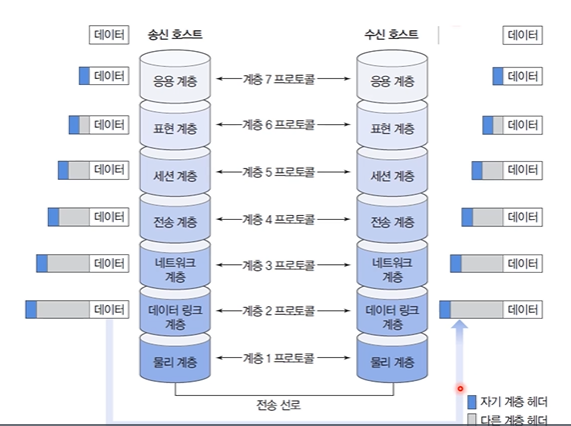
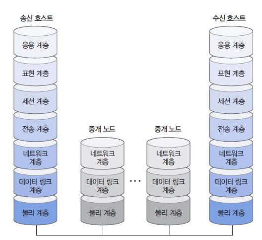

### OSI 참조 모델

- 두 개의 호스트가 각각 7 계층으로 구성된 모듈을 수행
- 송신 호스트의 응용계층에서 하위 계층으로 순차적으로 전달되어 물리계층까지 도달
- 물리계층을 통해 수신 호스트로 데이터가 이동하고, 순차적으로 상위 계층으로 전달되어 응용계층까지 도달
- 각 계층이 직접 통신하는 것이 아니라 항상 물리 계층을 통해 데이터가 전송
- 송신 측에서 하위 계층으로 이동할 때 각 계층 프로토콜에서 정의한 `헤더(header) `추가
  - 헤더(header) : 머리 부분에 붙여진다 해서 헤더(head). 위 그림에선 파란색 영역.
    - 전송할 때 필요한 정보이므로 실제 송신자가 수신자에게 전달할 필요가 없는 정보. 
    - +) 즉, 컴퓨터에게 필요한 정보이지 사람은 알 필요가 없다. 다만 헤더정보는 해커들이 좋아하는 정보이다.
- 수신 측에서 상위 계층으로 이동할 때 순차적으로 헤더 정보를 처리하고 제거(연산처리)

#### 용어 정의

- 계층 n 프로토콜
  - 계층 n 모듈끼리 사용하는 통신 규칙
  - 프로토콜의 역할
    - 프로토콜에서 정의된 기능을 수행하면서 필요한 정보를 서로 교환
    - ex) 주소의 표현, 오류 제어, 흐름 제어 등
- 동료(peer) 프로세스
  - 동일 계층에 위치한 통신 양단 프로세스
- 인터페이스
  - 상하위 계층 사이의 접속 방법
- 서비스
  - 상위 계층이 하위 계층을 사용하는 방법

#### 중계 기능

- 중계 노드(라우터 : Router)의 경우
  - 7계층이 아닌, 네트워크 계층까지의 기능만 수행
- 라우팅(Routing)
  - 경로배정기능
  - 헤더 정보를 해석하여 적절한 경로로 전달
  - 다음 라우터로 보내기 전에 헤더 정보를 적절히 수정하여 전송

#### 계층별 기능

- ##### ❤️물리(physical) 계층

  - 전송 매체의 물리적(기계적, 전기적) 인터페이스에 관한 사항 기술
    - 개별 정보의 비트(bit) 교환 문제
  - 하드웨어(hardware)로 구현
  - 데이터의 전송속도, 클럭(clock) 동기화, 물리적 연결 형태 등
    - 클럭(clock) 동기화 : 여러 서버가 있을때 time server 로부터 시간을 받아서 동기화 하는 것. 서버의 시간을 똑같이 맞추는 것

- ##### 🧡데이터 링크(data link) 계층

  - 물리계층을 통해 전송하는 데이터의 물리적 전송 오류를 해결하고 흐름 제어 제공

  - 두 개의 노드가 1:1로 직접 연결된 환경에서 데이터 전송 기능 지원

  - 프레임(frame)

    

    - 데이터 링크 계층을 통해 전송되는 데이터
    - 헤더에 포함되는 정보
      - MAC 주소
      - 오류 제어에 관련된 추가 정보(오류 검출 정보, 순서번호)
      - 흐름 제어에 관련된 추가 정보(버퍼(윈도우)의 크기, Ready/Not ready 플래그 등)
      - 즉 목적지, 출발지 주소 그리고 데이터 내용을 정의
    - 효율적인 처리를 위해 트레일러(trailer)를 이용하기도 함
      - 꼬리부분에 달린 것이 트레일러
      - 비트의 에러를 감지

- ##### 💛네트워크(network) 계층

  - 네트워크 `주소`를 기반으로 호스트 간 데이터의 `전송 경로`를 결정하는 `라우팅` 문제 처리
    - 전달경로 설정
      - 정적(static) : 사전에 미리 정해진 경로 이용
      - 동적(dynamic) : 네트워크 상황 등을 고려하여 판단
  - 패킷(packet)
    - 네트워크 계층에서의 전송 데이터 명칭
    - 보쌈...?
  - 혼잡 제어(congestion control)
    - 네트워크를 이용하여 전송하는 데이터가 과도하게 많은 경우 전송속도가 떨어지는데, 이를 조절
      - like 명절 대이동
    - 네트워크 계층에서 혼잡제어를 하지 않는 경우 전송계층에서 수행하기도 함
      - 네트워크 계층에서 수행하는 경우와 전송계층에서 수행하는 경우가 어떻게 다른가?

- ##### 💚전송(transport) 계층

  - 송신 프로세스와 수신 프로세스를 연결하는 `단대단(종단간)` (end-to-end) 통신 기능 제공
    - 프로세스를 구별할 수 있는 주소 개념 필요(ex. 포트 번호)
  - 컴퓨터 내부에서 논리적으로 구축되는 통신 담당자 사이의 문제 처리
    - 전송 속도, 전송 오류, 흐름 제어 등

- ##### 💙세션(session) 계층

  - 상위적(논리적) `연결` 개념인 세션 기능 제공
  - 대화(dialog) 제어
  - 토큰(token) 제어
  - 동기화(synchronization)

- ##### 💜표현(presentation) 계층

  - 데이터의 의미(semantic)와 표현방법(syntax)을 처리
  - 통신 양단에서 서로 이해할 수 있는 표준 방식으로 코딩(coding)
  - 암호화/압축 기능도 처리

- ##### 🤎응용(application) 계층

  - 사용자에게 유용한 다양한 서비스
  - ex)
    - http(hypertext transfer protocol)
    - ftp(file transfer protocol)
    - telnet
    - e-mail