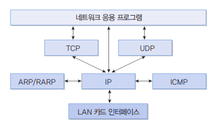

### TCP / IP 모델

컴퓨터가 서로 통신하는 경우, 특정 규칙이나 *프로토콜*을 사용하여 순서대로 데이터를 전송 및 수신할 수 있다. 전세계를 통해 가장 일상적으로 사용되는 프로토콜 세트 중 하나가 **TCP/IP(Transmission Control Protocol/Internet Protocol)**. 일부 일반적인 기능은 메일, 컴퓨터 간 파일 전송, 원격 로그인.

- 사용자 공간
  - 일반적으로 세션계층부터 응용계층까지의 기능은 사용자 프로그램으로 구현
- 시스템 공간
  - TCP / IP와 하위 계층은 운영체제 커널(kernel) 내부에 구현
  - 사용자가 TCP, UDP, IP 기능을 이용할 수 있도록 소켓(socket) 인터페이스 제공
    - 인터넷 접속이 가능한 대부분의 호스트에서 지원
  - 하위 계층은 LAN 카드(H/W)와 드라이버 루틴으로 동작

- TCP / UDP : 사용자 데이터를 전송하는 `전송 계층` 프로토콜
- IP : 사용자 데이터를 전송하는 `네트워크 계층` 프로토콜
  - 오류 정보를 전송하는 목적으로 ICMP를 사용

#### ARP

- Address Resolution Protocol = 주소 결정 프로토콜

- 네트워크 상에서 IP 주소를 물리적 네트워크 주소로 대응(bind)시키기 위해 사용되는 프로토콜

- 데이터 링크 계층 프로토콜을 이용하여 데이터를 전송하려면 네트워크 주소를 데이터링크 계층 주소로 변환하여야 함

- 방송(Broadcast) 기반

  - 모든 노드들이 해당 요청을 다 들음

- 경우

  - 동일 망

    - 처음엔 S가 IP 주소만 알고 있었는데, 방송을 통해 A가 응답을 해서 해당 IP 주소의 데이터링크 계층 주소를 알게 됨. 그렇게 서로간의 통신이 가능해짐.

    

    
  
  - 다른 망
  
    - S가 방송을 통해 해당 IP 주소를 가진 노드를 찾고, 중계하는 라우터가 자신의 하드웨어 주소를 알려줘서 브릿지나 라우터는 B가 있는 계층에 정보를 뿌려서 찾아주고 통신이 가능하게 한다.

#### RARP

- Reverse Address Resolution Protocol

- 역 ARP

- IP 호스트가 자신의 물리 네트워크 주소는 알지만 IP주소를 모르는 경우, 서버로부터 IP 주소를 요청하기 위해 사용

- 호스트의 경우 일반적으로 설정된 자신의 IP 주소를 디스크에 저장. 일반적으로 디스크가 다 있기 때문에 IP 주소를 알고 있음.

- 일부 장비는 디스크가 없는 경우가 있음
  - X-터미널
    - 고해상도 모니터, 메모리를 갖추고 있으나 파일/폴더는 파일서버를 이용

- 부팅시 LAN 카드에서 MAC 주소를 알아낸 다음 RARP로 자신의 IP 주소 문의

- 특정 호스트(서버)에서 질의된 MAC에 해당된 IP 주소 반환

  

#### ICMP

- Internet Control Message Protocol
- IP 프로토콜에 캡슐화되어 있으나 상위 프로토콜로 보지 않고 동일 계층에 있는 것으로 간주
- 주요 Control Message
- 오류를 처리하고 IP 메시지를 제어하는 프로토콜

