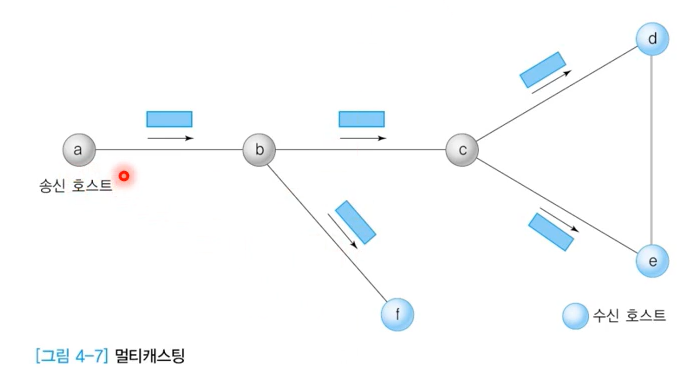
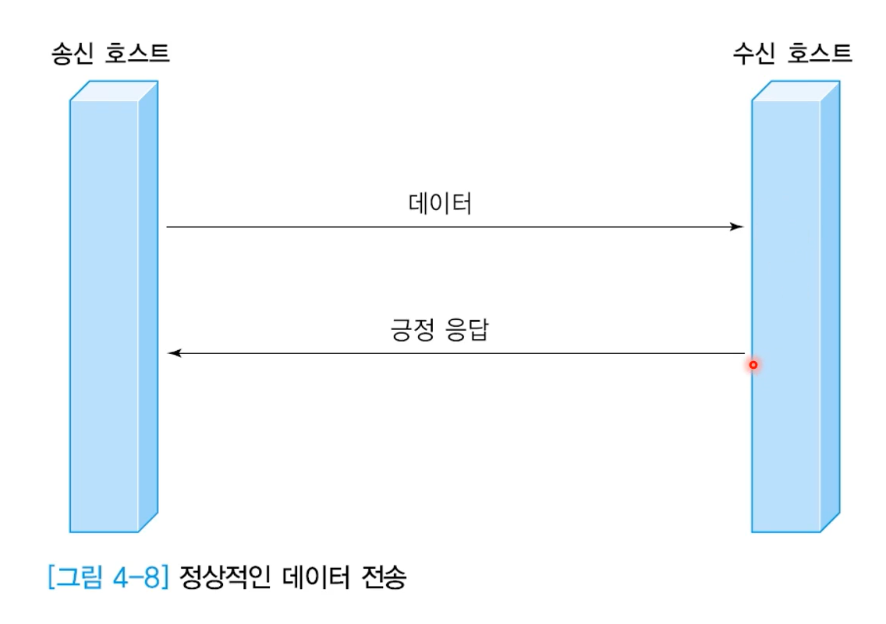

# 데이터 전송의 기초

> **학습 목표**
>
> 전송과 교환의 구조와 원리를 이해한다.
>
> 프레임 전송 과정에서 발생되는 오류의 유형을 살펴본다.
>
> 문자 프레임과 비트 프레임의 구조를 이해한다.
>
> 오류 검출 코드의 종류와 원리를 이해한다.
>
> 생성 다항식을 이용한 오류 검출 방식을 알아본다.

## 데이터 전송 방식

### 네트워크 효과

- 자원 공유

  - 컴퓨터 하드웨어 외에 물리적, 논리적 정보 공유

- 병렬 처리에 의한 성능 향상

  - 네트워크 속도 제한에 의한 한계

  - 네트워크 성능 개선으로 병렬 처리 가능

- 중복 저장으로 인한 신뢰성 향상

  원본데이터를 여러 곳에 놔두면 혹시 잃어버리더라도..

  - 일관성 문제: 서로 각각 다른 값을 가지고 있을 때 정답은 무엇인가

  - 데이터 갱신 비용: 원본이 변경되는 경우, 그것을 변경해주어야 하는 비용이 든다

### 전송과 교환

a->d로 전달, a-c 전송 c에서 교환 c-d 전송

- **전달(Transfer)**

  - 교환(Switching) + 전송(Transmission)

- **교환**

  - 둘 이상의 경로 중 어느 방향으로 전달할지 선택

- **전송**

  - 물리적으로 1:1 연결된 시스템 사이의 데이터 전송

### 전송방식의 종류

- 지리적 분포

  - LAN, MAN, WAN

- 전송 교환기술에 의한 분류

  - 점대점(Point-to-Point)

    - 호스트들이 물리적으로 1:1 형식으로 연결

  - 브로드캐스팅(Broadcasting)

    - 호스트들이 공유 전송 메체에 연결

### 점대점 방식

- 스타형

  가운에 중심 호스트가 있고 다른 호스트들은 그 중심호스트에 연결되어있는 방식

  - 교환호스트가 송수신 호스트 중간에 위치

- 링형

  모든 호스트들이 원처럼 연결되어 있는 방식

  - 직접 연결하거나 중계기능을 통해 전달

- 완전형

  모든 호스트들이 연결되어 있는 방식

  - 연결 개수가 많아지면 성능면에서 우수하나 매체 길이가 증가하여 비용 증가

- 불규칙형

  - 연결 개수가 적어지면 네트워크 혼잡도 증가

**스타형**

- 중앙에 있는 하나의 중계 호스트(허브: hub) 주위로 여러 호스트를 1:1로 연결

- 중앙 호스트의 성능과 신뢰성이 중요

- 트리(tree)형

**링형**

- 호스트의 연결이 순환 구조를 이룸

- 모든 호스트가 전송과 교환 기능을 수행

- 시계방향 또는 반시계방향 선택 가능

- 현실적으로 한 방향으로만 전송

- 토큰

  - 데이터를 전송할 수 있는 권리

  - 데이터 전송을 원하는 호스트는 미리 토큰을 확보

  - 데이터 전송이 완료되면 호스트는 토큰을 반납야함

  - 데이터를 전송하는 호스트가 없으면 오직 하나의 토큰이 링을 순환함.

- 데이터 전송 원리

  - 먼저, 토큰을 링에서 회수하여 확보한 후, 

  - 데이터를 링에 전송함

  - 데이터는 링을 한 바퀴 순환한 후, 다시 송신 호스트에게 돌아옴

  - 이 과정에서 링에 연결된 모든 호스트가 데이터를 수신함

  - 단, 자신을 목적지로 하는 호스트만 데이터를 보관하고, 다른 호스트는 버림

  - 마지막으로 송신 호스트는 데이터를 회수한 후에 토큰을 링에 돌려줌.

**완전형**

- 네트워크에 존재하는 모든 호스트를 1:1로 연결 

- 교환 기능이 불필요

- 극단적으로 비효율적인 방식

**불규칙형**

- 트레픽이 많은 지역은 연결의 수가 많지만, 

- 트레픽이 적은 지역은 연결의 수가 적음

### 브로드캐스팅 방식

- 네트워크에 연결된 모든 호스트에게 데이터를 전달하는 방식

- 주로 LAN 환경에서 사용

- 버스형과 링형이 존재

**버스형**

- 공유 버스에 모든 호스트를 연결

- 둘 이상의 호스트가 데이터를 전송하면 충돌 방생

- 충돌 문제의 해결 방법

  - 사전 예방: 전송 시간대를 다르게 하는 방법과 토큰 제어

  - 사후 해결: 충돌을 감지하는 기능이 필요(예: 이더넷)

**링형**

- 호스트를 순환 구조로 연결

- 송신 호스트가 전송한 데이터는 링을 한 바퀴 순환한 후 송신 호스트에 되돌아 옴

- 중간의 호스트 중에서 수신 호스트로 지정된 호스트만 데이터를 내부에 저장

- 데이터를 전송하기 위해서는 토큰 확보가 필수

### 멀티포인트 통신

- 하나의 송신 호스트를 기준으로(어떻게 연결됐는가)

  - **유니포인트**: 하나의 수신호스트와 연결

  - **멀티포인트**: 다수의 수신 호스트와 연결

- 송신 호스트가 한번의 전송으로

  - **유니캐스팅**: 하나의 수신 호스트에 데이터를 전송

  - **멀티캐스팅**: 다수의 수신 호스트에 데이터를 전송

- **멀티포인트 유니캐스팅**

  - 유니캐스팅 방식을 이용하여 일대다 통신을 지원

  - 호스트 a가 호스트 d, e, f에게 데이터를 전송하려면 3번의 송신 절차가 필요(유니캐스팅을 3번 보내는 방식)

  - 수신 호스트의 수가 증가하면 성능에 문제점 발생

- **브로드캐스팅**

  - 네트워크에 연결된 모든 호스트에 데이터 전송

  - 자신을 목적지로 하는 호스트만 데이터를 내부에 저장하고, 다른 호스트는 데이터를 무시함

- **멀티캐스팅**

  - 1:N 전송 기능을 지원

  - 송신 호스트는 한번의 데이터 전송으로 여러 호스트에게 데이터를 전송할 수 있음

  - 예: 송신 호스트 a, 수신 호스트 d,e, f

## 오류제어

### 오류 복구를 위한 기본 기능

- 수신 호스트의 응답 프레임

  - 긍정 응답(ACK: Acknowledge)

  - 부정 응답(NAK: Negative Acknowledge)

- 송신 호스트의 타이머 기능

  - <u>프레임 분실 오류 시</u> 수신 호스트의 인지 불가능

  - 일정 시간 내 긍정 응답이 없으면, 송신단에서 타임아웃(timeout) 기능을 동작시켜 재전송

  

변형된 것을 알았을 때 부정 응답을 할 필요가 있는가? 그냥 버리면 되지 않나..?(기다렸다가 다시 받기) -> NAK 전송 여부는 프로토콜마다 차이가 있음

- 순서번호(sequence number)

  - 긍정 응답이 분실되는 경우 재전송으로 인한 중복 수신 가능

  - 이를 구별하기 위해 순서 번호 기록

  

  순서번호가 없는 경우, 긍정 응답을 잃어버렸을 때 다음에 전달된 데이터가 다음 데이터인지 아니면 이전의 데이터가 재전송된 것인지 모르기 때문에 문제 발생

  

  긍정응답이 분실되더라도, 이미 전송된 데이터를 무시할 수 있음

### 흐름제어

- 전송 데이터의 속도 조절

- 송신 호스트는 수신 호스트가 감당할 수 있을 정도의 전송속도를 유지하면서 전송해야 한다.

- 흐름 제어가 없는 경우 데이터의 손실, 재전송으로 이어짐

- 기본 원리

  - 다음에 수신한 프레임의 전송 시점을 송신 호스트에게 통지하는 방식

- 대표적인 방식

  - 슬라이딩 윈도우(sliding window)

## 프레임

### 데이터링크 계층 기능

프레임 구성 / 물리적인 주소 지정 / 흐름 제어 / 오류 제어 / 접근 제어(순서결정)

- <u>프레임(frame)</u> 단위로 나누어 처리

  - 전송 데이터

  - 오류 확인을 위한 <u>체크썸(checksum)</u>

  - 송수신호스트 주소

    - 물리적인 주소 지정

      - 외부 시스템일 경우, 수신자의 주소는 다음 네트워크에 연결되어 있는 접속 장치의 주소

      - 연결된 바로 이웃 컴퓨터와의 통신만 생각! 다음 목적지만 알려줘~!

      - 네트워크 계층에서는 목적지 주소(IP 주소)만 주면서 여기로 보내줘~! 하는데, 실질적으로 현재 지금 상황에서 어디로 보낼지를 결정하는게 데이터링크 계층

        

  - 기타 프로토콜에서 사용되는 제어 코드 같은 정보 포함

- 프레임 구분

  - 내부 정보를 표현하는 방식에 따라

    - 문자 프레임

    - 비트 프레임

### ASCII(American Standard Code for Information Interchange)

- 7 비트 표현 방식

  - 2^7 즉 128개의 문자 조합(코드 값 0~127)

- 8번째 비트는 오류 검출용 패리티

- 1968년 미국 ANSI X3.4로 표준화

- 구성

  - Graphic/Printable Character

    - 0-9, a-z, A-Z, 특수문자 등

  - Non-graphic/Non-printable Character or Control Character

    - 통신 제어 또는 전송 제어

    - 서식 제어(tab)

    - 특수 제어 (프린터, 전송속도 매칭 등)

    - 정보 분리 (파일 분리, 레코드 분리 등)

**문자 프레임**

- 프레임의 내용이 <u>문자로만</u> 구성됨

- 프레임의 시작과 끝에 특수 문자 사용

  DLE(data link escape)

  STX(Start of Text)

  ETX(End of Text)

  - 시작 :DLE / STX

  - 끝: DLE / ETX

- 전송 데이터에 특수 문자가 포함되면 혼선이 발생

  - 문자 스터핑(stuffing)

    - (송신측에서는) 데이터에 DLE가 있으면 강제로 DLE 하나 더 추가

    - 수신측에서는 두 개의 DLE가 나오면 뒤에 있는 DLE 제거

**비트 프레임**

- 임의의 비트 패턴 전송 가능

- 프레임의 시작과 끝을 나타내는 플래스(flag) 사용: `01111110`

- 전송 데이터에 플래그와 같은 패턴이 등장할 수 있음

  - 비트 스터핑

    - 1이 연속해서 5개 발생하면 강제로 0 추가

    - 반대편에서는 0 제거

## 다항코드

### 오류 극복 방법

- 오류 **검출** 코드

  - 오류 검출코드를 넣어 수신 호스트가 오류 검출 후 재전송으로 복구

  - CRC(Cyclic Redundancy Check)

- 오류 **복구** 코드

  - 오류 복구 코드를 넣어 수신 호스트가 오류 검출과 복구를 동시에 수행

    - **해밍코드(Hamming code)**

    - **순방향 오류 복구(FEC: Forward Error Control)** : 전진에러수정, 프레임에 부가정보를 전송해서 수신측이 에러 검출 및 자체 정정을 할 수 있도록 함.

### 해밍 코드(Hamming code)

- 이진 블록 오류 정정 부호의 일종

- 1950년 Bell 연구소의 Richard Hamming에 의해 고안

- 최대 2비트의 오류를 감지하거나, 1비트의 오류 수정 가능

전체 비트 - 패리티 비트 -> 데이터 비트의 범위

### 오류 검출

앞에 들어간 1의 개수에 따라 0 or 1

세로 축으로 검사

- **BEC(Backward Error Control)**: 후진 에러 수정 / 

  - 에러발생 데이터에 대해 송신측에 재전송(ARQ)를 요구

- **ARQ(Automatic Repeat reQuest)**

  - 일반적으로 사용

- **패리티(parity)**

  - 짝수 패리티

  - 홀수 패리티

- 블록 검사 (Block sum check)

### 다항코드(Polynomial Code)

m개의 데이터가 있고 그 데이터에 생성 다항식을 적용 n개의 비트를 추가하여 오류를 검사한다. 

