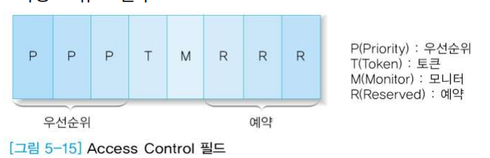

# MAC 계층

> 학습목표
>
> 1. LAN 환경에서 MAC 계층과 LLC 계층의 차이와 역할을 이해한다.
>
> 2. IEEE 802 표준들의 개요를 이해한다.
>
> 3. 이더넷의 동작 원리와 프레임 구조를 이해한다.
>
> 4. 토큰 버스에서 토큰의 역할과 프레임 구조를 이해한다.
>
> 5. 토큰 링의 프레임 구조와 제어 필드를 이해한다. 

### LLC 계층과 MAC 계층

- LAN 환경에서 데이터링크 계층을 LLC 계층과 MAC 계층으로 나누어 처리

- **LLC(Logical Link Control)**

  - 데이터링크 계층의 기본 기능

  - WAN의 데이터링크 계층과 거의 유사

  - LAN 특성에 따라 부분적인 차이가 있을 수 있음

  - 다양한 LAN을 상위계층인 네트워크계층에 동일한 인터페이스를 제공

- **MAC(Medium Access Control)**

  - <u>물리적 선로의 특징</u>과<u> 매체 간의 연결방식</u>에 따른 제어

    - LLC 계층에서 내려온 LLC 프레임을 물리 계층을 통해 수신 호스트에 전달하려면 토큰 버스/토큰링/이더넷 프로토콜에서 정의한 프레임에 맞게 해당 프레임을 만들어야 한다

  - **이더넷, 토큰 링, 토큰 버스**

## IEEE 802 시리즈

 CSMA/CD : 이더넷

- IEEE(www.ieee.org)에서 LAN 표준안 연구결과를 802 시리즈로 발표

  - 802.1

    - 관련 표준안 전체 소개

    - 인터페이스 프리미티브 정의

  - 802.2

    - LLC 프로토콜 정의

  - 802.3 ~

    - 물리계층과 MAC 계층

### MAC 소개

- 다중 접근 채널(<u>Multiple Access Channel</u>) 방식을 이용하여 공유매체에 프레임을 전송하는 방식에서는 <u>충돌 발생 가능성 존재</u>

  - 해결 방안

    - 충돌 허용 후 후속 조치

      - 이더넷

        - CSMA/CD(Carrier Sense Multiple Access/Collision Detection)

        - 충돌 감지 후 재전송

        - 매체 길이가 길어질수록 프레임 전송 지연 증가, 충돌 발생 가능성 증가

    - 충돌을 원천적으로 차단

      - 타임 슬롯(time slot) 배정

      - <u>토큰</u>을 가지고 있는 경우에만 송신

- **토큰 버스**

  

  - 물리적으로는 버스 구조이나 논리적으로는 링 구조

  - 토큰(token)이라고 부르는 제어 프레임 사용

    - 토큰이 있는 송신자만 프레임을 전송할 수 있다.

- **토큰 링**

  

  - 순환 구조의 전송매체

  - 대기 모드와 전송 모드로 동작

## 이더넷(Ethernet)

- **1-persistent CSMA/CD** 방식의 LAN 환경을 규정

  - 1-persistent CSMA

    - 프레임을 전송하기 전에 채널(<u>공유 버스</u>) 사용 여부를 확인 – Carrier Sense

    - <u>채널이 사용 중이면 유휴 상태가 될 때까지 대기</u>

    - 이후, 채널이 유휴 상태가 되면 확률 1의 조건으로 프레임을 전송

    - 둘 이상의 호스트에서 동시에 유휴 상태로 판단하면 충돌 발생 – Multiple Access

    - 충돌이 발생하면 임의의 시간 동안 대기한 후 처음부터 다시 시작

  - CD(Collision Detection)

    - 둘 이상의 호스트에서 채널이 유휴 상태라고 판단할 수 있음

    - 이런 경우 프레임 전송 과정에서 충돌이 발생

    - 따라서 충돌 감지 기능이 필수적으로 요구됨

    - 충돌이 감지되면 진행중인 프레임의 전송을 중지

- **Non-persistent CSMA**

  - 프레임을 전송하기 전에 채널 사용 여부를 확인

  - 채널이 사용 중이면 더 이상 유휴 상태를 확인하지 않음

  - 대신 <u>임의의 시간 동간 대기 후 다시 채널 감지</u>를 시작

  - 1-persistent 방식보다 충돌 확률을 줄일 수 있음

- **P-persistent CSMA**

  - 슬롯 채널 방식에서 주로 사용

  - 프레임을 전송하기 전에 채널 사용 여부를 확인

  - 채널이 사용 중이면 다음 슬롯까지 대기후 다시 채널 감지를 시작

  - 채널이 유휴 상태면 <u>p의 확률로 프레임을 전송</u>

### 프레임

- MAC 프레임 = <u>MAC 헤더(header) </u>+ <u>LLC 프레임</u> + <u>MAC 트레일러(trailer)</u>

  - LLC 프레임: LLC 계층이 MAC 계층에게 전송하도록 요청한 데이터

- 이더넷 프레임 구조

  

  - **MAC 헤더**:

    - **Preamble**

      - 수신 호스트가 송신 호스트의 클록 동기를 맞추는 용도

    - **Start Delimiter**

      - 프레임의 시작 위치 구분

    - **Destination Address**

      - 수신 호스트의 MAC 주소

    - **Source Address**

      - 송신 호스트의 MAC 주소

    - **Length**

      - Data 필드에 포함된 가변 길이의 전송 데이터 크기

  - **LLC 프레임**

    - DATA

  - **LLC 트레일러**

    - Pad:padding

    - Checksum

      - 데이터 변형 오류를 감지

### 연결 방식

고전적인 연결 방식

- 트랜시버(Transceiver): 전송기(transmitter)와 수신기(receiver)를 하나의 패키지에 합한 것

- 리피터(Repeater)

### 허브와 스위치

- 허브(Hub, dummy Hub): 받으면 나머지 호스트에 브로드캐스팅

- **스위칭 허브**(switching hub): 특정 호스트에만 보냄

**허브**

- 각 호스트는 외형상 스타형 구조로 허브에 연결

- 내부적인 동작 원리는 공유 버스 방식을 사용

**스위치 허브**

- 스위치 기능

  - 모든 호스트에 프레임을 전송하지 않음

  - 목적지로 <u>지정된 호스트에게만 프레임 전송</u>

  - 따라서 동시에 여러 호스트가 데이터를 전송할 수 있음

- 장점

  - 스위치 허브의 용량이 허용되면 각각의 호스트는 할당된 LAN 용량을 모두 사용함

  - 일반 허브를 스위치 허브로 교체하는 과정이 간단함

## 토큰 버스(이더넷 + 토큰 형태)

토큰이 각 단말기를 순서적으로 옮겨 다니는 방식

하나의 단말기에는 토큰이 이동해야 할 단말기의 정보를 보유하고 있다

- IEEE 802.3(CSMA/CD)의 단점

  - 네트워크 트래픽이 심할 때 특정 호스트가 오랫동안 전송할 수 없는 상황

  - 프레임 우선 순위 개념이 없음

- 호스트가 순서를 정해 프레임을 전송하는 기능 필요

**토큰 버스의 프레임 구조**

- MAC 헤더

  - Preamble

    - 수신 호스트가 송신 호스트의 클록 동기를 맞추는 용도

  - Start Delimiter

    - 프레임의 시작 위치 구분

  - **Frame Control**

    - <u>데이터 프레임과 제어 프레임을 구분</u>

  - Destination Address

    - 수신 호스트의 MAC 주소

  - Source Address

    - 송신 호스트의 MAC 주소

- LLC 프레임

  - DATA -> 더 많은 양 전송 가능

- LLC 트레일러

  - Checksum

    - 데이터 변형 오류를 감지

  - End Delimiter

    - 프레임의 끝 위치 구분

  **Frame Control**

  

  프레임의 역할에 따라 TT 부분이 달라진다.

  - 토큰 프레임

    - TT = 00

    - CCCCCC = 001000

  - 데이터 프레임

    - TT = 01

  **제어 프레임 예시**

  

**토큰 버스의 프레임 캡슐화**

## 토큰 링

- **점대점으로 연결한 호스트**가 순환 구조로 LAN을 구성

- **모니터 호스트**

  - 링에 연결된 호스트 중에서 특별 임무를 부여 받은 관리 호스트

    - 토큰 생성 기능

      - 토큰을 보유한 호스트의 고장 등의 원인에 의한 토큰 분실

      - 모니터 호스트가 이를 감지하여 토큰을 재생성

    - 데이터의 무한 순환 방지

      - 송신 호스트가 전송 데이터를 회수하지 않는 오류

      - 전송 데이터를 회수한 후 토큰을 만들어 줌

토큰 링의 프레임 구조

- 토큰 프레임

  - SD(start delimeter), AC(access control), ED(end delimeter)의 세 필드로 구성

- 데이터 프레임

  **필드의 의미**

  - Start Delimiter/End Delimiter

    - 프레임의 시작과 끝을 구분하는 역할

  - Access Control

    

    P (Priority) 우선순위 -> 3개 비트

    - T 비트: 토큰 프레임(T=0)과 일반 프레임(T=1)을 구분

    - M 비트: 모니터 호스트가 사용

      - 모니터 호스트를 지날 때 M=1로 지정

      - M=1인 상태로 모니터 호스트를 지나가면 송신 호스트의 회수 기능 오류로 간주

  - Frame Control

    

    - 제어용 MAC 프레임: TT = 00

    - LLC 프레임: TT = 01

  - Frame Status

    

    - 프레임의 수신 호스트가 송신 호스트에게 응답하는 기능을 제공

    - A 비트: 수신 호스트가 접근(Access)했다는 표시로 1 지정

    - C 비트: 수신 호스트가 자신의 내부 버퍼에 보관 했다는 표시로 1 지정

    - A, C 모두 한 쌍으로 이루어져 신뢰성을 담보

  토큰 링의 프레임 캡슐화

  