# 데이터 링크 계층

> **학습목표**
>
> 1. 오류 제어, 흐름 제어의 원리와 동작 방식을 이해한다.
>
> 2. 통신 프로토콜에서 윈도우의 개념과 동작 방식을 이해한다.
>
> 3. 양방향 통신을 지원하는 슬라이딩 윈도우 프로토콜을 알아본다.
>
> 4. HDLC 프로토콜을 통해 프로토콜을 구현하는 원리를 이해한다.

## 데이터 링크 계층 프로토콜의 기초

### 연결 구성

- 점대점(point-to-point)

- 멀티드롭(multi drop)

  - 주소(address) 개념 필요

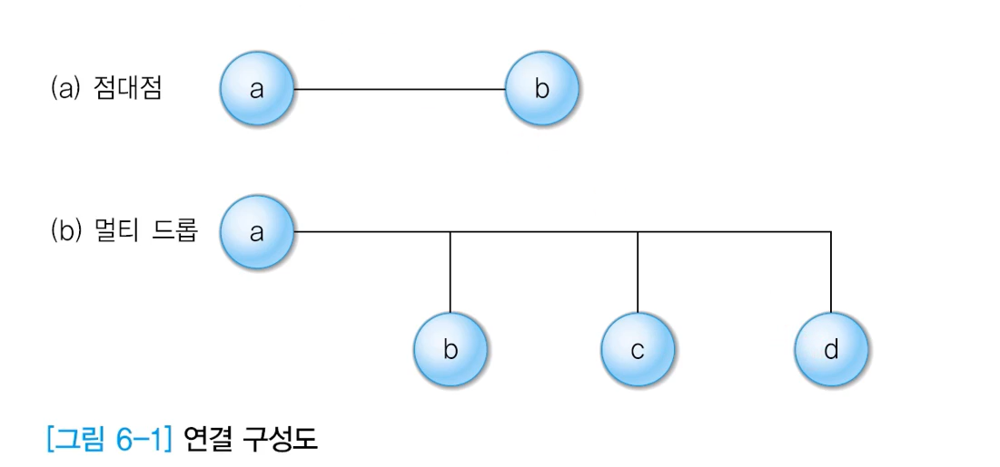

점대점 관계에서는 굳이 주소 개념이 필요 없을 수 있겠지만 여러 노드가 연결된 멀티 드롭의 경우, 각각을 구분할 수 있는 주소 개념이 필요하다

### 프레임 종류

- 정보 프레임: I 프레임

  - 상위 계층이 <u>전송 요구한 데이터를 송신</u>하는 용도

  - 순서번호, 송수신 호스트 정보 등이 포함됨

- 긍정 응답 프레임: ACK 프레임

  - 전송 데이터가 <u>올바르게 도착했음을 회신</u>하는 용도

  - 데이터를 수신한 호스트가 데이터를 송신한 호스트에게 전송

- 부정 응답 프레임: NAK 프레임

  - 전송 데이터가 깨져서 도착했음을 회신하는 용도

  - 데이터를 수신한 호스트가 데이터를 송신한 호스트에게 전송

  - 데이터를 송신한 호스트는 원래의 데이터를 재전송하여 오류 복구

- 긍정 응답, 부정 응답 프레임 모두 회신하고자 하는 I 프레임 순서 번호 포함

  - 제대로 도착한 프레임과 오류가 발생한 프레임 판단 가능

### 오류, 흐름 제어가 없는 프로토콜

- 가정

  - 단방향 통신

    - 송신 호스트에서 수신 호스트 한쪽 방향으로만 데이터 전송

  - 전송 오류가 없는 물리 매체

    - 어떠한 전송 오류도 발생하지 않음

  - 무한 개의 수신 버퍼

    - 흐름 제어 기능이 필요 없음

- **단순 프로토콜**

  - 송신 호스트는 원하는 만큼 자유롭게 프레임을 전송할 수 있음

  - 오류 제어 없음

    - 프레임 분실/ 변형 오류가 발생하지 않음

  - 흐름 제어 없음

    - 수신 버퍼가 무한이므로 분실 오류 없음

  - 순서 번호도 불필요

  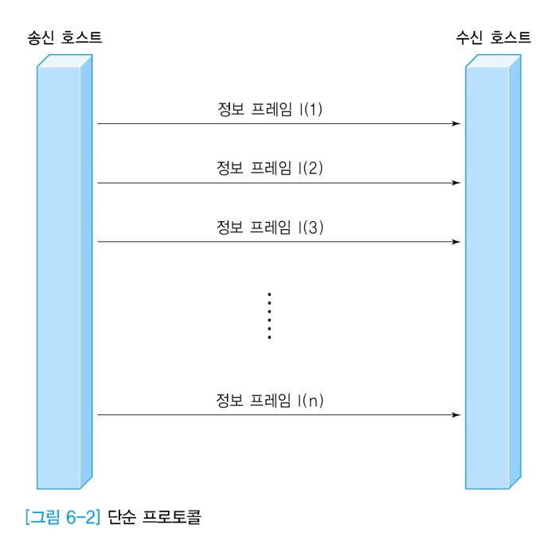

### 오류 제어가 없는 프로토콜

- 가정

  - 단방향 통신

    - 송신 호스트에서 수신 호스트 한쪽 방향으로만 데이터 전송

  - 전송 오류가 없는 물리 매체

    - 어떠한 전송 오류도 발생하지 않음

  - 전송오류는 없으나, 버퍼 부족으로 프레임 분실 가능

- **정지 - 대기 프로토콜 1**

  - <u>수신 버퍼의 개수가 유한</u>

    - 흐름 제어 필요

  - 이전 프레임을 잘 받았다는 긍정 응답 기능과 수신 호스트가 송신 호스트의 전송 시점을 지정하기 위한 ACK 프레임 필요

    - ACK의 의미는 (1)앞의 프레임을 잘 받았으니 (2)다음 것을 보내라

  - 데이터의 중복 수신 우려가 있으며 순서 번호 기능 필요

  - 정지 대기(Stop-and-wait)

    - 하나의 프레임 전송 후 응답 대기

    - 전송 효율이 떨어지므로 잘 사용하지 않음

  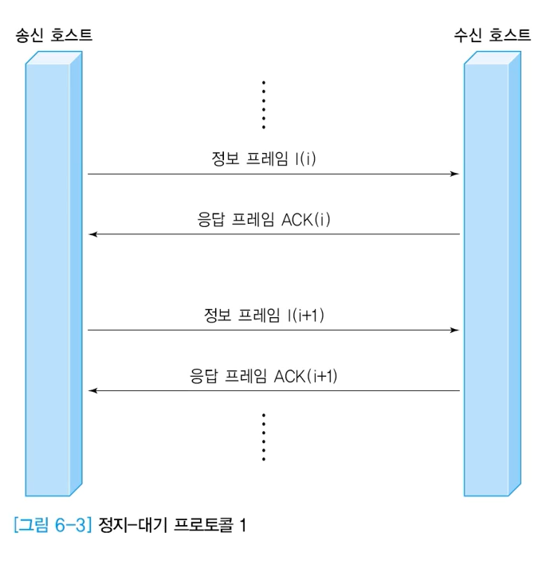

### 단방향 프로토콜

- 가정

  - 단방향 통신: 송신 호스트에서 수신 호스트 한쪽 방향으로만 데이터 전송

  - 전송 매체 <u>오류 발생 가능</u>

  - <u>버퍼 유한</u>

- <u>오류 제어와 흐름 제어가 모두 필요</u>

- 프레임 변형 오류 문제 해결 방안

  - 수신 호스트의 NAK 기능 필요

  - 송신 호스트의 타임아웃 기능 필요

- **단방향 프로토콜 - NAK가 없는 경우**

  - 정보 프레임 분실

    - 송신 호스트의 <u>타임아웃 기능</u>으로 오류 복구

      

  - ACK 프레임 분실

    - 송신 호스트의 타임아웃 기능으로 오류 복구

      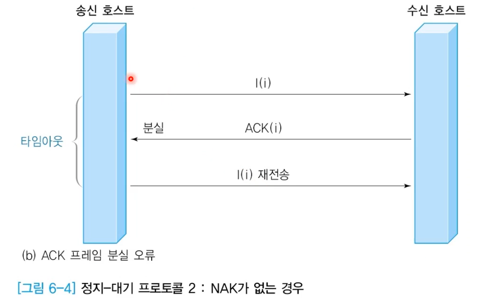

  - 정보 프레임 변형

    - 송신 호스트의 타임아웃 기능으로 오류 복구

      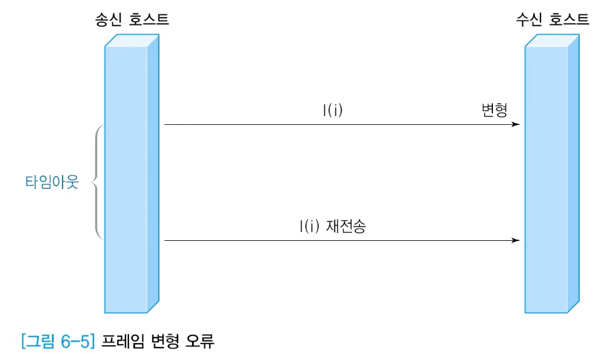

- **단방향 프로토콜 - NAK가 있는 경우**

  - 정보 프레임 변형 오류

    - NAK를 이용하여 통보

      - 더 효율적일 수 있음

      - 다른 요인에 의해 NAK를 사용하지 못하는 경우도 있음(구현이 복잡해짐)

      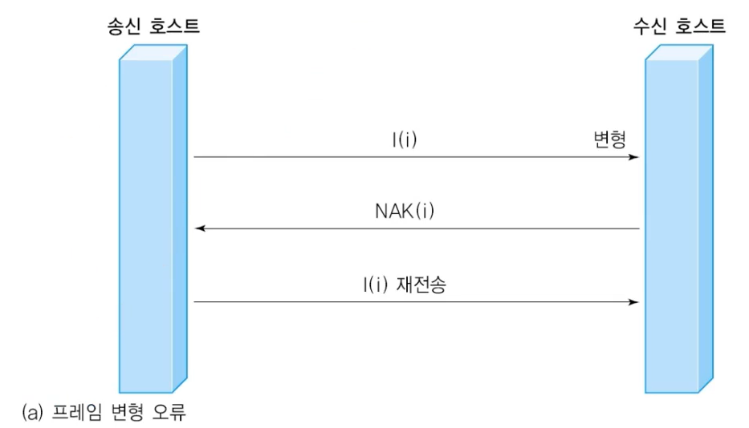

  - 정보 프레임 분실 오류

    - 타임아웃으로 인지 - 재전송

    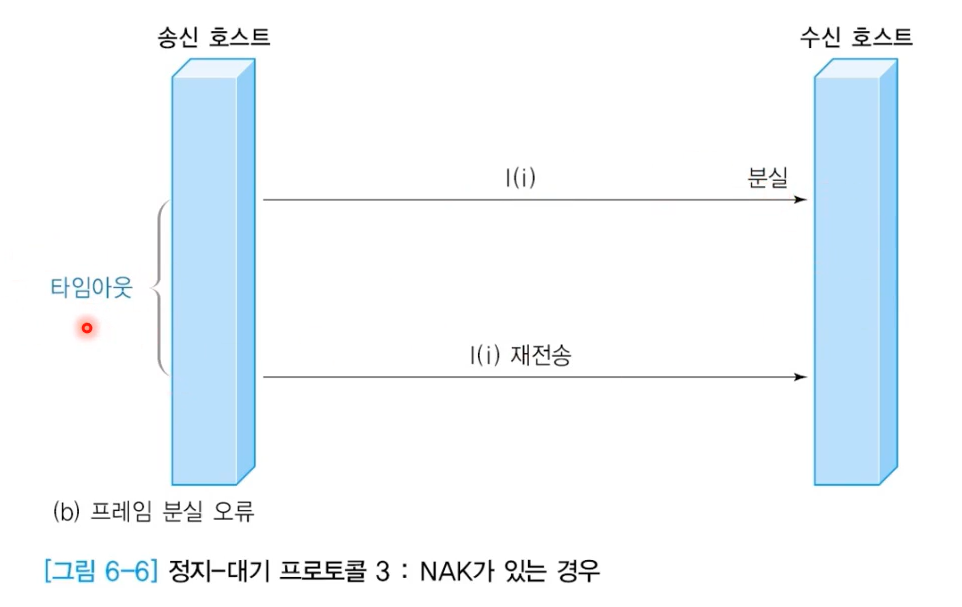

## 슬라이딩 윈도우 프로토콜

### 슬라이딩 윈도우

- **양방향 통신**을 지원

- **오류 제어**와 **흐름 제어**를 함께 지원

- 기본 절차

  1. 송신 호스트는 정보 프레임(전송 데이터 + 순서 번호 + 오류 검출 코드)을 순서 번호에 따라 순차적으로 전송함

  2. 정보 프레임을 수신한 수신 호스트가 응답하는 순서 번호는 정상적으로 수신한 번호가 아닌, <u>다음에 수신하기를 기대하는 번호를 회신하는 것이 일반적임</u>

  3. 송신 호스트가 관리하는 송신 윈도우는 전송 되었지만 <u>긍정 응답이 회신되지 않은 프레임을 보관함</u>

  4. 수신 호스트가 관리하는 수신 윈도우는 프로토콜의 동작 방식에 따라 크기가 다름

     - 선택적 재전송(Selective Repeat) 방식에서는 송신 윈도우 크기와 같음

     - Go-back N 방식에서는 크기가 1임

### 흐름 제어

- 순서 번호

  - 프레임 별로 부여되는 일련 번호

  - 0부터 임의의 최댓값까지 순환 방식으로 사용

  - 일반적으로 순서 번호의 최댓값이 송신 윈도우 크기보다 커야함

  - 프레임에서 순서 번호의 공간 크기 = n 비트: 순서 번호의 범위는 0 ~ 2^n -1

  - Stop-and-wait 방식의 경우 n=1 인 특별한 경우

- 윈도우 크기

  - 긍정 응답 프레임을 받지 않고도 연속으로 전송할 수 있는 프레임의 최대 개수

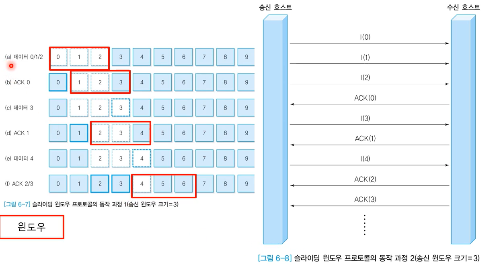

윈도우는 3개 -> 긍정 응답 프레임을 받지 않고 보낼 수 있는 최대 개수.

처음 0, 1, 2를 전송. -> 대기. -> ACK(0) 받음 -> 3 전송 -> ACK(1) 받음 -> 4 전송 ....

미끄러지는 형태 -> sliding~

### 연속형 전송

- 정지-대기 프로토콜은 송신 윈도우 크기가 1인 경우

  - 프레임 전송 시간이 오래 걸리는 경우 전송 효율이 극단적으로 떨어짐

- 연속형 전송(Pipelining)

  - <u>ACK 프레임을 받지 않고 여러 프레임을 연속으로 전송</u>

  - 전송 오류 발생 가능성이 적은 환경에서는 상당히 효율적

  - 오류 발생이 가능하므로 해결 방안이 필요

    - Go-back N

    - 선택적 재전송(Selective Repeat)

- Go-back-N

  - 오류가 발생한 12번 프레임을 포함해 이후에 전송된 모든 정보 프레임을 재전송

  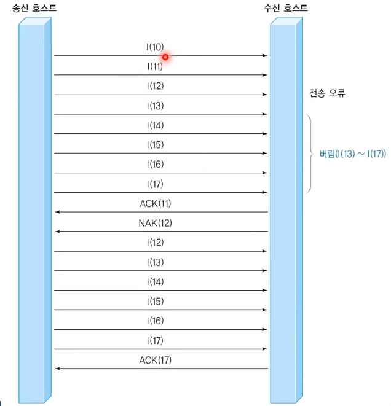

  12번에서 오류가 발생했을 때, 수신호스트는 12번 이후에 받았던 것들을 모두 버림. 송신 호스트는 12번 부터 다시 보냄.

- 선택적 재전송

  - 오류가 발생한 프레임만 선택적으로 복구하는 방식

  - 부정 응답 프레임을 사용해 오류가 발생한 정보 프레임을 처리하는 경우

    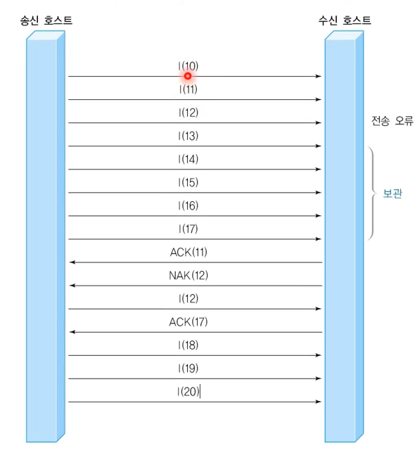

    12번 오류 발생 -> 수신 호스트는 이후 정상적으로 받은 것들은 보관해둠. -> 송신호스트는 12번만 다시 보내줌.

### 피기배킹(Piggybacking)

- <u>양방향 전송</u>의 경우

  - 양방향으로 동시에 <u>정보프레임과 응답 프레임을 교차하여 전송</u>하는 경우가 일반적

- 피기배킹을 사용하지 않는 경우

  - 개별 정보 프레임에 대해 긍정 응답 혹은 부정 응답 프레임이 순서 번호와 함께 별도 처리

  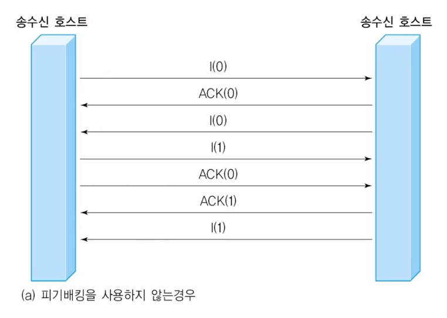

- <u>피기배킹</u>을 사용하는 경우

  - 정보 프레임과 응답 프레임을 각각 보내는 것이 아니라 정보 프레임을 전송하면서 응답 기능까지 동시에 수행하도록 프레임 구조 변경

  - 정보 프레임의 표기 방식은<u> I(i, j)</u>로 재정의

  - i는 자신이 전송하는 데이터의 순서 번호, j는 제대로 수신한 프레임의 순서 번호를 의미

  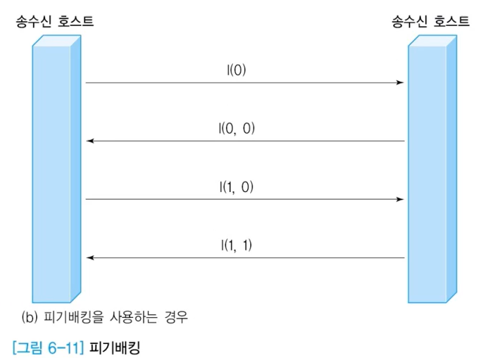

  - 응답 프레임을 전송할 시점에 전송할 프레임이 없는 경우

    - 응답 프레임만 전송

    - 응답을 잠시 늦춘 후 피기배킹 방식으로 전송

## HDLC 프로토콜

### 개요

- 역사

  - SDLC(Synchronous Data Link Control)

    - IBM SNA의 데이터 링크 프로토콜

  - ISO에서 SDLC를 발전시켜 HDLC(High-level Data Link Control)로 발표

  - LAPB(Link Access Protocol-Balanced)로 향상

- 특징

  - 일대일, 일대다로 연결된 환경에서 데이터 송수신 기능 제공

  - 호스트의 종류

    - **주국(Primary Station)**: 명령을 전송하는 호스트

    - **종국(Secondary Station):** 명령에 대한 응답을 회신하는 호스트

    - **혼합국(Combined Station)**: 주국과 종국 기능을 모두 지닌 호스트

  - 기본 동작 원리

    - 주국이 종국에게 명령(Command)을 전송하고

    - 종국은 주국에게 응답(Response)을 회신함

### 프레임 구조

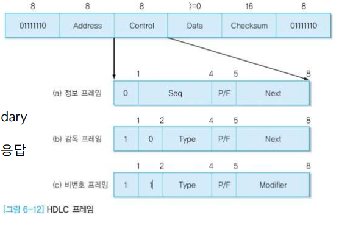

- 주요 필드

  - **비트 프레임**

    - 프레임의 시작과 끝

    - 플래그(01111110) 사용

  - **Address**

    - <u>일대다 환경을 지원</u> (Secondary station 주소)

    - 일대일 환경에서는 명령과 응답 구분

      - 예

        - DTE : A(03hex)

        - DCE : B(01hex)

  - Data

    - 가변 크기의 전송 데이터

  - Checksum

    - CRC-CCITT 생성 다항식 사용

  - Control

    - 프레임 종류

      - Information(I)

      - Supervisory(S)

      - Unnumbered(U)

    - 필드

      - 송신용 순서번호

      - 회신용 순서번호

      - Type

        - SABM(Set Asynchronous Balanced  Mode)

        - UA(Unnumbered  Acknowledgement)

        - DM(Disconnected Mode)

        - FRMR (Frame Reject)

      - P/F(Poll/Final)

### 정보 프레임

- Seq

  - 송신용 순서번호

- Next

  - Piggybacking을 이용한 응답기능 (다음에 수신할 순서번호)

- P/F (Poll/Final)

  - P = 1 : 주국에서 종국에 데이터 전송을 허용

    - 수신단에서는 반드시 주어진 시간 내에 응답을 보내야 함

    - 송신단에서 타임 아웃 발생시 P=1로 응답 요구

  - F = 1 : 종국에서 주국으로 데이터 전송

### 감독 프레임

- 프레임에 대한 응답 기능

  - Type

    - 0 (RR : Receive Ready)

      - 긍정 응답

    - 1 (REJ: Reject)

      - 부정 응답

    - 2 (RNR : Receive Not Ready)

      - 흐름 제어

      - 나중에 RR, REJ, 기타 프레임 전송하면 계속 진행

    - 3 (SREJ : Selective Reject)

      - 선택적 재전송

### 비번호 프레임

- 순서 번호가 없는 프레임을 의미

- 프레임 종류 (Type + Modifier 총 5비트로 구분)

  - SABM(Set ABM): 비동기 균형 모드의 연결 설정을 요구

  - SNRM(Set NRM): 정규 응답 모드의 연결 설정을 요구

  - SARM(Set ARM): 비동기 응답 모드의 연결 설정을 요구

  - DISC: 연결 해제를 요구

  - RSET: 리셋 기능을 수행 (N(R), N(S) 초기화)

  - FRMR: 프레임 수신을 거부

  - UA: 비번호 프레임에 대한 응답 기능을 수행

- 연결 설정 모드의 종류: NRM, ABM, ARM

- 정규 응답(NRM: Normal Response Mode)

  - 종국에서 데이터를 전송하려면 주국의 허락이 필요

  - 불균형 모드를 의미하므로, 호스트 하나는 주국이고 다른 하나는 종국

- 비동기 균형(ABM: Asynchronous Balanced Mode)

  - 두 호스트 모두 혼합국으로 동작

  - 양쪽에서 명령과 응답을 전송할 수 있음

- 비동기 응답(ARM: Asynchronous Response Mode)

  - 불균형 모드

  - 주국의 허락 없이 종국에서 데이터를 전송할 수 있음 

- 응답

  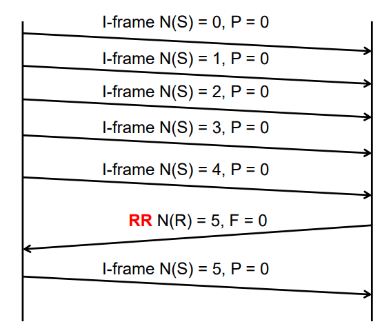

- REJ 사용

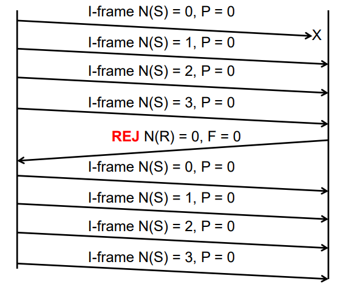

- Poll / Final 비트 사용

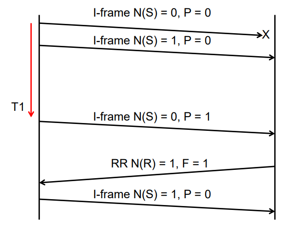

- FRMR 사용

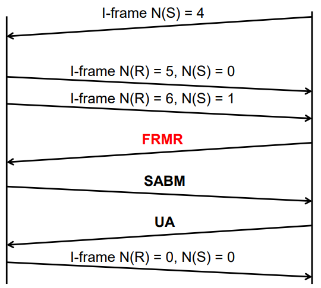

### LAP(Link Access Protocol)

- 비동기 응답 모드인 ARM으로 동작

- 연결 설정

  - 주국에서 SARM 명령 전송

  - 종국에서 SARM 응답 전송

    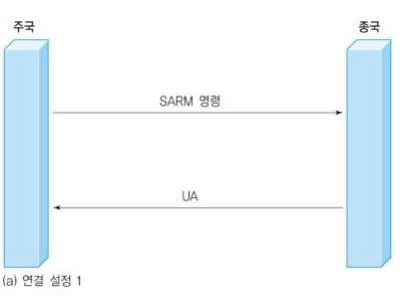

    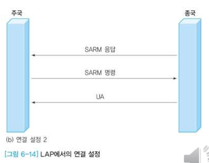

### LAPB(Link Access Protocol-Balanced)

- 양쪽 호스트가 혼합국으로 동작

  - 임의의 호스트에서 SABM 전송하여 연결 설정

  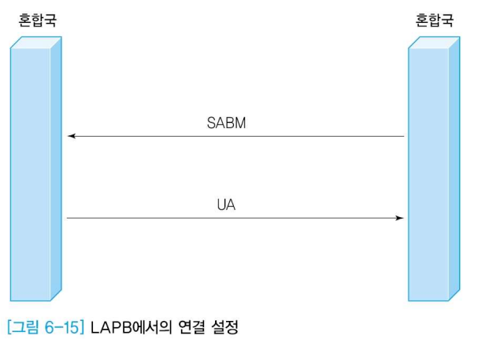