# 1절 네트워크 계층의 기능

**목표**

- 네트워크 계층의 필요성과 역할을 이해한다.
- 혼잡 제어 기능 이해한다.

## 네트워크 계층의 주요 기능

- 기본 기능
  - 라우팅(Routing)
    - 주소 바탕으로 경로 선택 => 송수신 호스트 사이의 패킷 전달 경로를 선택
    - 라우팅 테이블
      - 주역할
      - 네트워크 구성 형태에 관한 정보를 관리
      - 각각의 라우터들이 독자적으로 테이블을 형성하고 주기적으로 다시 채움
  - 라우팅 과정 중에 수반되는 기능
    - 혼잡제어, 패킷 분할/병합(상위 계층에서 나온 것을 쪼개고 받는 받는 쪽에서 다시 묶음)
    - 혼잡 제어(Congestion Control)
      - 혼잡(congestion)
        - 네트워크에 패킷 수가 과도하게 증가되는 현상
      - 혼잡의 발생을 예방하거나 제거하는 기능이 필요
      - ex. 망에서 상대방까지 갔다가 응답이 올 때까지 충분한 시간이 보장되어야 하는데 그 값이 잘못 설정됐을 때 정상적인 응답이 오기 전에 분실이 됐다고 판단하고 재전송 => 쓸데없는 패킷이 늘어나고 폐기하는 것이 증가하는 상황 
    - 패킷의 분할
      - 상위 계층에서 내려온 데이터는 하위 계층인 MAC 계층의 프레임 구조에 정의된 형식으로 캡슐화할 필요가 있다.(캡슐화 : 상위 계층에서 내려준 거에 헤더와 트레일러 붙임)
      - 송신 호스트에서는 전송 전에 적절한 크기로 데이터를 분할(Segmentation)할 필요가 있다.
      - 수신 호스트는 분할되어 수신한 데이터를 다시 병합(Reassemble)할 필요가 있다.

## 서비스의 종류

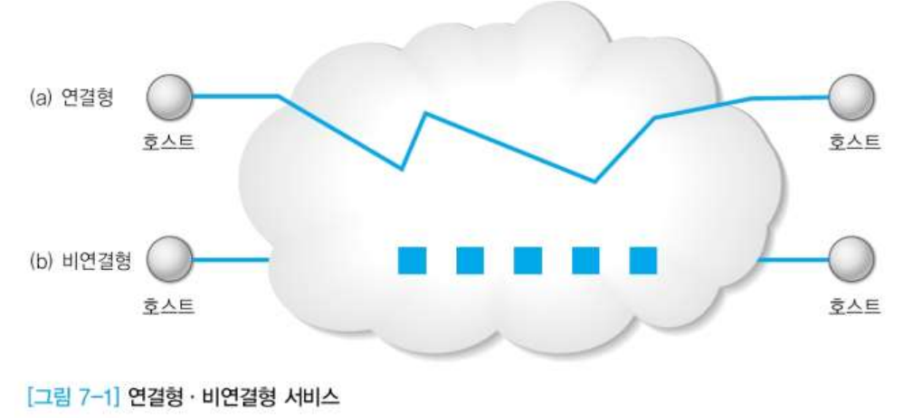

- **비연결형**

  - 데이터의 **전송 경로를 사전에 결정하지 X**, 패킷 단위로 결정함
  - 패킷의 전달 순서
    - 패킷이 서로 다른 경로로 전송되므로 **도착 순서가 일정하지 않음** => 상위 계층에서 순서 재조정해야

  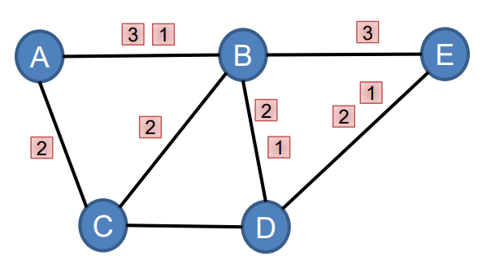

  

  - 패킷 분실 가능성

    - 100% 도착 보장 X
    - 상위 계층에서 패킷 분실 오류 복구해야

  - 인터넷 환경의 예

    - IP : **네트워크 계층**의 기능을 지원하는 **비연결형** 프로토콜

    - UDP : **전송 계층**의 기능을 지원하는 **비연결형** 프로토콜

      

- **연결형**

  - 데이터 전송 전에 데이터의 **전송 경로를 미리 결정함** => 상대적으로 신뢰성 높음
  - ex. C에서 D로 갈 때, 1이 빠지면 그 안에서 재전송 요청을 해서 처리가능함  
  - TCP : **전송 계층**의 기능을 지원하는 **연결형** 프로토콜

  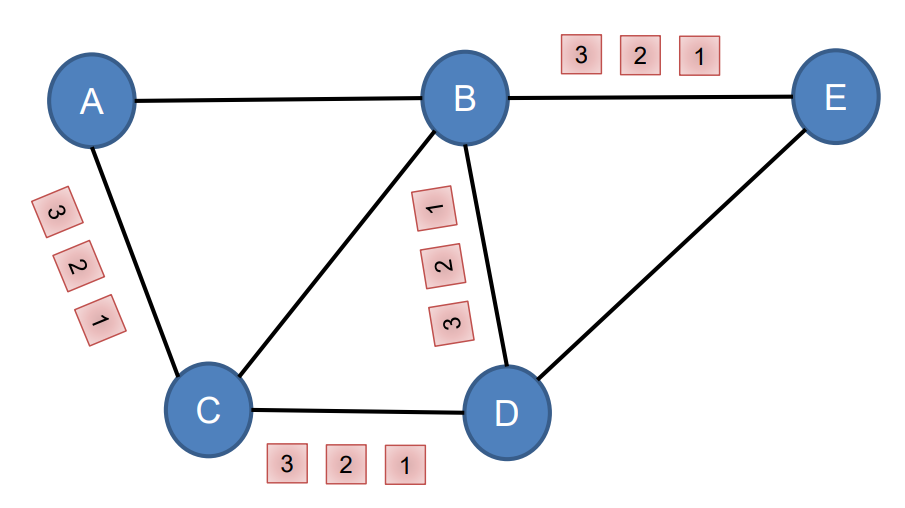

## 라우팅(Routing)

- 패킷의 전송 경로 지정
- 전송 경로 결정 시 고려 사항
  - 공평 원칙 : 다른 패킷의 우선 처리를 위해 다른 패킷이 손해를 보면 안됨
  - 효율 원칙 : 전체 네트워크의 효율성에 대해 고려해야 함
    - 패킷의 평균지연시간, 중간에 거쳐가는 라우터 수 등을 기준으로
  - 정적/동적 라우팅
    - 정적(Static) 라우팅
      - 패킷 전송 이루어지기 전에 라우터가 경로 정보를 미리 저장하여 중개
      - 최적의 라우팅 정보를 개별 라우터에 저장하여 관리하는 게 중요함
      - 단점
        - 경로 정보 갱신 어려움 => 네트워크 변화/혼잡도 대처 부족
    - 동적(Dynamic) 라우팅
      - 라우터 경로 정보를 네트워크 상황에 따라 적절하게 변경
      - 경로정보 변경 주기에 따른 보완 가능
      - 단점
        - 복잡한 작업 추가로 필요
        - 경로 정보의 수집과 관리로 인한 성능 저하
- HELLO/ECHO 패킷
  - HELLO
    - 주변 라우터에 보내 주변 경로 정보를 파악하는 용도
  - ECHO
    - 라우터 사이의 전송지연시간을 측정하는 용도
- 임의의 라우터가 획득한 정보를 각 라우터에 통보함으로써 정보 공유
  - 개별 라우터에 도착하는 시간 차이로 인한 정보 불일치 발생 가능성
  - 변화되는 상황에서 일관성 유지가 관건

## 라우팅 테이블

- 라우터가 패킷의 적절한 경로를 찾기 위한 가장 기본적인 도구

- 필수 정보

  - 목적지 호스트 : 패킷의 최종목적지가 되는 호스트 주소
  - 다음 홉 : 목적지 호스트까지 패킷을 전달하기 위한 인접 경로

  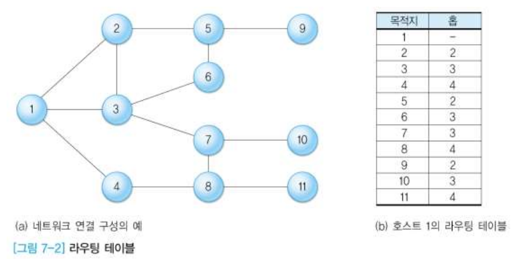

  정해진 경로

## 라우팅 정보의 처리

- 소스(Source) 라우팅
  - 송신 호스트가 패킷의 전달 경로를 결정하는 방식 -> 그 후 라우터가 그 길을 따라감 
  - 전송 경로는 전송 패킷 내부에 기록됨 -> 그것들을 살펴서 길을 찾아감
- 분산(Distributed) 라우팅
  - 라우팅 정보를 분산하여 관리하는 방식(전체 망 정보가 너무 커서 나눠 관리)
  - 호스트의 개수가 많아질수록 효과적
- 중앙(Centralized) 라우팅
  - 특정 호스트(RCC : Routing Control Center)가 모든 라우팅 정보를 관리
  - 송신 호스트는 패킷 전송 전에 RCC에게 경로 정보를 얻어서 소스 라우팅으로 전송
  - 호스트의 개수가 많아질수록 비효율적
- 계층(Hierarchical) 라우팅
  - 분산 라우팅과 중앙 라우팅의 조합
  - 계층구조
  - 네트워크 규모가 커질수록 매우 효과적임

## 혼잡 제어

- 흐름 제어 : 송수신 호스트 사이의 전송 속도 문제
  - 양쪽 호스트 사이의 흐름 문제
- 혼잡 제어 : 네트워크에서의 전송 능력 문제
  - 중간에 거쳐가는 망에서의 전송 능력 문제

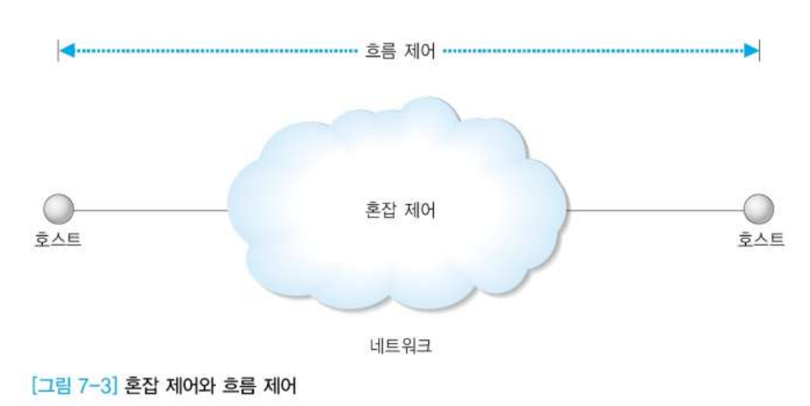

- 혼잡의 원인

  - 타임 아웃 기능에 의한 패킷의 재전송으로 혼잡도 증가

    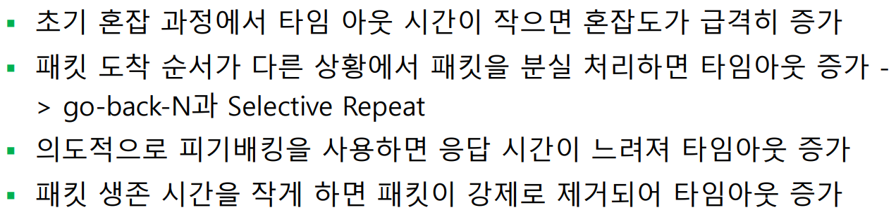

- 라우팅 알고리즘

  - 혼잡이 발생하지 않는 경로를 배정하도록 설계해야
  - 혼잡이 발생하는 경로를 선택하면 혼잡이 주변으로 확대됨

- 트레픽 성형(형태 바꿈)

  - 혼잡의 발생 <= 트레픽이 특정 시간에 집중되는 버스트(burst) 현상이 원인

  - 패킷 발생 정도를 네트워크에서 예측 가능한 정도로 조절하는 기능이 필요

  - 리키 버킷 알고리즘

    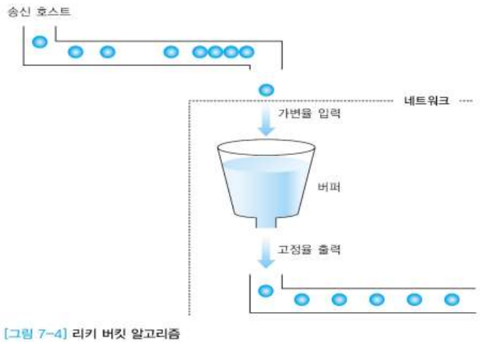

    버퍼를 두어 출력할 때는 일정한 비율로 나갈 수 있도록

    

- 혼잡 제거

  - 특정 지역의 혼잡이 다른 지역으로 확대되지 않도록 하는 것이 중요

  - 자원 예약 방식

    - 호스트와 서브넷이 미리 네트워크 자원의 사용 정도를 협상하여 사전 예약
    - 단점 : 자원 낭비 가능성 <= 항상 예약대로 자원을 사용하지 않으므로

  - 초크(Choke) 패킷

    - ECN(Explicit Congestion Nofitication) 패킷 : 명시적으로 혼잡을 통보하는 패킷
    - 출력 경로를 사용하는 빈도를 모니터
    - 한계치가 넘어가면 송신 호스트에게 주의 표시
    - 초크 패킷을 받은 호스트는 송신 패킷 양을 줄임(초크 패킷이 더이상 오지 않을 때까지)
    - ex. 초크 패킷 오지 않을 때까지 양을 줄이고 안 오면 다시 높이는 식으로 송수신할 수 있음

    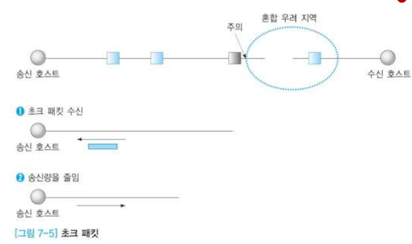

# 2절 IP 프로토콜의 이해

**목표**

- 라우팅 기능을 이해하고 관련 프로토콜을 알아본다.

## 간단한 라우팅 프로토콜

- 최단 경로 라우팅

  - 중간에 거쳐가는 홉(hop) 수로 판단
  - 패킷이 목적지로 가는 동안 거치는 라우터 수가 최소가 되도록 경로를 선택

  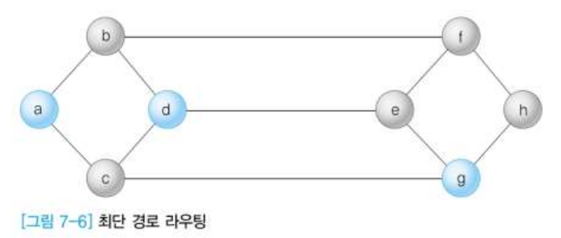

  a -> g : a-c-g => 2 홉이 최소, a-b-d-e-g => 4 홉

  

  - 기타 거리 기준

    - 패킷의 전송 지연, 전송 대역폭, 통신 비용 등

    

- 플러딩(Flooding)

  - 라우터가 입력된 패킷을 출력 가능한 모든 경로로 중개하는 방식
  - 네트워크에 패킷이 무한 개 만들어질 위험
    - 방지하기 위해, 홉 수를 일정 범위로 제한하고 제거
  - 중요한 데이터를 모든 호스트에게 동시에 전달하는 환경에서 제한적으로 사용(적합)

## 거리-벡터 프로토콜✨

- 라우터가 자신과 **직접 연결된 주변 라우터에게 라우팅 정보를 교환**하는 방식

  - (본인이 알고있는) 전체 네트워크에 대한 지식
  - 이웃 라우터에게만 전달
  - 일정한 주기로 정보 공유

- 교환할 때, 전체 네트워크에 속하는 개별 네트워크까지 걸리는 거리 정보를 전달함

- 개별 라우터에서 유지하는 필수 정보

  - 링크 벡터 : 본인이 어디에 묶여져 있는지에 대한 정보
  - 거리 벡터 : 전체 개별 네트워크에 대한 거리 정보
  - 다음 홉 벡터 : 개별 네트워크로 가기 위한 다음 홉 정보

  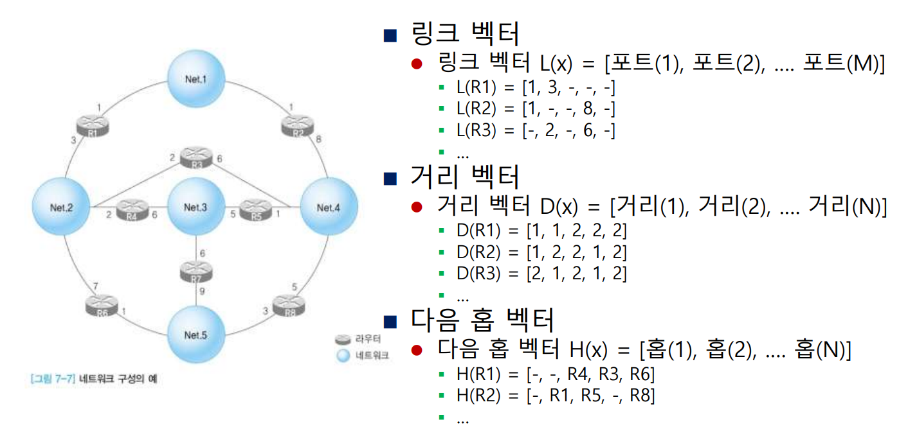

- RIP(Routing Information Protocol)

  - 거리 벡터 방식

  - 소규모 네트워크 환경에 적합

  - 주변 라우터가 제공하는 거리 벡터 정보가 임의의 짧은 시간 내 모두 도착해야

    - 현실적으로 구현 어려움(ex. UDP 사용 - 패킷 손실 가능성)

  - 라우팅 정보 수정하는 경우

    - 거리 벡터 정보가 새로운 네트워크 주소일 때
    - 목적지까지의 지연이 더 적을 때
    - 거리 벡터 정보가 입력되면 등록 정보 수정

  - R1의 라우팅 테이블

    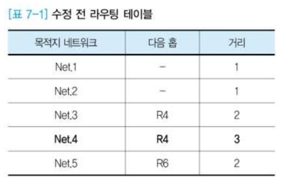

    다음 홉이 없는 것 : 직접 묶여있는 상태

    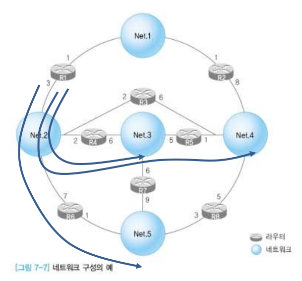

    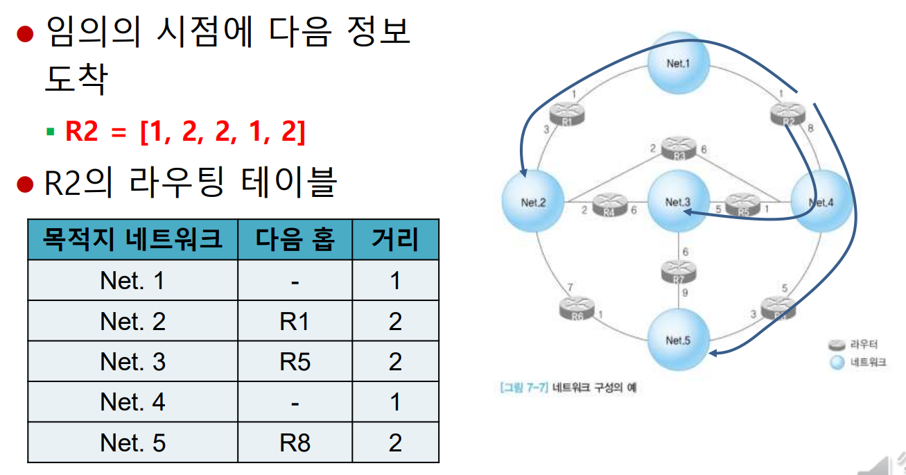

    

  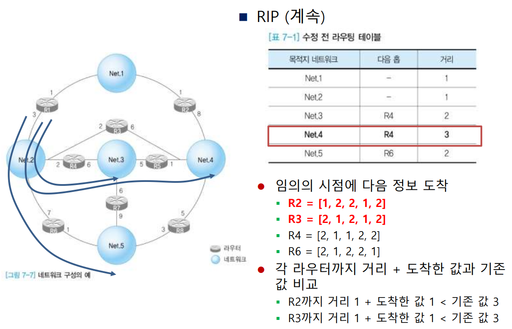

  - R1-R2까지의 거리 1 + 도착한 값(R2에서 값) 1 < 기존 값 3

  - R1-R3까지의 거리 1 + 도착한 값(R3에서 값) 1 < 기존 값 3

  - 위 그림에서 3개의 홉을 거쳐서 갈 수 있는 걸로(거리 : 3) 되어있지만 (각 라우터까지 거리 + 도착한 값)과 기존값을 비교했을 때 전자가 더 작음. R2나 R3는 2번만에 갈 수 있음. 

  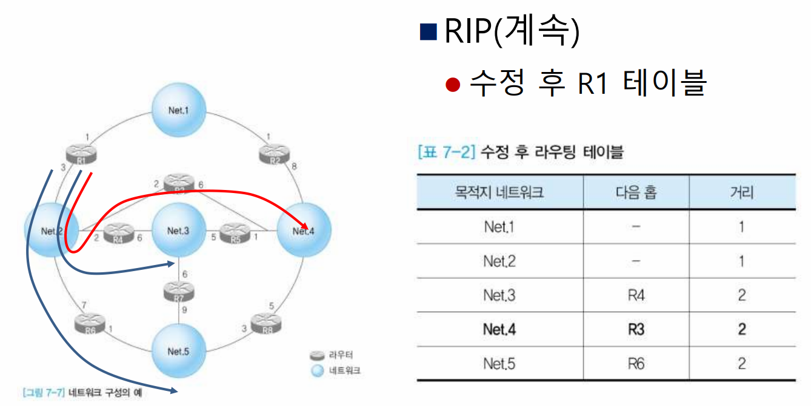

  

  

  - 패킷 구조

    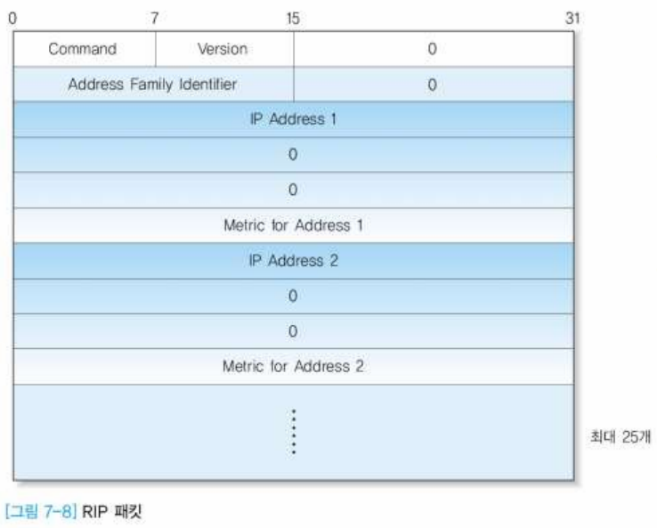

    - Command
      - 1 : request
      - 0 : response
      - 초기에 요청 받으면 즉시 응답해야 함(본인이 알고있는 내용 바로 전달)
    - IP Address
      - 네트워크 지칭
    - Metric
      - 목적지까지의 거리

  

## 링크 상태 프로토콜

- 거리-벡터 프로토콜의 단점 개선

  - 주변 상황에 변화 있을 때 

  - 주변 라우터까지의 정보를

  - 모든 라우터에게 전달

    ❗거리-벡터 프로토콜은 전체 네트워크에 대한 정보를 주변 라우터에게만 전달함

- 플러딩(Flooding) 방식으로 정보 전달(모든 라우터에게 전달하기 위해) -> 중복해서 도착할 수 있음

- ex. OSPF(Open Shortest Path First) 프로토콜

## OSPF 토폴로지

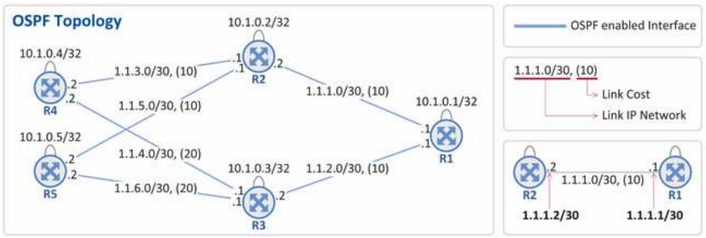

- OSPF 라우터 5개(R1~R5)

- 라우터 간 연결 링크에 대한 IP 주소(Link IP Network)와 OSPF Cost 및 각 라우터의 Loopback 주소(ex. R1의 경우 10.1.0.1) 표시

- 파란색 줄(링크) : OSPF가 enable하다고 표시

- R1이 자신의 링크 정보를 다른 OSPF 라우터들로 전파

  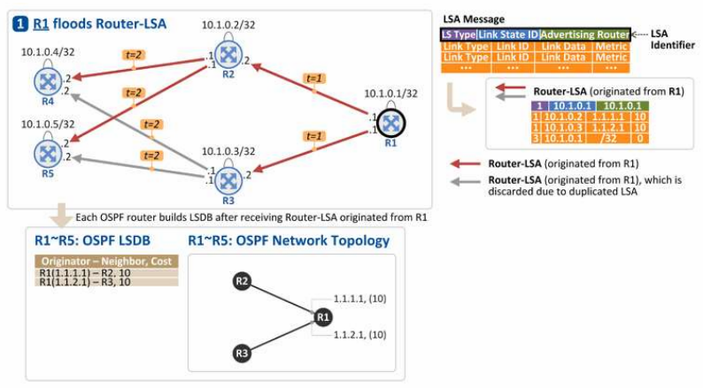

  - 이를 수신한 R2, R3는 Router-LSA가 수신된 링크를 제외한 나머지 링크로 Router-LSA를 flooding
  - R4와 R5는 동일한 Router-LSA를 2개씩 수신
    - 먼저 받은 걸로 채워넣고 그 후에 동일하게 받은 정보를 폐기
      - LSA 식별자에 해당하는 {LS Type, Link State ID, Advertising Router}가 동일한 경우 두번째 수신한 LSA를 폐기

- R2가 자신의 링크 정보를 다른 OSPF 라우터들로 전파

  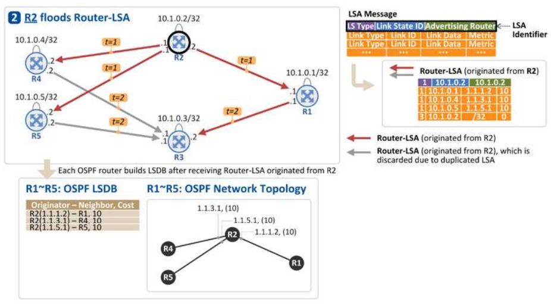

  - R3는 3개의 동일한 Router-LSA 수신

- R3가 자신의 링크 정보를 다른 OSPF 라우터들로 전파

  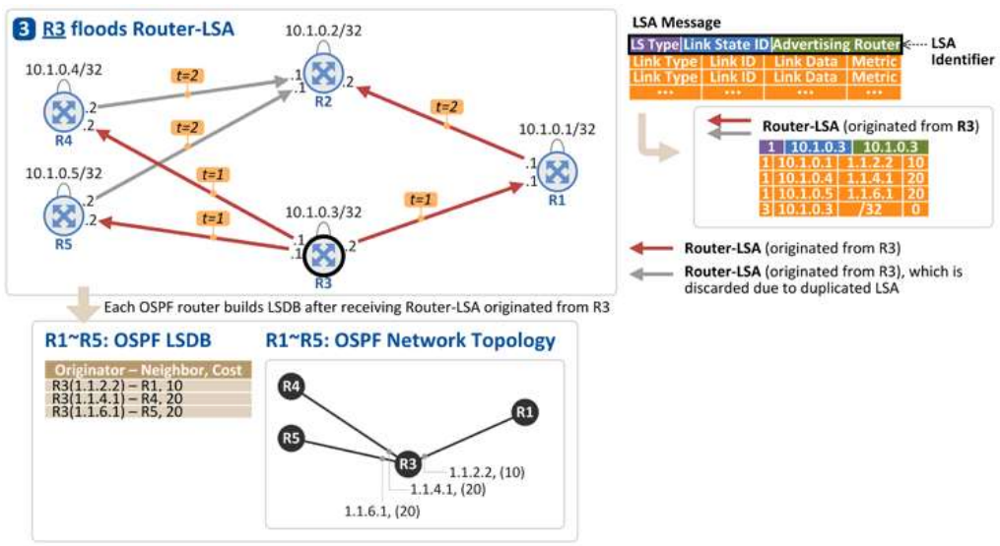

- R4가 자신의 링크 정보를 다른 OSPF 라우터들로 전파

  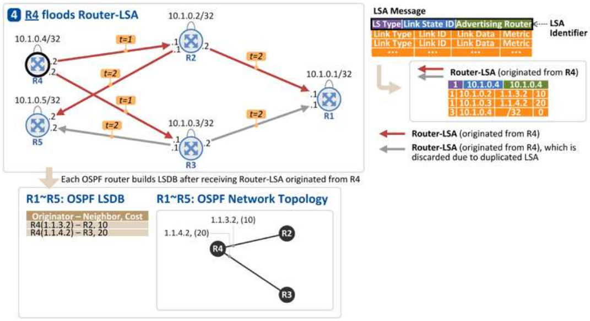

- R5가 자신의 링크 정보를 다른 OSPF 라우터들로 전파

  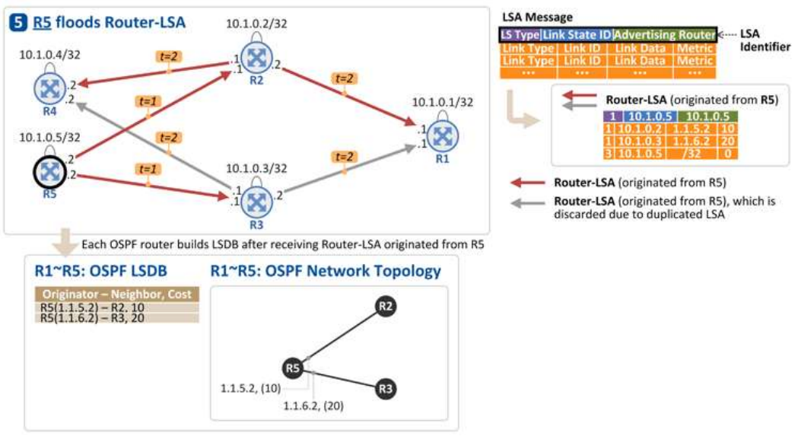

- 각 라우터에서 OSPF Topology 그림 그리기

  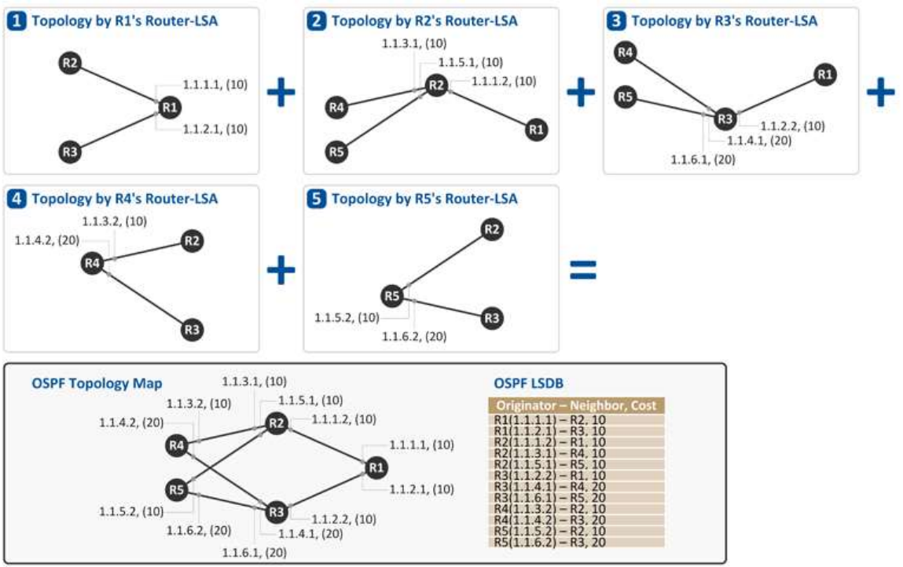

  - 각각 모아진 정보들을 바탕으로 전체 그림을 각자 알아서 그리는 방식

- Shortest Path Tree 구성하기

  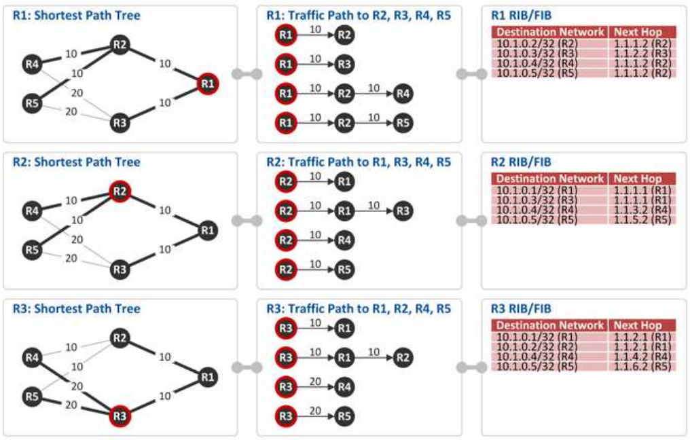

## 외부 라우팅 프로토콜

- 실제 경로 벡터(Path Vector) 안에 경로값이 없음, 연결되어 있다 정도만 있음 -> **경로값이 필요없는 방식**
- 내부 라우팅 프로토콜과의 차이
  - 거리(비용)에 대한 처리 과정이 없음
  - 목적지 네트워크에 도착하기 위한 자율시스템에 대한 내용만 포함
- BGP(Border Gateway Protocol)
  - 인터넷에서 多
  - 서로 다른 종류의 자율시스템 간 정보 교환 가능
  - TCP를 이용하여 정보 교환
  - 메시지 종류
    - Open
      - 연관(Relationship) 생성
    - Update
      - 경로 관련 정보 전달
    - KeepAlive
      - Open에 대한 응답 기능과 주기적인 연관 확인 기능(변화가 거의 없기 때문에)
    - Notification
      - 오류 상태 통보

## BGP

- 계층적 라우팅 필요성

  - 평면적 라우팅은 확장이 어려움
  - 목적지에 이르는 거리가 멀수록 더 적은 정보를 이용하는 것이 타당
  - 해결 방안: 영역 계층구조(Area Hierarchy)

  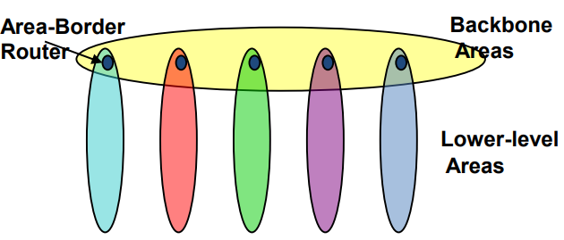

- 영역(area)

  - 망을 영역들로 분할
    - 각 영역에 서브-영역 존재 가능
  - 망 노드는 계층적 주소 부여
  - 영역 내부
    - 각 노드는 다른 노드로 가는 경로 보유
  - 영역 외부
    - 각 노드는 다른 top-level 영역으로 가는 경로만 보유
    - 영역 간 패킷은 적절한 border router에게 전달

  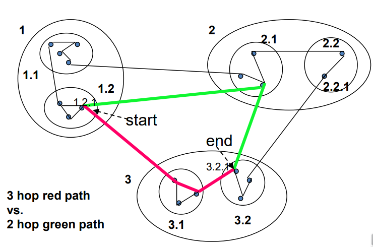

- 인터넷이 모든 라우터들끼리 연결되어 있다고 착각할 수 있는데 사실이 아님!

- 인터넷의 영역 계층구조

  - 자율시스템(AS: Autonomous System)

    - 하나의 기술적 관리 하에 있는 라우터들의 집합 ex. SKT 망은 SKT가 알아서, KT 망은 KT가 알아서
      - AS 안에서는 IGP(interior gateway protocol)
      - 다른 AS로 전달할 땐 EGP(exterior gateway protocol)
    - 각 AS는 유일 ID 할당
      - 16 bit
    - AS는 피어(peer) 역할

    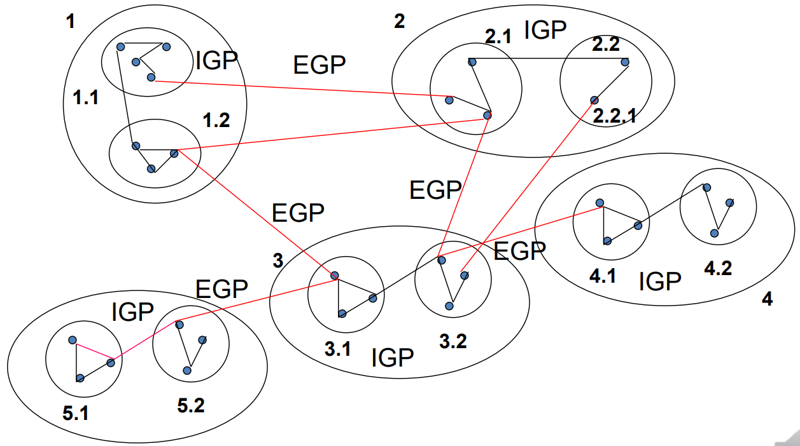

- RIP/OSPF는 확장성이 떨어지므로 계층구조를 가져야 함

- 실제로 정확한 계층구조를 가지지 X

  - ISP의 규모나 연결성에 따라 다르므로

- Transit(환승) vs Peering(직접)

  - 일반적인 방법은 Transit -> 더 상위계층 Tier를 거쳐서 환승해서 가는 방법
  - Peering : 따로 길을 뚫어놓아서 이용하는 방법

- Link state or distance vector => Distance Vector with Path

  - 각각의 라우팅들은 전체 경로에 대한 정보를 유지
  - 이를 통해 loop에 정보가 있는지 없는지 판단

- Interconnecting BGP Peers

  - TCP로 서로 연결해서 사용함
  - 장점
    - BGP를 간단하게 함
    - 주기적으로 리프레쉬할 필요없음
    - 점진적인 업데이트 가능
  - 단점
    - 혼잡제어해야하는 상황

- Hop-by-hop Model

  - BGP는 주변 라우터에 대해서만 본인 경로를 광고함

# 3절 IP 프로토콜의 이해

**목표**

- IP 프로토콜 헤더의 역할을 이해한다.

## IP 프로토콜의 주요 특징

- 비연결형 서비스
- 패킷 분할/병합 기능
- 데이터 체크썸은 없고, 헤더 체크썸만 제공
  - IP는 전체에 대해 확인하지 X, 헤더만
- Best-effort(최선) -> 결과 책임 못짐..!

## IP 헤더✨ (그림 그릴 수 있어야!)

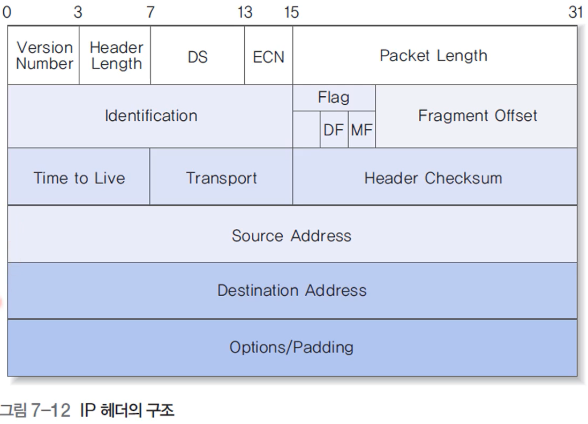

- 한 줄당 4 바이트 * 5 = 20 바이트

- IP 헤더는 총 20 바이트
- Packet Length : 패킷 전체의 길이(바이트) 때에 따라 Packet이 아닌 다른 것일수도 있음
- Fragment Offset : 쪼개는 것의 위치값(13 비트)
- Time to Live : 최대 얼마나 살 수 있는지/홉으로 계산/라우터를 지날 때마다 하나씩 감소시킴/0이 되면 버림
- Header Checksum : 헤더에 대해서만 계산하여 실음
- Source Address : IP 주소 들어감

- Service Type 필드 (-> DS/ECN 필드로 변경)

  - 서비스 품질 관련 내용

    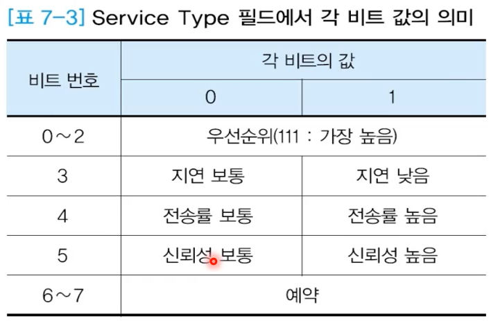

    - 0~2 비트는 상위 계층의 응용서비스 환경에 따라 설정
    - 3, 4, 5 비트는 일반적으로 0

  - DS(Differentiated Services) (6비트)

    - 사전에 서비스 제공자와 서비스 이용자 사이에 서비스 등급에 대해 합의
    - 동일한 DS 값을 갖는 트래픽들은 동일한 서비스 등급으로 처리

  - ECN(Explicit Congestion Notification) (2비트)

    - 명시적으로 혼잡이 발생했다는 것을 통보
    - ECN 기능을 위해 TCP 프로토콜의 헤더에 ECE 필드와 CWR 필드가 추가

    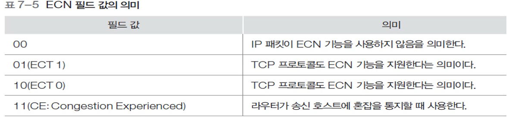

  

- 패킷 분할 관련 필드

  - 상위 계층에서 내려온 데이터가 **하나의 패킷으로 전달하기에 너무 큰 경우 분할하여 전송**
  - Identification(식별자/구분)
    - 분할되지 않은 패킷 : 값을 순차적으로 증가 부여
    - 분할된 패킷 : 동일한 번호 부여
  - DF(Don't Fragment) : 쪼개지마세요 -> 한번에 못보내면 폐기
  - MF(More Fragment)
    - 더이상 분할된 패킷이 있는지, 없는지 확인 가능
    - 분할된 패킷의 처음과 중간 : 1
    - 분할된 패킷의 마지막 : 0
  - Fragment Offset(13비트)
    - 분할되기 전 데이터에서의 상대적인 위치 정보
    - 8 바이트의 배수로 지정

- 주소 관련 필드

  - Source Address : 송신 호스트의 IP 주소

  - Destination Address : 수신 호스트의 IP 주소

  - IP 주소 체계

    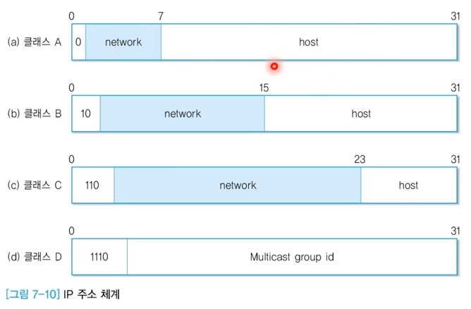

    - Network : NIC에서 할당
    - Host : 개별 망에서 관리

    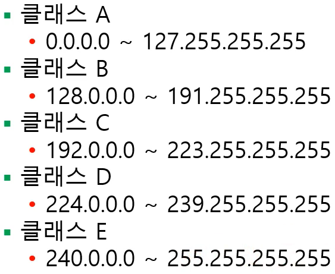

    

- 기타 필드

  - Version Number

    - 보통 4(IPv4)

  - Header Length

    - 32 비트
    - IPv4의 경우 보통 5

  - Packet Length : 헤더를 포함한 패킷 전체 길이

  - Transport(전송 프로토콜) : IP 프로토콜에 데이터 전송을 요구한 전송 계층의 프로토콜

    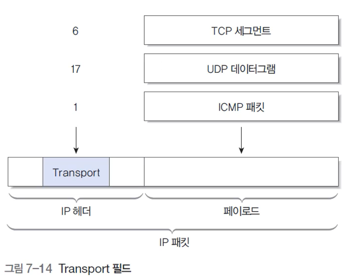

  - Time To Live(TTL)

    - 패킷의 생존 시간
    - 라우터 거칠때마다 1씩 감소/0되면 네트워크에서 강제 제거됨

  - Header Checksum

    - 우선 필드 값을 0으로 하고 계산 후 채움
    - 헤더 오류 검출

  - Options

    - 망 관리나 보안 목적으로 부여 가능

  - Padding

    - 32비트 맞춰주는 역할

  

## 패킷의 분할

- 분할의 필요성

  - 각 네트워크에서 다루는 **프레임의 크기가 다름**
  - **여러 종류의 네트워크를 거쳐** 패킷 전달

  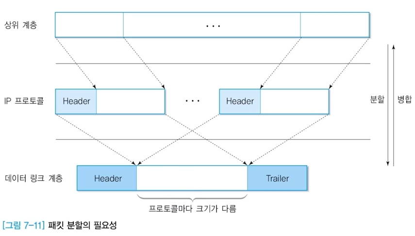

- 분할 예

  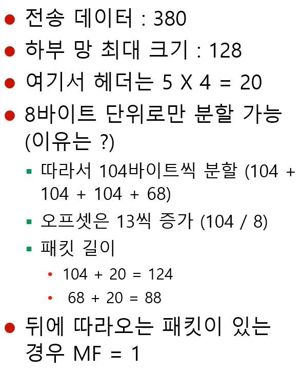

  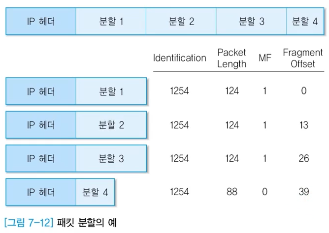

## BOOTP와 DHCP

- BOOTP(Bootstrap Protocol)

  - DHCP 전에 개발된 호스트 구성 프로토콜

- DHCP(Dynamic Host Configuration Protocol)

  - BOOTP를 바탕으로 개선됨
  - 호스트 구성 서비스
  - BOOTP의 특정 제한을 해결함

- BOOTP와 DHCP 유사점

  - 서버와 클라이언트 간 메이시 교환 형식 구조
  - UDP 포트(67, 68) 사용
  - 구성 서비스의 필수적인 부분으로 IP 주소 배포

- BOOTP와 DHCP 차이점

  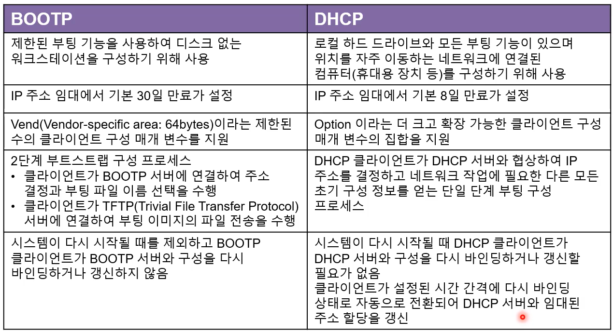

## DHCP 프로토콜

- IP 주소를 여러 컴퓨터가 공유함

- 기능

  - 설정된 매개변수들에 대한 저장소 역할
  - 동적으로 네트워크 주소 할당

- DHCP 메시지

  - DHCPDISCOVER : 클라이언트가 **DHCP 서버를 찾기** 위해
  - DHCPOFFER : 클라이언트의 **DHCPDISCOVER 메시지에 대한 응답**
  - DHCPREQUEST : 주소를 권고한 DHCP 서버에 메시지 전송하여 **권고한 주소를 사용한다고 알림**
  - DHCPACK : **사용 가능**하면 메시지 전송
  - DHCPNAK : 클라이언트가 **DHCPDISCOVER 과정 다시 하도록** 함

- DHCP 프로토콜의 동작 과정

  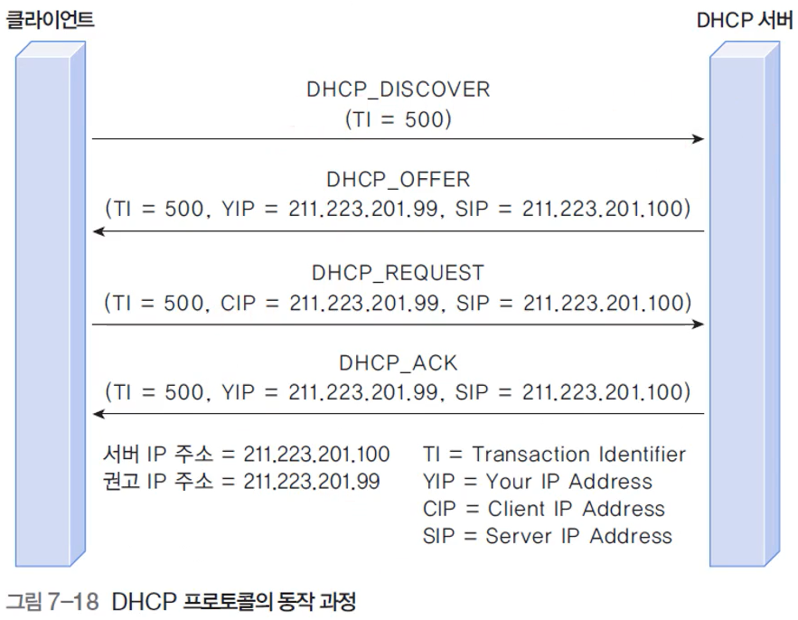

  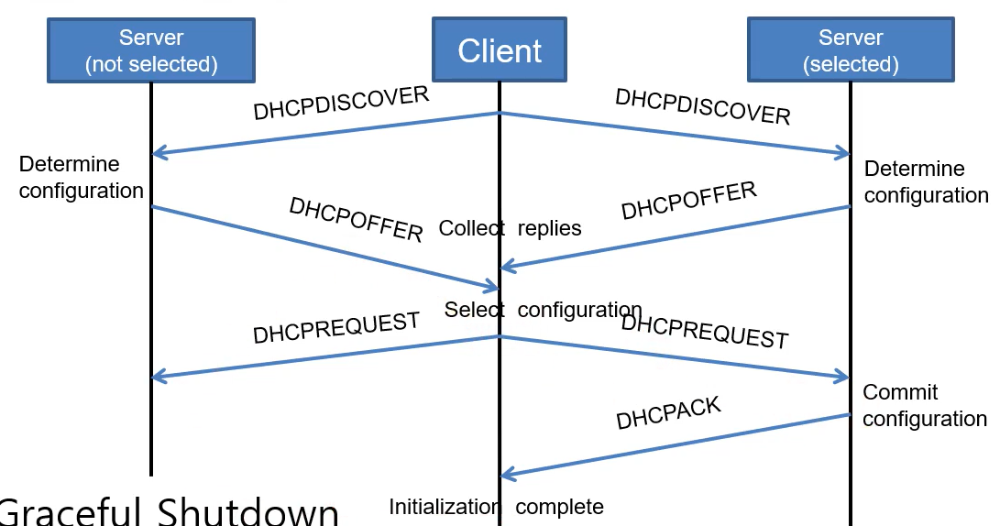

  - 제일 먼저 온 OFFER를 선택해서 REQUEST를 보냄

  

- UDP/IP 프로토콜의 캡슐화

  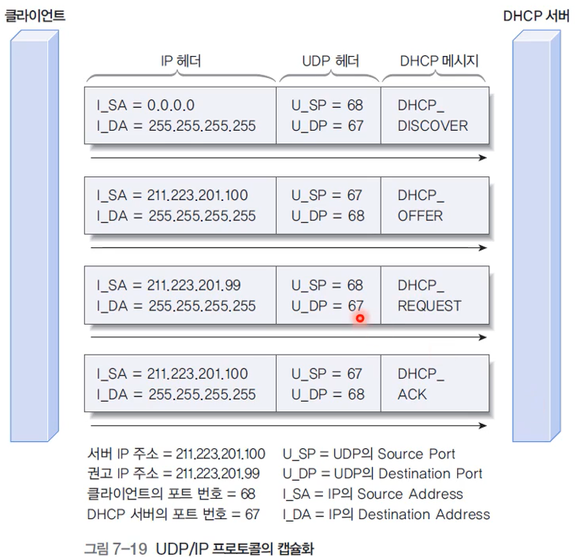

