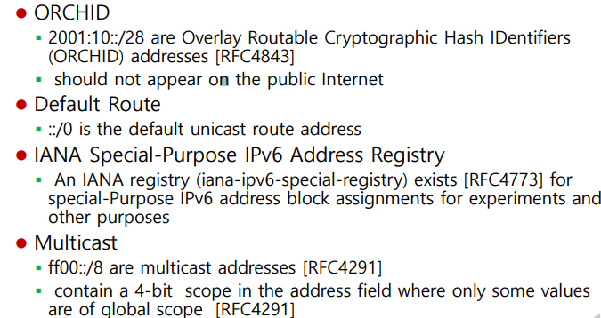

### IPv6 

▶️ **기존 32비트의 IPv4 주소가 고갈되는 문제를 해결하기 위하여 개발된 새로운 128비트 체계의 무제한 인터넷 프로토콜 주소**

#### IPv6 주요 변경 사항

- 주소공간의 확장
  - IPv4의 32비트(4바이트)에서 128 비트(16바이트)로 확장
  - 최대 2^128개의 호스트를 지원
- 헤더 구조 단순화
  - 불필요한 필드 제외 => 빠른 처리 가능
  - 옵션은 모두 확장헤더 방식으로 지원
  - 오류제어 등의 오버헤드를 줄여 프로토콜의 전송 효율 향상
- 흐름 제어 기능 지원
  - Flow Label 도입으로 일정 범위 내에서 예측 가능한 데이터 흐름을 지원
    - **흐름 라벨(Flow Label)** : 네트워크 상에서 패킷들의 어떤 특정한 흐름에 대한 특성을 나타내는 필드
    - 각각의 흐름에 대한 꼬리표를 달아서 흐름을 달리 적용할 수 있음
  - 하나의 연속 스트림(stream)으로 전송해야 하는 연관 패킷 전송 기능 지원
  - 실시간 멀티미디어 응용 환경을 수용

#### IPv6 헤더

- 기본 헤더

  

  - 9개의 기본 필드를 지원

    - 총 40 바이트 중에서 32 바이트는 주소 공간으로 할당
    - 8 바이트만 프로토콜 기능

  - Version Number : 6

  - (기존) Priority 필드 : 특정 패킷의 우선 순위를 상향

    - 혼잡 제어 유무에 따른 처리
    - 혼잡 제어 기능이 `없는` 경우
      - 우선 순위를 8 단계로 구분하여 처리
    - 혼잡 제어 기능이 `있는` 경우 구분하여 처리
      - 인터넷 제어 트래픽
      - 대화식 트래픽
      - 대용량 전송 트래픽
      - 데이터 트래픽
      - 필터 트래픽

  - DS/ECN 필드

    - 차등 서비스가 도입되면서 6 비트의 DS 필드와 2 비트의 ECN 필드가 정의됨

  - Flow Label

    - IPv4에서는 패킷 중개 시 동일한 기준만을 적용(패킷 구분할 수단이 없음)
    - 각 패킷을 구분할 수 있으므로 실시간 서비스가 필요한 응용 환경에서 유용
    - 필드를 지원하지 않는 호스트 혹은 라우터에서의 처리
      - 패킷 생성 시 0으로 지정(기본값)
      - 음성이나 화상 등의 실시간 데이터 트래픽을 나타내기 위해 0이 아닌 값으로 설정
      - 패킷 중개시 현재 값 유지
      - 패킷 수신시 값 무시
    - 0이 아닌 동일번호 패킷들은 주요 필드에 대해 동일한 값들을 가지며, 이는 중개 과정을 간단히 처리할 수 있음(다른 필드 값 확인 없이 Flow Label만을 보고 처리)
    - 값은 랜덤(random)하게 선택

  - Payload Length : `헤더를 제외`한 패킷의 크기

    - IPv6 패킷의 기본 헤더를 제외한 확장 헤더와 데이터의 크기를 알려줌

  - Next Header : 기본 헤더 다음에 위치하는 헤더의 유형
  
  - IPv6의 확장 헤더
  
- 확장 헤더가 없는 경우 상위 계층인 TCP 혹은 UDP 헤더
  
- Hop Limit : IPv4의 Time To Live 필드와 동일한 역할을 수행
  
    - 네트워크에서 패킷이 이동할 수 있는 최대 노드 개수
    
  - Source Address / Destination Address : IPv6 주소
  
    

#### IPv4 vs IPv6 헤더

#### IPv6 헤더

- 확장 헤더

  

  - IPv6는 기본 고정 헤더 뒤에 선택적인 확장 헤더들이 뒤따라올 수 있음
  - **홉-바이-홉(Hop-by-Hop) Options Header**
    - ✅ 패킷 이동 경로 상의 모든 라우터에서 검사해야하는 옵션 관련 정보
    - hop-by-hop 옵션 처리를 지원
      - hop-by-hop : 데이터통신망에서 각 패킷이 매 노드(또는 라우터)를 건너가는 양상을 비유적으로 표현
    - Jumbo 페이로드 옵션 : 데이터의 크기가 65535 바이트보다 클 때 사용
    - 라우터 긴급 옵션 : 라우터에 전송 대역 예약 같은 특정 정보를 제공
  - **라우팅(Routing) Header**
    - ✅ IPv6 패킷이 특정 노드를 거쳐 가도록 경로를 지정하기 위하여 사용
    - IPv4의 소스 라우팅과 유사한 기능
    - 패킷이 Routing Header에 지정된 특정 노드를 경유하여 전송됨
  - **단편화(Fragment) Header**
    - ✅ 네트워크의 MTU(최대 전송 단위)보다 큰 패킷을 전송하기 위해 패킷을 분할하기 위하여 사용
    - 패킷 분할과 관련된 정보를 포함
  - **목적지 옵션(Destination Options) Header**
    - ✅ 패킷의 전송 대상에서 처리해야할 옵션을 표시하기 위해 사용
    - 수신 호스트가 확인할 수 있는 옵션 정보
  - **AH(Authentication) Header**
    - ✅ 데이터의 무결성과 사용자 인증 관련 정보를 포함
    - 기존 IPSec의 AH
    - 패킷 인증 관련 기능
  - **암호화 ESP(Encapsulating Security Payload) Header**
    - ✅ 패킷의 데이터 기밀 유지와 인증 및 무결성 서비스 제공
    - 기존 IPSec의 ESP
    - 프라이버시 기능

- 주소 표현

  

- 기본적으로 서로 다른 두 가지 유니캐스트(단일 인터페이스에 대한 주소) 주소 지정
  - **전역 유니캐스트 주소**
    - 전역적으로 고유한 IPv6 주소로 모든 IPv6 네트워크에서 유일
    - 공용 토폴로지, 사이트 토폴로지(또는 서브넷 ID), 인터페이스 ID로 구성
  - **링크 로컬(link-local) 주소**
    - 특정 라우터의 인터페이스가 담당하는 단일 네트워크 내부에서만 이용되는 IPv6 주소
      - 쉽게 말하면 IPv4의 `사설 주소`와 비슷한 개념
    - 로컬 네트워크 링크에서만 사용
    - 링크로컬 접두어(fe80). 54비트 0, 인터페이스 id(64비트 하드웨어 주소)로 구성
- **사이트-로컬(Site-local) 주소**
  - 하나의 조직, 회사, 학교 등 내부에서 유효한 주소
  - 사이트-로컬 프리픽스(fbc0)

