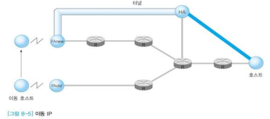

### 이동 IP

#### 배경

- 무선 단말기 사용자가 급격하게 늘면서 인터넷 산업에서도 무선 인터넷 사용자에게 `이동 서비스`를 제공하기 위한 환경을 구축할 필요성이 생김

- 기존의 고정통신망에서 유무선이 복합된 이동 광대역 통신망으로 진화
- 이동환경서비스 수용 필요
- 관련 개념
  - 핸드오버(hand-over) (또는 핸드오프(hand-off))
  - 로밍(Roaming)

#### Hand-off

- 말기가 연결된 기지국의 서비스 공간에서 다른 기지국의 서비스 공간으로 `이동`할 때, 단말기가 다른 기지국의 서비스 공간에 할당한 통화 채널에 동조하여 서비스가 연결되는 기능
- ✅ 통화채널을 자동으로 변경해주어 통화가 단절되지 않도록 하는 기술
- MS(Mobile Station)가 움직일수록 BS1의 신호보다 BS2의 신호가 강해진다. 그래서 서비스가 넘어가면 BS2가 할 수 있도록.
- 사용자는 계속해서 서비스를 이용

#### 2G(GSM) 구조

- Base Station Subsystem : 기지국
- BTS에서 MS를 감지하면 VLR에 등록을 해준다.

#### 이동통신망 구조

- 처음엔 음성만 송수신되도록 했지만 시대가 지나며 다양한 데이터를 주고받을 수 있도록 하였다.

#### 3G 네트워크 예 (UMTS / GSM 구조)

- GSAM RAN, GSM Core : 2G 음성

- UTRAN : ~TRAN의 의미가 한 구간, 지역 내의 신호망을 의미. 

- GPRS : 무선 망.유선 광케이블 무선 네트워크

  

#### 3G 네트워크 프로토콜 스택

- 각각의 단말, 네트웤 구조를 가지고 있음.
- 뒤쪽으로 갈수록 데이터를 주고받을 수 있는 망이 복잡해지고 있음

#### Roaming

- ✅ 이동통신 서비스 지역이 다른 사업자의 무선 네트워크를 넘나들어도, 통신 및 그에 따른 요금의 결제도 가능케 하는 서비스
- 전세계 어디를 가든지 내 통신 단말기를 자유롭게 사용할 수 있도록 하자!
- Home operator에 모든 기록이 남고, Visited operator에 내가 어디 있든간 남는 데이터가 저장되고 남겨준다! "유선전화는 내가 쓴 만큼 비용을 낸다"가 포인트.

#### 터널링 원리

- 상이한 전송 수단
  - 버스라는 헤더, 배라는 헤더를 상이하게 선택하여 수단으로 활용한다.

- 터널링
  - ✅ IP 계층 상 전용망 환경에서 point-to-point로 연결한 것과 같은 효과를 얻기 위해, 캡슐화 등을 이용하여 두 종단 사이에 가상의 터널을 형성하는 기술

- 주소 표현
  - 통신할 상대방을 구분하기 위해 `주소(Address) `필요
  - 이동망 환경에서 주소 처리
    - 이동한 위치에서 새로운 IP 주소 할당
    - 호스트 고유의 주소 유지
  - 기존 IP 주소가 가진 두 가지 기능
    - 호스트 식별
    - 경로(위치)

- 에이전트(Agent)
  - 두 종류의 주소 사용
    - **Home Address**
      - 이동 호스트를 위한 고정 주소
      -  HA(Home Agent)
        - 이동 호스트를 위한 고정 위치에서 FA로의 연결 처리
    - **COA(Care of Address)**
      - 이동 호스트를 위한 임시 가변 주소(일시적 할당)
      - FA(Foreign Agent)
        - 이동 호스트에서 근접한 FA
        - COA 관리 및 HA와의 터널 관리
  - 호스트가 이동할 때의 처리
    - HA는 변하지 않고 FA만 변함
    - 따라서 HA와 새로운 FA 사이에 터널 설정
  - 패킷 전달 과정
    - 이동 호스트를 목적지로 하는 패킷은 HA에게 전달
    - HA는 FA에게 패킷 전달
    - FA는 이동 호스트에게 패킷 전달

- IP 터널

  

  - **터널** : 홈 에이전트와 이동 에이전트 사이에 설정되는 경로 / 원 IP 패킷을 목적지까지 전송하기 위한 중간 단계의 새로운 경로를 뜻함
  - 터널 구간에서 IP 캡슐링 방식으로 패킷을 중개
    - 원 패킷 : 송신 호스트가 전송하고, 수신 호스트가 수신 받는 패킷
    - IP 캡슐 패킷 : 터널 구간에서 원 패킷을 IP 캡슐화
  - 추가된 헤더의 목적지에 COA가 들어감
    - COA :  이동 호스트가 새로 이동한 지역에서 일시적으로 할당된 IP 주소

