### 기타 네트워크 계층 프로토콜

#### ARP

- Address Resolution Protocol
- **네트워크 상에서 IP 주소를 물리적 네트워크 주소로 대응(bind)시키기 위해 사용되는 프로토콜**
- 필요성
  - 실제로 통신이 이루어지기 위해선 데이터링크 계층의 `MAC 주소`를 알아야 가능
  - 송신 MAC 주소
    - LAN 카드에서 획득
  - 수신 MAC 주소(상대방의 MAC 주소를 어떻게 알아내느냐?)
    -  ARP request `방송`
    - 해당 호스트가 자신의 MAC 주소를 ARP reply로 회신
- 과도한 트래픽 유발을 방지하기 위해 캐시 이용
- 사용 예
  - 일반 호스트
  - 라우터(router)

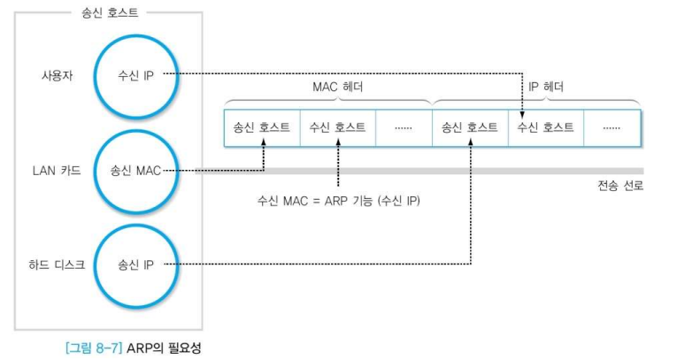

#### RARP

- Reverse Address Resolution Protocol
- **IP호스트가 자신의 물리 네트워크 주소는 알지만 IP주소를 모르는 경우, 서버로부터 IP주소를 요청하기 위해 사용**
- 필요성
  - 하드 디스크가 없는 시스템(ex. X 터미널 등)은 자신의 IP 주소를 저장할 수 없음
    - ROM에 TFTP 등 기본 프로토콜만 존재
    - 서버에서 관련 정보를 받아 메모리에 저장
  - 이 경우 자신의 HW 주소를 방송하여 RARP 서버가 알려준 IP 주소 이용
- 동작
  - 자신의 MAC 주소를 담아 방송
  - 해당 정보를 가지고 있는 RARP 서버가 응답

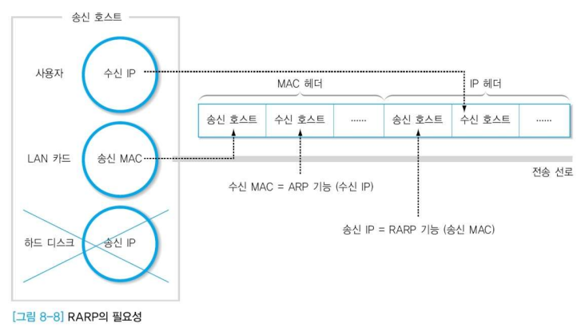

#### ICMP

- 인터넷 제어 메시지 프로토콜 Internet Control Message Protocol
- 용도
  - 인터넷/통신 상에서 발생한 일반적인 상황에 대한 보고(report)
  - 인터넷/통신 상에서 발생한 오류에 대한 보고
  - 위험한 상황에 대한 경보
- ICMP 메시지
  - ECHO REQUEST, ECHO REPLY: ping 프로그램
    - ping 명령어 : 상대방 호스트의 작동 여부 및 응답시간 측정하는데 사용
    - Echo Request : ICMP 질의메시지 요청
    - Echo Reply : ICMP 응답메시지 요청
  - DESTINATION UNREACHABLE: 수신 호스트에 접근 불가능
    - 라우팅 통해서 최대한 목적지에 가려고 했으나 시스템 상의 문제 등으로 도달이 안되면 다시 돌아감
  - SOURCE QUENCH: 네트워크에 필요한 자원 부족으로 패킷 폐기
  - TIME EXCEEDED: 시간 초과로 패킷 폐기
  - TIMESTAMP REQUEST, TIMESTAMP REPLY: 네트워크 지연 측정

- ICMP 헤더 형식
  - 처음 8 바이트는 모든 메시지에 반드시 포함됨
  - 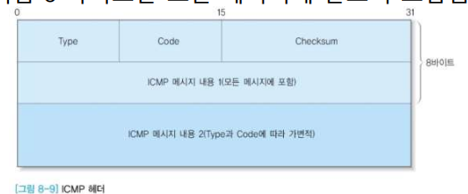
  - Type : 메시지를 구분
  - Code : 메시지 내용에 대한 자세한 정보
  - Checksum : 전체 메시지에 대한 체크섬 기능
  - ICMP 메시지 내용 1 : 메시지 종류에 따라 값이 결정됨
  - 주요 Control message
    - 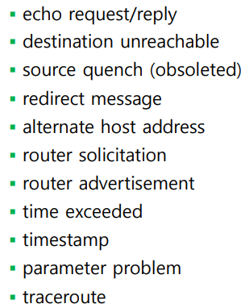
  - ICMP 메시지 내용 2
    - 오류 원인을 제공한 IP 패킷의 헤더와 이어지는 8 바이트의 정보가 포함
    - 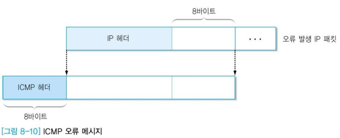

- ICMP 메시지의 전송
  - 기능적으로 IP 프로토콜과 같은 계층의 역할을 수행
  - 메시지는 IP 프로토콜에 `캡슐화`되어 전송
  - 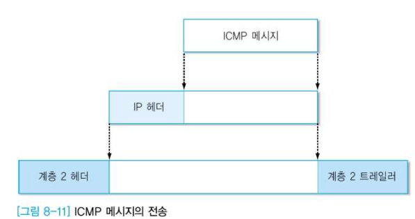

### 멀티캐스팅

- Multicasting
- 특정 그룹에 속한 모든 호스트에게 메시지를 전송하는 방식
- 멀티캐스팅을 지원하기 위한 방안
  - 다중 호스트를 표시하는 멀티캐스트 그룹 주소 표기 방법의 통일
    - IPv4, IPv6에서 이 형식 제공
  - 라우터가 멀티캐스트 주소와 이 그룹에 속하는 호스트 사이의 연관성 처리
    - 특히 동적 추가, 삭제(탈퇴) 환경 대응
    - => IGMP!
  - 효율적인 멀티캐스트 라우팅 알고리즘
    - 모든 멤버에게 전달 가능한 가장 짧은 경로 선택 방안

#### IP 멀티캐스트 주소

- 특별한 IPv4 멀티캐스팅 주소
  - 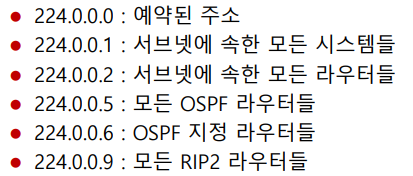

- 특별한 IPv6 멀티캐스팅 주소
  - 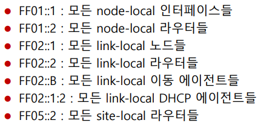

#### IGMP

- Internet Group Management Protocol
- 서브넷(로컬 네트워크) 상에서, 멀티캐스팅 멤버십 제어를 위한 `그룹 관리용 프로토콜`
- 그룹 관리
  - 순수하게 그룹만 관리하는 프로토콜
  - 그룹의 생성/제거, 그룹 참가/탈퇴
  - 라우터가 멀티캐스트 주소와 이 그룹에 속하는 호스트 사이의 연관성 처리
    - 특히 동적 추가, 삭제 환경 대응

- IGMP 헤더 형식
  - 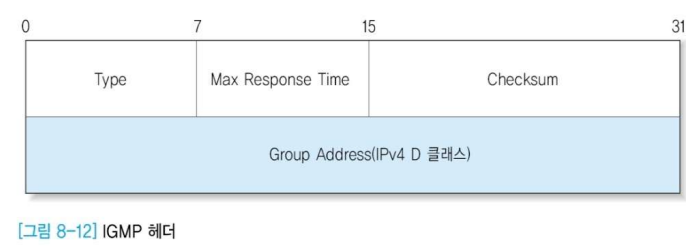
  - 질의 메시지 : 라우터에서 호스트로 전달
  - 보고 메시지 : 질의 메시지에 대한 응답으로 호스트가 회신
  - IGMP 버전 2의 메시지 형식
    - Type
      - 0x11 : 질의 메시지
      - 0x16 : 보고 메시지
      - 0x17 : 그룹 탈퇴에 관한 메시지
    - Max Response Time
      - 질의 메시지에서 사용하며 보고 메시지가 전송되어야 하는 `최대 응답 시간`
    - Checksum : IP와 동일한 방식
    - Group Address
      - 질의 메시지 : 0으로 채움
      - 보고 메시지 : 호스트(라우터)가 가입을 원하는 그룹 주소 표기
- IGMP 동작 과정

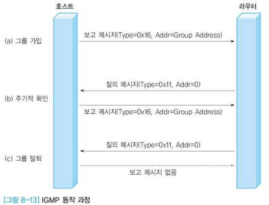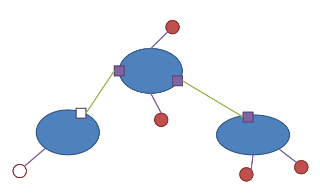

- IGMP 메시지의 전송
  - IGMP는 IP 프로토콜과 동등한 계층의 기능을 수행
  - IP 패킷에 `캡슐화`되어 전송
  - 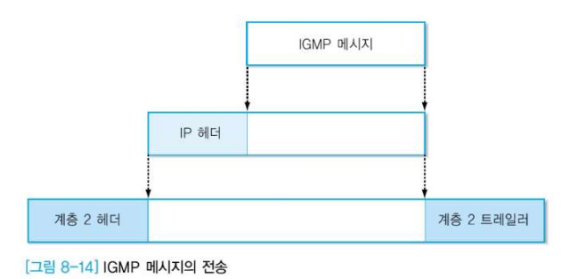

❗IGMP, ICMP 등은 데이터 전송용 프로토콜이 아니고, 네트워크 상의 이벤트 또는 변화를 알리는데 사용되는 `제어용 프로토콜`이다! 

