# 1절 전송계층 기능

**목표**

- 전송 계층 프로토콜이 제공하는 기능을 이해한다.
- 전송 계층 프로토콜을 설계하는 과정에서 고려할 사항을 이해한다.

## 전송 계층 프로토콜 개요

- 데이터 링크 계층과 유사

  - 오류 제어, 흐름 제어, 데이터 순서화 등 제공

- 데이터 링크 계층과의 차이점

  - 데이터 링크 계층 : 물리적으로 1:1 연결된 호스트 사이의 전송
  - 전송 계층 : 논리적으로 1:1 연결된 호스트 사이의 전송

  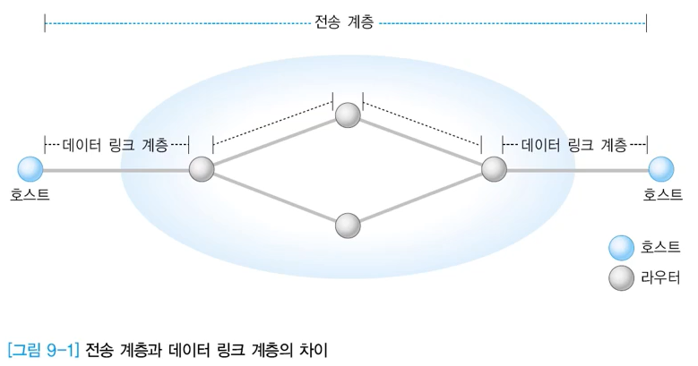

## 전송 계층의 주요 기능

- 흐름 제어
  - 계층 2와 다른 버퍼 관리 필요
  - 수신자가 송신자의 전송 속도보다 느리게 수신 -> 버퍼 용량 초과로 데이터 분실 -> 타임아웃 기능을 통한 재전송 유발
  - 방지하기 위해, 수신자가 슬라이딩 윈도우 프로토콜의 윈도우 하단 값을 조정
    - 송신자가 보낼 수 있는 패킷의 한계 설정
- 오류 제어
  - 데이터 변형, 데이터 분실 오류 시 재전송 기능으로 복구
  - 수신자의 요구(NAK) 또는 송신자의 판단(타임 아웃)
  - 각 계층의 SW 동작 과정 중에 분실하는 경우 대부분
    - 네트워크 계층의 기능적 한계
    - 잘못된 위치/경로 정보
- 분할과 병합
  - 상위 계층에서 요구한 데이터 크기가 전송 계층에서 처리할 수 있는 크기보다 큰 경우(버퍼의 크기와 개수가 연관됨)
  - 분할(Segmentation)
  - 병합(Reassembly)
- 서비스 프리미티브
  - 네트워크 계층의 경우 대부분 비연결형 서비스 프리미티브가 정의
  - 전송 계층의 경우 비연결형과 신뢰성이 향상된 연결형 서비스 모두 제공함

## 전송 계층 설계 시 고려사항

- 주소 표현

  - ex. 네트워크 계층의 호스트 IP 주소 + 전송 계층의 포트번호 조합
    - 포트 번호 : 하나의 컴퓨터에 다수의 포트 존재(통신 프로세스 구별)
  - TSAP(Transport Service Access Point)
  - 구조적 표현
    - 여러 개의 계층적 필드로 구분(각 필드는 상하 계층 관계 나타냄)
      - 대한민국:서울:한국대학교:전자과:반도체연구실:홍길동
  - 비구조적 표현
    - 값만 해석해서는 논리적인 위치 파악 불가
    - 값 자체에 위치 X, 다른 중요한 정보 담고 있는 경우
      - 반 번호, 일련 번호
  - IP 주소
    - 네트워크와 호스트의 계층적인 특성
    - 도메인 주소는 구조적 특징
      - www.korea.co.kr
    - 위치 정보와 관련해서 비구조적 특징
      - 주소를 바탕으로 위치 파악 불가

- 멀티플렉싱(Multiplexing)

  - 개별적으로 설정된 TPDU(Transport Protocol Data Unity)의 주소가 동일한 경우 하나의 가상회선에 실어보내는 것이 유리

    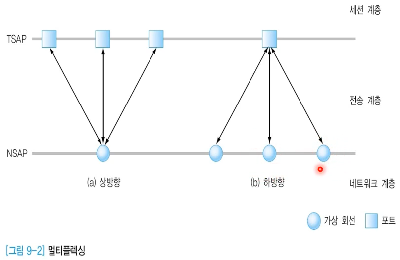

    - TSAP가 다르다는 것 : 프로세스가 다름

  - 종류

    - 상향
      - 다수의 전송 계층 연결을 하부의 네트워크 계층에서 하나의 연결로 지원
      - 서로 서비스는 다르지만 같은 호스트로 가는 것을 하나로 묶을 수 있음
      - 네트워크 계층의 가상 회선 연결의 개수를 줄일 수 있음
    - 하향
      - 하나의 전송 연결에 대하여 네트워크 계층에서 다수의 가상회선을 지원
      - 여러 개 분리도 가능. 영화를 영상, 언어별 더빙, 언어별 자막으로 나누듯이
      - 멀티미디어 전송에 유리 : 음성, 영상, 자막 등을 별도의 가상회선으로 처리

- 연결 설정

  - 개념적으로 양자 합의가 필요
    - 한쪽의 연결 설정 요구 : Conn_Req
    - 상대방의 연결 수락 응답 : Conn_Ack
  - 2단계 연결설정
    - 최소한의 단계
    - 수신단에서 거부 가능
  - 실제로 프리미티브 전달 과정에서의 분실, 변형, 복사(replay : 요청 보낼 때 몰래 복사해서 보내고 연결 설정) 가능성이 있으므로 이러한 문제들을 고려해야 함

  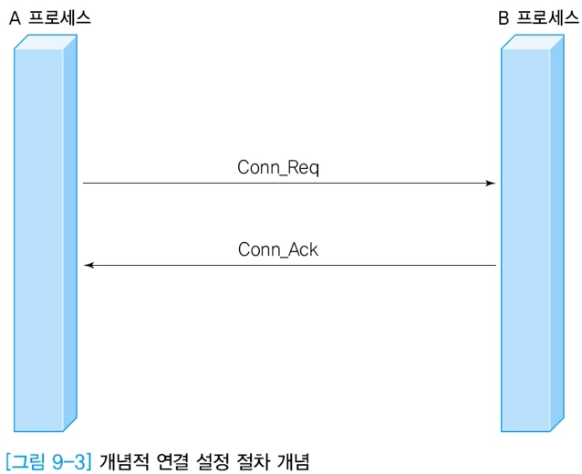

  - 3단계 설정(3-Way Handshake)

    

    - 3번째의 Data_Req는 Conn_Ack에 대한 응답과 데이터 보내는 기능을 수행함
    - 보낼 데이터가 없을 때, Conn_Ack(y,x)에 대한 응답을 따로 보내야

- 연결 해제

  - 일방적 연결 해제

    - 어느 한쪽이 Disc_req로 전체 연결 해제
    - 상대방이 송신할 데이터가 있어도 종료

    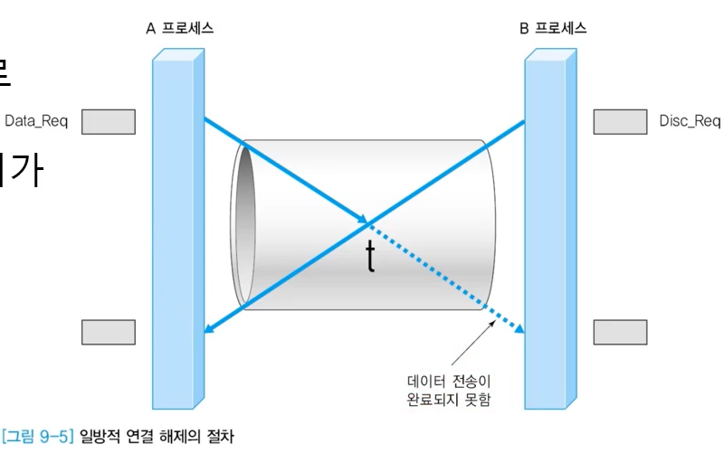

    

    - 점진적 연결 해제

      - 논리적으로 2개의 단방향 연결을 지원
      - 어느 한쪽에서 해제 요청 시 그 프로세스가 송신하는 연결만 해제
      - 양쪽 모두 Disc_req를 전송해야 해제가 됨
      - 보내는 것은 끊지만 받는 것은 계속 해야하는 상황

      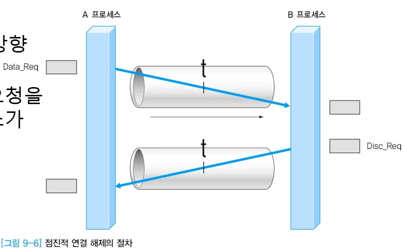

# 2절 TCP 프로토콜

**목표**

- TCP 헤더에 정의된 필드의 역할을 이해한다.
- TCP에서 사용하는 Well-known 포트를 알아본다.

## TCP 개요

- Transport Control Protocol
- 주요 기능
  - 연결형 서비스 제공
  - 전이중(full-duplex) 방식의 양방향 가상 회선 제공
  - 신뢰성 있는 데이터 전송 보장 => 오류제어, 흐름제어 등 제공함
- 전송계층 프로토콜은 운영체제 내부 기능으로 구현
- 데이터를 세그먼트(segment)라는 블록 단위로 분할하여 전송
  - 블록 크기 -> 네트워크 부하 정도, 윈도우 크기 등에 영향
  - 가변 크기
  - 세그먼트당 순서번호를 부여하지 X, 세그먼트에 실어 보내는 데이터 바이트 수를 순서번호에 반영

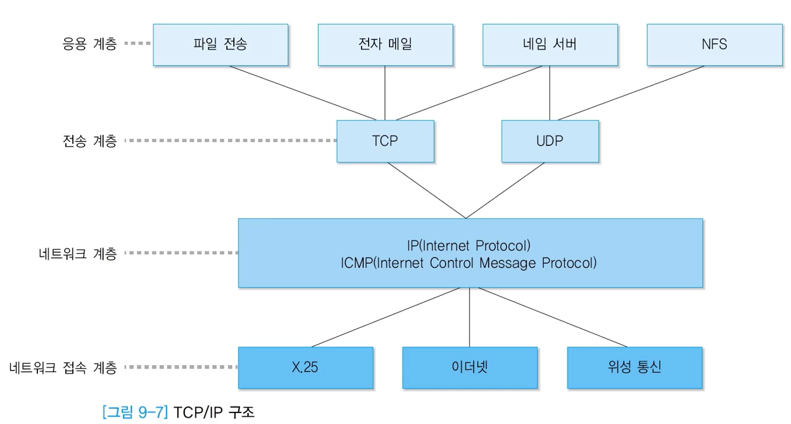

- 상위계층에서 연결형 서비스와 비연결형 서비스를 선택하여 전송 계층 프로토콜(TCP, UDP) 선택
  - 연결 유무, 신뢰성 외에도 해당 전송 계층을 선택했을 때 각 응용 프로그램에서 수행해야 하는 기능에 대해서 이해 필요(전송계층에서 해주느냐, 응용 프로그램에서 직접 해야되느냐,...)
- 데이터 링크 계층에는 다양한 네트워크 인터페이스 존재

## TCP 헤더✨ (그림 그릴 수 있어야)

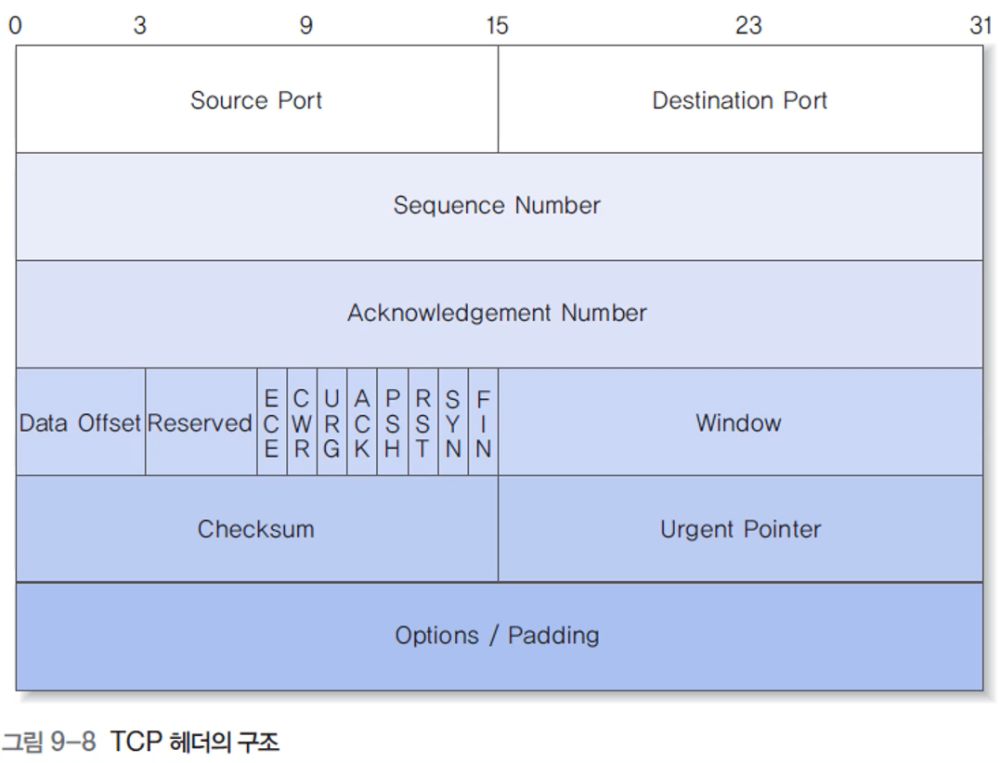

- 헤더

  - 최소 20, 최대 40 바이트

- 헤더의 필드

  - Source Port(출발지 포트번호)/Destination Port(도착지 포트번호)

    - 송수신 포트 번호
    - 범위 : 0 ~ 2^16-1 (16비트 차지하므로)

  - **Sequence Number**

    - 순서 번호(보내는 쪽)
    - 세그먼트 내의 바이트 수
    - 범위 : 0 ~ 2^32-1
    - 최초의 시작 순서번호는 임의로 설정(연결 재설정 시 혼선 방지)
      - ex. 시작번호가 항상 0이면 재설정 시 바로 전인지, 새로 시작한건지 구별 어려움

  - **Acknowledgement Number**

    - 응답 번호(다음에 받길 기대하는 순서번호)
    - ACK 플래그가 지정된 경우에 한해 유효
    - 다음에 수신하기를 원하는 데이터를 지정함
    - 연결 설정이나 연결 해제와 같이 데이터가 없는 경우에도 1씩 증가

  - Data Offset

    - 데이터가 시작하는 위치
    - TCP 헤더의 크기

  - Window

    - 수신단에서 본인이 받을 수 있는 크기 지정
    - 0이면 송신 프로세스의 전송 중지

  - Checksum

    - 헤더와 데이터에 대한 오류 검출
    - IP 프로토콜에서 사용하는 오류 검출방식 이용

  - Urgent Pointer

    - 송신 프로세스가 긴급히 처리하기를 원하는 데이터의 처리
    - RFC 6093에서 비사용 추천

  - TCP 헤더의 플래그 비트

    - 플래그 비트가 8개 정의, 처음 2개 비트는 혼잡 제어 용도로 사용

    - 나머지 6개 필드는 값이 1이면

      - URG가 1이면 : Urgent Pointer 유효

      - ACK가 1이면

        - Acknowledgement Number 유효
        - 정상적인 Piggybacking 환경(데이터와 응답을 함께 보내는 환경)에서는 연결 설정의 첫 번째 세그먼트를 제외한 모든 세그먼트에서 1(앞서 받은 것에 대한 응답)로 설정

      - PSH가 1이면

        - 현재 세그먼트의 데이터를 즉시 상위 계층에 전달하도록 지시
        - 이에 대한 **응답이 도착하면** 요청한 **모든 데이터가 상위계층에 전달되었음**을 의미

      - RST가 1이면

        - 연결의 리셋이나 유효하지 않은 세그먼트에 대한 응답(치명적인 오류상황)
        - 연결이 리셋된 후 앞서 전송했지만, 정상 응답을 받지 못한 세그먼트는 재전송

      - SYN : **연결 설정** 요청

      - FIN 

        - 점진적 방식의 **연결 종료** 요청
        - 한 방향 연결만 해제됨 -> 쌍방이 FIN을 보내야 모든 연결이 해제됨

        

## 혼잡 제어

- ECN(Excplicit Congestion Notification) 기능

  - 라우터가 송신 프로세스에 **명시적으로 혼잡 발생을 알려주어** 송신 프로세스 스스로 트래픽을 완화하는 기술

  - 양끝단이 아니라 **중간의 라우터**가 인지를 했을 때 송신단에 알려줌

    - CWR(Congestion Window Reduced)

      - ECE 비트를 수신한 송신 프로세스가 전송 윈도우 크기를 줄였음을 **통지**함
      - 혼잡이 발생해서 전송 윈도우 크기가 줄어듦

    - ECE(ECN-Echo)

      - 네트워크 트래픽이 많아질 때 라우터가 **송신 프로세스에 명시적으로 혼잡을 알리려고** 사용

      - SYN(ECN 사용 여부 표시)이 설정된 경우 ECN이 가능함을 의미

      - SYN이 설정되지 않으면 IP 헤더에 CE(Congestion Experienced) 플래그가 설정된 패킷이 수신되었음을 의미

        - ECN이 1이 되었다면 IP에 혼잡이 발생해서 처리해줘야 한다는 의미

        

## TCP 캡슐화

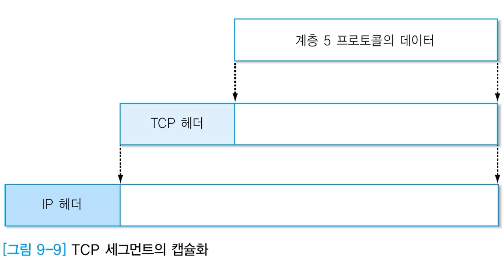

## 포트번호

- TCP, UDP 프로토콜이 상위 계층에 제공하는 주소 표현 방식
- TCP, UDP가 독립적으로 관리
  - TCP, UDP에서 동일한 번호 있을 수 있지만, 별개의 포트임
- Unix 계열의 경우 /etc/services에 저장
- 클라이언트-서버 방식에서 클라이언트는 **서버의 IP주소와 포트 번호를 알아야 통신 가능**
- Well-known 포트
  - 많이 이용하는 인터넷 서비스에 고정된 포트 번호 할당
- **서버**의 포트번호는 **Well-known** 포트번호를 이용하고
- **클라이언트**의 포트번호는 시스템에서 **임의의 포트**를 자동 할당

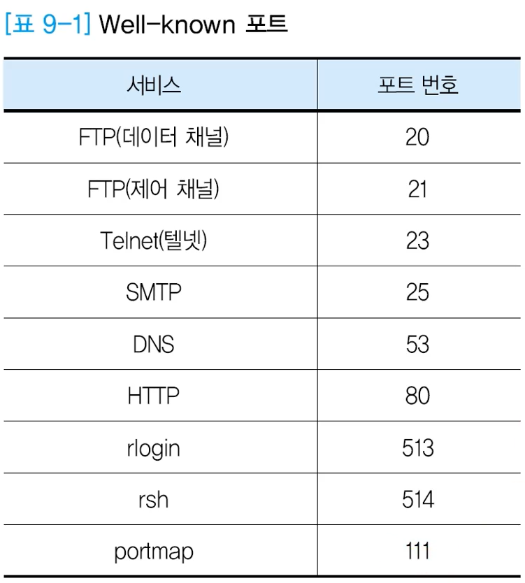

r로 시작하는 건 보안문제로 쓰지 않음

# 3절 TCP 프로토콜을 이용한 데이터 전송

**목표**

- TCP의 연결 설정, 데이터 전송, 연결 해제 과정을 이해한다.
- TCP/IP의 혼잡 제어 기능을 알아본다.

## TCP의 연결 설정

- 3 단계 설정(3-way handshake)

  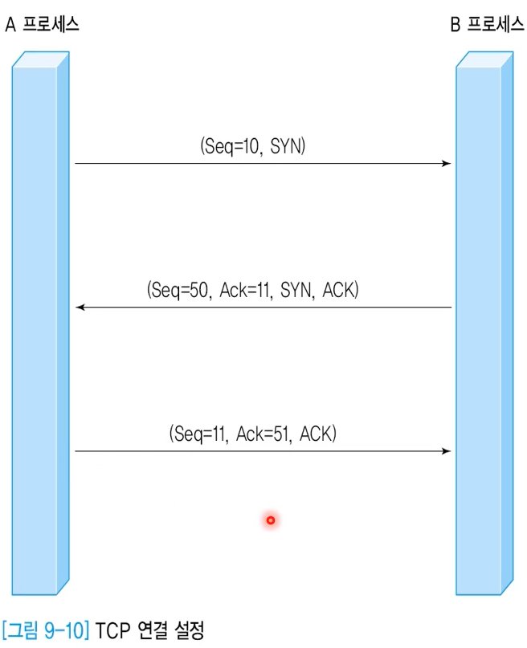

  - A 프로세스의 연결 설정 요청
    - 임의의 순서번호(10) 선택 후 SYN(연결설정 요청) 전송
  - B 프로세스의 응답
    - 10에 대한 응답(ACK)과 임의로 선택한 순서번호(50)의 SYN 전송
  - A 프로세스가 현재 보낼 데이터가 없을 때
    - 50에 대한 응답(ACK) 전송

- 정상적인 데이터 전송

  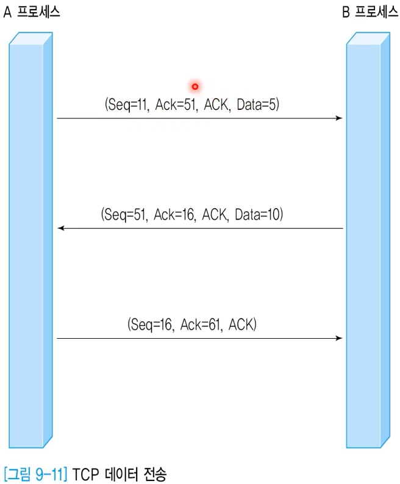

  - 3번째 연결설정 단계에서부터 데이터 전송 가능
  - 데이터 크기만큼 순서번호 증가(Seq + Data)
  - 흐름제어는 윈도우 필드 이용

- 데이터 전송 오류

  - 동일한 순서번호
    - 중복으로 판단하고 폐기
  - 순서번호가 빠지는 경우
    - 분실로 판단
  - NAK는 지원하지 않음
    - 분실 또는 변형 시 수신 프로세스는 응답하지 않고 
    - 송신 측에서 **타임아웃 기능으로 재전송**

  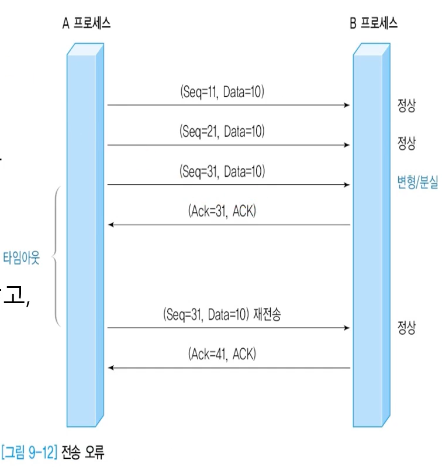

  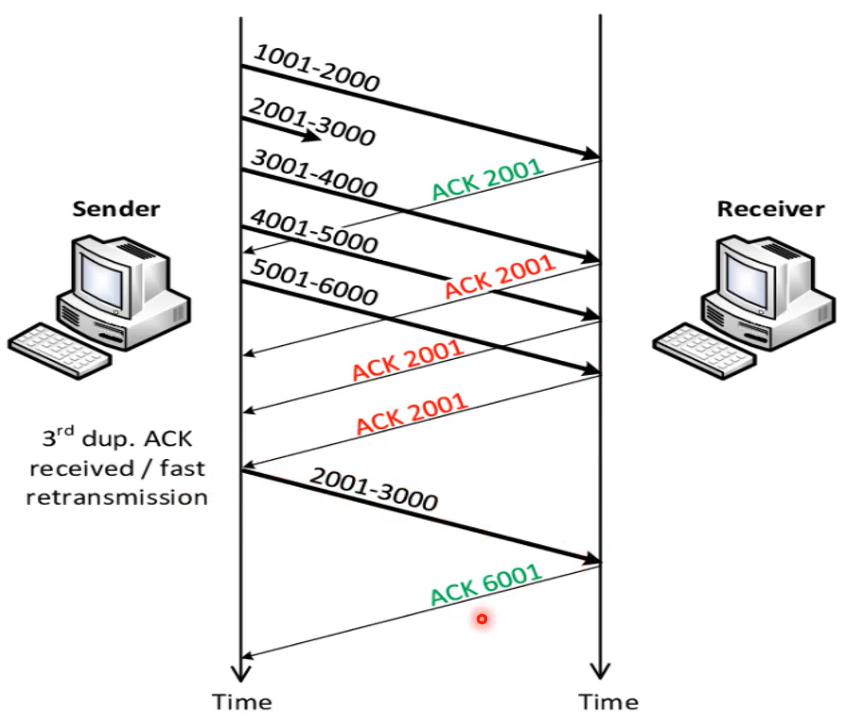

## TCP의 연결 해제

- 해제하고자 하는 측에서 FIN 전송
- FIN 수신측에서 보낼 데이터가 있을 때 계속 송신 가능함

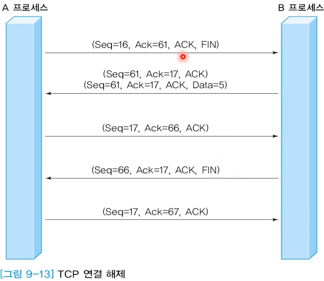

- 비정상적인 종료/연결 거부(RST 사용)

  - 원인

    - 자원 부족
    - 세션 오류
    - 이미 CLOSE 했는데, 다른 쪽이 계속 보낼 때
    - 서버가 연결 설정을 거부

    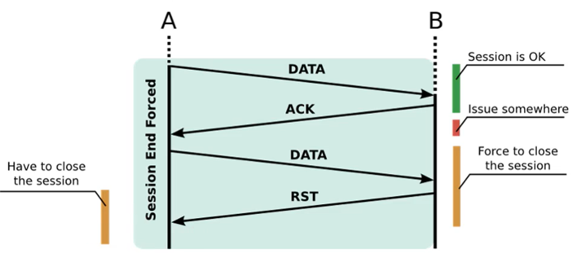

## 혼잡 제어

- ECN

  - 라우터가 송신 프로세스에 **명시적으로 혼잡 발생을 알려주어** 송신 프로세스 스스로 트래픽을 완화하는 기술

- 관련 TCP 헤더 플래그

  - CWR : 전송 윈도우 크기를 줄였음을 **송신 프로세스쪽**에서 보냄
  - ECE : **중간의 라우터**가 반대쪽에 보내 혼잡을 알림

- 관련 IP 헤더 플래그

  - ECN (2비트)

    - ECT  0과 ECT 1은 동일한 의미
    - ECN 기능을 위해 TCP 프로토콜의 헤더에 ECE 필드와 CWR 필드 추가

    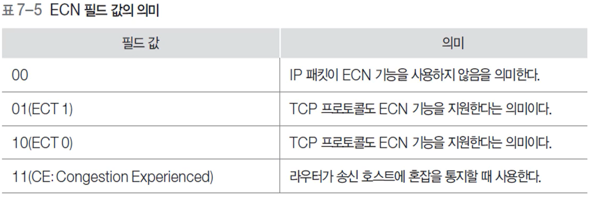

- ECN 기능 지원 여부 확인

  - 연결 설정 과정에서 SYN, CWR, ECE 설정하여 전송

    - 응답

      - ECN 기능 사용
        - (a)처럼 SYN, ACK, ECE 플래그 지정하여 응답
      - ECN 기능 사용 X
        - (b) 처럼 SYS, ACK 플래그만 지정하여 응답

      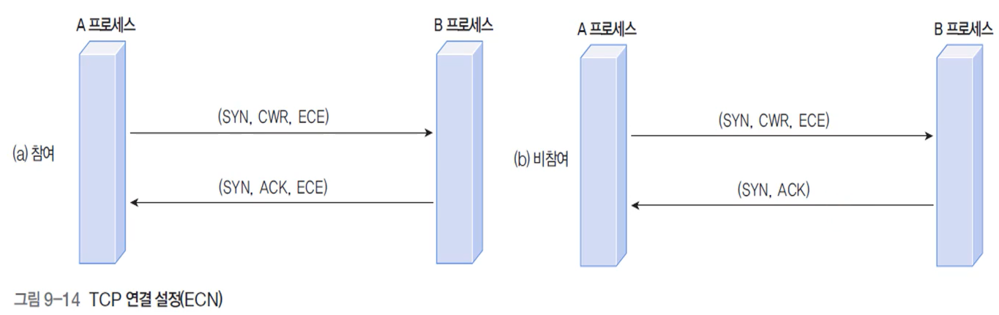

- 수신 프로세스의 중개(Echo)를 거쳐 간접적으로 송신 프로세스에 혼잡을 통지

  - 혼잡 인지한 라우터의 다음 라우터들이 ECN 기능을 반복적으로 수행하지 못하도록

  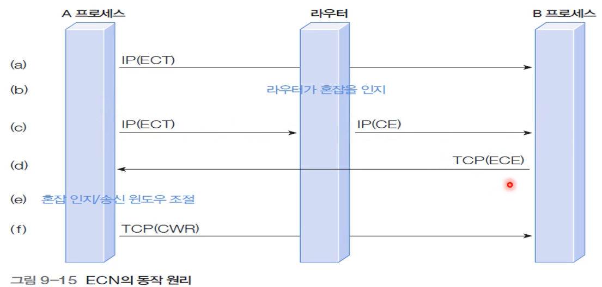

  

