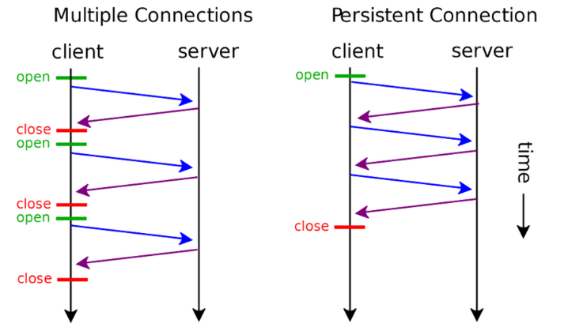
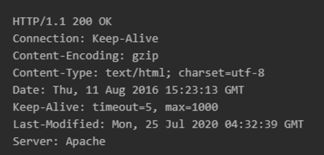
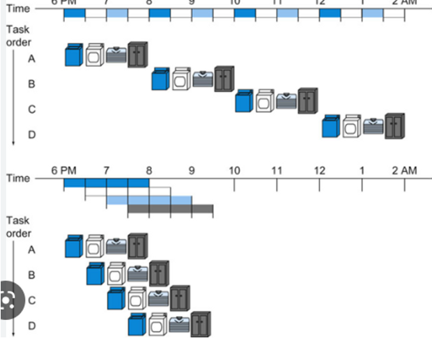
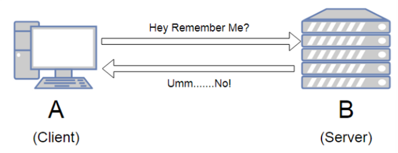
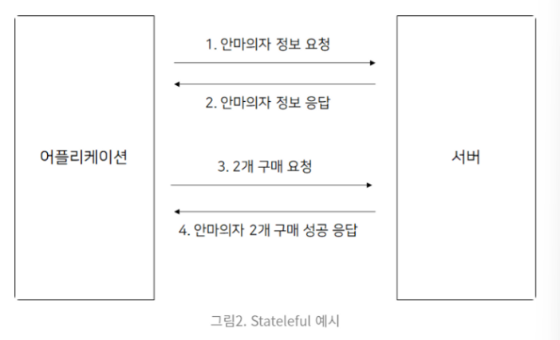
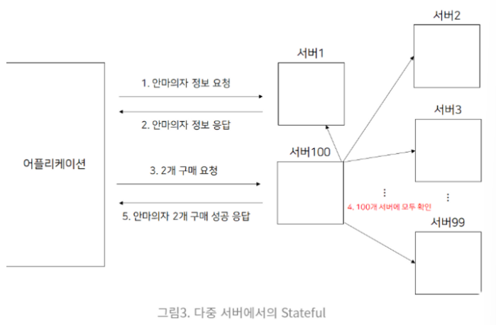
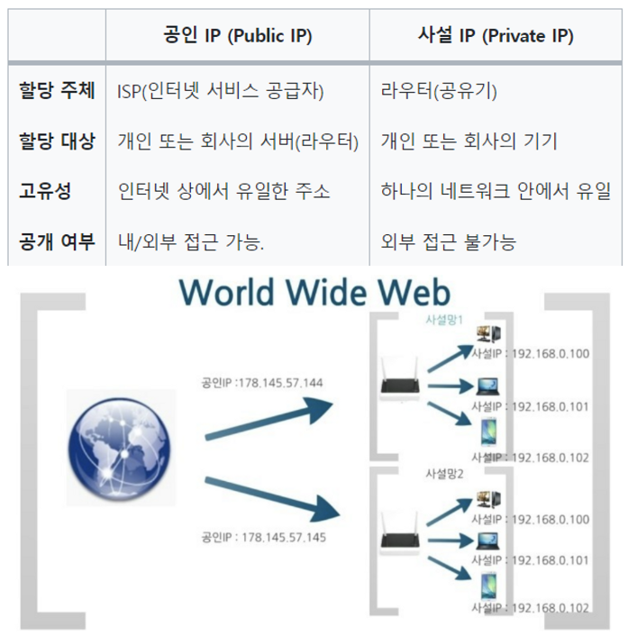
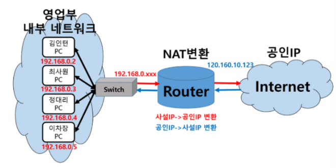

#### Q1. OSI 7계층에 대해 설명해주세요

#### Q2. TCP와 UDP는 무엇이며 차이점은 무엇인가요

#### Q3. 3 way-handshake와 4 way handshake를 설명해주세요

#### Q4. HTTP와 HTTPS의 정의와 차이점은 무엇인가요

#### Q5. HTTP1과 HTTP2에 대해 설명해주세요

#### Q6. 쿠키(Cookie)와 세션(Session)의 차이점에 대해 설명해주세요

#### Q7. CORS에 대해 설명해보세요

#### Q8. REST API가 무엇인가요

#### Q9. 웹브라우저에 www.naver.com을 입력하면 어떤 일이 일어나는지 설명해주세요

#### Q10. DNS과 DNS round robin 방식에 대해 설명해보세요.


----


#### Q11. 응답 상태코드에 대해 설명해보세요

https://developer.mozilla.org/ko/docs/Web/HTTP/Status

1. **1xx : Information responses ⇒ 요청을 받았고, 작업을 진행 중**


- `100 Continue` : 진행 중임을 나타내는 응답코드. 현재까지 진행상태에 문제가 없음
- `101 Switching Protocol` : 클라이언트에 의해 보낸 업그레이드 요청 해더에 대한 응답
- `102 Processing` : 서버가 요청을 수신하였으며 이를 처리하고 있지만, 아직 제대로 된 응답을 알려줄 수 없음

2. **2xx : Successful responses ⇒ 이 작업을 성공적으로 받았고, 이해했으며, 받아들여졌다**

- ❗`200 OK` : 요청이 성공적으로 되었음
- ❗`201 Created`: 요청이 성공적이었으며 그 결과로 새로운 리소스가 생성되었음. 일반적으로 POST 요청 또는 일부 PUT 요청 이후 따라옴
- `202 Accepted` : 요청을 수신하였지만 그에 대하여 행동할 수 없음.
- `203 Non-Authoriatative Information` : 돌려받은 메타 정보 세트가 오리진 서버의 것과 일치하지 않지만 로컬이나 서드 파티 복사본에서 모아졌음. 이러한 조건에선 이 응답이 아니라 200 OK 응답이 반드시 우선된다.
- ❗`204 No Content` : 요청에 대해서 보내줄 수 있는 콘텐츠가 없지만, 헤더는 의미있을 수 있음
- `205 Reset  Content` : 요청을 완수한 이후에 사용자 에이전트에게 이 요청을 보낸 문서 뷰를 리셋하라고 알려줌
- ❗ `206 Partial Content` : 클라이언트에서 복수의 스트림을 분할 다운로드하고자 범위 헤더를 전송했기 때문에 사용됨
- `207 Multi-Status` : 멀티-상태 응답은 여러 리소스가 여러 상태 코드인 상황이 적절한 경우에 해당되는 정보를 전달
- `208 ALREADY REPORTED` : 동일 컬렉션으로 바인드된 복수의 내부 멤버를 반복적으로 열거하는 것을 피하기 위해 사용됨
- `226 IM Used(HTTP Delta encoding)` : 서버가 GET 요청에 대한 리소스의 의무를 다했고, 그리고 응답이 하나 또는 그 이상의 인스턴스 조작이 현재 인스턴스에 적용이 되었음

3. **3xx : Reirection messages ⇒ 이 요청을 완료하기 위해서는 리다이렉션이 이루어져야 한다는 의미**

- `300 Multiple choice` : 요청에 대해서 하나 이상의 응답이 가능
- `301 Moved Permanently` : 영구적으로 컨텐츠가 이동했을 때 사용
- `302 Found` : 일시적으로 콘텐츠가 이동했을 때 사용
- `303 See other` : 서버가 사용자의 GET 요청을 처리하여 다른 URL에서 요청된 정보를 가져올 수 있도록 응답하는 코드
- `305 Use Proxy` : 프록시를 사용하지 않으면 접근할 수 없는 컨텐츠에 사용할 목적으로 만들어졌다.

4. **4xx : Client Error ⇒ 이 요청은 올바르지 않다는 의미**

- `400 BAD REQUEST` : 요청 자체가 잘못되었을 때 사용하는 코드
- `401 Unauthorized` : 인증이 필요한 리소스에 인증 없이 접근할 경우 발생. 권한 없음
- `402 Payment Required` : 결제가 필요한 리소스에 결제없이 접근했을 경우 발생
- `403 Forbidden` : 클라이언트의 인증 정보에 상관없이 페이지에 대한 접근을 거부 = 이는 해당 서버에 중요한 정보를 포함하고 있다는 것을 우회적으로 드러내는 표시
  - 메시지 자체로 보안의 취약점이 될 수 있다 ⇒ 최근에는 자세한 오류 정보를 노출시키는 대신 통합 에러 페이지를 보여주는 식의 보안 정책이 적용
- `404 Not Found` : 찾는 리소스가 없다
- `408 Request Timeout` : 요청 중 시간이 초과되었을때 사용하는 코드
- `410 Gone` : 404와는 달리 찾는 리소스가 영원히 사라진 경우 사용하는 코드

5. **5xx : Server Error ⇒ 서버가 응답할 수 없다는 의미이며, 요청이 올바른지의 여부는 알 수 없다 => 에러의 원인이 노출되는 경우 보안 사고 발생 가능성 O**

- `500 Internal Server Error` : 서버에 오류가 발생해 작업을 수행할 수 없을 때 사용
- `502 Bad Gateway` : 게이트웨이가 연결된 서버로부터 잘못된 응답을 받았을 때 사용
- `503 Service Temporarily Unavailable` : 서비스를 일시적으로 사용할 수 없을 때 사용된다. 주로 웹서버 등이 과부하로 다운되었을 때 볼 수 있다.
- `504 Gateway Timeout` : 게이트웨이가 연결된 서버로부터 응답을 받을 수 없을 때 사용

​    

----


#### Q12. GET, POS 방식의 차이점은 무엇인가요

✅ HTTP 메서드로 클라이언트에서 서버로 `무언가를 요청`할 때 사용

HTTP 메서드 : **클라이언트와 서버 사이에 이루어지는 요청(Request)과 응답(Response) 데이터를 전송하는 방식. 쉽게 말하면 서버에 주어진 리소스에 수행하길 원하는 행동, 서버가 수행해야 할 동작을 지정하는 요청을 보내는 방법**

### GET 방식

클라이언트에서 서버로 어떠한 리소스로 부터 정보를 요청하기 위해 사용되는 메서드

ex) 게시판의 게시글 조회

- GET 요청은 캐시가 가능하다.
  - 캐시 : 컴퓨터 과학에서 데이터나 값을 미리 복사해 놓는 임시 장소
    - 접근 시간에 비히 원래 데이터를 접근하는 시간이 오래 걸리는 경우(서버의 균일한 API 데이터)
    - 반복적으로 동일한 결과를 돌려주는 경우(이미지나 썸네일 등)
- GET 요청은 브라우저 히스토리에 남는다.
- GET 요청은 중요한 정보를 다루면 안된다.

### POST 방식

클라이언트에서 서버로 리소스를 생성하거나 업데이트하기 위해 데이터를 보낼 때 사용되는 메서드

ex) 게시판의 글 생성

- POST 요청은 캐시되지 않는다.
- POST 요청은 브라우저 히스토리에 남지 않는다.
- POST 요청은 데이터 길이에 제한이 없다.

❗ ***GET과 POST 의 차이점 ❗***

- **사용목적** : GET은 서버의 리소스에서 데이터를 요청할 때, POST는 서버의 리소스를 새로 생성하거나 업데이트할 때 사용한다. DB 관점으로 봤을 때 GET은 SELECT에 가깝고, POST는 Create에 가깝다고 볼 수 있다.
- **요청에 Body 유무** : GET은 URL 파라미터에 요청하는 데이터를 담아 보내기 때문에 HTTP 메시지에 body가 없다. 대신 POST는 body에 데이터를 담아 보내기 때문에 HTTP 메시지에 body가 존재한다.
- **멱등성 idempotent** : GET 요청은 멱등이고 POST는 멱등이 아니다.
  - 멱등 : 연산을 여러 번 적용하더라도 결과가 달라지지 않는 성질. GET은 리소스를 조회한다는 점에서 몇 번을 요청해도 결과가 똑같다. 하지만 POST는 리소스를 새로 생성하거나 업데이트할 때 사용되기 때문에 멱등이 아니라고 볼 수 있다.


---


#### Q13. KeepAlive에 대해 설명해보세요

서론 : HTTP는 stateless이며 connectionless ⇒ 하고 싶은 말만 하고 연결 끊어버림!

⇒ 여러 클라이언트의 접속을 원활히 하기 위해서였지만 데이터 보내는데 생각보다 비용을 많이 지불하는 경우도 많아 ⇒ 그래서 추가한 기능이 바로 **Keepalive**!!



`persistent connection` : HTTP 지속적 연결 상태, HTTP 영구 접속 또는 HTTP 킵얼라이브, HTTP 연결 재사용은 **하나의 TCP 연결을 사용하여 복수의 HTTP 요청/응답을 주고받는다**는 개념으로, 매 요청/응답 쌍마다 새로운 요청을 여는 것과는 반대되는 개념.

- HTTP/1.1에서는 디폴트로 지원하지만 HTTP/1.0에서 지속 커넥션을 사용하려면 특정 헤더를 추가해줘야 하는데, 이게 바로 

  Connection

   헤더와 

  Keepalive

  헤더이다.

  - Connection : Keep-alive

  - timeout: 유휴 연결이 계속 열려 있어야 하는 ***최소한의 시간(초 단위)***. keep-alive TCP 메시지가 전송 계층에 설정되지 않는다면 TCP 타임아웃 이상의 타임아웃은 무시된다.

  - max: 연결이 닫히기 이전에 전송될 수 있는 ***최대 요청***. 만약 0이 아니라면, 해당 값은 다음 응답 내에서 다른  요청이 전송될 것이므로 비-파이프라인 연결의 경우 무시된다. HTTP 파이프라인은 파이프라이닝을 제한하는 용도로 해당 값을 사용할 수 있다.

    

`Keepalive` : **persistent connection**을 맺는 기법 중 하나로 HTTP/1.0+부터 지원하고 있다. 디바이스간의 데이터 링크가 잘 동작하고 있는지 확인하거나 데이터 링크가 끊어지는 것을 방지하기 위해서 디바이스 간에 서로 주고받는 메시지.

💯HTTP/1.1에서 Keepalive로 인한 장점은???

- 3-way handshake로 인한 지연시간을 줄일 수 있다.
- CPU 사용량을 줄여준다 : 새로운 TCP 연결을 만들기 위해서는 CPU, 메모리 사용과 같은 많은 리소스가 필요하다. 이러한 연결된 커넥션을 재사용하기 때문에 리소스 사용을 줄여준다.
- HTTP 파이프라인 커넥션 : 여러 개의 요청을 파이프라이닝 할 수 있다.
  - 파이프라이닝 : 명령어의 데이터 경로를 세분화하고, 각기 다른 세부 단계를 동시에 수행하게 함으로써, 여러 명령어들을 중첩 수행 가능하게 만들어 성능을 향상




----


#### Q14. 무상태성에 대해 설명해보세요.

(HTTP 특징 2가지 기억해두기!!)

✅ **비연결성(connectionless)** : 요청과 응답 이후, (자동으로) 연결이 끊어지는 비상태 프로토콜

✅ **무상태성(Stateless)** : HTTP에서 서버가 클라이언트의 상태를 보존하지 않는 프로토콜



ex) 점원이(서버가) 계속 바뀌더라도 고객이 자신의 주문을 기억하고 있다면 주문은 리셋되지 않고 계속 된다. ⇒ 갑자기 고객이 증가해도 점원을 대거 투입할 수 있다!

- ex) 점원과 고객의 대화

  ```
  손님: 노트북 모델 Z의 가격은 얼마인가요?
  직원A: 100만원입니다.
  
  손님: 노트북 모델 Z를 2개 구매하겠습니다.
  직원B: 200만원입니다. 카드로 결제하시나요, 현금으로 결제하시나요?
  
  손님: 노트북 모델 Z 2대를 카드로 결제하겠습니다.
  직원C: 총 200만원 결제되었습니다. 감사합니다.
  ```

⇒ 클라이언트가 서버에게 request를 보낼 때마다 추가 데이터를 계속 보내야 한다는 점이 있지만 항상 같은 서버에 연결될 필요가 없으므로 scale up(기존 서버의 사양을 업그레이드해 시스템을 확장)에 유리하다!

- ❓중요한 이유 : 서버가 확장 가능해야 하기 때문!!! 서버의 개수가 많아지면 그만큼 정보를 많이 공유해야 하기 때문에 비싸질 수 밖에 없는데, stateless하게 사용하면 정보 공유가 최소화되어 비용 절감이 가능하다.

------

❗상태성(Stateful) : HTTP에서 서버가 클라이언트의 상태를 보존하는 프로토콜 ⇒ 같은 클라이언트에게 항상 같은 서버가 응답해야 하므로 스케일 업을 기대할 수 없다(서버가 context를 보존해야 하기 때문)

- ex) 점원과 고객의 대화

  손님 : 이 갤럭시 S22는 얼마인가요?

  점원A : 100만원 입니다.

  손님 : 이 갤럭시 S23은요?

  점원A : 이전 모델보다 50만원 더 비쌉니다.

  손님 : 이걸로 두 개 구입할게요.

  점원A : 300만원입니다. 현금인가요 카드인가요?

  손님 : 카드요

  점원A : 할부 몇 개월 필요하세요 ? ……..






---


#### Q15. 공인 IP와 사설 IP 차이에 대해 설명해주세요

- `공인 IP`(Public IP) :  ISP(인터넷 서비스 공급자, ex. KT, SKT, LG U+ 등)가 제공하는 IP 주소이며, 외부에 공개되어 있는 IP 주소 ⇒ ***공용 IP 주소***
- `사설 IP`(Private IP) : 일반 가정이나 회사 내 등에 할당된 네트워크 IP 주소이며, IPv4의 주소부족으로 인해 서브넷팅된 IP이기 때문에 라우터(공유기)에 의해 로컬 네트워크상의 PC나 장치에 할당됨. ⇒ ***로컬 IP, 가상 IP***



- 사설 IP 주소만으로는 인터넷에 직접 연결할 수 없고, 라우터를 통해 1개의 공인 IP를 할당하고, 라우터에 연결된 개인 PC는 사설 IP를 각각 할당 받아 인터넷에 접속 할 수 있습니다.
- ✅ **공인 IP는 전 세계에서 유일하지만, 사설 IP는 하나의 네트워크 안에서 유일하다.**
- ✅ **공인 IP는 외부, 내부 상관없이 해당 IP에 접속할 수 있으나, 사설 IP는 내부에서만 접근이 가능하다.**

❗NAT : 네트워크(**인터넷) 주소 번역** (**Network Adress Translation). IP 패킷의 TCP/UDP 포트 숫자와 소스 및 목적지의 IP 주소 등을 재기록하면서 라우터를 통해 네트워크 트래픽을 주고 받는 기술**



라우터에 연결된 [192.168.0.xxx](http://192.168.0.xxx) 사설 IP 주소를 받아와 공인 IP로 변환해준다. ⇒ 공인 IP로 연결된 인터넷을 통해 어떤 작업을 하고 다시 라우터를 통해 해당 사설 IP로 변환된다.

***NAT 사용 이유***

1. 기업체 등에서 사설 네트워크에 속한 여러 개의 호스트가 하나의 공인 IP 주소를 사용하여, 여러 명이 동시에 인터넷에 접속하기 위함
2. 내부 네트워크에서 사용하는 IP 주소와 외부에 드러나는 주소를 다르게 유지할 수 있기 때문에 내부 네트워크에 대한 어느 정도의 보안 기능 ⇒ 방화벽과 비슷한 기능

***BUT…***  여러 명이 동시에 인터넷을 접속하게 되므로, 실제로 접속하는 호스트 숫자에 따라서 접속 속도가 느려질 수 있다!