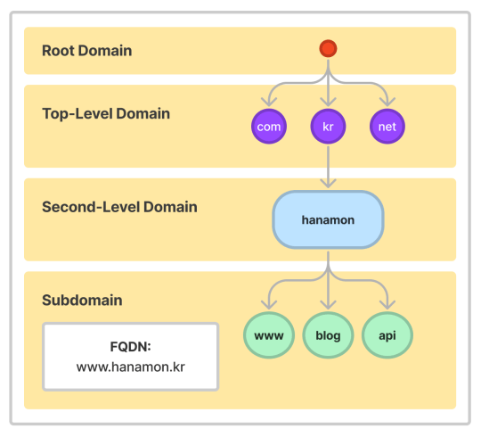
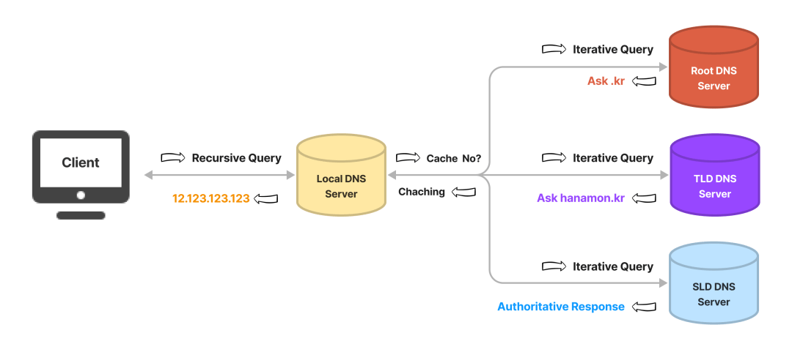
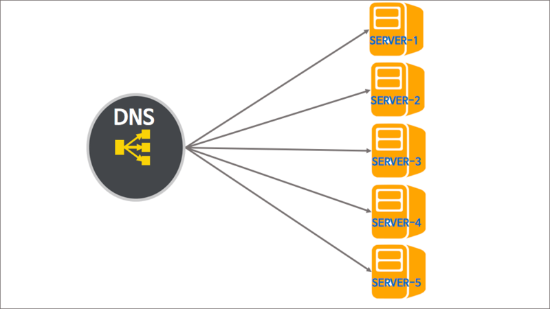

# Q10. DNS에 대해 설명해주세요.

## 정의

- Domain Name System의 약자로, Domain name을 실제 네트워크 상에서 사용되는 IP 주소로 바꿀 수 있도록 도와주는, 거대한 분산 시스템을 의미한다.

## 구성 요소

### 도메인 네임 스페이스(Domain Name Space)

- DNS가 저장 관리하는 계층적 구조를 의미한다.
- 최상위에 루트 DNS 서버가 존재하고 그 하위로 연결된 모든 노드가 연속해서 이어진 계층 구조로 되어있다.
- 계층적 도메인 레벨(Hierarchical Domain Level)
  - 도메인 네임 스페이스의 트리 구조는 최상위 레벨부터 순차적으로 계층적 소속 관계를 나타낸다.
  - 하위 조직의 네임 스페이스를 할당하고 관리하는 방식은 각 하위 기관의 관리 책임자에게 위임된다.
  - 예를들어 [hanamon.kr](https://hanamon.kr/) 도메인은 kr 도메인을 관리하는 네임 서버에 등록되어있고 [www.hanamonr.kr](http://www.hanamonr.kr/) 은 [hanamon.kr](https://hanamon.kr/) 을 관리하는 네임 서버에 등록되어있다.
  - blog.hanamon.kr을 생성하기 위해서는 [hanamon.kr](https://hanamon.kr/) 도메인을 관리하는 네임 서버의 레코드만을 수정함으로써 가능하다.
  - 이러한 위임 구조는 호스트의 증가에 대한 관리가 효율적으로 이루어지는 것을 가능하게 한다.
  - [hanamon.kr](https://hanamon.kr/) 은 kr 도메인을 관리하는 네임 서버에 등록되어있는데 해당 하위 기관은 가비아로 되어있다.
  - 하나몬은 [www.hanamon.kr](http://www.hanamon.kr/) 을 만들기 위해서 가비아에 가서 도메인 레코드에 하위 도메인을 추가하면 된다. (가비아가 하위 기관이다.)
  - (그래서 AWS 같은 호스팅에서 가비아에서 구매한 도메인을 사용하려한다면 route53에 생성된 네임서버를 가비아 도메인에 추가해야한다. “해당 도메인에 대한 IP 주소를 route53 네임서버에서 찾으시오”같은 것이다. route53에서는 해당 인스턴스나 버킷 등으로 연결되어있다.)
  - (또는 카페24 같은 호스팅에서 가비아에서 구매한 도메인을 사용하려한다면 카페24의 네임 서버를 가비아 도메인에 추가해야한다. “해당 도메인에 대한 IP 주소를 카페24 네임서버에서 찾으시오” 같은 것이다. 그리고 카페24에도 해당 도메인을 연결한다. “카페24에 추가가 가능하군요 추가하겠음, 그리고 사용중인 호스팅에 연결하세요”하면 끝난다.)
- Fully Qualified Domain Name(FQDM) 전체 도메인 이름
  - 도메인의 전체 이름을 표기하는 방식
    - 도메인 이름: [hanamon.kr](https://hanamon.kr/)
    - 호스트 이름: www
    - FQDN : [www.hanamon.kr](http://www.hanamon.kr/)

### 네임 서버(Name Server) =  권한 있는 DNS 서버

- 문자열로 표현된 도메인 이름을 실제 컴퓨터가 통신할 때 사용하는 IP 주소로 변환시키기 위해서는 도메인 네임 스페이스의 트리 구조에 대한 정보가 필요한데 이러한 정보를 가지고 있는 서버를 네임 서버라고 한다.
- 데이터베이스 역할(저장, 관리), 찾아주는 역할, 요청 처리 응답 구현
- 전 세계에 13개의 Root DNS 서버가 구축되어 있다. (패킷의 실질적인 크기 제한으로 인해 루트 DNS 서버 수를 13개 서버 주소로 제한하도록 결정되었다고한다.)
- 그리고 DNS 서버를 복사하여 같은 기능을 담당하는 미러 서버가 있다고 한다.

1. Root DNS 서버

   - ICANN이 직접 관리하는 절대 존엄 서버이다.
   - TLD DNS 서버 IP 주소를 저장하고 안내하는 역할을 한다.

2. Top-Level Domain(TLD) DNS 서버

   - 도메인 등록 기관이 관리하는 서버이다.
   - Authoritative DNS 서버의 주소를 저장하고 안내하는 역할을 한다.
   - 도메인 판매 업체(가비아 등)의 DNS 설정이 변경되면 도메인 등록 기관으로 전달되기 때문에 어떤 도메인이 어떤 판매업체(가바이 등)에서 구매했는지 알수 있는 것이다.

3. Second-Level Domain(SLD) DNS 서버 (Authoritative DNS 서버 라고도 함)

   - 실제 개인 도메인과 IP 주소의 관계가 기록(저장, 변경)되는 서버이다.
   - 그래서 권한의 의미인 Authoritative가 붙었다. 일반적으로 도메인/호스팅 업체의 네임서버를 말한다.
   - 개인 DNS 구축해도 이 경우에 해당한다.

4. 권한 없는 DNS 서버 (리졸버 서버, 리컬시브 서버, 리커서)

   - DNS 서버는 도메인 네임 스페이스를 위한 권한 있는 DNS 서버와 권한이 없는 DNS 서버로 구분된다.
   - 위 1,2,3은 권한 있는 DNS 서버이다.
   - 네임 스페이스를 위한 권한 있는 DNS 서버는 IP 주소와 도메인 이름을 매핑한다.
   - 네임 스페이스를 위한 권한 없는 DNS 서버는 질의를 통해 IP 주소를 알아내거나 캐시한다.

   

### 리졸버(Resolver) = 권한 없는 DNS 서버

- 리졸버는 웹 브라우저와 같은 DNS 클라이언트의 요청을 네임 서버로 전달하고 네임 서버로부터 정보(도메인 이름과 IP 주소)를 받아 클라이언트에게 제공하는 기능을 수행한다.

- 이 과정에서 리졸버는 하나의 네임 서버에게 DNS 요청을 전달하고 해당 서버에 정보가 없으면 다른 네임 서버에게 요청을 보내 정보를 받아온다.

- 이렇듯 리졸버는 수많은 네임서버에 접근하여 사용자로부터 요청 받은 도메인의 IP 정보를 조회하는 기능을 수행한다.

- 하지만 리졸버에 기능을 단말에 구현하는 것은 자원의 한계가 있기에 대부분 기능을 DNS 서버에 구현하고 클라이언트 호스트는 리졸버의 단순한 기능만을 지닌 리졸버 루틴을 구현하는 옵션이 제시되어있다.

- 이러한 단순화된 기능의 리졸버를 스터브 리졸버(Stub Resolver)라고 하며,
  스터브 리졸버는 수 많은 네임 서버의 구조를 파악할 필요없이 리졸버가 구현된 DNS 서버의 IP 주소만 파악하면 된다.

- 클라이언트 호스트에서 설정하는 DNS 서버(Recursive DNS Server)는 이와 같은 서버를 의미하는 것으로,
  도메인에 대한 질의를 받은 스터브 리졸버는 설정된 DNS 서버로 DNS Query(질의)를 전달하고
  DNS 서버로부터 최종 결과를 응답 받아 웹 브라우저로 전달하는 인터페이스 기능만을 수행한다.

## 동작과정

1. 웹 브라우저에 www.naver.com을 입력한다.
2. 웹 브라우저는 이전에 방문한적 있는지 찾는다.
   - 브라우저 캐시 확인
   - OS 캐시 확인
   - 라우터 캐시 확인
   - ISP 캐시 확인 (Recursive DNS Server)
3. ISP에서 DNS Iterative하게 쿼리를 날린다.
   - ISP: internet service provider KT/ SKT/LG U+ ...
4. ISP는 Authoritative DNS 서버에서 최종적으로 IP 주소를 응답받는다.
5. ISP는 해당 IP 주소를 캐시한다.
6. 웹 브라우저에게 응답한다.

## DNS Query(쿼리)란?

- DNS 클라이언트와 DNS 서버는 DNS 쿼리를 교환한다.

- DNS 쿼리는 Recursive(재귀적) 또는 Iterative(반복적)으로 구분된다.

### Recursive Query (재귀적 질의)

- 결과물(IP 주소)를 돌려주는 작업이다. (결과적으로 Recursive 서버가 Recursive 쿼리를 웹 브라우저 등에게 돌려주는 역할을 한다.)
- Recursive 쿼리를 받은 Recursive 서버는 Iterative 하게 권한 있는 네임 서버로 Iterative 쿼리를 보내서 결과적으로 IP 주소를 찾게 되고 해당 결과물을 응답한다.
- 사전적 의미로써 재귀로, 응답을 돌려주는 쿼리라고 생각하자.

### Iterative Query (반복적 질의)

- Recursive DNS 서버가 다른 DNS 서버에게 쿼리를 보내어 응답을 요청하는 작업이다.
- Recursive 서버가 권한 있는 네임 서버들에게 반복적으로 쿼리를 보내서 결과물(IP 주소)를 알아낸다.
- Recursive 서버에 이미 IP 주소가 캐시 되어있다면 이 과정은 건너 뛴다.

## Round Robin DNS

### 정의

- 별도의 소프트웨어 혹은 하드웨어 로드밸런싱 장비를 사용하지 않고 DNS 만을 이용하여 도메인 레코드 정보를 조회하는 시점에서 트래픽을 분산하는 기번이다. 

### 원리

- 웹 서비스를 담당할 여러 대의 웹 서버는 자신의 공인 IP를 각각 가지고 있다. 
- 웹 사이트에 접속을 원하는 사용자가 해당 도메인 주소를 브라우저에 입력하면, DNS는 도메인의 정보를 조회하는 데, 
- 이때 IP 주소를 **여러 대의 서버 IP 리스트 중에서 라운드 로빈 형태로 랜덤하게 하나 혹은 여러개를 선택하여 다시 사용자에게 알려준다.**  
- 결과적으로 웹 사이트에 접속하는 다수의 사용자는 실제로는 복수의 웹 서버에 나뉘어 접속하게 되면서 자연스럽게 서버의 부하가 분산되는 방식이다.

- DNS의 조회 결과로 1개의 IP만 DNS 결과로 조회되는 경우도 있지만 최근의 라운드 로빈 DNS 방식은 복수의 IP를 모두 (순서를 정해서) 제공하고 클라이언트로 하여금 선택하도록 한다.

### 단점

- 일반적인 로드밸런싱(load balancing)은 뒤 단에 있는 백 엔드 서버들의 헬스 체크(health check) 정보를 수반하지만, 라운드 로빈 DNS는 로드밸런싱 기능이 없기에 별도의 헬스 체크가 없다. 따라서 특정 웹 서버에 문제가 생겨 서비스가 불가한 상태라 하더라도, DNS는 이를 알 방법이 없고, 해당 서버의 공인 IP를 도메인 조회 결과에 포함시키기 때문에 **HA(High Availability) 용도로는 적합하지 않다. 이것이 라운드 로빈 DNS의 최대 단점이다.**
  - Health-check:  *서버*에 일정한 간격으로 신호를 보내고 응답이 오는지 *체크*하여 정상 가동 중인지를 판단

참고 자료

https://hanamon.kr/dns%EB%9E%80-%EB%8F%84%EB%A9%94%EC%9D%B8-%EB%84%A4%EC%9E%84-%EC%8B%9C%EC%8A%A4%ED%85%9C-%EA%B0%9C%EB%85%90%EB%B6%80%ED%84%B0-%EC%9E%91%EB%8F%99-%EB%B0%A9%EC%8B%9D%EA%B9%8C%EC%A7%80/

https://m.blog.naver.com/techtrip/221691155719
