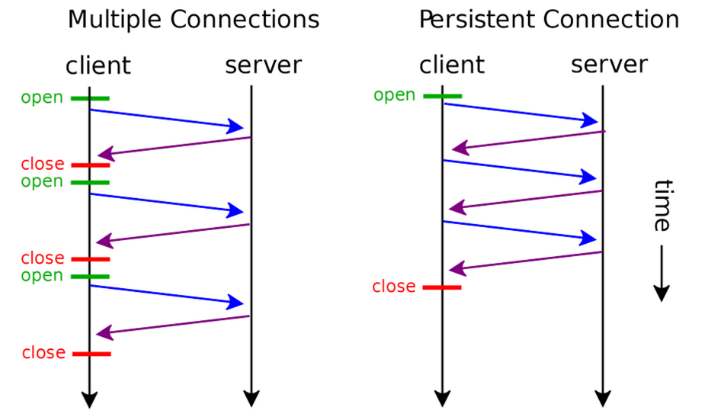
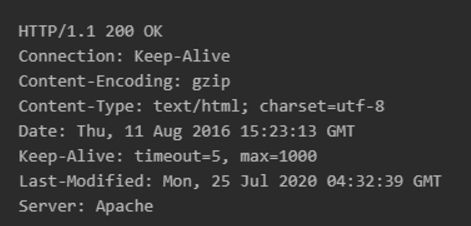
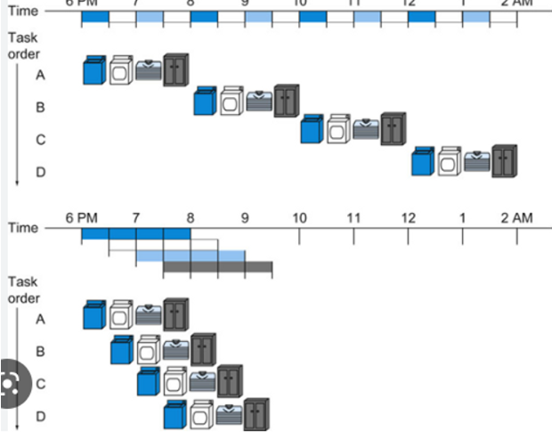

#### Q13. KeepAlive에 대해 설명해보세요

서론 : HTTP는 stateless이며 connectionless ⇒ 하고 싶은 말만 하고 연결 끊어버림!

⇒ 여러 클라이언트의 접속을 원활히 하기 위해서였지만 데이터 보내는데 생각보다 비용을 많이 지불하는 경우도 많아 ⇒ 그래서 추가한 기능이 바로 **Keepalive**!!

`persistent connection` : HTTP 지속적 연결 상태, HTTP 영구 접속 또는 HTTP 킵얼라이브, HTTP 연결 재사용은 **하나의 TCP 연결을 사용하여 복수의 HTTP 요청/응답을 주고받는다**는 개념으로, 매 요청/응답 쌍마다 새로운 요청을 여는 것과는 반대되는 개념.

- HTTP/1.1에서는 디폴트로 지원하지만 HTTP/1.0에서 지속 커넥션을 사용하려면 특정 헤더를 추가해줘야 하는데, 이게 바로 

  Connection

   헤더와 

  Keepalive

  헤더이다.

  - Connection : Keep-alive

  - timeout: 유휴 연결이 계속 열려 있어야 하는 ***최소한의 시간(초 단위)***. keep-alive TCP 메시지가 전송 계층에 설정되지 않는다면 TCP 타임아웃 이상의 타임아웃은 무시된다.

  - max: 연결이 닫히기 이전에 전송될 수 있는 ***최대 요청***. 만약 0이 아니라면, 해당 값은 다음 응답 내에서 다른  요청이 전송될 것이므로 비-파이프라인 연결의 경우 무시된다. HTTP 파이프라인은 파이프라이닝을 제한하는 용도로 해당 값을 사용할 수 있다.

    

`Keepalive` : **persistent connection**을 맺는 기법 중 하나로 HTTP/1.0+부터 지원하고 있다. 디바이스간의 데이터 링크가 잘 동작하고 있는지 확인하거나 데이터 링크가 끊어지는 것을 방지하기 위해서 디바이스 간에 서로 주고받는 메시지.

💯HTTP/1.1에서 Keepalive로 인한 장점은???

- 3-way handshake로 인한 지연시간을 줄일 수 있다.
- CPU 사용량을 줄여준다 : 새로운 TCP 연결을 만들기 위해서는 CPU, 메모리 사용과 같은 많은 리소스가 필요하다. 이러한 연결된 커넥션을 재사용하기 때문에 리소스 사용을 줄여준다.
- HTTP 파이프라인 커넥션 : 여러 개의 요청을 파이프라이닝 할 수 있다.
  - 파이프라이닝 : 명령어의 데이터 경로를 세분화하고, 각기 다른 세부 단계를 동시에 수행하게 함으로써, 여러 명령어들을 중첩 수행 가능하게 만들어 성능을 향상

