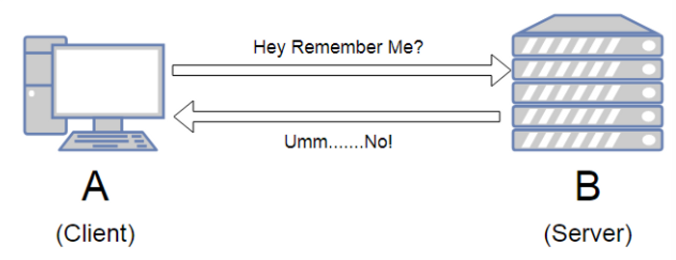
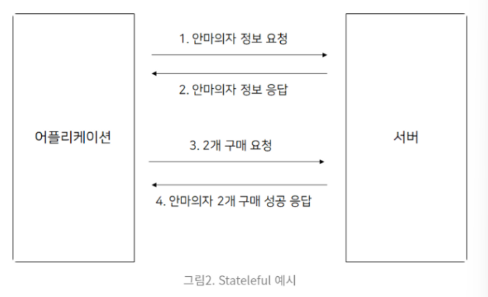
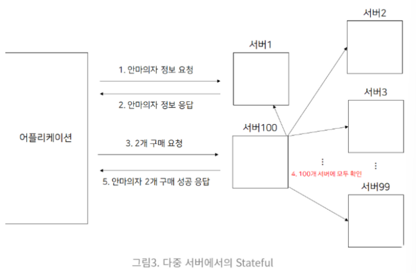
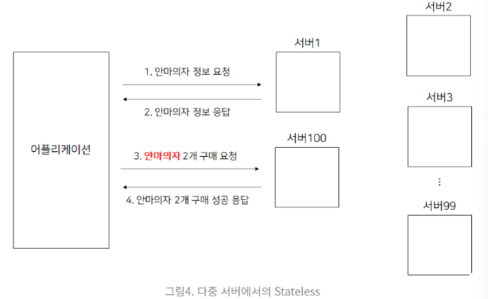

#### Q14. 무상태성에 대해 설명해보세요.

(HTTP 특징 2가지 기억해두기!!)

✅ **비연결성(connectionless)** : 요청과 응답 이후, (자동으로) 연결이 끊어지는 비상태 프로토콜

✅ **무상태성(Stateless)** : HTTP에서 서버가 클라이언트의 상태를 보존하지 않는 프로토콜



ex) 점원이(서버가) 계속 바뀌더라도 고객이 자신의 주문을 기억하고 있다면 주문은 리셋되지 않고 계속 된다. ⇒ 갑자기 고객이 증가해도 점원을 대거 투입할 수 있다!

- ex) 점원과 고객의 대화

  ```
  손님: 노트북 모델 Z의 가격은 얼마인가요?
  직원A: 100만원입니다.
  
  손님: 노트북 모델 Z를 2개 구매하겠습니다.
  직원B: 200만원입니다. 카드로 결제하시나요, 현금으로 결제하시나요?
  
  손님: 노트북 모델 Z 2대를 카드로 결제하겠습니다.
  직원C: 총 200만원 결제되었습니다. 감사합니다.
  ```

⇒ 클라이언트가 서버에게 request를 보낼 때마다 추가 데이터를 계속 보내야 한다는 점이 있지만 항상 같은 서버에 연결될 필요가 없으므로 scale up(기존 서버의 사양을 업그레이드해 시스템을 확장)에 유리하다!

- ❓중요한 이유 : 서버가 확장 가능해야 하기 때문!!! 서버의 개수가 많아지면 그만큼 정보를 많이 공유해야 하기 때문에 비싸질 수 밖에 없는데, stateless하게 사용하면 정보 공유가 최소화되어 비용 절감이 가능하다.

------

❗상태성(Stateful) : HTTP에서 서버가 클라이언트의 상태를 보존하는 프로토콜 ⇒ 같은 클라이언트에게 항상 같은 서버가 응답해야 하므로 스케일 업을 기대할 수 없다(서버가 context를 보존해야 하기 때문)

- ex) 점원과 고객의 대화

  손님 : 이 갤럭시 S22는 얼마인가요?

  점원A : 100만원 입니다.

  손님 : 이 갤럭시 S23은요?

  점원A : 이전 모델보다 50만원 더 비쌉니다.

  손님 : 이걸로 두 개 구입할게요.

  점원A : 300만원입니다. 현금인가요 카드인가요?

  손님 : 카드요

  점원A : 할부 몇 개월 필요하세요 ? ……..








