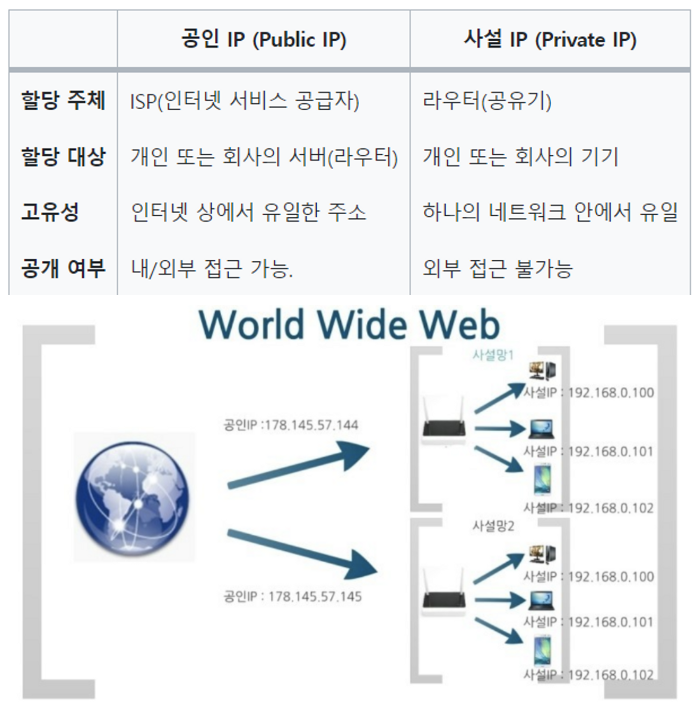
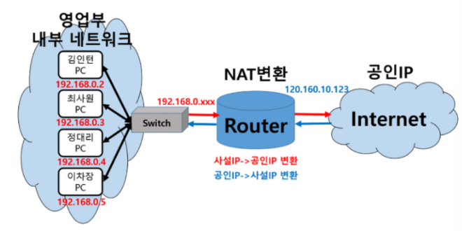

#### Q15. 공인 IP와 사설 IP 차이에 대해 설명해주세요

- `공인 IP`(Public IP) :  ISP(인터넷 서비스 공급자, ex. KT, SKT, LG U+ 등)가 제공하는 IP 주소이며, 외부에 공개되어 있는 IP 주소 ⇒ ***공용 IP 주소***
- `사설 IP`(Private IP) : 일반 가정이나 회사 내 등에 할당된 네트워크 IP 주소이며, IPv4의 주소부족으로 인해 서브넷팅된 IP이기 때문에 라우터(공유기)에 의해 로컬 네트워크상의 PC나 장치에 할당됨. ⇒ ***로컬 IP, 가상 IP***

- 사설 IP 주소만으로는 인터넷에 직접 연결할 수 없고, 라우터를 통해 1개의 공인 IP를 할당하고, 라우터에 연결된 개인 PC는 사설 IP를 각각 할당 받아 인터넷에 접속 할 수 있습니다.
- ✅ **공인 IP는 전 세계에서 유일하지만, 사설 IP는 하나의 네트워크 안에서 유일하다.**
- ✅ **공인 IP는 외부, 내부 상관없이 해당 IP에 접속할 수 있으나, 사설 IP는 내부에서만 접근이 가능하다.**

❗NAT : 네트워크(**인터넷) 주소 번역** (**Network Adress Translation). IP 패킷의 TCP/UDP 포트 숫자와 소스 및 목적지의 IP 주소 등을 재기록하면서 라우터를 통해 네트워크 트래픽을 주고 받는 기술**

라우터에 연결된 [192.168.0.xxx](http://192.168.0.xxx) 사설 IP 주소를 받아와 공인 IP로 변환해준다. ⇒ 공인 IP로 연결된 인터넷을 통해 어떤 작업을 하고 다시 라우터를 통해 해당 사설 IP로 변환된다.

***NAT 사용 이유***

1. 기업체 등에서 사설 네트워크에 속한 여러 개의 호스트가 하나의 공인 IP 주소를 사용하여, 여러 명이 동시에 인터넷에 접속하기 위함
2. 내부 네트워크에서 사용하는 IP 주소와 외부에 드러나는 주소를 다르게 유지할 수 있기 때문에 내부 네트워크에 대한 어느 정도의 보안 기능 ⇒ 방화벽과 비슷한 기능

***BUT…***  여러 명이 동시에 인터넷을 접속하게 되므로, 실제로 접속하는 호스트 숫자에 따라서 접속 속도가 느려질 수 있다!
