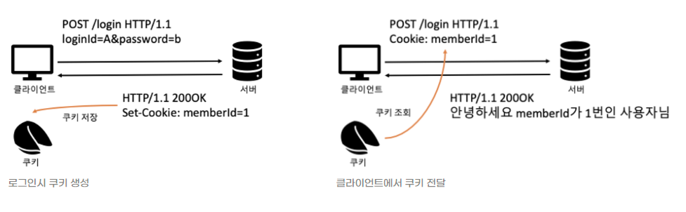
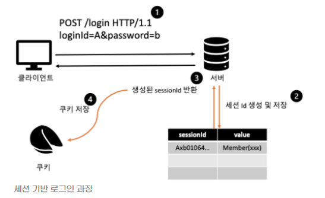

# Q6. 쿠키(Cookie)와 세션(Session)의 차이점에 대해 설명해주세요.

## 배경지식

### 쿠키와 세션을 사용하는 이유?

- HTTP 프로토콜의 특징인 **Connectionless(비연결성)**,  **Stateless(비상태성)** 때문이다.

  - **Connectionless**: 클라이언트가 서버에 요청(request)를 했을 때, 그 요청에 맞는 응답(response)을 보낸 후 연결을 끊는 처리방식이다.
    - keep-alive는 예외
  - **Stateless**: 커넥션을 끊는 순간 클라이언트와 서버의 통신이 끝나며 상태 정보를 유지하지 않는 특성이 있다. 
  - 이는 서버의 자원을 절약하기 위해 모든 사용자의 요청마다 연결과 해제의 과정을 거치기 때문에 연결 상태가 유지되지 않고 연결 해제 후에 상태 정보가 저장되지 않는다는 것이다.

  - 그러나, 이전의 ***상태 정보를 유지할 필요가 있는 경우가 있다.***
    - 로그인, 장바구니
    - 정보가 유지되지 않으면 페이지를 이동할 때마다 로그인을 해야하고, 구매하려 했던 구매 목록이 사라지게 된다.

- 그래서 이러한 stateful 한 상황을 대처하기 위해 쿠키와 세션을 사용한다.

## 쿠키(Cookie)

### 정의

- 사용자가 어떤 웹 사이트를 방문할 경우, 그 사이트가 사용하고 있는 **서버에서 사용자의 컴퓨터에 저장하는 작은 기록 정보 파일**이다. 
- HTTP에서 클라이언트의 상태 정보를 클라이언트 PC에 저장하였다가 필요시 참고하거나 재사용할 수 있다. 
- 쿠키의 데이터 형태는 key와 value로 구성되고 string 형태로 이루어져 있다.

### 특징

- 이름, 값, 만료일(저장기간), 경로 정보로 구성되어 있다. 
- 클라이언트에 총 300개의 쿠키를 저장할 수 있다.
- 하나의 도메인 당 20개의 쿠키를 가질 수 있다.
- 하나의 쿠키는 4KB(=4096byte)까지 저장 가능하다.

### 동작 순서

1. 클라이언트가 페이지를 요청한다.(사용자가 웹사이트에 접속한다.)
2. 웹 서버는 쿠키를 생성한다.
3. 생선한 쿠키에 정보를 담아 HTTP 화면을 돌려줄 때, 같이 클라이언트에게 돌려준다.
4. 넘겨받은 쿠키는 클라이언트가 가지고 있다가(로컬 PC에 저장) 다시 서버에 요청할 때 요청과 함께 쿠키를 전송한다.
5. 동일 사이트 재방문 시 클라이언트의 PC에 해당 쿠키가 있는 경우, 요청 페이지와 함께 쿠키를 전송한다.

### 사용 목적

- 세션 관리(Session Management)
  - 로그인, 사용자 닉네임, 접속 시간, 장바구니 등의 서버가 알아야할 정보들을 저장한다.
- 개인화(Personalization)
  - 사용자마다 다르게 그 사람에 적절한 페이지를 보여줄 수 있다
- 트래킹(Tracking)
  - 사용자의 행동과 패턴을 분석하고 기록한다.

- 사용 예시
  - '오늘 이 창을 다시 보지 않기'
  - '아이디와 비밀번호를 저장하시겠습니까?'

### 단점

- 방문했던 웹 사이트에 대한 정보 및 개인정보가 기록되기 때문에 사생활을 침해할 소지가 있으며, 이를 해소하기 위해 웹 브라우저 자체에 쿠키 거부 기능이 있다.
- 서버가 가지고 있는 것이 아니라 사용자에게 저장되기 때문에, 임의로 고치거나 지울 수 있고, 가로채기도 쉬워 보안이 취약하다. 
  - 실제로 javascript의 `document.cookie`로 쿠키에 접근이 가능하다. 이는Cross-site scripting(XSS)라고 하는 공격에 매우 취약하다.
    - XSS:  악의적인 사용자가 공격하려는 사이트에 스크립트를 넣는 기법을 말한다. 공격에 성공하면 사이트에 접속한 사용자는 삽입된 코드를 실행하게 되며, 보통 의도치 않은 행동을 수행시키거나 쿠키나 세션 토큰 등의 민감한 정보를 탈취한다.
  - 이러한 공격을 방지하기 위해 `HttpOnly Cookie` 라는 것이 있는 데, 이는 자바스크립트의 document.cookie로 접근할 수 없으며 서버에 전송되기만 한다.
  - 이외에도 HTTPS 프로토콜 상에서 암호화된 요청일 경우에만 요청되는 `secure cookie`도 있다. 
- 이러한 단점을 보완해주는 것이 **세션**이다.

## 세션(Session)

![[Spring] 세션(Session)이란? (개념 / 특징 / 사용법) - undefined - undefined - 서론](assets/img.png)

### 정의

- 일정 시간 동안 같은 사용자(브라우저)로부터 들어오는 일련의 요구를 하나의 상태로 보고, 그 상태를 유지시키는 기술이다.
- 여기서 일정 시간은 방문자가 웹 브라우저를 통해 웹 서버에 접속한 시점부터 웹 브라우저를 종료하여 연결을 끝내는 시점을 말한다.
- 즉, **방문자가 웹 서버에 접속해 있는 상태**를 하나의 단위로 보고 그것을 **세션**이라고 한다.

### 특징

- 웹 서버에 웹 컨테이너의 상태를 유지하기 위한 정보를 저장한다.
- 웹 서버의 저장되는 쿠키(=세션 쿠키)
- 브라우저를 닫거나, 서버에서 세션을 삭제했을 때만 삭제가 되므로, 쿠키보다 비교적 보안이 좋다.
- 저장 데이터에 제한이 없다(서버 용량이 허용하는 한에서)
- 각 클라이언트에 고유 Session ID를 부여한다. Session ID로 클라이언트를 구분해 각 요구에 맞는 서비스를 제공한다.

### 동작 순서

1. 클라이언트가 페이지에 요청한다. (사용자가 웹사이트에 접근)
2. 서버는 접근한 클라이언트의 Request-Header 필드인 Cookie를 확인하며, 클라이언트가 해당 session-id를 보냈는지 확인한다.
3. session-id가 존재하지 않는다면 서버는 session-id를 생성해 클라이언트에게 돌려준다.
4. 서버에서 클라이언트로 돌려준 session-id를 쿠키를 사용해 클라이언트에 저장한다.
5. 클라이언트는 재접속 시, 이 쿠키를 이용해 session-id 값을 서버에 전달한다.

### 사용 예시

- 화면을 이동해도 로그인이 풀리지 않고 로그아웃하기 전까지 유지

### 쿠키와 세션의 차이⭐

- **정보가 저장되는 위치**
  - 쿠키는 서버의 자원을 전혀 사용하지 않으며, 
  - 세션은 서버의 자원을 사용한다.
- **보안**
  - 쿠키는 클라이언트 로컬에 저장되기 때문에 변질되거나 request에서 스니핑 당할 우려가 있어 보안에 취약하지만
  - 세션은 쿠키를 이용해서 session-id만 저장하고 그것으로 구분하여 서버에서 처리하기 때문에 비교적 보안성이 높다.
- **라이프 사이클**
  - 쿠키도 만료기간이 있지만 파일로 저장되기 때문에 브라우저를 종료해도 정보가 유지될 수 있다. 또한 만료 기간을 따로 지정해 쿠키를 삭제할 때까지 유지할 수도 있다.
  - 세션도 만료 기간을 따로 정할 수 있지만, **브라우저가 종료되면 만료기간에 상관없이 삭제된다**.
- 속도
  - 쿠키는 쿠키에 정보가 있기 때문에 서버에 요청 시 속도가 빠르고
  - 세션은 정보가 서버에 있기 때문에 처리가 요구되어 비교적 느린 속도를 낸다.

## 쿠키를 사용한 로그인 처리

## 세션을 사용한 로그인 처리

참고 자료

https://developer.mozilla.org/ko/docs/Web/HTTP/Cookies

https://devuna.tistory.com/23

https://dev-coco.tistory.com/61

https://jeongkyun-it.tistory.com/105
