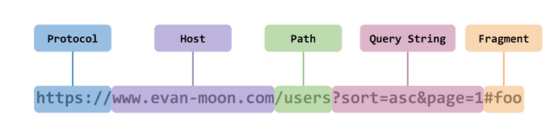

# Q7. CORS에 대해 설명해주세요

## 정의

- **CORS(Cross-Origin Resource Sharing)**란 직역하면 교차 출처 리소스 공유로, 즉 <u>서로 다른(Cross) 출처(Origin) 간에 자원(resource)을 공유(sharing)</u>한다는 것을 의미한다.

- `출처(Origin)` 란 무엇일까?

  

  - 출처란 `Protocol`, `Host`, `Port` 를 모두 합친 것을 의미한다.
    - 출처 내의 포트 번호는 생략이 가능한데, 이는 각 웹에서 사용하는 HTTP, HTTPS 프로토콜의 기본 포트 번호가 :80, :443 등으로 정해져 있기 때문이다.

## 배경 지식

- `SOP(Same-Origin-Policy)`
  - RFC 6454에서 처음 등장한 보안 정책으로, 말 그대로 <u>같은 출처에서만 리소스를 공유할 수 있다</u> 라는 규칙을 가진 정책이다.
  - 이러한 정책 때문에 원래는 같은 출처에서만 리소스 공유가 가능하지만, CORS라는 예외 사항을 두어 다른 출처에서 정보를 읽도록 선택할 수 있다.

## 같은 출처와 다른 출처의 구분?

- 두 URL의 구성 요소 중 `Scheme`, `Host`, `Port` 이 세가지만 동일하면된다.
- 예를 들어 `https://naver.com:80`가 출처라 한다면, `https://`라는 스킴에 `naver.com`이라는 호스트를 가지고 `:80` 포트를 사용하고 있는 것만 같다면 나머지는 전부 다르더라도 같은 출처로 인정된다는 것이다.
- 만약 실제 CORS 로 등록된 출처가 `https://naver.com`으로 되어 있을 때, 스킴이나 호스트는 명시되어 있기 때문에 하나라도 다르다면 같은 출처로 인정되지 않는다. 그러나 포트 번호는 명시되어 있지 않기 때문에 이를 처리하는 것은 브라우저마다 다르다.

## 사실 CORS는 서버에서 관리하는 것이 아니다..?

- 이렇게 출처를 비교하는 로직은 서버에 구현된 스펙이 아니라 브라우저에 구현되어 있다. 
- 만약 CORS 정책을 위반하는 리소스 요청을 하더라도 해당 서버가 같은 출처에서 보낸 요청만 받겠다는 로직을 가지고 있는 경우가 아니라면 서버는 정상적으로 응답을 하고, 이후 브라우저가 이 응답을 분석해서 CORS 위반이라고 판단되면 그 응답을 사용하지 않고 그냥 버리는 순서인 것이다.
- 그렇기 때문에 브라우저를 통하지 않고 서버 간 통신을 할 때는 이 정책이 적용되지 않는다. 또한 CORS 정책을 위반하는 리소스 요청 때문에 에러가 발생했다고 해도 서버 쪽 로그에는 정상적으로 응답했다는 로그만 남는다.

## 동작 방법

1. 클라이언트 측에서 다른 출처의 리소스를 요청할 때는 HTTP 프로토콜을 사용하여 요청을 보내게 되는데, 이때 브라우저는 요청 헤더에 `Origin`이라는 필드에 요청을 보내는 출처를 함께 담아 보낸다.

2. 서버가 이 요청에 대한 응답을 할 때 응답 헤더의 `Access-Control-Allow-Origin`이라는 값에 이 리소스에 접근하는 것이 허용된 출처를 내려준다.

3. 브라우저는 자신이 보냈던 요청의 `Origin`과 서버가 보내준 응답의 `Access-Control-Allow-Origin`을 비교해본 후 이 응답이 유효한 응답인지 아닌지 결정한다.

실제로는 이보다 조금 더 복잡하다. 이는 참고자료를 통해 확인하도록 하자.

- 해결 방법

  - 서버에서 'Access-Control-Allow-Origin'  헤더에 알맞은 값을 세팅해주는 것이다.

참고 자료

https://evan-moon.github.io/2020/05/21/about-cors/
