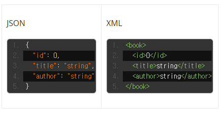

# Q8. REST API에 대해 설명해주세요.

## REST, REST API란?

- **Representational State Transfer**라는 용어의 약자로, 직역하면 표현적인 상태 전송이라는 의미인데, 여기서의 표현적인 상태라 하면 JSON과 같은 결과물을 의미하는 것 같다. 실제로 서버에 있던 데이터를 JSON과 같은 형태로 표현(represent)하여 전송하기 때문에 이러한 이름을 갖게 된 것이 아닌가 추측한다.

  - JSON: JavaScript Object Notation (JSON) is a standard text-based format for representing structured data based on JavaScript object syntax.
  - 즉,  자바스크립트 객체 문법을 기반으로 구조화된 데이터를 "represent"된 텍스트 기반의 표준 형식을 의미한다.

  

  - 실제로 저렇게 표현된 결과물을 JSON representation, XML representation이라고 부르는 듯하다. 

- <u>자원의 이름으로 해당 자원의 상태를 주고 받는 모든 것</u>을 의미한다.

  - HTTP URI(Uniform Resource Idenfier)를 통해 자원(Resource)를 명시하고
  - HTTP Method(POST, GET, PUT, DELETE, PATCH 등)를 통해
  - 해당 자원(URI)에 대한 CRUD Operation을 적용하는 것을 의미한다.
    - Create : 데이터 생성(POST)
    - Read : 데이터 조회(GET)
    - Update : 데이터 수정(PUT, PATCH)
    - Delete : 데이터 삭제(DELETE)

## 왜 RESTful 한 API를 만드는 것인가?

- RESTful APIs 개발하는 가장 큰 이유는 **Client Side를 정형화된 플랫폼이 아닌 모바일, PC, 어플리케이션 등 플랫폼에 제약을 두지 않는 것을 목표로 했기 때문이다.**
- 즉, 2010년 이전만 해도 Server Side에서 데이터를 전달해주는 Client 프로그램의 대상은 PC 브라우저로 그 대상이 명확 했다. 그렇다 보니 그냥 JSP ASP PHP 등을 잉요한 웹페이지를 구성하고 작업을 진행하면 됐다.
- 하지만 스마트 기기들이 등장하면서 TV, 스마트 폰, 테블릿 등 Client 프로그램이 다양화 되고 그에 맞춰 Server를 일일이 만든다는 것이 꽤 비효율적인 일이 되어 버렸다.
- 이런 과정에서 개발자들은 Client Side를 전혀 고려하지 않고 메시지 기반, XML, JSON과 같은 **Client에서 바로 객체로 치환 가능한 형태의 데이터 통신을 지향하게 되면서 Server와 Client의 역할을 분리하게 되었다.**

## 구성요소

- **자원(Resource)**
  - **HTTP URI**
  - 서버에 존재하는 데이터의 총칭. 모든 자원은 고유의 URI(URL)을 가지며 클라이언트는 이 URI를 지정하여 해당 자원에 대한 CRUD 명령을 수행할 수 있다
- **행위(Verb)**
  - **HTTP Method**
  - 클라이언트가 HTTP Method를 이용하여 자원을 조작하는 것을 의미한다.
- **표현(Representations)**
  - **HTTP Message Payload**
  - HTTP Method로 자원을 조작하면 서버가 그에 대한 응답(**JSON**, XML)을 보내주는데 그것을 의미한다.

## 특징

- 서버-클라이언트의 구조(Server-Client Architecture)
  - 서버는 API 제공, 클라이언트는 유저에 대한 처리를 전담하는 구조를 가지기 때문에 클라이언트의 역할을 분명하게 구분할 수 있다.
- 무상태성(Stateless)
  - HTTP를 이용하는 만큼 Stateless의 특성을 지녔다. 각각의 요청에 대한 정보를 저장하지 않고 별개의 요청으로 처리한다. 덕분에 구현이 쉽고 서버의 부담을 덜어줄 수 있다.
- 캐시 가능(Cacheable)
  - HTTP 를 사용하기 때문에 웹의 기본 인프라를 사용할 수 있다. 따라서 캐시 기능을 통해 같은 URI에 대한 반복된 요청을 효율적으로 처리할 수 있다.
  - 캐시: 자주 사용하는 데이터나 값을 미리 복사해 놓은 임시 저장 공간. 반복적으로 데이터를 불러오는 경우에, 지속적으로 DBMS 혹은 서버에 요청하는 것이 아니라 Memory에 저장해두었다가 불러다 쓰는 것을 의미한다.
- 일관된 인터페이스(Uniform Interface)
  - HTTP를 사용할 수 있는 환경이라면 플랫폼에 상관없이 사용할 수 있으며 리소스 타입에 상관없이 같은 형태의 요청으로 처리된다.
- 자체적인 표현 구조(Self-Descriptiveness)
  - JSON, XML 등을 이용하는 메세지 구조로 해당 메세지가 무엇을, 어떤 행위를 의미하는지 직관적으로 이해할 수 있다.
- 계층 구조(Layered System)
  - 클라이언트는 대상 서버와 직접 통신하는지 아니면 중간 서버와 통신하는지 알 수 없다. 따라서 클라이언트와 서버의 통신 사이에는 보안이나 로드 밸런싱 등을 위한 중간 계층을 추가할 수 있다.

## REST 장단점

- 장점
  - 별도의 인프라를 구축할 필요가 없다
    - HTTP를 사용하기 떄문에 별도의 인프라를 구축할 필요가 없다.
  - 클라이언트와 서버의 분리
    - 클라이언트와 서버는 REST API를 통해 정보를 주고 받기 떄문에 둘 간의 역할이 명확하게 분리된다.
  - 플랫폼에 독립적
    - HTTP를 사용 가능한 환경이라면 플랫폼에 상관없이 사용 가능하다.
  - 쉬운 사용
    - 메세지가 자체적으로 무엇을 의미하는지 표현하고 있기 때문에 사용이 쉽다.
- 단점
  - 표준이 존재하지 않다.
    - 명확한 표준이 존재하지 않는다.
  - HTTP Method의 한계
    - HTTP Method를 사용하기 떄문에 CRUD라는 단순한 행위의 Method만 지원한다.
  - RDBMS와 맞지 않음
    - REST에서는 리소스를 JSON, XML 등의 형태로 표현하는데, 이는 RDBMS와는 맞지 않는 형태다. 그래서 key value를 사용하는 NoSQL이 더 선호된다.

## 규칙

- 중심 규칙

  - URI는 정보의 자원을 표현해야 한다
  - 자원에 대한 행위는 HTTP Method (GET, POST, PUT, DELETE 등)으로 표현한다

- 세부 규칙

  1. 슬래시 구분자 ( / )는 계층 관계를 나타내는데 사용한다.

  2. URI 마지막 문자로 슬래시 ( / )를 포함하지 않는다.

     - 즉 URI에 포함되는 모든 글자는 리소스의 유일한 식별자로 사용되어야 하며 URI가 다르다는 것은 리소스가 다르다는 것이고, 역으로 리소스가 다르면 URI도 달라져야 한다.

  3. 하이픈 ( — )은 URI 가독성을 높이는데 사용한다.

  4. 밑줄 ( _ )은 URI에 사용하지 않는다.

  5. URI 경로에는 소문자가 적합하다.

     - URI 경로에 대문자 사용은 피하도록 한다.

  6. 파일확장자는 URI에 포함하지 않는다.

     - REST API 에서는 메시지 바디 내용의 포맷을 나타내기 위한 파일 확장자를 URI 안에 포함시키지 않는다.
     - 대신 Accept Header 를 사용한다.
     - ex) `GET`: `http://restapi.exam.com/orders/2/Accept: image/jpg`

  7. 리소스 간에 연관 관계가 있는 경우

     - /리소스명/리소스ID/관계가 있는 다른 리소스 명

     - ex) GET: /users/2/orders (일반적으로 소유의 관계를 표현할 때 사용)

참고자료

https://khj93.tistory.com/entry/%EB%84%A4%ED%8A%B8%EC%9B%8C%ED%81%AC-REST-API%EB%9E%80-REST-RESTful%EC%9D%B4%EB%9E%80

https://velog.io/@somday/RESTful-API-%EC%9D%B4%EB%9E%80

https://mangkyu.tistory.com/69

https://levi45.medium.com/rest-api-%EB%9E%80-3c81a10cb993

