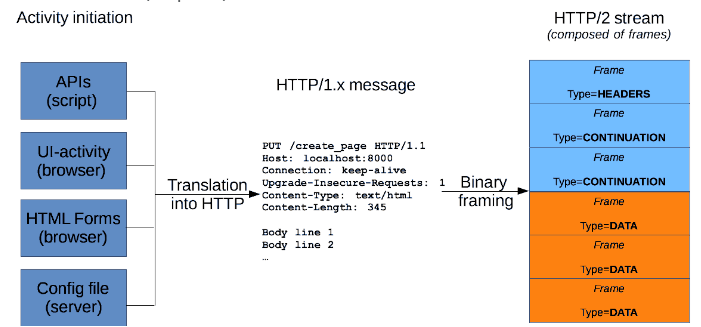

# Q9. 웹 브라우저에 www.naver.com을 입력하면 어떤 일이 일어나는지 설명해주세요.

## 1. 사용자 입력

- 사용자가 주소창에 원하는 키워드를 입력한다.

- 만약 해당 키워드가 url의 형식을 띄고 있다면 해당 주소의 페이지를 요청할 것이고

- 그게 아니라면, 사용하고 있는 브라우저의 기본 검색엔진을 통해 해당 키워드를 검색할 것이다. 

## 2. 웹페이지 URL

- 브라우저는 위와 같은 형식으로 입력되면 웹 페이지 URL이라 인식하여 이 도메인 네임에 대한 IP 주소를 요청하러 간다.

- 이때, 우리가 protocol 부분을 따로 입력하면 `http`, `https` 로 요청하겠지만, `naver.com`처럼 프로토콜 부분을 생략하고 바로 도메인 부분을 입력하게 되면 기본적으로 https로 요청한다.

## 3. 도메인 네임 요청 & IP 주소 획득

- 입력받은 URL에 포함된 domain name을 통해 IP 주소를 획득해야 하는데, 그 떄 변환 요청을 보내는 곳이 바로 Domain Name System, DNS라 한다.

- DNS에 도메인 네임을 전달하여 IP 주소를 받아온다.

  

## 4. HTTP 요청 메시지 전달과 TCP 요청

- 가져온 IP 주소를 토대로 페이지를 요청한다.

- 이 때 HTTP request를 보내게 되고 이때의 요청 메시지가 아래에 나온 그림과 같다.

  

  

- 우리의 HTTP 요청 메시지가 tcp 통신을 이용해 네이버 서버에 요청을 하게 된다.

## 5. 서버 측에서 HTTP 응답 메세지 전송

- HTTP 요청을 받은 서버측에서 응답을 보낸다.

  

## 6. 사용자 출력

- 이렇게 받은 html 문서를 브라우저에 넣어준다.

- 그럼 이제 브라우저가 반환 받은 html 데이터를 파싱하고 처리한다.

- html을 파싱해서 DOM 트리를 구축하고 다른 한 편으로는 CSS 파일 링크를 찾아 CSS 파일을 받아오고 CSS 오브젝트 모델을 만들고 이 둘을 사용해 렌더 트리를 만든다.

- 렌더 트리를 이용해서 각각의 노드들의 위치를 지정하는 레이아웃 과정을 거치고 최종적으로 화면에 paint 한다.

참고 자료

https://amunre21.github.io/web/1-site-works/
