### 운영체제의 기능

#### CPU 스케줄링

CPU 이용률을 극대화하기 위해서는 멀티프로그래밍(multiprogramming)이 필요하다. BUT CPU core가 하나라면 한 번에 하나의 프로세스만이 실행 가능하기 때문에 이때 필요한 것이 **CPU 스케줄링**이다!

✅작업을 처리하기 위해서 프로세스들에게 `CPU를 할당하기 위한 정책`을 계획하는 것

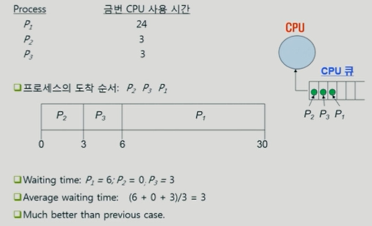

- **FCFS(First-Come First-Served) **: 가장 먼저 요청한 프로세스에 CPU를 할당해주는 방식

  - 평균 대기 시간(Average Waiting Time)이 길어질 수 있다.
  - 응답 시간(Response Time)이 길어질 수 있다.
  - 반환시간(Turnaround Time) 면에서는 좋을 수 있다.
  - Convoy Effect(호위 효과)가 발생할 수 있다.
    - 호위 효과 : 모든 프로세스들이 하나의 긴 프로세가 종료될 때 까지 기다려 비효율적인 성질
  - 첫 번째 사진과 두 번째 사진의 차이점 ?
  - P1의 사용시간이 긴데 P1이 먼저 도착해 사용하는 바람에 P2와 P3의 대기시간도 그만큼 늘어난다 => 효율적이지 못하다!!
  - 두 번째 사진처럼 순서가 바뀌면 평균 대기 시간이 훨씬 줄어든다!

  

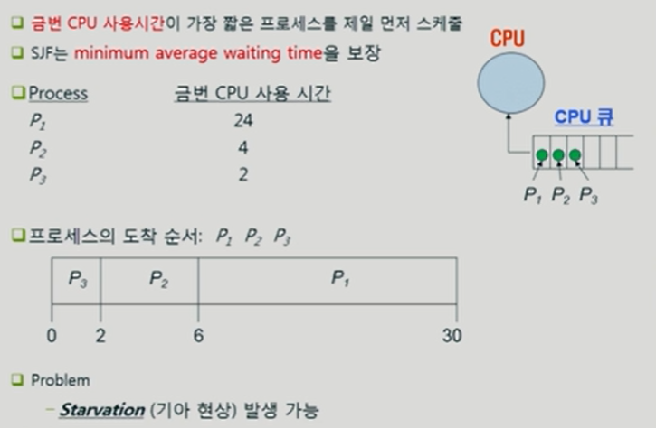

- **SJF(Shortest-Job-First)** : "제일 짧게 CPU 사용하는 아이에게 제일 먼저 주자!"
  - 효율성은 좋지만 형평성이 어긋나게 된다! => Starvation이 발생할 수 있음
    - P1이 무한정 기다려야 하는 상황이 발생할 수 있다는 뜻

❗ 위 두 방식은 일단 프로세스에게 CPU를 주면 뺏지는 않았다. 자발적으로 내어놓을 때까지 CPU를 뺏지는 않았다. => ***비선점형 스케줄링***

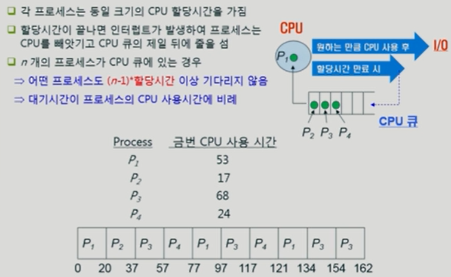

- **Round Robin(RR)** : 짧은 시간 간격으로 CPU를 번갈아 사용하도록 하는 방식 채택

  - 선점 스케줄링 알고리즘

  - 준비 큐에 도착한 순서에 따라 디스패치하지만

  - 정해진 시간 할당량에 의해 실행을 제한

  - 시간 할당량 안에 완료되지 못한 프로세스는 준비 큐의 맨 뒤에 배치 • `대화형 운영체제`에 유용

    - 대화형 운영체제 : 사용자의 입력에 대하여 컴퓨터에서 바로 결과를 출력

  - 장점 

    - CPU를 독점하지 않고 공평하게 이용
    - 대화형 운영체제에 유용

  - 단점

    - 시간 할당량이 너무 크면 FCFS 스케줄링과 같아짐
    - 시간 할당량이 너무 작으면 문맥 교환에 따른 오버헤드가 크게 증가함

     

---

#### 메모리 관리

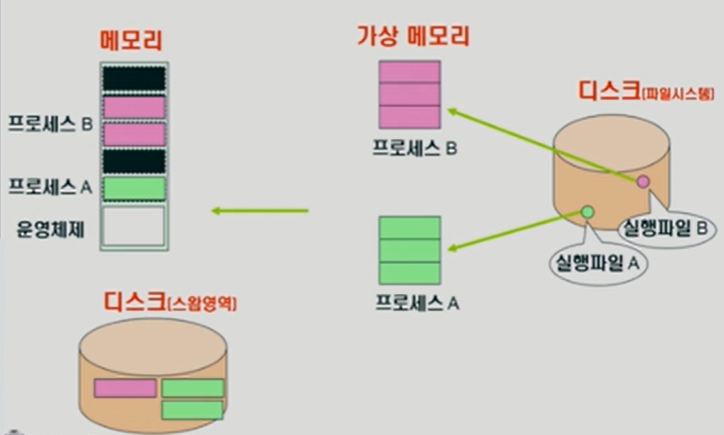

당장 필요한 부분만 쪼개서 메모리에 올려놓고 다 차버리면 외의 부분들은 스왐영역으로 간다 => 어떤 페이지를 메모리에서 쫓아낼 것인가 결정해야 한다!

**페이지** : 쪼개지는 단위

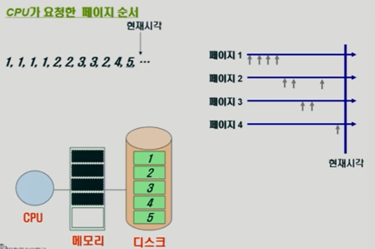

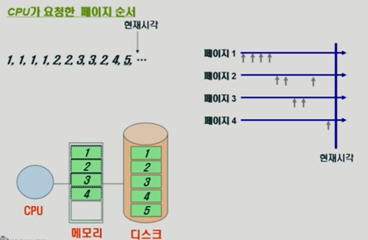

5번을 넣기 위해 1,2,3,4 중에 하나가 쫓겨나가야 한다. 그럼 운영체제는 효율성을 생각해야 한다.

- **LRU(가장 오래 전에 참조 페이지 삭제)** : 1번 페이지가 삭제된다.
  - 가까운 미래에 사용될 가능성이 낮은 페이지를 쫓아내는 것이 효율적이다.
  - ❗BUT 오래되었다는 이유만으로 쫓겨나가는 것이 단점이다.

- **LFU(참조 횟수가 가장 적은 페이지 삭제)** : 4번 페이지가 삭제된다.
  - 전제조건 : 데이터 사용되는 분포가 적을수록 사용될 가능성이 적을 것이다.
  - ❗BUT 인기라는 개념은 시간의 상대성에 따라 가변적일 수 있다.

#### 디스크 스케줄링

✅일반적으로 컴퓨터는 데이터를 저장할 때, 순차적으로 하드웨어 디스크에 저장하지 않는다. 그때 그때 필요에 따라 상황에 맞게! 데이터를 저장하기 때문에 데이터를 찾기 위해선, 산재돼서 저장된 데이터를 찾아와야 한다. 이때, **어떻게 효율적으로 산재된 데이터를 액세스 할 것인가에 대한 고민과 방법을 디스크 스케줄링**이라 한다!

- 디스크 스케줄링 목표
  - 하드 디스크 검색으로 낭비되는 시간을 최소화
  - 특정한 프로세스의 입출력 요청의 우선순위를 정함
  - 디스크 대역을 실행중인 각 프로세스에 할당
  - 정해진 기한까지 요청을 처리

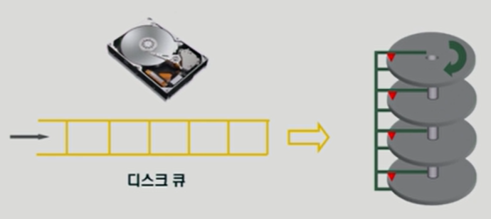

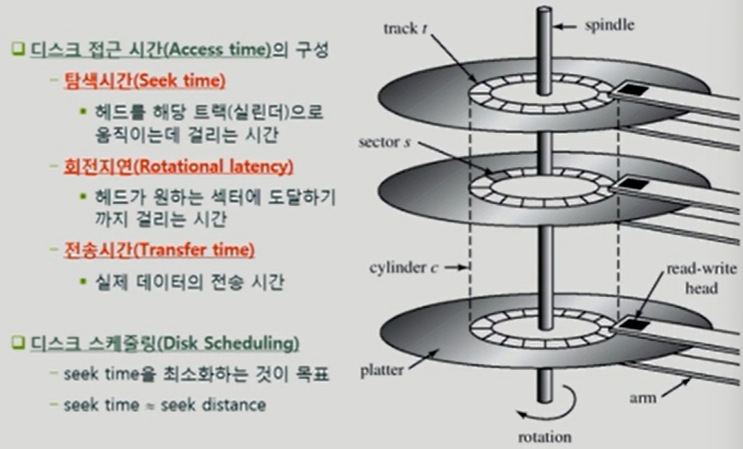

- **FCFS(First-Come First-Served)**

  - "먼저 들어온 친구를 먼저 서비스해주자!"
  - 알고리즘이 다른 기법보다 단순하며, 공평하게 요청을 처리한다.
  - 비용이 많이 발생한다는 단점 발생

  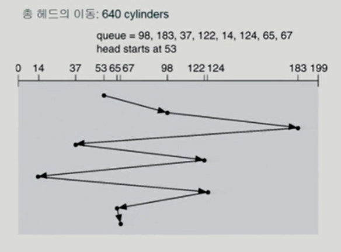

- **SSTF(Shortest Seek Time First)**

  - "제일 가까운 트랙의 요청부터 서비스해주자!"
  - Seek time이 적다 => 트랙을 찾는 시간을 최소화하고, 처리량을 극대화할 수 있다.
  - ***Starvation*** 발생 가능 => 멀리 있는 요청은 평생 서비스받지 못할 가능성도 존재

  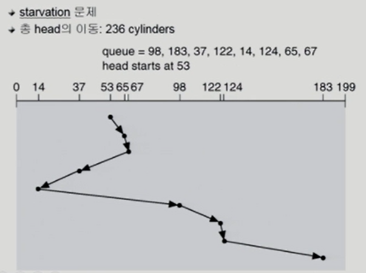

- **SCAN**
  - 헤드가 디스크의 한쪽 끝에서 다른쪽 끝으로 이동하며 가는 길목에 있는 모든 요청을 처리한다
  - 다른 한쪽 끝에 도달하면 역방향으로 이동하며 오는 길목에 있는 모든 요청을 처리하며 다시 반대쪽 끝으로 이동한다
  - SSTF의 starvation 문제 해결하고, 응답시간의 편차를 줄일 수 있다.
  - 양단 끝의 요청들의 대기시간이 중간 요청의 대기시간보다 길어질 수 있다는 단점 존재

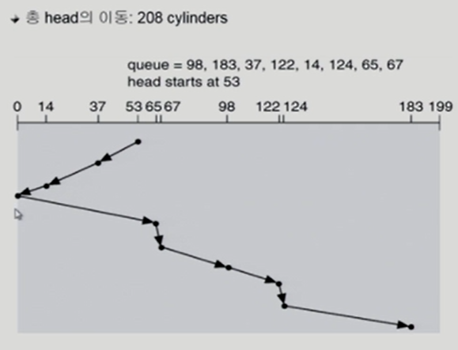

#### 저장장치 계층구조와 캐싱(caching)

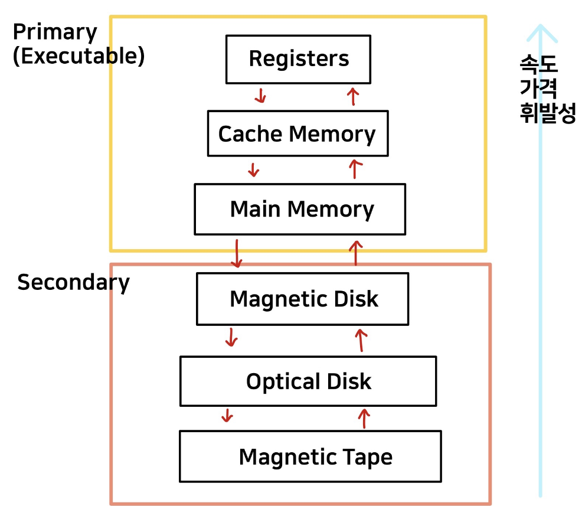

- **속도**와 **가격**에 따라 하나의 계층으로 구성
- 상위 수준으로 갈수록 가격이 비싸고 빠르며, 하위 수준으로 갈수록 비트당 비용은 감소하며 접근시간은 증가한다.
- Primary는 CPU가 직접 접근 및 실행 가능하지만 Secondary는 불가능하다.

- **Volatility(휘발성)** : 전원이 꺼져 메모리가 날아가는 것
  - 휘발성 저장 장치 : 전원이 제거되면 저장하고 있는 정보 손실
  - 비휘발성 저장 장치 : 전원이 공급되지 않아도 저장된 정보 유지

- **캐싱(Caching) **
  - ✅ 명령어와 데이터를 캐시 기억 장치(cache memory) 또는 디스크 캐시(disk cache)에 일시적으로 저장하는 것
  - 중앙 처리 장치(CPU)가 명령어와 데이터를 주기억 장치 또는 디스크로부터 읽어오거나 데이터를 주기억 장치 또는 디스크로 기록하는 것보다 몇 배 빠른 속도 또는 CPU의 속도에 가깝게 단축시키믕로써 컴퓨터의 성능을 향상할 수 있다.

#### 플래시메모리

- ✅ 전원이 끊겨도 데이터를 보존하는 특성을 가진 반도체

  - 반도체장치(하드디스크 : 마그네틱)

  - NAND형(스토리지), NOR형(임베디드 코드저장용)

    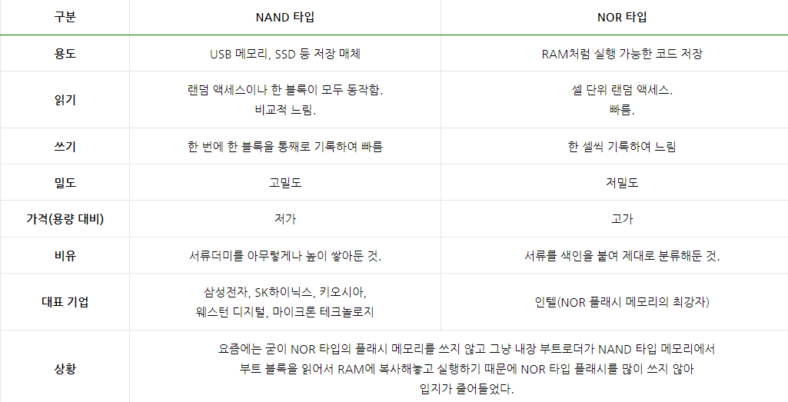

- 플래시메모리의 특징

  - Nonvolatile : 비휘발성
  - Low power consumption
  - Shock resistance : 기계적인 충격에 강함
  - Small size : 사이즈가 작음
  - Lightweight : 가벼움
  - BUT 단점도 존재
    - 블록을 지우기 전에 새로 쓸 수 없다
    - 기록 횟수에 제한이 있다
    - 블록 단위로만 재기록 가능

- 플래시메모리의 사용 형태

  - 휴대폰, PDA 등 임베디드 시스템 구성용
  - USB용 메모리 스틱
  - 디지털카메라 등의 SD 카드, CompactFlash, Smart Media card
  - 모바일 장치 뿐 아니라 대용량 시스템에서 SSD(Solid State Drive)란 이름으로 하드디스크 대체 시도

#### 운영체제의 종류

- 서버용, PC용, 스마트디바이스용 운영체제
- 공개 소프트웨어(Open Source Software)
  - Linux, Android