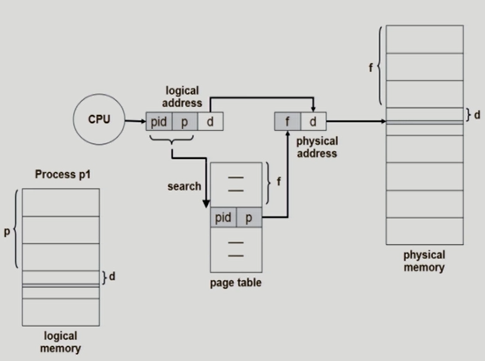

## Memory Protection

- Protection bit
  - read/write/read-only 구분

## Inverted Page Table Architecture

- 물리적인 주소를 가지고 논리적인 주소를 알아냄
- 단점 : 1. page table의 p가 논리적인 page이므로 프로세스 1, 2, ...에도 p번째 page 있을 수 있음 => **f번째에 올라가있는 page p가 누구의 논리적 page인지 정보 있어야(프로세스 ID 필요)**  2. **주소변환 위해 page table 모두 검색 필요**
- 조치 : associative register 사용(비싸)

## Shared Page

- 프로세스가 모두 한 프로그램이라고 하면 -> 코드부분 동일, 데이터만 다름 -> 메모리에 동일한 코드 카피가 올라가면 낭비 => 공유해서 낭비를 줄이자!
- Shared code
  - **read-only**로 하여 프로세스 간에 **하나의 code만** 메모리에 올림
  - Re-entrant Code (=Pure code)
  - 모든 프로세스의 logical address space에서 동일한 위치에 있어야 함 => **page 번호 같아야 함**(기계어가 같다고 하면 기계어 안에 표시되는 논리적 주소체계도 같아야 함)
- Private code and data
  - 각 프로세스들은 메모리의 각자 다른 위치에 올라감

## Segmentation

- 주소 공간이 가진 의미를 기준으로 자르고 각각의 세그먼트들은 메모리의 다른 위치에 올라가게 하는 방법
- 세그먼트 크기가 달라서 미리 잘라놓고 관리할 수 없음
- 프로그램은 의미 단위인 여러 개의 segment로 구성
  - segment 안 : code, data, stack

## Segmentation Architecture

- logical address 구성 : segment-number, offset

- segment table의 s번째 entry에 감 -> base로 메모리의 세그먼트의 시작위치 파악 -> 세그먼트 시작위치로부터 얼마나 떨어져있는지 d(offset)으로 파악 -> d만큼 떨어진 위치에 가면 찾는 내용 존재!
- segment table에 세그먼트 길이(limit)도 담고 있음
- offset이 세그먼트 길이보다 길면 주소변환 안해줌 <- track을 걸어서 막음
- segment table
  - base : 세그먼트의 시작하는 메모리 주소
  - limit : 세그먼트의 길이
- Segment-table base register(STBR)
  - 물리적 메모리에서 segment table 위치
- Segment-table length register(STLR)
  - 프로그램이 사용하는 세그먼트 수(길이)
    - 세그먼트 번호(s)는 그 번호가 STLR보다 작아야 함

- Allocation

  - first fit/ best fit
  - external fragmentation 발생

  => 길이가 동일하지 않아 가변분할 방식과 같은 문제점 발생

- Protection

  - 각 세그먼트 별로 protection bit
  - 각 entry :
    - valid bit = 0 => illegal segment
    - read/write/execution 권한 bit

- Sharing

  

  - 동일 세그먼트 number

=> 의미 단위여서 paging보다 공유와 보안에 있어 효과적

but 퓨어 세그먼테이션을 실제로 쓰진 않음, paging기법 사용함

## Segmentation with Paging

- 세그먼트 길이가 페이지 크기의 배수가 됨(페이지가 세그먼트 구성함)
- 의미 단위는 세그먼트로 관리

- segment가 메모리 어디에 있는지에 대한 정보가 page-table base에 있음(세그먼트마다 page table 존재)
  - 세그먼트 10개 -> page-table의 entry도 10개
- 공유, 보안도 segment 기법으로 관리
- page table의 번호는 offset(d)을 보고 파악 -> p: 세그먼트 구성하는 page 번호 부분, d': page 내 page offset
- ex. s가 11번, 세그먼트 길이는 10이면 fail