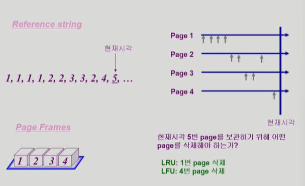

# 11. 가상메모리

### 💡**Demand Paging**

: *실제로 **필요할 때** page를 메모리에 올리는 것*

- I/O 양의 감소
- Memory 사용량 감소
- 빠른 응답 시간
- 더 많은 사용자 수용

- Valid / Invaild bit의 사용
  - invalid의 의미
    - 사용되지 않는 주소 영역인 경우
    - 페이지가 물리적 메모리에 없는 경우
  - 처음에는 모든 page entry가 invalid로 초기화
  - address translation 시에 invalid bit이 set되어 있으면 => `page fault`.

> <small>- 당장 필요한 부분은 물리적인 메모리에 올라가 있고, 그렇지 않은 부분은 backing store에 저장되어 있음.</small>
>
> <small>- 현재 올라와 있는 부분은 valid, 올라와 있지 않은 부분은 invalid임.</small>
>
> <small>- page fault가 발생하면 운영체제한테 CPU가 넘어가게 됨</small>

### 💡**Page Fault**

- invalid page를 접근하면 MMU가 *trap*을 발생시킴(page fault trap)

- *Kernel mode*로 들어가서 *page fault handler*가 invoke됨

- ☑️다음과 같은 순서로 page fault를 처리한다

  

  1. Invalid reference? (eg. bad address, protection violation) => abort process
  2. 빈 페이지를 하나 얻고 없으면 하나를 비운다
  3. 해당 페이지를 disk에서 memory로 읽어온다
     1. disk I/O가 끝나기까지 이 프로세스는 CPU를 preempt당함(block)
     2. Disk read가 끝나면 page tables entry 기록, valid/invalid bit = "valid"
     3. ready queue에 process를 insert => dispatch later
  4. 이 프로세스가 CPU를 잡고 다시 running
  5. 아까 중단되었던 instruction을 재개

**Performance of Demand Paging**

- Page Fault Rate 0 <= p <= 1

  - `p = 0`, no page faults
  - `p = 1`, every reference is a fault

- Effective Access Time

  = (1 - p)* memory access 

​			+ p (OS & HW page fault overhead  + [swap page out if needed]  + swap page in + OS & HW restart overhead)

> = page fault가 안나는 비율  * 메모리 접근
>
> \+ 운영체제가 CPU로 넘어가서 하드웨어적으로 page fault를 처리
>
> \+ 빈 페이지가 없다면 해당 페이지를 쫓아냄
>
> \+ 페이지를 메모리에 올림
>
> \+ 운영체제가 다시 CPU 주도권을 잡고 HW가 다시 시작

### 💡Page replacement

​	: 새로운 페이지를 메모리에 올리고자 할 때, 메모리가 이미 페이지로 가득 차 있어 이전에 있던 페이지를 새로운 페이지로 교체하는 것.

- 어떤 frame을 빼앗아올지 결정해야 함
- 곧바로 사용되지 않은 page를 쫓아내는 것이 좋음
- 동일한 페이지가 여러 번 메모리에서 쫓겨놨다가 다시 들어올 수 있음

### **Replacament Algorithm**

- *page-fault rate을 최소화*하는 것이 목표
- 알고리즘의 평가
  - 주어진 page reference string에 대해 page fault를 얼마나 내는지 조사
- reference string의 에
  - 1, 2, 3, 4, 1, 2, 5, 1, 2, 3, 4, 5

🗝️**Optimal algorithm**

​	: *가장 먼 미래에* 참조되는 page를 replace

- 미래의 참조를 어떻게 아는가?
  - Offline algorithm
- 다른 알고리즘의 성능에 대한 *upper bound*를 제공
  - `Belady's optimal algorithm`, `MIN`, `OPT` 등으로 불림

🗝️**FIFO(First In First Out) Algorithm**

​	:  먼저 들어온 것을 먼저 내쫓음

> <small>page frame을 증가시키면 오히려 page faults가 증가(성능이 나빠짐)</small>

- FIFO Anomaly (Belady's Anomaly)
  - more fremes !=> less page fault

🗝️**LRU(Least Recently Used) Algorithm**

​	: *가장 오래 전에 사용된 것*을 지움

​		 

🗝️**LFU(Least Frequently Used) Algorithm**

: *참조 횟수(reference count)가 가장 적은 페이지*를 지움

- 최저 참조 횟수인 page가 여럿 있는 경우

  - LFU 알고리즘 자체에는 여러 page 중 임의로 선정한다
  - 성능 향상을 위해 가장 오래 전에 참조된 page를 지우게 구현할 수도 있다.

- 장단점

  - LRU처럼 직전 참조 시점만 보는 것이 아니라 장기적인 시간 규모를 보기 때문에 page의 인기도를 좀 더 정확히 반영할 수 있음
  - 참조 시점의 최근성을 반영하지 못함
  - LRU보다 구현이 복잡함

  

  > LRU
  >
  > <small>가장 오래전에 참조된 페이지를 지우기 때문에 1번 page를 지움. 그렇기 때문에, 얼마나 빈번하게 참조되었는가를 고려하지 못함</small>
  >
  > LFU
  >
  > <small>가장 참조 횟수가 적은 페이지를 제우기 때문에 4번 페이지를 지움. 그래서 해당 페이지가 얼마나 최근에 참조되었는가는 고려하지 못함. </small>

- LRU와 LFU 알고리즘 구현

  - LRU

    

    - 메모리 안에 있는 페이지들을 참조 시간에 따라 줄 세우기를 함. (*Linked List* 형태)
    - 수정: 만약 이미 있는 페이지가 참조된다면 해당 페이지를 제일 아래쪽에 연결하면 됨.
    - 삭제 & 추가: 페이지 교체가 일어날 때는 제일 위쪽의 페이지를 제거하고 제일 아래쪽에 새로운 페이지를 추가함.
    - `O(1)` : 페이지를 비교할 필요가 없다는 의미(매번 결정할 필요X)

  - LFU

    

    - 메모리 안에 페이지들을 참조 횟수를 이용해 *heap*에 넣음. 아래로 갈수록 참조 횟수 증가.
    - 수정: 이미 있는 페이지가 참조된다면, 해당 페이지를 아래(자식)의 페이지와 비교해서 자리를 바꿈.
    - 삭제 & 추가: 페이지 교체가 일어날 때는 제일 참조횟수가 적은 페이지를 heappop 새로운 페이지를 heappush.
    - `O(log n)`

### 다양한 캐슁 환경

💡**캐슁 기법**

- *한정된 빠른 공간(=캐쉬)에 요청된 데이터를 저장*해 두엇다가 후속 요청시 캐쉬로부터 직접 서비스하는 방식

- `paging system` 외에도 `cache memory`, `buffer caching`, `Web caching` 등 다양한 분야에서 사용

  |                | 빠른 공간    | 느린 공간        |
  | -------------- | ------------ | ---------------- |
  | paging system  | D-RAM memory | disk swap area   |
  | cache memory   | cache        | main memory      |
  | buffer caching | D-RAM memory | disk file system |

❗**캐쉬 운영의 시간 제약**(시간 복잡도)

- 교체 알고리즘에서 삭제할 항목을 결정하는 일에 지나치게 많은 시간이 걸리는 경우 실제 시스템에서 사용할 수 없음
- Buffer caching 이나 Web caching의 경우
  - O(1)에서 O(log n) 정도까지 허용
- Paging system인 경우
  - page fault인 경우에만 OS가 관여함
  - 페이지가 이미 메모리에 존재하는 경우 참조 시각 등의 정보를 OS가 알 수 없음
  - O(1)인 LRU의 list 조작조차 불가능

❓**Paging System에서 LRU, LFU 가능한가?**

> <small>주소 변환을 했더니 이미 메모리에 올라와 있음 -> 운영체제의 개입이 없음. (주소 변환은 운영체제의 개입 없이 하드웨어적으로 이루어짐) 그렇기 때문에 관리하는 것(가장 최근에 사용됐다거나..) 자체가 불가능.</small> 

🗝️**Clock Algorithm**

: `Reference bit`(0, 1)을 사용해서 교체 대상 페이지 선정(circular list)

- 최근에 사용된 페이지는 1, 사용되지 않은 페이지는 0으로 표시.
- 1로 바꾸는 것은 하드웨어(address binding)가,  0으로 바꾸는 것은 운영체제(page fault)가 함. 
- LRU의 근사(approximation) 알고리즘
- Seconde change algorithm, NUR(Not Used Recently), NRU(Not Recently Used) 라고도 불림

- ☑️동작 방식
  - reference bit가 0인 것을 찾을 때까지 포인터를 하나씩 앞으로 이동
  - 포인터를 이동하는 중에 reference bit 1은 모두 0으로 바꿈
  - Reference bit이 0인 것을 찾으면 그 페이지를 교체
  - 한 바퀴 되돌아와서도(=second chance) 0이면 그때에는 replace 당함
  - 자주 사용되는 페이지라면 second chance가 올 때 1(사용될 때 1로 바꿈)
- 🩹개선
  - reference bit(access bit)과 `modified bit`(dirty bit)을 함께 사용
  - reference bit = 1: 최근에 참조(접근)된 페이지
  - modified bit = 1: 최근에 변경(쓰기)된 페이지(I/O를 동반하는 페이지)
    - 0이라면 수정이 안됐다는의미이고, 바로 삭제해도 됨. 디스크에 수정된 내용을 올리지 않아도 됨. 

### 💡Page Frame의 Allocation

​	❓각 프로세스에 얼마만큼의 page frame을 할당할 것인가?

- Allocation의 필요성
  - 메모리 참조 명령어 수행 시, 명령어, 데이터 등 여러 페이지 동시 참조
    - 명령어 수행을 위해 최소한 할당되어야 하는 frame의 수가 있음
  - Loop를 구성하는 page들은 한꺼번에 allocate 되는 것이 유리함
    - 최소한의 allocation이 없으면 매 loop마다 page fault
- Allocation Scheme
  - `Equal allocation`: 모든 프로세스에 *똑같은 갯수 할당*
  - `Proportional allocation`: *프로세스 크기*에 비례하여 할당
  - `Priority allocation`: 프로세스의 *priority*에 따라 다르게 할당

### Global vs. Local Replacement

💡**Global replacement**

​	: 각 프로세스에게 frame을 할당하는 것이 아닌 전체적으로 replacement.

- Replace 시 다른 process에 할당된 frame을 빼앗아 올 수 있다
- Process 별 할당량을 조절하는 또 다른 방법
- FIFO, LRU, LFU 등의 알고리즘을 global replacement로 사용시에 해당
- Working set, PFF 알고리즘 사용

💡**Local replacement**

​	: 자신에게 할당된 frame 내에서만 replacement

- FIFO, LRU, LFU 등의 알고리즘을 process 별로 운영

### 💡Thrashing

: 프로세스의 원활한 수행에 필요한 *최소한의 page frame 수를 할당 받지 못한 경우* 발생

> `CPU utilization` : cpu 이용률
>
> `degree of multiprogramming` : 메모리에 올라간 프로그램 수
>
> 각각의 프로세스가 CPU를 사용하다가 I/O를 하러감. 그래서 번갈아 가면서 사용.
>
> 메모리에 너무 많은 프로그램을 올려두게 되면, 프로그램을 실행하는데 필요한 최소한의 메모리도 얻지 못한 상황. -> 지속적으로 page fault가 일어남.

- page fault rate이 매우 높아짐
- CPU utilization이 낮아짐
- OS는 MPD(Multiprogramming degree)를 높여야 한다고 판단
- 또 다른 프로세스가 시스템이 추가됨(higher MPD)
- 프로세스 당 할당된 frame의 수가 더욱 감소
- 프로세스는 page의 swap in/ swap out으로 매우 바쁨
- 대부분의 시간에 CPU는 한가함
- low throughput

❓**어떻게 thrashing을 방지할 수 있을까?**

### 💡**Working-Set Model**

:  process의 *working set 전체가 메모리에 올라와 있어야 수행되고* 그렇지 않은 경우 모든 frame을 반납한 후 *swap out(suspend)*

- **Working set**

  : Locality 에 기반하여 프로세스가 일정 시간동안 원활하게 수행되기 위해 *한꺼번에 메모리에 올라와 있어야하는 page들의 집합*

  > **Locality of reference**
  >
  > 프로세스는 *특정 시간 동안 **일정 장소**만을 집중적으로 참조*한다
  >
  > **locality set** 
  >
  > 집중적으로 참조되는 해당 page들의 집합

- Thrashing을 방지함
- Multiprogramming degree를 결정함.

🗝️ **Working-Set Algorithm**

​	: Working set에 속한 page는 메모리에 유지, 속하지 않은 것은 버림 

​	(즉, 참조된 후 시간 동안 해당 page를 메모리에 유지한 후 버림)

- Working set 결정

  - *Working set window*를 통해 알아냄

  - window size가 $\Delta$인 경우

  - 시각 t~i~에서의 working set WS(t~i~)

    - *Time interval [$t_{i-\Delta}$, t~i~] 사이에 참조된 서로 다른 페이지들의 집합*

    

    > <small>$\Delta$동안 사용된 페이지들이 working set이 됨</small>
    >
    > <small>working set을 현재 window size로 보장받을 수 있다면 계속 진행, 그렇지 못하면 모든 frame 반납</small>

### 💡**PFF(Page-Fault Frequency) Scheme**

: 각 프로세스의 page fault rate을 보고 메모리를 얼마나 줘야할지 결정.

- page-fault rate의 상한값과 하한값을 둔다
  - Page fault rate이 *상한값을 넘으면 frame을 더 할당*한다
  - Page fault rate이 *하한값 이하이면 할당 frame 수를 줄인다*
- 빈 frame이 없으면 일부 프로세스를 swap out

### Page Size의 결정

- Page size를 감소시키면
  - 페이지 수 증가
  - 페이지 테이블 크기 증가
  - Internal framgmentation 감소
  - Disk transfer의 효율성 감소
    - Seek/rotation vs. transfer
    - 근접한 메모리의 데이터가 사용될 가능성이 높기 때문.
  - 필요한 정보만 메모리에 올라와 메모리 이용의 효율적
    - Locality의 활용 측면에서는 좋지 않음
- Trend
  - Larger page size