# File Systems

## File and File System

**❗Memory vs File**

memory : **주소**를 통해 접근하는 장치

file : **이름**을 통해 접근하는 단위

### File

- A named collection of related information
- 보통 비휘발성의 보조기억장치(하드디스크)에 저장
- OS에서는 다양한 저장 장치를 file(동일한 논리적 단위)로 관리
- 연산
  - create, delete, read, write, reposition(lseek), open, close 
    - reposition(lseek) : 현재 위치말고 다른 위치부터 읽고 싶을 때 위치 수정해주는 연산
    - open : read, write 하기 전에 하는 연산, file의 metadata를 memory에 올려놓는 작업
    - close : read, write 등을 다 하고나면 종료하는 연산

### File attribute (파일의 metadata)

- 파일 자체 내용 X
- 파일 관리 위한 각종 정보
  - 파일 이름, 유형, 저장 위치, 파일 사이즈
  - 접근 권한(읽기/쓰기/실행), 시간(생성/변경/사용), 소유자 등

### File system

- 파일 관리하는 SW 부분
- 파일 및 파일의 메타데이터를 디렉토리를 둬서 계층적으로 저장함
- 파일 저장 방법 결정
- 파일 보호

## Directory and Logical Disk

### Directory

- 디렉토리 아래 정보(파일의 metadata)를 그 파일의 내용으로 하는, 하나의 파일
- 그 디렉토리에 속한 파일 이름 및 파일 attribute
- 디렉토리에 metadata를 모두 저장할 수 있지만 일부 metadata를 디렉토리에 직접 저장, 나머지는 다른 곳에 저장하기도
- 연산
  - search for a file, create a file, delete a file
  - list a directory, rename a file, traverse the file system(파일 시스템 전체 탐색)

### Partition(=Logical Disk)

- 논리적 디스크
- ex. 하드디스크 하나를 C드라이브, D드라이브로 나누는 것 -> 각각이 논리적 디스크
- 하나의 물리적 디스크를 여러 파티션으로 나누거나 (일반적)
  - 파티션에 **file system**을 깔거나 **swap area**로 사용할 수 있음
- 여러 개의 물리적 디스크를 하나의 파티션으로 구성하기도 함

## open()

- 파일의 metadata를 memory에 올려놓음(시스템콜)
- open("/a/b/c")
  - c의 metadata가 메모리에 올라감
  - c 파일의 metadata의 저장 위치를 찾음
    - 루트 디렉토리의 위치가 미리 알려져 있으므로 루트 디렉토리부터 경로를 따라내려가면서 찾음

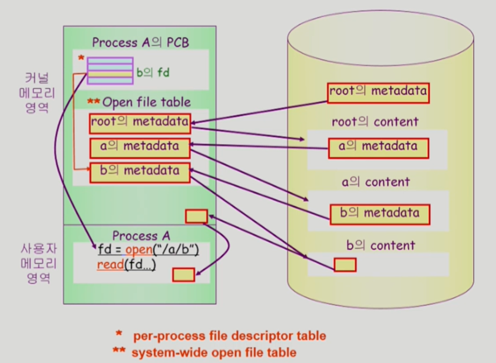

- 왼쪽 : 물리적 메모리, 오른쪽: disk
- a 아래 b 파일을 **open**하겠다는 시스템 콜을 함 -> **CPU 제어권이 운영체제로** 넘어감 -> 운영체제 안 상황 : 각 프로세스 별로 관리하기 위한 자료구조 존재 & 전체 프로그램들이 오픈한 파일들이 어떤건지 관리하는 global한 table이 유지되고 있음 -> 운영체제가 **루트 디렉토리의 metadata를 먼저 memory에 올림** -> metadata에는 파일의 위치정보 있으므로 **루트 디렉토리 내용이 저장된 위치를 찾을 수 있음** -> **루트 디렉토리 내용에 가면 a 파일의 metadata 있음** -> **a의 metadata를 메모리에 올림**(a를 open) -> metadata 안 a의 파일 시스템상 위치 정보를 통해 disk에서 a 위치 찾을 수 있음 -> a도 디렉토리 파일이므로 아래 파일에 대한 metadata(그 중 b) 존재 -> **b의 metadata를 찾아서 메모리에 올림**(b를 open) -> **open이 완료**됨 -> **시스템콜이기 때문에 사용자 프로세스한테 결과값(fd)을 리턴함** (각 프로세스마다 오픈한 파일들에 대한 metadata pointer를 가진 배열 있음. b의 metadata 위치를 가리키는 pointer가 배열에 만들어지고 그 배열의 인덱스가 fd.)
- b가 open 되고나면, read나 write할 때 다시 디스크로 가서 찾을 필요없이 fd를 가지고 요청하면 됨 -> disk의 b 내용을 요청한 용량만큼 읽어옴 -> 운영체제가 자신의 메모리 공간 일부에다 먼저 읽어놓음 -> copy해서 사용자 프로그램에 전달
  - **동일한 파일의 동일한 위치를 요청**하면 OS가 이미 읽어놓은 게 있으므로 **바로 전달 가능** => **버퍼캐싱**
    - 운영체제가 모든 정보를 알기 때문에 버퍼캐싱 환경에서는 LRU나 LFU 알고리즘 사용 가능
- metadata가 메모리에 올라가면 **현재 프로세스가 파일의 어느 위치에 접근하고 있는지에 대한 offset**도 가지고 있어야(**프로그램마다 별도**) -> offset 관리 table도 따로 둠

## File Protection

- 접근 권한이 누구한테?
- 접근 유형은 어떤?

### Access Control 방법

- Access control Matrix

  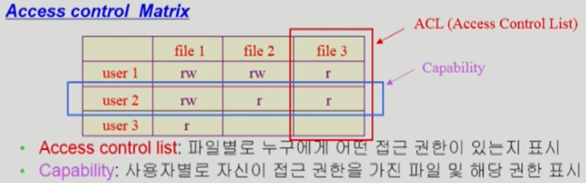

  - 행렬에 의한 공간 낭비 막기 위한 방법 2 가지
    - Access control list : 사용 권한 있는 사용자에 대해서만 표시
    - Capability : 사용자를 주체로 한 리스트

- Grouping

  - 전체 user를 3 그룹으로 나눔(owner, group, public)
  - 각 파일에 대해 3 그룹의 접근 권한 표시(3 비트씩)

  => 9 개 비트 필요

  - ex. UNIX

    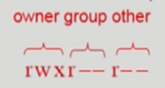

  

- Password
  - 파일마다 password 거는 방법 (디렉토리 파일에 걸 수도 있음)
  - 접근 권한별(읽기, 쓰기, 실행) password 둘 필요 => 암기 문제, 관리 문제

## File System의 Mounting

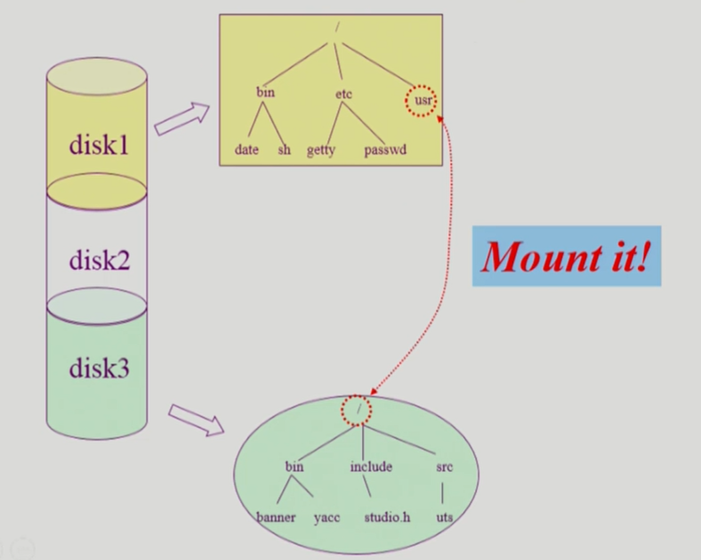

### ❓서로 다른 파티션의 파일시스템에 접근 어떻게?

**mounting** 연산 : 루트 파일시스템의 특정 디렉토리 이름에다가 다른 파티션의 파일시스템을 마운트해줌 

=> 마운트된 디렉토리를 접근 == 또다른 시스템의 루트 디렉토리에 접근

## Access Methods

- 시스템이 제공하는 파일 접근 방법
  - 순차 접근 (sequential access)
    - 카세트 테이프 사용 방식처럼
    - 읽거나 쓰면 offset이 자동적으로 증가
  - 직접 접근 (direct access, random access)
    - 특정 위치 접근 가능
    - 파일 구성하는 레코드를 임의의 순서로 접근 가능

# File System Implementation

## Allocation of File Data in Disk

- Contiguous Allocation
- Linked Allocation
- Indexed Allocation

### Contiguous Allocation

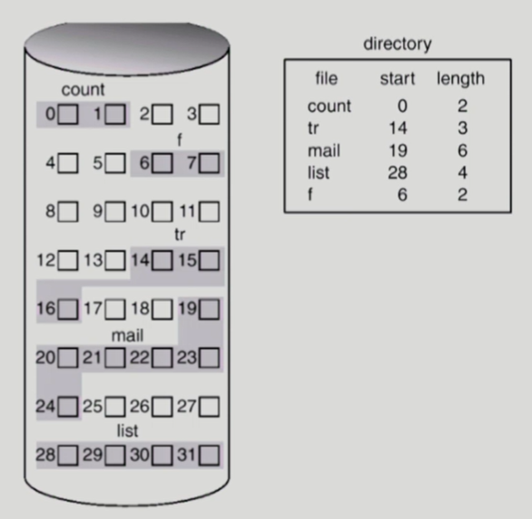

- 하나의 파일이 디스크 상에 연속해서 저장되는 방법
- ex. 블럭 2 개 이상으로 구성된 파일은 인접하게 연속해서 저장됨
- 단점
  - external fragmentation : 중간에 크기가 다른 free block이 존재할 수 있음 -> 비어있음에도 활용불가
  -  파일 크기가 커지는데 제약 있을 수 있음(file grow 어려움)
    - grow 가능 vs 낭비 (internal fragmentation)
- 장점
  - fast I/O
    - 한번의 seek/rotation으로 많은 양의 데이터를 받아올 수 있음
    - swap area 용도로 사용가능(파일 저장 X, 프로세스의 주소공간을 위함) -> 속도 효율성
    - realtime file용
  - 직접 접근 가능

## Linked Allocation

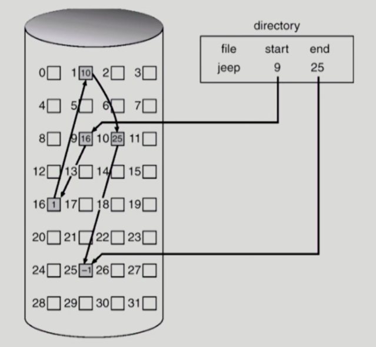

- 디렉토리에 시작 위치만 저장되어 있고, 첫 블럭을 찾아가면 끝부분에 두번째 블럭이 어디에 있는지 기록되어 있음 -> 그 정보를 따라 다음 블럭 이동 -> 같은 방법으로 블럭 이동...
- 장점
  - 외부 조각 발생 X
- 단점
  - 직접 접근 안됨(순차접근만)
    - 디스크 헤드 이동시간 때문에 시간 많이 소요됨
  - realiability
    - 중간에 베드섹터 나면 뒷부분을 다 잃게 됨
  - 보통 디스크에서 **하나의 섹터는 512 바이트**로 구성됨(컴퓨터에서 디스크로 접근할 때 저장 단위가 512 바이트의 배수로 구성됨), **포인터로 4 바이트**가 소요된다면 **실제 저장 크기는 (512-4) 바이트** -> **한 섹터에 저장될 걸 두 섹터에** 저장해야 함
- 변형
  - File-allocation table(FAT) 파일 시스템

## Indexed Allocation

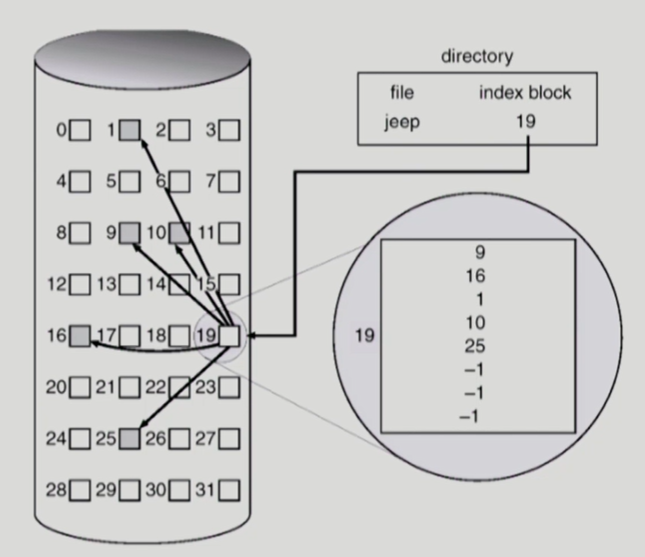

- 디렉토리에 파일의 위치 정보 바로 저장 X, 인덱스 정보(파일 내용 X, 파일 저장 위치)가 있음
  - ex. 4번째블럭 찾기 : 인덱스 번호 찾아서(10) 접근
- 장점
  - 외부 조각 발생 X
  - 직접 접근 가능
- 단점
  - *파일이 작은 경우* 공간 낭비
  - *파일이 굉장히 크면* 인덱스 파일 하나로 표시 불가
    - 해결방법
      - linked scheme : 마지막에 파일 위치가 아니라, 또다른 인덱스 블럭 가리킴
      - multi-level index

## UNIX 파일시스템의 구조

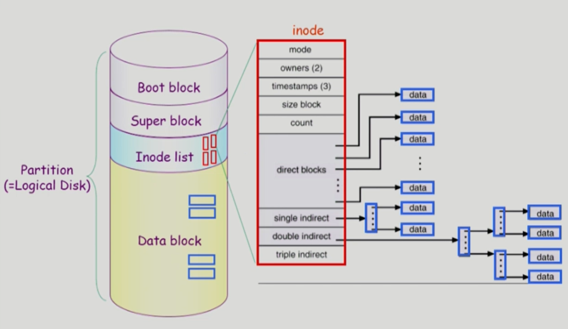

- Boot block 

  - 모든 파일시스템 앞에 존재
  - 부팅에 필요한 정보

- Super block

  - 파일 시스템에 대한 총괄 정보 가짐

- Inode list

  - 파일 하나당 inode 하나씩 할당됨(그 파일의 metadata 가짐)

- Data block

  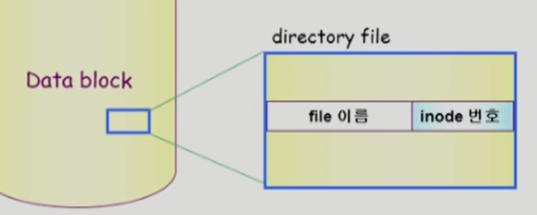

#### ❓파일 위치 정보 저장 방법

**Indexed allocation** 변형해서 사용

- 작은 inode(크기 고정)를 가지고(pointer 갯수도 유한) 큰 파일 표시할 수 있어야 함
- 작은 파일은 direct pointer로 파일 위치 파악
- 큰 파일은 single indirect, double indirect, ... 따라가서 인덱스 찾고 파일 위치 파악

## FAT File System

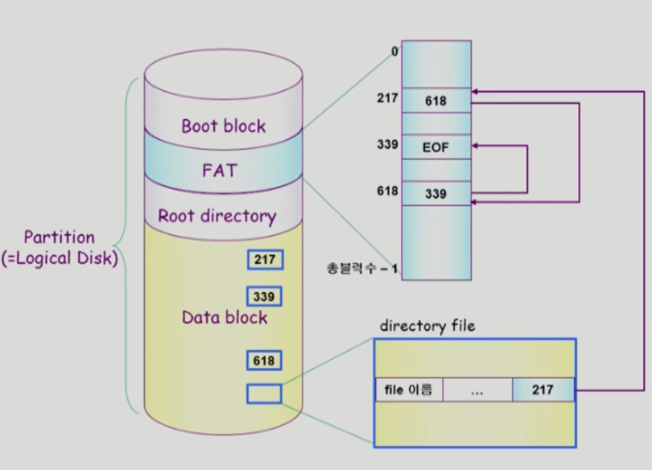

- Data block에 디렉토리 파일에 모든 정보 가짐
- 다음 블럭이 무엇인지에 대한 정보를 FAT(별도의 배열)에 담아둠 => 직접 접근 가능
  - Data block의 갯수 == FAT 배열의 크기
  - FAT 배열에 담긴 숫자는 다음 블럭 위치
- Linked Allocation 단점 극복
  - pointer 분실해도 FAT에 내용이 있으므로 파일 찾기 가능(FAT 보통 2 카피 이상 둠)

## Free-Space Management

### Bit map or bit vector

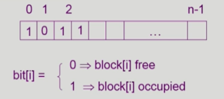

- 비트 맵 크기는 블럭 개수만큼
- 파일이 새로 만들어지거나 크기 커지면 비어있는 블럭 중 하나 할당해야
- 파일 삭제되면 0으로 표시
- 장점
  - 연속적인 빈 블럭 찾는데 효과적

### Linked list

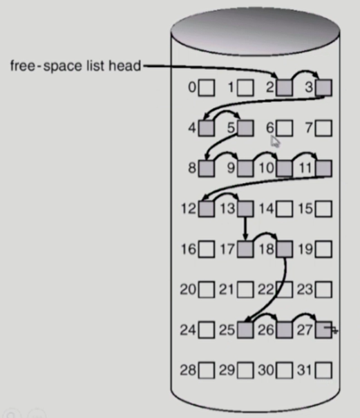

- 빈 블럭들을 링크로 연결
- 빈 블럭 첫번째 위치만 포인터로 가짐 -> 다음 블럭 위치는 이전 블럭에 가면 알 수 있음

## Grouping

- linked list 방법의 변형
- 첫번째 빈 블럭이 n개의 pointer 가짐
  - 앞에서 n-1까지 포인터는 빈 블럭 가리킴
  - 마지막 포인터는 또다른 블럭 가리킴
- 연속적인 빈 블럭 찾기에 효과적 X

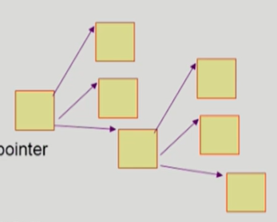

## Counting

- 빈 블럭 첫 위치와 거기서부터 몇 개가 비어있는지 관리

## Directory 구현 방법

### Linear list

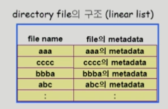

- metadata 순차적으로 저장 & 크기 고정
- 구현 간단 but 파일 찾는데 시간 많이 걸림

### Hash Table

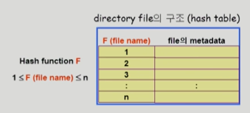

- linear list + hashing
- 해쉬 함수 적용하면 특정 범위 안으로 값이 나옴
- file의 hash 결과값에 해당하는 entry에 그 파일의 metadata 저장
- ex. 파일 이름 aaa를 해쉬 함수 적용했을 때 1이라면 파일 이름(1)과 그 metadata 저장
- search time 없앰
- collision 발생 가능
  - 다른 이름 파일에 대해 같은 데이터가 매핑되는 충돌 발생 가능

### File의 metadata의 보관 위치

- 디렉토리 내 직접 보관
- 디렉토리에 포인터를, 나머지는 다른 곳에 보관
  - inode, FAT

### Long file name의 지원

- entry는 보통 고정
- 이름을 어느 정도로 한정해놓고 길면 앞부분은 저장하고 뒷부분은 포인터를 둬서 맨끝에서부터 파일 이름이 저장되도록 함

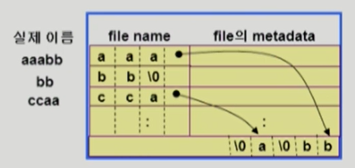

## VFS and NFS

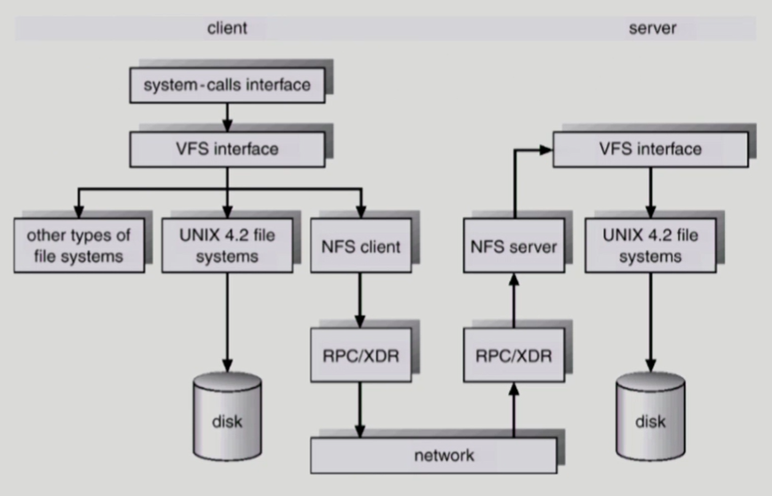

### Virtual File System (VFS)

- 사용자가 시스템 콜을 할 때 **서로 다른 file system에 대해 동일한 시스템 콜 인터페이스(API)를 통해 접근**할 수 있게 해주는 OS의 계층
- 어떤 종류의 파일 시스템이 사용되는지 상관없이 **개별 파일시스템 윗 계층에 인터페이스를 둠**

### Network File System (NFS)

- 자신의 로컬 시스템 파일이 아닌 **원격 파일 시스템에 접근할 때** 이용
- **분산 시스템에서 네트워크를 통해 파일이 공유**될 수 있게 함
- 주고받는 양쪽(server, client)에 NFS 보조가 있어야 됨

## Page Cache and Buffer Cache

### Page Cache

- Virtual memory 관점
- paging system에서 사용하는 page frame
- 관리방법 : OS에 주어지는 정보가 제한적

### Buffer Cache

- 파일 시스템 관점
- 파일의 데이터를 사용자가 요청했을 때 OS가 읽어온 내용을 자신의 일부에 저장해놓고 같은 파일을 요청해오면 바로 읽어줌(buffer cache)
- 관리방법 : 파일 접근할 때 시스템 콜이 되므로 CPU 제어권이 OS에 넘어감 -> 어느 시점에 그 파일에 대한 요청이 일어났는지 알 수 있음(hit나 miss가 발생하더라도) -> 그 정보를 이용해 LRU, LFU 등 replacement algorithms 필요

### Unified Buffer Cache

- Page Cache와 Buffer Cache를 합쳐서 관리하는 방법

### Memory-Mapped I/O

- 파일의 일부를 메모리에 매핑시켜놓고 사용 -> read, write할 때 시스템 콜 X, 메모리에서 읽고 씀
- 효율적

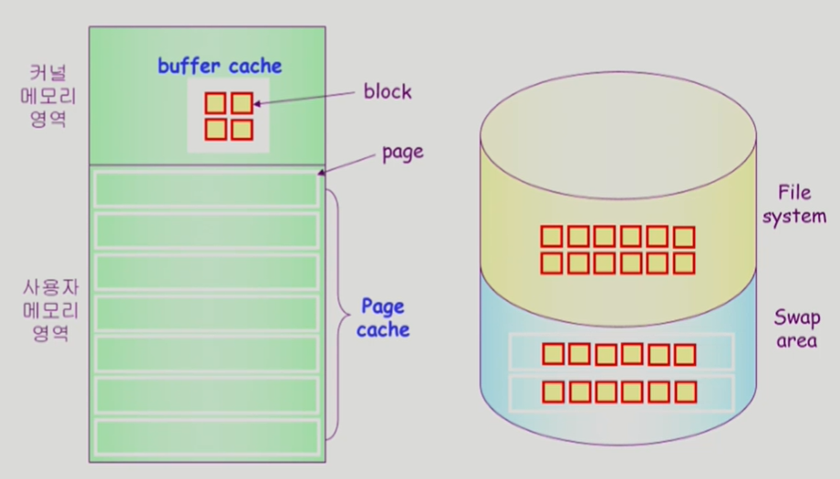

- 파일의 내용 읽어오기 : buffer cache가 파일 시스템에서 파일 내용 가져온 후 카피해서 사용자에게 전달

- swap area : 속도의 효율성을 위해 여러 페이지/블럭을 한꺼번에 올리고 내림

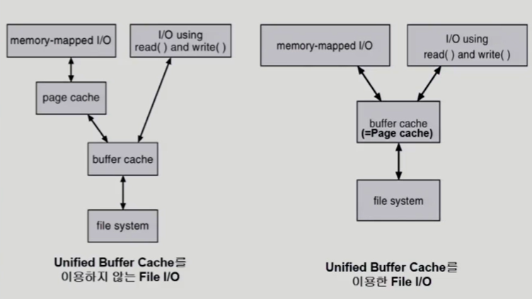

- Unified Buffer Cache를 사용하지 않는 환경
  - 파일에 대한 read/write를 요청하는 경우
    - 파일시스템의 블럭을 OS가 buffer cache로 읽어들임 -> 카피해서 사용자 주소공간에 넘김
    - buffer cache에 요청한 내용이 이미 올라와 있다면 disk까지 가지 X, buffer cache에서 바로 전달함
  - memory-mapped I/O
    - 파일시스템의 블럭을 사용자 주소공간에 매핑시킴
      - read/write 하면 무조건 buffer cache 거침

- Unified Buffer Cache를 사용하는 환경
  - memory-mapped I/O
    - 사용자 프로그램 주소공간에 바로 파일을 매핑함(Page cache만 접근! 카피하는 단계 없음)

#### ❗매핑만 되어있고 파일이 디스크에서 올라오지 않았을 때

​	사용자 메모리 영역에서 그 내용을 읽으려하면 페이지 폴트 발생 -> 페이지 핸들러가 OS를 통해 호출됨 -> 파일시스템에 있는 내용이 page로 올라감 -> 다음번에 page 접근 시 바로 파일 접근 가능(page로 올라가있으므로)

## 프로그램의 실행

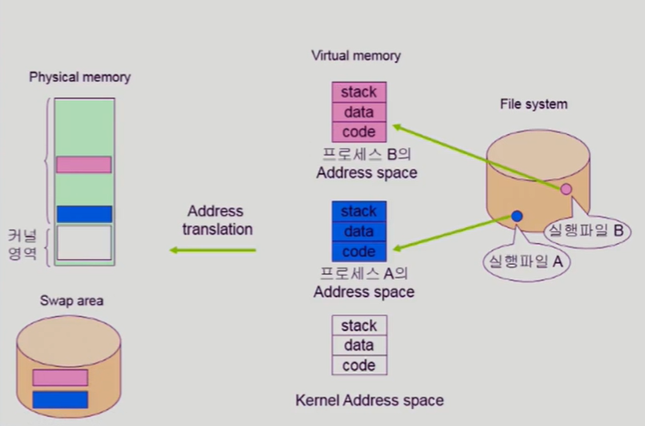

- **stack**이나 **data**는 당장 사용안되면 **swap area**에 내려가지만
- **code**는 실행파일에 이미 존재하므로 **당장 필요하지 않으면 지우면 됨**

- **loader(메모리에 파일을 올림)가 사용하는 memory-mapped I/O 방법**

  - 프로그램의 실행파일 부분을 프로그램의 주소공간 일부에 매핑을 함
  - ex. code가 메모리에 없어서 페이지 폴트가 발생한다면 -> 그 code가 매핑된 실행파일에서 해당 부분을 찾아서 메모리에 올려서 사용

- 데이터 파일도 같은 방법으로

  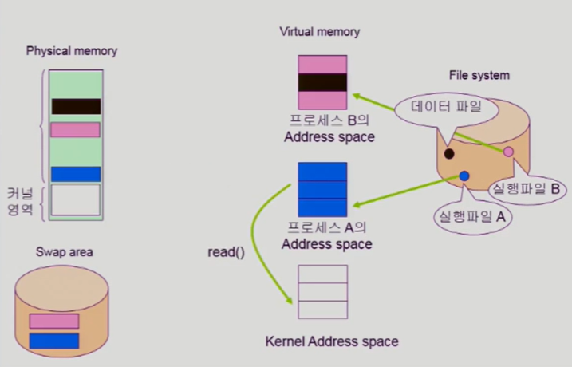

- memory-mapped I/O의 장점
  - 한번 매핑해놓으면 자신의 주소공간에서 직접 메모리 read/write를 할 수 있음

- memory-mapped I/O의 단점
  - 일관성 문제
    - ex. 여러 프로그램이 같은 파일을 memory-mapped I/O로 쓰는 경우 한 프로그램이 수정했을 때 다른 프로그램에서 수정내용이 바로 업데이트되지 않을 수 있음