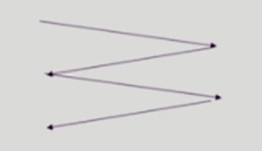

#### Disk Scheduling

- 디스크 접근 시간(Access time)의 구성
  - **탐색시간(seek time)**
    - 헤드를 해당 실린더로 움직이는데 걸리는 시간
  - **회전지연(Rotational latency)**
    - 헤드가 원하는 섹터에 도달하기까지 걸리는 회전지연시간
  - **전송시간(Transfer time)**
    - 실제 데이터의 전송 시간
- Disk bandwidth
  - 단위 시간 당 전송된 바이트의 수
- Disk Scheduling
  - seek time을 최소화하는 것이 목표
  - seek time = seek distance

#### Disk Structure

- 논리 블록 (logical block)
  - 디스크의 외부에서 보는 디스크의 단위 정보 저장 공간들
  - 주소를 가진 1차원 배열처럼 취급
  - 정보를 전송하는 최소 단위
- 섹터 (Sector)
  - Logical block이 물리적인 디스크에 매핑된 위치
  - Sector 0은 최외곽 실린더의 첫 트랙에 있는 첫 번째 섹터이다

#### 디스크 관리 Disk Management

- **physical formatting(Low-level formatting)**
  -  디스크는 컨트롤러가 읽고 쓸 수 있도록 ***섹터들로 나누는 과정***
  - 각 섹터는 header + 실제 data + trailer로 구성
  -  header와 trailer는 sector number, ECC(Error-Correcting Code) 등의 정보가 저장되며 controller가 직접 접근 및 운영
     - ECC : 가장 일반적인 종류의 내부 데이터 손상을 감지하고 수정하는 기억 장치의 일종
- **파티셔닝 (Partitioning)**
  - 디스크를 하나 이상의 실런더 그룹으로 나누는 과정
  -  OS는 이것을 하나의 partition, 독립적 disk로 취급(logical disk)
- **Logical formatting**
  - 파일 시스템을 만드는 것
  - FAT, inode, free space 등의 구조 포함
- **Booting**
  - ✅ 컴퓨터에서 사용자가 운영 체제를 시동할 때 운영 체제를 시작하는 부트스트래핑 과정
  - ROM에 있는 "small bootstrap loader"의 실행
    - DRAM : 휘발성의 메모리 장치.
    - DRAM 옆에 ROM이 작게 붙어 있는데, 이는 컴퓨터 전원이 끊어져도 내용이 변함없이 유지됨.
    - 0번 sector에 있는 내용을 로드하라고 명령어에 입력되어 있다. 전원이 켜지면 부팅이 되며 자동으로 0번 sector가 load가 되는 것임
  - sector 0(boot block)을 load하여 실행
  - sector 0은 "full Bootstrap loader program"
    - 진정한 부트 시스템
  - OS를 디스크에서 load하여 실행

### Disk scheduling Algorithm

✅ **디스크 스케줄링** = 어떻게 효율적으로 산재된 데이터를 엑세스 할 것인가에 대한 고민과 방법

#### FCFS(First Come First Served)

- "먼저 들어온 요청 먼저 서비스"
- 알고리즘이 다른 기법보다 단순하며, 공평하게 요청을 처리한다.
- 비용이 많이 발생한다는 단점 발생

#### SSTF(Shortest Seek Time First)

- "제일 가까운 요청부터 서비스"
- 탐색 시간이 적어 트랙 찾는 시간 최소화하고 처리량을 극대화할 수 있다
- 기아 발생 가능 => 멀리 있는 요청은 평생 서비스받지 못할 수도 있다

#### SCAN

- disk arm(헤드)이 디스크의 한쪽 끝에서 다른쪽 끝으로 이동하며 가는 길목에 있는 모든 요청을 처리한다
- 다른 한쪽 끝에 도달하면 역방향으로 이동하며 오는 길목에 있는 모든 요청을 처리하며 다시 반대쪽 끝으로 이동한다
- 문제점 : 실린더 위치에 따라 대기 시간이 다르다
- 양단 끝의 요청들의 대기시간이 중간 요청의 대기시간보다 길어질 수 있다는 단점 존재
- 엘리베이터 스케줄링과 비슷한 동작 원리

#### C-SCAN

- 헤드가 ***한쪽 끝에서 다른쪽 끝***으로 이동하며 가는 길목에 있는 모든 요청을 처리
- 다른쪽 끝에 도달했으면 요청을 처리하지 않고 곧바로 출발점으로 다시 이동
- SCAN보다 균일한 대기 시간을 제공한다

#### Other Algorithms

- **N-SCAN**

  - SCAN의 변형 알고리즘
  - 일단 arm이 한 방향으로 움직이기 시작하면 그 시점 이후에 도착한 job은 되돌아올때 service

- **LOOK** and **C-LOOK**

  - SCAN이나 C-SCAN은 헤드가 디스크 끝에서 끝으로 이동

  - LOOK과 C-LOOK은 헤드가 진행 중이다가 그 방향에 더 이상 기다리는 요청이 없으면 헤드의 이동 방향을 즉시 반대로 이동한다

    

#### Swap-Space Management

- Disk를 사용하는 두 가지 이유
  - memory의 volatile한 특성 -> file system
  - 프로그램 실행을 위한 memory 공간 부족 -> swap space(swap area)
- 스왑 공간 (Swap-space)
  - 가상 메모리 시스템 (Virtual memory system)에서는 디스크를 memory의 연장 공간으로 사용
  - 파일 시스템 내부에 둘 수도 있으나 별도 partition 사용이 일반적
    - 공간효율성보다는 속도 효율성이 우선
    - 일반 파일보다 훨씬 짧은 시간만 존재하고 자주 참조됨
    - 따라서, block의 크기 및 저장 방식이 일반 파일시스템과 다름

#### RAID

- ✅ 개별 디스크드라이브를 묶어서 고가의 대용량 고성능 디스크 드라이브의 성능과 기술을 구현하기 위해 만들어진 기술

- Redundant Array of Independent Disks
- 여러 개의 디스크를 묶어서 사용
- 사용 목적 2 가지
  - ***디스크 처리 속도 향상***
    - 여러 디스크에 block의 내용을 분산 저장
    - 병렬적으로 읽어옴(interleacing, striping)
  - ***신뢰성(reliability) 향상***
    - 동일 정보를 여러 디스크에 중복 저장
    - 하나의 디스크가 고장(failure)시 다른 디스크에서 읽어옴(Mirroring, shadowing)
    - 단순한 중복 저장이 아니라 일부 디스크에 parity를 저장하여 공간의 효율성을 높일 수 있다