#### UNIX 파일시스템

✅ 유닉스 및 유닉스 계열 운영 체제에 쓰이는 파일 시스템

- **수퍼블록(superblock)**
  - 파일시스템의 총체적 레이아웃 정보 보관
  - 블록의 크기, inode의 수, data block의 수, free block list의 head
- **i-node 블록**
  - 메타 데이터 보관(실제 데이터 블록의 위치 정보 포함)
- **data 블록**
  - 실제 데이터 보관

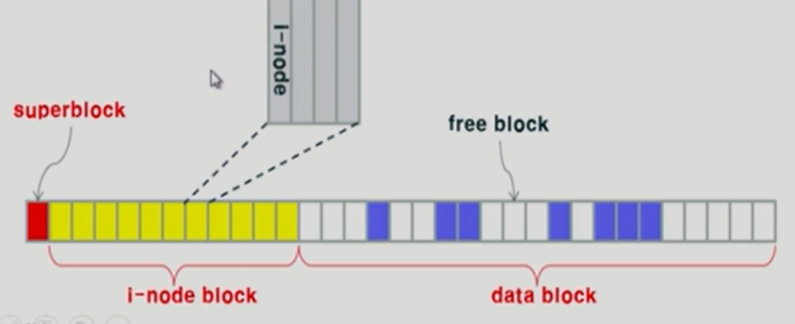

> UNIX 파일시스템 전체 개요도

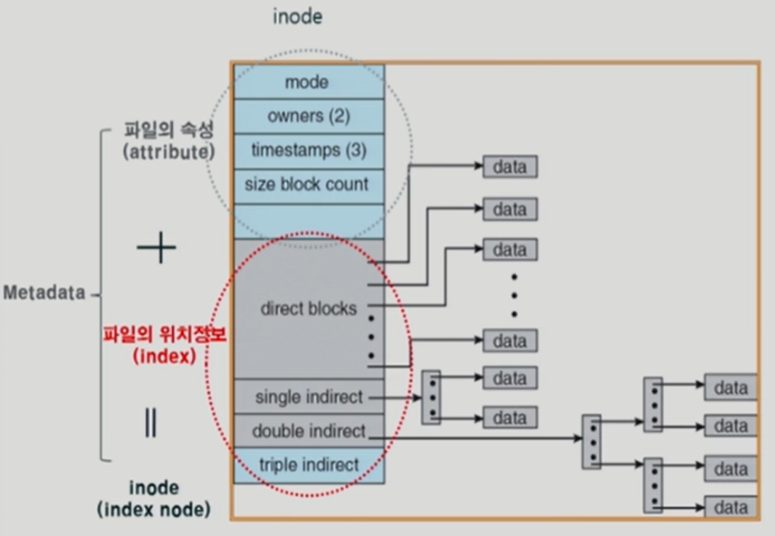

> I-node 구조도
>
> 속성, 위치정보 등이 i-node 형태로 저장되어 있다.

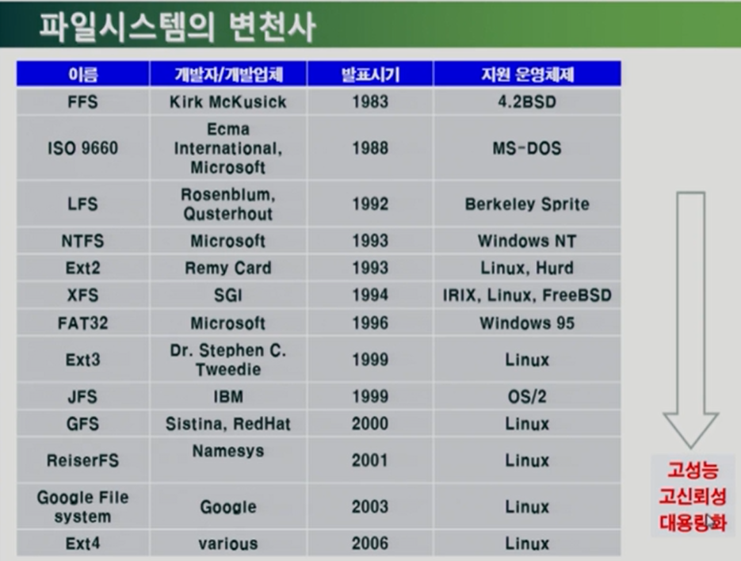

#### Ext2 파일시스템

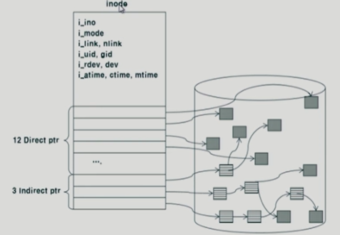

- 15개의 포인터로 위치 저장
  - 12개 포인터는 실제 데이터 위치를 곧바로 가리키고 있고
  - 나머지 3개 포인터는 큰 파일을 가리키기 위해서 지원하고 있다.

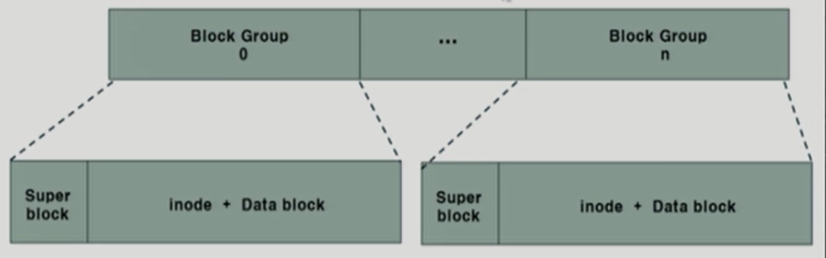

- 블록의 그룹화
  - ***메타데이터와 실제 데이터를 인접하게 배치***하여 디스크 탐색 시간 감소
  - 이것이 첫 번째 개선된 점!
- 수퍼블록의 중복저장
  - ***수퍼블록을 그룹마다 중복저장***하여 디스크 오류에 대비

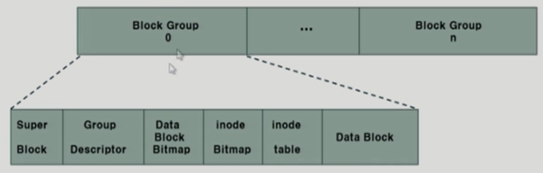

- **수퍼블록(Super block)**
  - 아이노드 수, 가용 아이노드 수, 데이터블록 수, 가용 데이터블록 수
  - 그룹 당 블록 수, 시간 정보
- **그룹 디스크립터(Group descriptor)**
  - 데이터블록 비트맵의 시작 위치, 아이노드 비트맵의 시작 위치
  - 첫 번째 아이노드의 시작 주소, 가용 아이노드의 수

- **데이터 블록 비트맵(data block bitmap)**
  - 사용 중인 데이터블록과 빈 데이터블록의 표시
- **아이노드 비트맵(inode bitmap)**
  - 사용중인 아이노드와 빈 아이노드의 표시
- **아이노드 테이블(inode table)**
  - 실제 아이노드의 저장 위치

#### Ext4 파일시스템

***"Ext4 = Ext2 + 저널링"***

##### ❗실수로 선 건드려서 전원이 나가거나 블루 스크린이 뜬다면?!

- 갑작스런 전원 공급 중단
  - 파일시스템 일관성 훼손(inconsistency) 발생

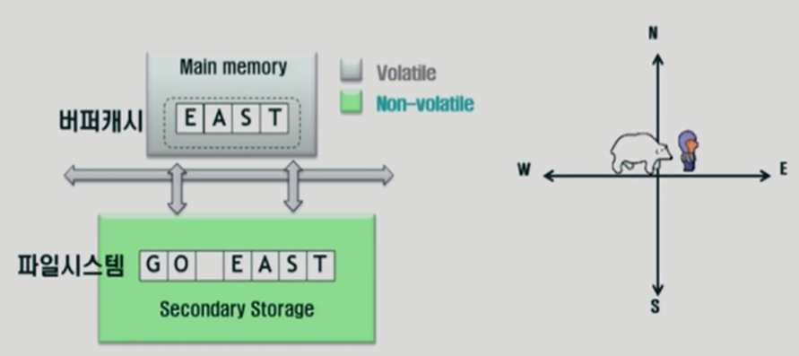

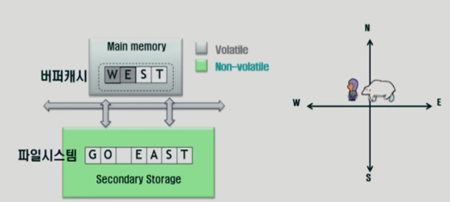

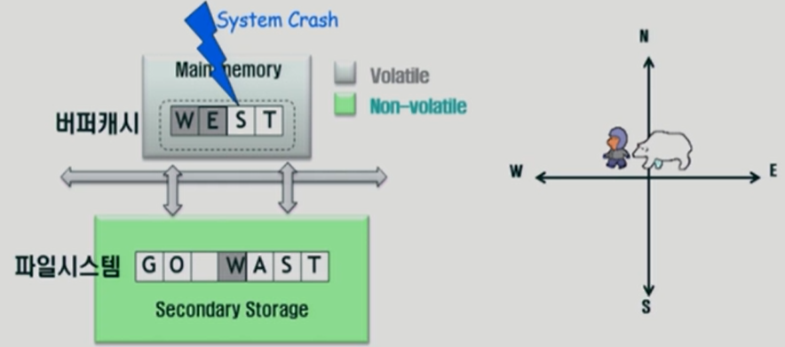

프로그래머가 "GO EAST"로 작업을 하다가 "GO WEST"로 수정했는데 이때 시스템이 다운되면 미처 파일시스템에 저장되지 못한 글자가 날아가버리거나 아예 안열리는 문제가 발생할 수 있다! 

#### 이 문제를 해결하기 위해선?

- Inconsistency 문제 해결을 위해 **journaling** 사용
  - Ext3, Ext4, ReiserFS, XFS, btrFS
  - 수정된 내용을 주기적으로 저널영역에 저장시켜줘서 위의 문제를 방지해준다.
- **Journaling**
  - 5~30초 단위로 버퍼캐시에서 수정된 내용을 저널 영역에 기록
- **Checkpointing**
  - 수정된 내용을 파일시스템의 원래 위치에 반영(예: 5분 주기)

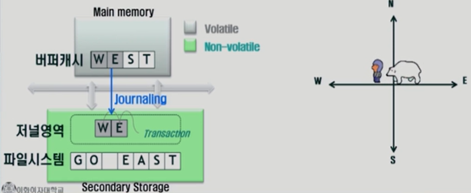

#### Another example

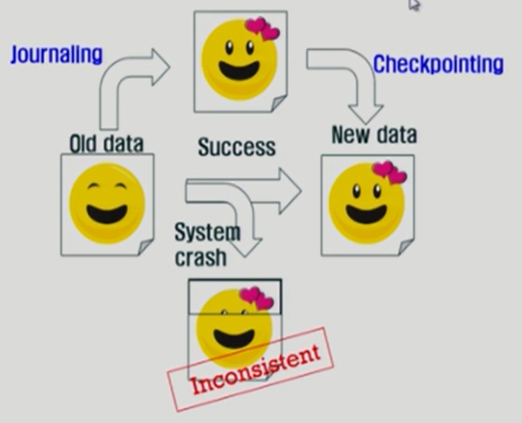

❗Ext4의 저널링에 크게 두 가지 모드가 있다.

#### Ext4의 저널링 - 메타데이터 저널링 모드

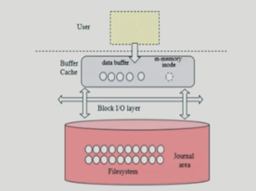

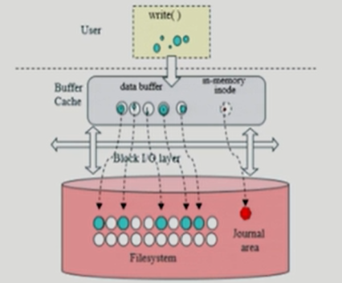

- 메타데이터만 저널링
  - 저널링 주기가 도래하면 데이터를 파일 시스템에 저장한 후 메타데이터를 저널영역에 기록
  - 체크포인팅 주기가 도래하면 메타데이터를 파일시스템에 반영(체크포인팅)
  - 크래쉬 발생 시 파일시스템 자체가 깨어지는 것 방지(일부 데이터 훼손 가능)

#### Ext4의 저널링 - 데이터 저널링 모드

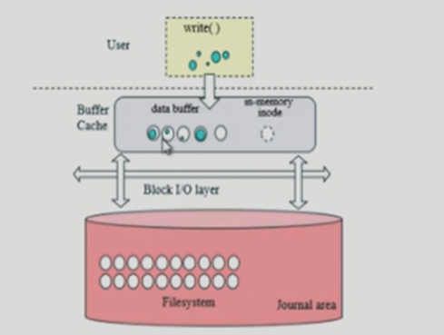

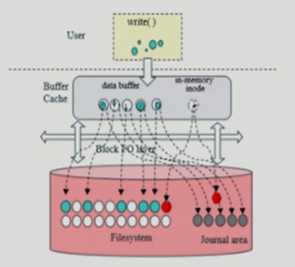

- 메타데이터와 일반 데이터의 모두 저널링
  - 저널링 주기가 도래하면 데이터와 메타데이터를 저널영역에 기록
  - 체크포인팅 주기가 도래하면 데이터와 메타데이터를 파일시스템에 반영
  - 크래쉬 발생 시 데이터 자체의 복구 보장

#### 파일시스템을 위한 버퍼캐시 알고리즘

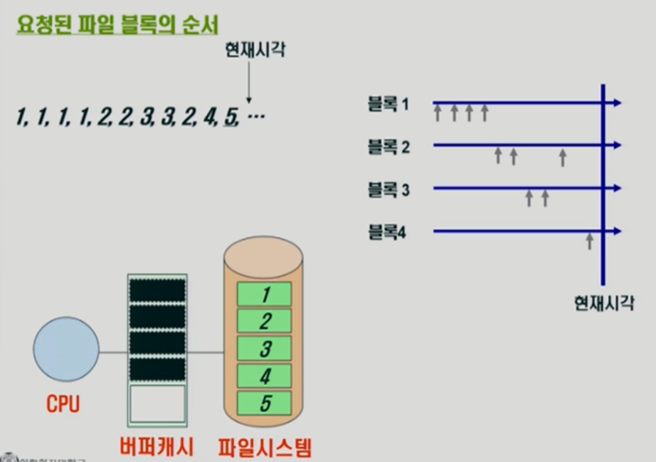

- 현재시각 5번 블록을 보관하기 위해 어떤 블록을 삭제해야 하는가?
  - LRU(가장 오래 전에 사용된 블록 삭제) : 블록 1
    - 가까운 미래에 사용될 가능성이 낮은 페이지를 쫓아내는 방식을 효율적이라 생각
  - LFU(사용 횟수가 가장 적은 블록 삭제) : 블록 4
    - 데이터가 사용되는 분포가 적을수록 사용될 가능성이 적을 것이라 생각

#### LRFU 알고리즘

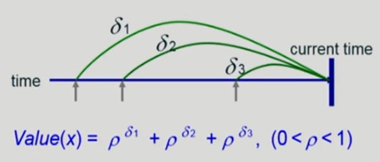

- 로우의 델타 승이 전부 합쳐져서 계산되는 식이다.
- 캐시 블록 x 중 그 가치평가값 Value(x)가 제일 적은 블록 삭제
- LFU적인 성질
  - 과거의 모든 참조 기록이 현재 시점의 블록 가치 계산에 합산됨
  - 사용 횟수가 많을수록 가치가 높아진다는 점에서 LFU적이다
- LRU적인 성질
  - 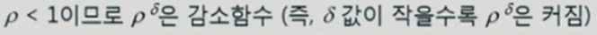
  - 최근 참조일수록 블록의 가치 평가에 대한 기여도가 큼

- 실효성
  - Space overhead
    - Should all the past reference times of each block be maintained?
    - 각 블록의 과거 참조 시간을 모두 유지해야 하는가?
  - Time overhead
    - Should the Value of all blocks in cache be re-calculated at each replacement decision?
    - 각 교체 결정 시 캐시의 모든 블록 값을 다시 계산해야 하는가?

- 효율적인 구현 방법
  - 공간 복잡도 Space Complexity
    - 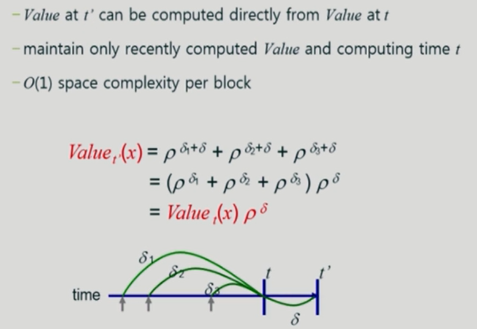
    - T 시점에 이미 구해놓은 value를 가지고 t 프라임 시점의 과거의 모든 기록을 가지고 있을 필요 없이, t 시점으로부터 얼마나 시간이 흘렀는가 그것을 지수로 해서 곱해주면 임의의 시점의 블록의 가치를 구할 수 있다.
    - = 모든 과거 기록을 참조할 필요 없이 어떤 시점의 블록의 가치를 미리 구해놓으면 아무리 시간이 흐르더라도 그 이후의 블록의 가치를 흐른 시간 정보만 가지고 계산할 수 있다.
  - 시간 복잡도 Time Complexity
    - 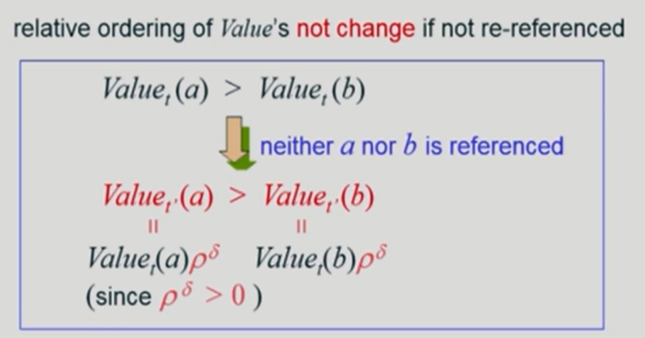
    - a든 b든 시간 흐름은 똑같으니 블록이 재사용되지 않는 이상은 계산의 가치는 크게 변하지 않는다!
    - 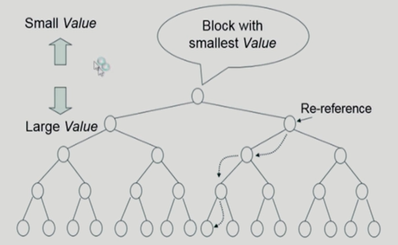
    - 모든 블록을 다 찾아볼 필요 없이 뿌리 루트를 찾아서 계산하면 밑의 블록들 다 찾아볼 필요가 없어진다.
    - 재사용된 블록은 value가 증가하니 그 블록만 직계자손들과 비교하여 value를 구하고 위치를 바꾸면 된다.

❗***복잡해보이지만 LFU와 LRU의 장점을 합쳐놓은 알고리즘이라 효율적이다!***

#### LRFU 알고리즘의 성능 분석

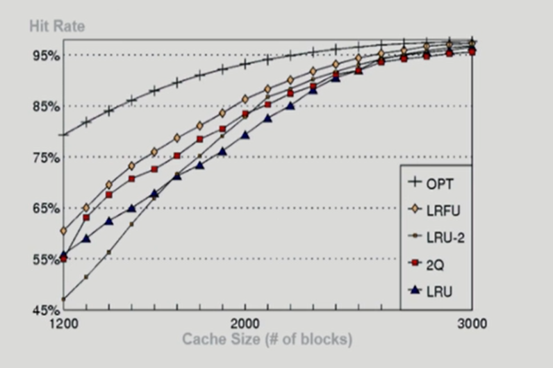