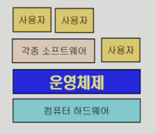
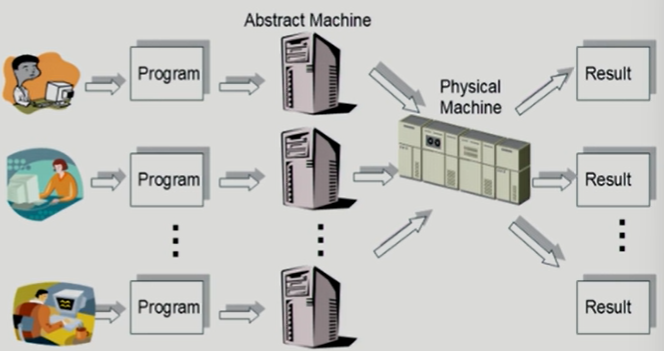
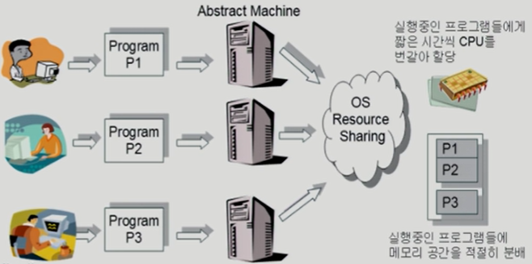
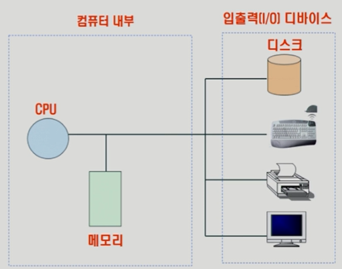
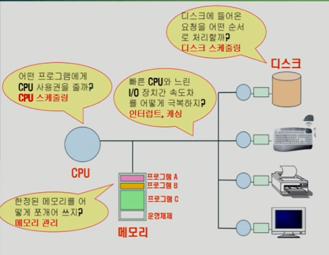
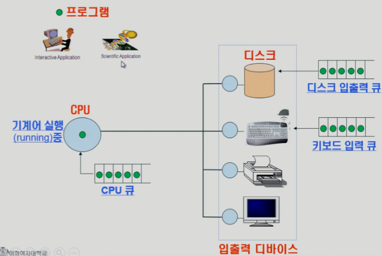

### 운영체제

#### 운영체제(Operating System, OS)란?

- 컴퓨터 하드웨어 바로 위에 설치되어 사용자 및 다른 모든 소프트웨어와 하드웨어를 연결하는 소프트웨어 계층

✅ 컴퓨터 시스템의 자원들을 효율적으로 관리하며, 사용자가 컴퓨터를 편리하고, 효과적으로 사용할 수 있도록 환경을 제공하는 여러 프로그램의 모임

ex) 윈도우(Windows), 맥 OS(Mac OS), 리눅스(Linux), 유닉스(Unix) 등

❓왜 필요할까?

- 키보드, 마우스는 사용자의 움직임대로 컴퓨터 화면에 나타나는 것을 혼자 할 수 없다.
- 메모리의 기능은 파일이나 프로그램을 저장하는 것인데 어떤 파일을 어떻게 어디에 저장하는지를 혼자 할 수 없다.
- 저장매체는 컴퓨터의 어디에 어떻게 저장되어야하는지 모른다.

- 컴퓨터 시스템을 편리하게 사용할 수 있는 환경을 제공
  - 운영체제는 동시 사용자/프로그램들이 각각 독자적 컴퓨터에서 수행되는 것 같은 환상(illusion)을 제공
  - 하드웨어를 직접 다루는 복잡한 부분을 운영체제가 대행

- 컴퓨터 시스템의 ***자원을 효율적으로 관리***
  - CPU, 메모리, I/O 장치 등의 효율적 관리
    - 주어진 자원으로 최대한의 성능을 내도록 -> ***효율성***
    - 특정 사용자/프로그램의 지나친 불이익이 발생하지 않도록 -> ***형평성***
  - 사용자 및 운영체제 자신의 보호

#### 운영체제의 목적

- **처리능력 향상**
  - 처리능력(Throughput) : 일정 시간 내에 시스템이 처리하는 일의 양
- **반환 시간 단축**
  - 반환시간(Turn Around Time) : 시스템에 작업을 의뢰한 시간부터 처리가 완료될 때까지 걸린 시간
- **사용 가능도 향상**
  - 사용가능도(Availability) : 시스템을 사용할 필요가 있을 때 즉시 사용 가능한 정도
- **신뢰도**
  - 신뢰도(Reliability) : 시스템이 주어진 문제를 정확하게 해결하는 정도

#### 컴퓨터 시스템의 구조

- **CPU** : 컴퓨터 부품과 정보를 교환하면서 컴퓨터 시스템 전체를 `제어`하는 장치
- **메모리(주기억장치) **: 컴퓨터에서 수치·명령·자료 등을 `기억`하는 컴퓨터 하드웨어 장치
- **I/O 디바이스** : 사용자가 원하는 문자나 그림의 데이터를 컴퓨터로 전달하는 하거나 출력하는 장치
  - ex) 입력 장치 : 키보드, 마우스
    - Input : 디바이스 측에서 무언가 작업해서 컴퓨터 내부로 넣는 것
  - ex) 출력 장치 : 모니터, 프린터
    - Output : 컴퓨터 내부 측에서 디스크로 배출하는 것/ 파일 형태로 저장하는 것

#### 운영체제의 기능

#### 프로세스의 상태

