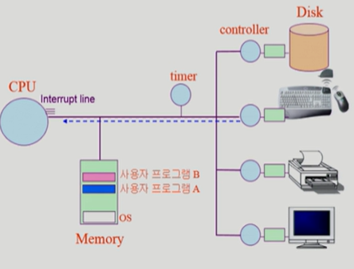

# 컴퓨터 시스템 구조 & 프로그램 실행

## 컴퓨터 시스템 구조

- 컴퓨터 내부
  - **CPU**
    - 연산하기 위한 장치

  - **mode bit**
    - CPU에서 기계어를 계속 실행하고 있는데, 운영체제를 사용할 때는 문제가 생기지 않지만 사용자 프로그램이 사용할 때는 CPU를 과도하게 오래 사용할 수 있는 등의 문제가 발생할 수 있는데, 운영체제를 이를 제어할 기능이 없음. 근데 이렇게 CPU를 운영체제가 사용하고 있는지, 사용자 프로그램이 사용하고 있는지를 확인하는 역할을 함.
    - **exception**
      - 권한이 없는 사용자 프로그램이 권한이 필요한 무언가를 하려고 할 때, 이때 mode bit은 0이기 때문에, 바로 CPU가 운영체제로 넘어감. 

  - **interrupt line**
    - 매 순간 기계어를 읽고 처리한 후, 다시 새로운 무언가를 하기에 앞서 interrupt line에 interrupt가 들어온 것이 있는지 확인.
    - interrupt가 들어왔다면 OS에게 CPU를 사용할 권할을 바로 넘김
  - **PC(program counter)** 
    - 다음번에 실행할 프로그램의 메모리의 주소를 가지고 있는 레지스터
    - 프로그램 카운터가 가리키고 있는 메모리를 읽어서 해당 기계어를 실행함. 
    - interrupt가 들어오면 무조건 OS를 가리키게됨.
  - **Memory**
    - CPU를 위한 작업 공간
    - 부팅: 컴퓨터 전원을 켜게 되면 메모리에 운영체제가 항상 상주하고 있음
    - 프로그램을 실행을 시키면 메모리에 해당 프로그램이 올라가 프로세스가 됨
    - Memory도 device이기 때문에 이를 전담하는 memory controller가 붙어있음.

  - **timer**
    - 특정 프로그램의 CPU 독점을 막기 위해 존재
      - 무한 루프를 돌고 있는 프로그램이 존재한다고 했을 때, 그 CPU 사용권한은 OS 혼자 뺏어올 수 없음. 

    - 일정 시간 간격으로 interrupt를 발생시킴. 
      - 일정 시간이 흘러 발생된 interrupt로 운영체제가 다시 CPU권한을 가져오게 되고 다른 프로그램에게 CPU를 넘겨줄 수 있게 됨.

    - 운영체제가 프로그램에게 CPU를 넘길 때 timer setting 후 넘겨줌. 

  - **DMA controller**
    - device controller의 interrupt가 너무 빈번하게 걸리는 것을 막기 위해, 특정 크기 까지 input이 찼을 때 가 메모리에 해당 내용을 직접 복사하여 저장
    - 해당 작업 다 끝나면 CPU에 interrupt를 한 번 걸어줌.

- I/O device
  - **Disk**
    - 파일 등을 저장하고 있는 저장공간

  - **disk controller**
    - I/O 장치에는 붙어있는 작은 연산장치
    - CPU가 Disk를 읽기 위해서는 disk controller에게 요청을 함. controller가 일을 다 마치면 CPU,에게 interrupt를 걸음. 그러면 CPU는 interrupt가 들어오면 바로 운영체제로 넘어가게 됨.
  - **local buffer**
    - 각각의 controller에 필요한 작업공간
  - Keyboard/Printer/Monitor

### mode bit

- 사용자 프로그램의 잘못된 수행으로 다른 프로그램 및 운영체제에 피해가 가지 않도록 하기 위한 보호 장치 필요

- Mode bit을 통해 하드웨어적으로 두 가지 모드의 operation 지원

  > 1 사용자 모드: **사용자 프로그램** 수행
  >
  > 0 모니터 모드: **OS** 코드 수행
  >
  > -> 운영체제게 사용자 프로그램에게 CPU를 넘겨줄 때 mode bit을 1로 바꿔서 넘겨줌.

  - 보안을 해칠 수 있는 중요한 명령어는 모니터 모드에서만 수행 가능한 `특권명령`으로 규정

  - Interrupt나 Exception 발생 시 하드웨어가 mode bit을 0으로 바꿈

  - 사용자 프로그램에게 CPU를 넘기기 전에 mode bit을 1로 세팅

    

### Timer

- 타이머
  - 정해진 시간이 흐른 뒤 운영체제에게 제어권이 넘어가도록 인터럽트를 발생시킴
  - 타이머를 매 클럭 틱 때마다 1씩 감소
  - 타이머 값이 0이 되면 타이머 인터럽트 발생
  - CPU를 특정 프로그램이 독점하는 것으로부터 보호
- 타이머는 time sharing을 구현하기 위해 널리 이용됨
- 타이머는 현재 시간을 계산하기 위해서도 사용.

### Device Controller

- I/O device controller
  - 해당 I/O 장치 유형을 관리하는 일종의 작은 CPU
  - 제어 정보를 위해 control register, status register를 가짐
  - local buffer를 가짐(일종의 data register)
  - 하드웨어 이기 때문에 내부 펌웨어(소프트웨어)로 작동됨.
- I/O는 실제 device와 local buffer 사이에서 일어남
- Device controller는 I/O가 끝났을 경우 interrupt로 CPU에 그 사실을 알림

> device driver(장치 구동기) : OS 코드 중 각 장치별 처리루틴 -> software
>
> CPU가 controller에게 요청을 할 때 CPU가 실행함
>
> device controller(장치제어기): 각 장치를 통제하는 일종의 작은 CPU -> hardware

### 인터럽트(Interrupt)

- 인터럽트
  - 인터럽트 당한 시점의 레지스터와 program counter를 save한 후 CPU의 제어를 인터럽트 처리 루틴에 넘긴다
- Interrupt(넓은 의미)
  - Interrupt(하드웨어 인터럽트): 하드웨어가 발생시킨 인터럽트
  - Trap(소프트웨어 인터럽트)
    - Exception: 프로그램이 오류를 범한 경우
    - System call: 프로그램이 커널 함수를 호출하는 경우
- 인터럽트 관련 용어
  - 인터럽트 벡터
    - 해당 인터럽트의 처리 루틴 주소를 가지고 있음
    - 인터럽트 별로 실행해야하는 코드가 다른데, 운영체제 내부의 해당 코드의 위치를 가리킴.
  - 인터럽트 처리 루틴(= Interrupt Servie Routine, 인터럽트 핸들러)
    - 해당 인터럽트를 처리하는 커널 함수
    - 해당 인터럽트에서 무엇을 해야하는지 적혀있음.

### 시스템콜(System Call)

- 시스템콜

  - 사용자 프로그램이 운영체제의 서비스를 받기 위해 커널 함수를 호출하는 것

    

  - 모든 I/O 장치를 접근하는 기계어는 모두 특권 명령임. 그걸 하려면 OS한테 해달라고 요청을 해야함. 

  - 운영체제가 실행되기 위해서는 OS에게 역할을 넘겨야하는데, 이를 위해 스스로 interrupt를 거는 것

### 동기식 입출력과 비동기식 입출력

- 동기식 입출력(synchronous I/O)

  - I/O 요청 후 입출력 작업이 완료된 후에야 제어가 사용자 프로그램에 넘어감
  - 구현 방법1
    - I/O가 끝날 때까지 CPU를 낭비시킴
    - 매시점 하나의 I/O만 일어날 수 있음
  - 구현 방법 2
    - I/O가 완료될 때까지 해당 프로그램에게서 CPU를 빼앗음
    - I/O 처리를 기다리는 줄에 그 프로그램을 줄 세움
    - 다른 프로그램에게 CPU를 줌

- 비동기식 입출력(asynchronous I/O)

  - I/O가 시작된 후 입출력 작업이 끝나기를 기다리지 않고 제어가 사용자 프로그램에 즉시 넘어감

  

### DMA(Direct Memory Access)

- 빠른 입출력 장치를 메모리에 가까운 속도로 처리하기 위해 사용

- CPU의 중재 없이 device controller가 device의 buffer storage의 내용을 메모리에 block 단위로 직접 전송

- 바이트 단위가 아니라 **block 단위로 인터럽트를 발생시킴**

  

### 서로 다른 입출력 기계어

- I/O를 수행하는 기계어에는 종류가 두가지 있음.
  - I/O를 수행하는 special instruction(기계어)에 의해
    - memory에 접근하는 기계어가 따로 있고 I/O를 하는 기계어가 따로 있는 형태.
  - Memory Mapped I/O 의해
    - memory 주소를 I/O 장치에도 main memory 주소를 연장해서 매겨 놓고 메모리 접근하는 I/O 기계어를 통해.

### 저장장치 계층 구조

- 맨 위에 CPU부터 제일 아래 I/O 까지 저장장치가 계층적으로 구성이 되고 위로 갈수록 용량이 작으면서 빠르고 비싸지만, 용량이 크지만 느려서 저렴함. 
- 실제로 모든 데이터는 아래에 저장이 되어있고 위에서 가져다가 쓰는 형태.
- 캐싱
  - 원하는 데이터가 있을 때, 제일 아래까지 내려와서 가저가기엔 너무 느리기 때문에 이미 가지고 있는 데이터가 있다면 해당 데이터를 사용. -> 재사용성. 
  - 재사용성이 높은 것을 캐쉬에 저장해두는 것이 효율적

- Primary
  - CPU가 직접 접근할 수 있는 부분 -> executable함(직접 실행이 가능함)
  - 휘발성 : 전원이 나가면 내용이 사라짐.

- Secondary
  - I/O controller에 요청을 해서 위로 읽어들여야 함. 
  - 비휘발성: 전원이 나가도 저장이 됨.