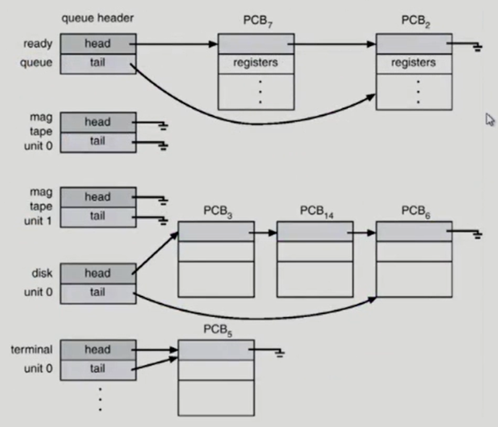

## 프로그램의 실행 (메모리 load)

- 프로그램은 실행파일 안에 저장되어있다가 실행시키면 메모리에 올라가서 프로세스가 됨

- **프로그램이 실행**될 때, 그 프로그램만의 **독자적인 Address space가 만들어짐** => **Virtual memory**
- 각각의 프로그램들은 자기만의 주소공간이 0번지부터 존재함
- **당장 필요**한 부분은 **메모리**에 올라감
- **그렇지 않은 부분**은 디스크의 **Swap area**에 내려가 있음
- 논리적 주소 -> 물리적 주소 (주소변환 필요)
- Address space 구성요소
  - code : 실행파일의 코드가 올라오는 부분. CPU에서 수행할 기계어가 위치함
  - data : 전역변수나 프로그램이 시작해서 남아있는 데이터가 위치함
  - stack : 모든 프로그램들이 어떤 언어로 작성되었건 함수 구조로 되어있는데 **함수가 호출 혹은 리턴될 때 관련 정보를 쌓아뒀다가 이용**함
- 커널 : 하나의 프로그램 => 함수 구조

- 모든 하드웨어를 관리하기 위한 자료구조 가짐
- 모든 프로세스를 관리하기 위한 자료구조 가짐 (PCB)
- 각 프로그램이 서비스를 요청할 수 있기 때문에 **커널 스택은 각 프로세스마다 별도**로 두고 있음
  - 운영체제가 프로그램 A 때문에 호출되었다면 프로세스 A의 커널 스택을 사용함

## 사용자 프로그램이 사용하는 함수

- 함수(function)
  - 사용자 정의 함수
    - 자신의 프로그램에서 정의한 함수
    - 내 프로그램 Address space의 code에 존재
  - 라이브러리 함수
    - 갖다 쓴 함수
    - 자신의 프로그램의 실행 파일에 포함되어 있다
    - 내 프로그램 Address space의 code에 존재
  - 커널 함수
    - 운영체제 안의 함수
    - 커널 함수의 호출 = 시스템 콜
    - Kernel Address space의 code에 존재
    - 시스템 콜이 일어날 때는 interupt line을 세팅해 CPU 제어권이 운영체제 제어권으로 넘어가게 한 다음 실행함

## 프로그램의 실행

- **사용자 정의 함수**나 **라이브러리 함수**가 쓰일 때는 내 주소공간에 있는 코드가 **user mode**에서 실행됨
- **시스템 콜**을 하게 되면, CPU 제어권이 운영체제 제어권으로 넘어가서 운영체제의 주소공간에 있는 코드가 **kernel mode**에서 실행됨
- 프로그램 하나가 실행될 때 user mode와 kernel mode가 **반복**되다가 종료
- mode bit 참고

# 3장

## 프로세스의 개념

- 실행 중인 프로그램
- 프로세스의 문맥(context)
  - **CPU 수행 상태**를 나타내는 하드웨어 문맥
    - Program Counter
    - 각종 register(기계어)
  - 프로세스의 주소 공간
    - code, data(변수나 데이터의 값 얼마?), stack(함수 몇개 호출, 몇개나 실행됐는가)
  - 프로세스 관련 커널 자료 구조
    - PCB(Process Control Block) : 프로세스를 관리하기 위한 자료구조(CPU를 얼마나 썼나, 메모리를 어떻게 썼는지)
    - Kernel stack

## 프로세스의 상태

- CPU가 하나이므로 **CPU에서 기계어를 수행하는 프로세스는 매순간 하나** => **Running** 상태
- CPU를 쓰기 위해 기다리는 프로세스들 => **Ready** 상태
- 오래 걸리는 작업, CPU를 얻어도 당장 기계어 실행이 불가한 작업 => **Blocked** 상태
  - ex. 키보드 입력을 받는 작업을 한다면, 키보드 입력을 받을 때까지 기다려야 함 => 그 후 instruction 수행이 가능함
- **Blocked 상태에서 Ready 상태로 어떻게 변환?**
  - ex. 키보드 입력이 들어오면 키보드 컨트롤러가 CPU 컨트롤러에게 인터럽트를 걸고 CPU 제어권이 운영체제에 넘어옴 -> Blocked 상태의 프로세스를 Ready 상태로 바꿔줌 & 키보드에 입력된 내용을 프로세스한테 copy해서 CPU를 얻을 수 있게 함

- 운영체제가 자신의 데이터 영역에 PCB 하나씩 두고 관리함

- ready 
  - 온전한 프로세스 상태
  - 메모리에 올라가 있음 -> CPU만 주면 바로 실행됨
- running하다가 나가는 3가지 경우
  - Timer interrupt
  - 오래 걸리는 작업에 들어갈 때(blocked 상태)
  - 종료

## Process Control Block (PCB)

- **운영체제가 각 프로세스를 관리하기 위해 두는 자료구조**
- 커널 주소공간 안에 존재
- 구성요소
  - OS가 관리상 사용하는 정보
    - Process state(ready, running, blocked, ...) , Process ID(aka. 주민번호)
    - scheduling information, priority(우선순위 높은 순대로 CPU 넘겨줌)
  - CPU 수행 관련 하드웨어 값
    - Program counter, registers (CPU가 뺏기면 현재 어디 실행했는지, 다음에 어디 실행해야 하는지 save할 필요있음)
  - 메모리 관련
    - code, data, stack의 위치 정보
  - 파일 관련
    - Open file descriptors

## 문맥 교환 (Context Switch)

- CPU를 한 프로세스에서 다른 프로세스로 넘겨주는 과정

  - **CPU에 빼앗기는 프로세스의 문맥을 저장**하고 **CPU를 새롭게 얻는 프로세스의 문맥을 복원**시켜주는 과정
  - 저장과 복원을 **PCB**에서 함

  

❗(1) **문맥 교환이 아닌 경우** 

❗(2) **문맥 교환 맞음** : 다른 프로세스로 넘어가는 경우

(1)의 경우 context 일부를 PCB에 save해야 함 but, (2)는 그 부담이 훨씬 큼(eg. cache memory flush : 프로세스 A에서 B로 갈 때 캐시 메모리 모두 지우고 감)

## 프로세스를 스케줄링하기 위한 큐

- Job queue
  - 현재 실행 중인 모든 프로세스가 들어있음
- Ready queue
  - Job queue에 있는 프로세스 중 당장 CPU를 얻어도 되는 프로세스 집합
- Device queue
  - I/O device의 처리를 기다리는 프로세스의 집합

- 프로세스가 처음에 실행되면 -> ready queue에 들어가서 대기 -> 본인 차례되면 CPU 얻음 -> 프로세스 종료되면 -> ...
- fork : 나와 똑같은 프로세스 만듦(복제 생성)

## 스케줄러 (Scheduler)

- **운영체제에서 스케줄링을 하는 코드**
- Long-term scheduler(장기 스케줄러 or job scheduler)
  - 프로세스가 memory에 들어오도록 허락해주는(**ready 상태로 전환**) 역할
  - time sharing system에는 장기 스케줄러 없음(보통 바로 ready)
  - degree of Multiprogramming을 제어(메모리에 프로그램 올라가는 양 조절)
- Short-term scheduler(단기 스케줄러 or CPU scheduler)
  - **CPU를 누구한테 얼마나 줄지 결정**하는 운영체제 코드
  - 단기 스케줄러는 자주 호출됨 -> 빨라야 함(millisecond 단위)
- Medium-term scheduler(중기 스케줄러 or Swapper)
  - **특정 프로세스를 메모리에서 쫓아냄**
  - degree of Multiprogramming을 제어
  - 메모리에서 쫓겨난 상태: suspended/stopped

## 프로세스의 상태 (Process State)

- Running
- Ready
- Blocked(wait, sleep)
- Suspended(stopped)
  - 외부적인 이유로 수행 정지 상태
  - 프로그램 일시 정지시킬 때

❗**Blocked와 Suspended 차이점** :  Blocked는 CPU만 없지 I/O 작업 등을 하고 있는 상태. Suspended는 외부요인에 의해 정지됨. 

- Suspended Blocked & Suspended Ready : 메모리 없는 상태
  - 외부에서 메모리를 주면 다시 active가 됨
  - I/O 작업 중이었다면 inactive 상태에도 I/O 작업 가능
- swap out : 메모리에서 통째로 쫓겨남
- swap in : 메모리로 들어옴
- 어떤 프로세스가 자기 코드를 수행 중이면 : user mode에서 running
- 시스템 콜을 해서 운영체제에서 수행 중일 때 : CPU를 빼앗긴 상태가 아니라 프로세스에서 일처리되고 있다고 봐야 함(프로그램 실행 참고) => 커널에서 running이 아니라, kernel mode에서 running
- interrupt가 들어온 경우 : ex. 프로그램 A가 CPU를 얻어 running 하고 있을 때 Disk controller가 interrupt를 발생시킴 -> CPU는 운영체제에 넘어감 -> CPU가 뺏겼어도 프로세스 A는 kernel mode에서 여전히 running이라고 간주
- Disk I/O를 하기 위해서 
  - 시스템 콜을 해서 요청 => software interrupt
  - 종료됐을 때 disk controller가 CPU에게 interrupt를 걸어서 I/O가 끝났음을 알림 => hardware interrupt

## Thread

- 프로세스 중 CPU 수행 단위
- 구성
  - program counter
  - register set
  - stack space
- Thread가 동료 Thread와 공유하는 부분(=task)
  - code section
  - data section
  - OS resources
- 각각의 프로세스를 만들면 비효율적이므로 -> code의 어느 부분을 수행하고 있는가에 해당하는 값을 Thread가 각각의 위치 나타냄
- 프로세스에서 CPU 수행과 관련된 부분만 별도로 가짐(관리)
- 그외의 것들은 단일 프로세스로 쉐어함
- register값과 stack만 다르게
- 장점 : 동일한 프로세스 안에서 Thread1 -> Thread2 CPU가 넘어갈 때 overhead 없이 수행됨

- 다중 스레드로 구성된 태스크 구조에서 하나의 서버 스레드가 blocked 상태인 동안에 동일한 태스크 내 다른 스레드가 실행(running)되어 빠른 처리할 수 있음
- 비동기식 입출력도 스레드 환경에서 효과적으로 동작 가능

## 스레드의 장점

- Responsiveness
  - 응답성이 빠르다
- Resource Sharing
  - 자원을 공유하는 효과 있음
- Economy
  - 프로세스 여러 개 vs 프로세스 안 스레드 여러 개
  - creating과 CPU switching 비용 차이
- Utilization of MP Architectures
  - 병렬성 추구 가능(CPU 여러 개 있을 때 더 빨리 작업 가능)

## 스레드 구현 방법

- 운영체제가 스레드 존재를 알게 구현하는 것 => Kernel threads
- 운영체제가 스레드 존재 모름 => User threads (스레드가 없는 프로세스처럼 보임)
- 리얼타임 목적으로 사용하는 경우도 있음

## 프로세스 생성 (Process Creation)

- 부모 프로세스(Parent Process)가 자식 프로세스(Children Process) 생성

- 운영체제에게 만들어달라고 요청해서 생성(fork)
- 계층 구조(트리) 형성
- 프로세스는 자원을 부모와 공유함(원칙적으로는 자원을 얻기 위해 싸움)
- 수행(execution)
  - 부모와 자식이 공존하는 모델
  - 자식이 종료될 때까지 부모가 기다리는 모델(blocked)
- 주소 공간(Address space)
  - 부모 공간 그대로 복사(binary and OS data)
  - 자식은 그 공간에 새 프로그램 올림
- 여러 프로그램을 돌리려면 복제해놓고 덮어씌워서 돌림 => exec () 시스템 콜

## 프로세스 종료 (Process Termination)

- 프로세스가 마지막 명령을 수행한 후 운영체제에 알려줌 (exit)
  - 부모에게 통보됨
- 부모가 자식의 수행을 종료시킴 (abort)
  - 할당 자원의 한계치를 넘어섬
  - 자식에게 할당된 태스크가 더이상 필요하지 X
  - 부모가 exit하는 경우
    - 단계적 종료(말단부터 차례로)

## fork() 시스템 콜

- fork하면 왼쪽 프로세스와 동일한 프로세스가 생성됨
- pid 값으로 부모, 자식 구분

## exec() 시스템 콜

- execlp("프로그램 이름", "프로그램 이름", (프로그램에 전달할 arguments 나열) 0) => 새로운 프로그램으로 덮어씌워짐
- execlp 실행 후 밑의 Hello는 출력안됨
  - execlp() : PATH 에 등록된 디렉토리를 참고하여 다른 프로그램을 실행하고 종료하는 함수

- 자식에게 fork 후 execlp 사용, 부모는 그대로