# 5강. CPU 스케줄링

### CPU and I/O Bursts in Program Execution

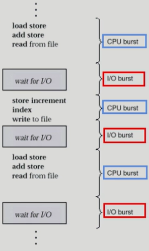

- 프로그램 실행 과정에서 계속 두가지 단계가 번갈아가면서 수행됨
- CPU burst
  - CPU를 가지고 기계어를 수행하는 단계
- I/O burst
  - I/O를 가지고 하는 단계

### CPU-burst Time의 분포

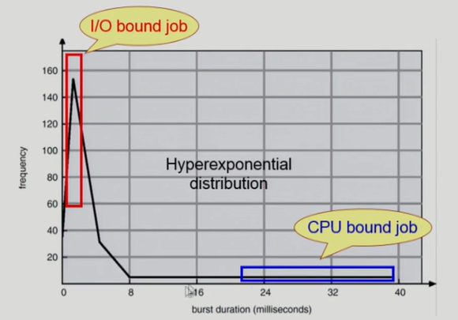

- CPU-burst Time
  - CPU를 한 번에 얼마나 오래 쓰느냐?
  - CPU bound job: CPU 사용이 오래 걸리는 작업
  - I/O bound job: I/O 사용이 오래 걸리는 작업
    - 사용자와 interaction이 많음

- 여러 종류의 job(=process)이 섞여 있기 떄문에 CPU 스케줄링이 필요하다
  - Interactive job에게 적절한 response 제공 요망
  - CPU와 I/O 장치 등 시스템 자원을 골고루 효율적으로 사용 

### 프로세스의 특성 분류

- 프로세스는 그 특성에 따라 다음 두 가지로 나눔
  - **I/O bound process**
    - CPU를 잡고 계산하는 시간보다 I/O에 많은 시간이 필요한 job
    - (many short CPU bursts)
  - **CPU-bound process**
    - 계산 위주의 job
    - (few very long CPU bursts)

### CPU Scheduler & Dispatcher

-> 운영체제 코드의 일부임

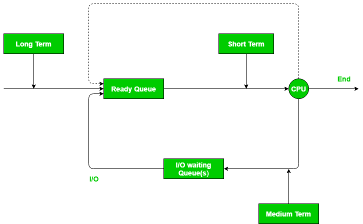

- **CPU Scheduler**
  - Ready 상태의 프로세스 중에서 **이번에 CPU를 줄 프로세스를 고른다**
- **Dispatcher**
  - **CPU의 제어권**을 CPU scheduler에 의해 **선택된 프로세스에게 넘긴다**
  - 이 과정을 context switch(문맥 교환)라고 한다
- CPU 스케줄링이 필요한 경우는 프로세스에게 다음과 같은 상태 변화가 있는 경우이다.
  1. Running -> Blocked (예: I/O 요청하는 시스템콜)
  2. Running -> Ready (예: 할당시간 만료로 timer interrupt)
  3. Blocked -> Ready (예: I/O 완료 후 인터럽트)
  4. Terminate
- 1, 4에서의 스케줄링은 **nonpreemptive**(=강제로 빼앗지 않고 자진 반납)
-  그 외의 스케줄링은 **preemptive**(=강제로 빼앗음)

### Scheduling Criteria

Permomance Index (= Performance Measure, 성능 척도)

- CPU utilization(이용률)
  - 전체시간 중에서 CPU가 놀지 않고 일한 시간의 비율
  - running time / (running time + idle time)
    - idle:  유휴 또는 아이들은 어떠한 프로그램에 의해서도 사용되지 않는 상태
- Throughput(처리량)
  - 단위시간 당 완료된 프로세스 수
- Turnaround time(소요시간, 반환시간)
  - 프로세스를 완료하거나 요청을 이행하는 데 걸리는 시간
  - 다음 I/O를 하러 갈 때까지 걸리는 시간
  - Completion Time - Arrival Time
- Waiting time(대기 시간)
  - 프로세스가 ready queue에서 기다린 시간
  - I/O를 나가기 전까지 ready queue에서 기다린 모든 시간의 합
- Response time(응답시간)
  - 요청하고나서 첫번째 응답이 생성되기 까지 걸리는 시간
  - I/O를 끝내고 돌아와서 CPU burst에 들어와서 처음으로 CPU를 얻기까지 걸리는 시간
  - FirstRun Time - Arrival Time

### Sceduling Algorithms

- FCFS(First Come First-Served)
  - nonpreemptive
- SJF(Shortest Job First)
  - nonpreemptive
- SRTF(Shortest-Remaining-Time-First)
  - preemptive
- Priority Scheduling
  - preemptive
  - nonpreemptive

- RR (Round Robin)
  - preemptive

- Multilevel Queue
- Multilevel Feedback Queue

### FCFS(First-Come First-Served)

- 프로세스가 먼저 도착한 순서대로 처리해줌

  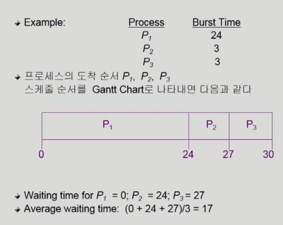

  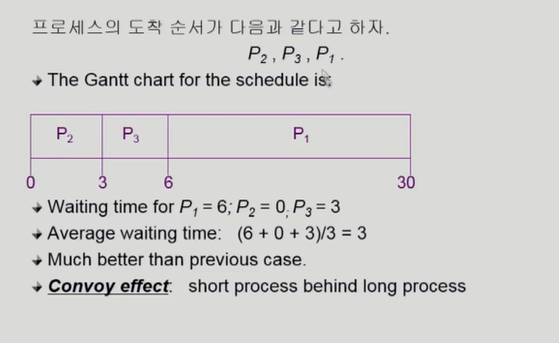

  - convoy effect: 수행시간이 긴 프로세스가 먼저 와서 처리되면서 수행시간이 짧은 프로세스가 오래 기다려야하는 현상

### SJF(Shortest Job First)

- 각 프로세스의 다음번 CPU burst time을 가지고 스케줄링에 활용

- **CPU burst time이 가장 짧은 프로세스를 제일 먼저 스케줄**

- Two schemes:

  - **Nonpreemptive**

    - 일단 CPU를 잡으면 이번 CPU burst가 완료될 때까지 CPU를 선점(preemption)당하지 않음

      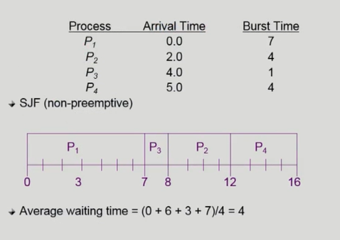

  - **Preemptive**

    - 현재 수행중인 프로세스의 남은 burst time보다 <u>더 짧은 CPU burst time을 가지는 프로세스가 도착하면 CPU를 빼앗김</u>

    - 이 방법을 **Shortest-Remaining-Time-First(SPTF)**이라고도 부름

      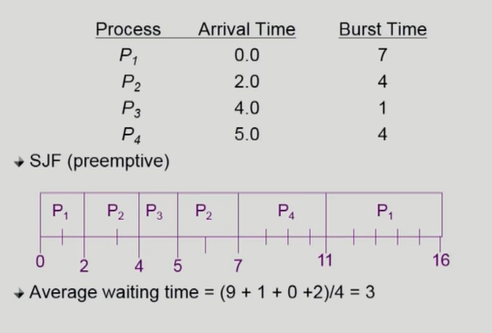

  - SJF is optimal(최적의 방법)

    - 주어진 프로세스들에 대해 minimum average waiting time을 보장.

  - 문제점

    - **starvation**을 발생시킴
      - CPU burst time이 긴 프로세스는 계속 뒤로 밀려남.
    - CPU burst time을 예측하기 어려움

#### 다음 CPU Burst Time의 예측

- 다음번 CPU burst time을 어떻게 알 수 있는가?(input data, branch, user)

  - 각 프로세스의 성격에 따라 갈리기 때문에 예측.
  - CPU burst가 길다면 다음 번에도 길지 않을까? 하는 추측

- 추정(estimate)만이 가능하다

- 과거의 CPU burst time을 이용해서 추정(exponential averaging)

  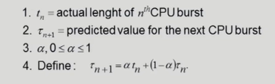

  ​		$t$ -> 이미 수행된 CPU burst time

  ​		$\tau$ -> 예측된 다음 CPU burst time

  ​		$\alpha$ -> 가중치

#### Exponential Averaging

- $\alpha = 0$
  - $\tau_{n+1} = \tau_{n}$
  - Recent history does not count
  
- $\alpha = 1$
  - $\tau_{n+1} = t_{n}$
  - Only the actual last CPU burst counts.
  
- 식을 풀면 다음과 같다

  - $\tau_{n+1} = \alpha t_{n} + (1-\alpha)\alpha t_{n-1} + ...$

    ​				$+(1-\alpha)^{j}\alpha t_{n-j} + ...$

​								$+(1-\alpha)^{n+1} \tau_{0}$

​				$(1-\alpha)$가 여러번 곱해질수록 더 작아

- $\alpha$와 $(1-\alpha)$가 둘다 1이하이므로 후속 term은 선행 term보다 적은 가중치 값을 가진다

### Priority Scheduling

- 각각의 프로세스에게 **priority number**를 준다
- <u>highest priority를 가진 프로세스에게 CPU를 할당</u> (smallest integer = highest priority)
  - preemptive
  - nonpreemptive
- SJF는 일종의 priority scheduling이다
  - priority = predicted next CPU burst time
- Problem
  - Starvation: 낮은 우선순위를 가진 프로세스는 수행되지 못함
- Solution
  - Aging: 오래 기다릴수록 프로세스의 우선순위를 높여줌.

### Round Robin(RR)

- 각 프로세스는 동일한 크기의 할당 시간(time quantum)을 가짐(일반적으로 10~100 ms)
- <u>할당 시간이 지나면 프로세스는 선점(preempted)당하고 ready queue의 제일 뒤에 가서 다시 줄을 선다</u>
- n개의 프로세스가 ready queue에 있고 할당 시간이 q time unit인 경우 각 프로세스는 최대 q time unit 단위로 CPU 시간의 1/n을 얻는다.
  - **어떤 프로세스도 (n-1)q time unit 이상 기다리지 않는다.**
- Perfomance
  - q large -> FCFS
  - q small -> context switch 오버헤드가 커진다.

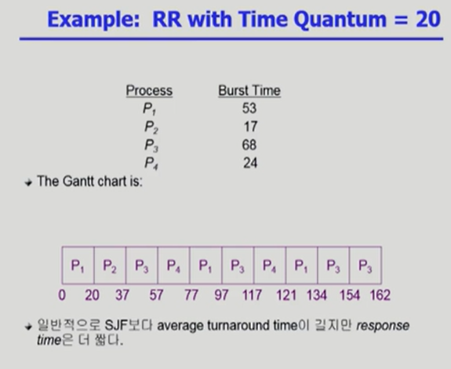

- **response time이 짧음**
  - 최초로 CPU를 얻는 시간이 짧아짐
- CPU burst time이 길수록 waiting time이 길어짐.

#### Turnaround Time vaires with time quantum

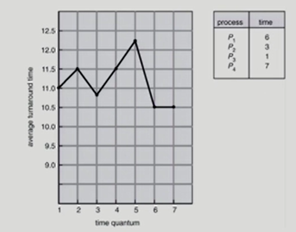

time quantume에 따른 turnaround time이 달라지는 것을 볼 수 있음.

무조건 짧다고 or 길다고 좋지는 않음.

### Multilevel Queue

프로세스들을 중요도에 따라 여러 종류의 그룹으로 나누어 여러 개의 큐에 다양한 알고리즘을 적용한 스케줄링

- **Ready queue를 여러 개로 분할**
  - **foreground**(interactive)
  - **background**(batch - no human interaction)
    - batch: 인간과 상호작용이 적고 CPU만 사용.
- 각 큐는 독립적인 스케줄링 알고리즘을 가짐
  - **foreground - RR**
    - 응답시간이 빨라야하기 때문에
  - **background - FCFS**
- 큐에 대한 스케줄링이 필요
  - **Fixed priority scheduling**
    - 모든 foreground의 프로세스를 처리한 다음에 background를 처리
    - starvation
  - **Time slice**
    - 각 큐에 CPU time을 적절한 비율로 할당
    - 예) foreground에 80% 시간 할당, background에 20% 시간 할당

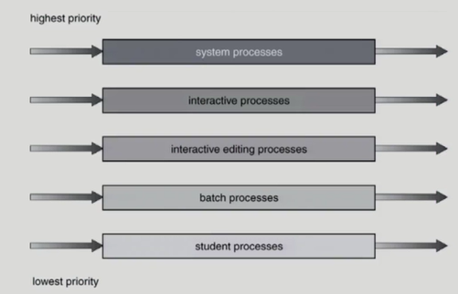

	### Multilevel Feedback Queue

- **프로세스가 다른 큐로 이동 가능**

- 에이징(aging)을 이와 같은 방식으로 구현할 수 있다

- Multilevel-feedback-queue scheduler를 정의하는 파라미터들

  - Queue의 수
  - 각 큐의 scheduling algorithm
  - Process를 상위 큐로 보내는 기준
  - Process를 하위 큐로 보내는 기준
  - 프로세스가 CPU 서비스를 받으려 할 때 들어가는 큐를 결정하는 기준

  ex)

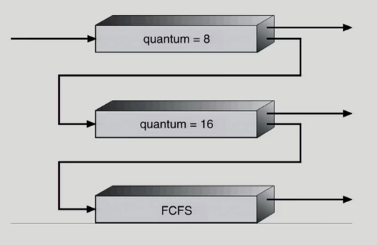

- Three queues:
  - Q~0~ - time quantum 8 ms
  - Q~1~ - time quantum 16ms
  - Q~2~ - FCFS
- Sceduling
  - 새로운 job이 queue Q~0~으로 들어감
  - CPU를 잡아서 할당 시간이 8ms 동안 수행됨
  - 8ms 동안 다 끝내지 못했으면 queue Q~1~으로 내려감
  - Q~1~에 줄서서 기다렸다가 CPU 를 잡아서 16ms 동안 수행됨
  - 16ms에 끝내지 못한 경우 queue Q~2~로 쫓겨남

### Multiple-Processor Scheduling

- **CPU가 여러 개**인 경우 스케줄링은 더욱 복잡해짐
- **Homogeneous processor**인 경우
  - Queue에 한줄로 세워서 각 프로세서가 알아서 꺼내가게 할 수 있다
  - 반드시 특정 프로세서에서 수행되어야 하는 프로세스가 있는 경우에는 문제가 더 복잡해짐(제약조건)
- **Load Sharing**
  - 일부 프로세서에 job이 몰리지 않도록 부하를 적절히 공유하는 메커니즘 필요
  - 별개의 큐를 두는 방법 vs 공동 큐를 사용하는 방법
- Symmetric Multiprocessing(SMP)
  - 각 프로세서가 각자 알아서 스케줄링 결정
- Asymmetric multiprocessing
  - 하나의 프로세서가 시스템 데이터의 접근과 공유를 책임지고 나머지 프로세서는 기기에 따름

### Real-Time Scheduling

arrival time, burst time, **deadline**이 붙게됨 -> deadline을 만족하는게 중요

- Hard real-time systems
  - Hard real-time task는 정해진 시간 안에 반드시 끝내도록 스케줄링해야함
  - 미리 offline으로 스케줄링 해두고 하는 경우가 많음(CPU 도착시간을 아는 경우)
- Soft real-time systems
  - Soft real-time task는 일반 프로세스에 비해 높은 priority를 갖도록 해야 함

### Thread Scheduling

- **Local Scheduling**
  - User level thread의 경우 사용자 수준의 thread library에 의해 어떤 thread를 스케줄할지 결정
- **Global Scheduling**
  - Kernel level thread의 경우 일반 프로세스와 마찬가지로 커널의 단기 스케줄러가 어떤 thread를 스케줄할지 결정

### Algorithm Evaluation

어떤 알고리즘이 좋은지 평가하는 방법

- **Queueing models**

  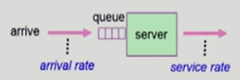

  - **확률 분포**로 주어지는 **arrival rate**와 **service rate** 등을 통해 각종 performance index 값을 계산

- **Implementation**(구현) & **Measurement**(성능 측정)

  - **실제 시스템**에 알고리즘을 **구현**하여 실제 작업(workload)에 대해서 **성능을 측정 비교**

- **Simulation**(모의 실험)

  - 알고리즘을 **모의 프로그램**으로 작성 후 **trace**를 입력으로 하여 결과 비교