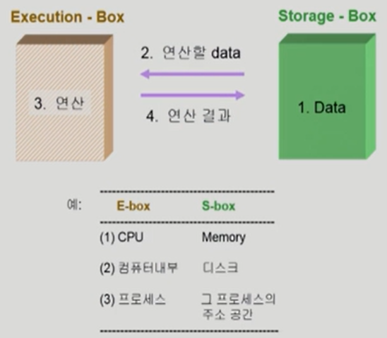
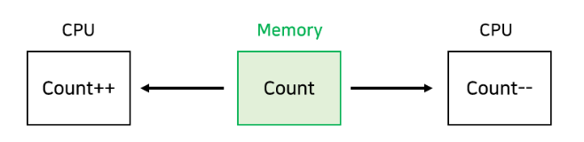

### 프로세스 동기화 (Process Synchronization)

#### 데이터의 접근

- Storage-Box에서 데이터를 불러 읽어오는데 E-box가 여럿 있는 경우 문제가 발생한다.
  - **경쟁상태(Race Condition)** : 둘 이상의 입력 또는 조작의 타이밍이나 순서 등이 결과값에 영향을 줄 수 있는 상태 => ***입력 변화의 타이밍이나 순서가 예상과 다르게 작동하면 정상적인 결과가 나오지 않게 될 위험***

- CPU가 하나 있는 상황 역시 이런 문제가 생길 수 있다! 
- 공유 데이터의 동시 접근(Concurrent access)은 데이터의 불일치 문제를 발생시킬 수 있다! 따라서 race condition을 막고 일관성을 유지하기 위해서 협력 프로세스 간의 실행 순서를 정해주는 매커니즘인 **동기화(Synchronization)**가 필요하다!

##### ❓ OS에서 race condition은 언제 발생하는가?

1. kernel 수행 중 인터럽트 발생 시
2. Process가 system call을 하여  kernel mode로 수행 중인데 context switch가 일어나는 경우
3. Multiprocessor에서 shared memory 내의 kernel data

##### 1. 커널 모드로 수행 중 인터럽트가 발생하는 경우(interrupt handler vs kernel)

- 커널모드 running 중 interrupt가 발생하여 인터럽트 처리루틴이 수행 => 양쪽 다 커널 코드이므로 kernel address space 공유
- 인터럽트가 들어오면 하던 일을 멈추고 CPU가 무조건 운영체제로 넘어감 => 끝나면 원위치로 돌아와 원래 하던 작업 수행
- ✔️ 의도된 동작은 count++와 count--가 모두 반영되어 count가 초기값을 유지하는 것이지만, 만약 Load를 한 후 인터럽트가 발생하는 경우 인터럽트의 결과는 반영되지 않고 count++만 반영된다.
  - ❗이는 커널 모드의 수행이 끝나기 전에는 인터럽트를 받지 않도록 하는 방법(disable/enable)로 문제 해결 가능

##### 2. 프로세스가 시스템 콜을 호출해서 커널 모드로 수행 중인데 Context Switch가 발생하는 경우 (Preempt a process running in kernel?)

- **시스템 콜(System call)** :  운영 체제의 커널이 제공하는 서비스에 대해, 응용 프로그램의 요청에 따라 커널에 접근하기 위한 인터페이스
- 두 프로세스의 address space 간에는 data sharing(데이터 공유)이 없음
- 그러나 system call을 하는 동안에는 kernel address space의 data를 access하게 됨(share)
- 이 작업 중간에 CPU를 preempt 해가면 race condition 발생
- ❗이는 커널 모드를 수행 중일 땐 CPU가 preempt 되지 않도록 하고, 커널 모드에서 유저 모드로 돌아갈 때 preempt 되도록 함으로써 해결할 수 있다. <= 커널 모드에 있다면 CPU의 제어권을 빼앗지 않도록!

##### 3. 여러 프로세스의 공유 메모리 내 커널 안 변수에 접근하는 경우 multiprocessor

- CPU가 여러 개인 시스템에서 공유 메모리 속 데이터를 여러 프로세스가 접근할 때 발생
- 어떤 CPU가 마지막으로 count를 store 했는가? => race condition
- multiprocessor의 경우 interrupt enable/disable로 해결되지 않음
  - 싱글일 경우는 1번과 같이 disable/enable 방법으로 해결 가능!
- ❗한 번에 하나의 CPU만이 커널에 들어갈 수 있게 하는 방법
  - 비효율적이다. 만약 두 프로세서가 서로 다른 데이터에 접근하여 race condition의 가능성이 없음에도 불구하고 한 번에 하나의 CPU만이 들어갈 수 있기 때문이다
- ❗ 커널 내부에 있는 각 공유 데이터에 접근할 때마다 그 데이터에 대한 lock/unlock을 하는 방법

#### Process Synchronization 문제

- 공유 데이터(shared data)의 동시 접근(concurrent access)은 ***데이터의 불일치 문제(inconsistency)를 발생***시킬 수 있다
- 일관성(consistency) 유지를 위해서는 ***협력 프로세스(cooperating process) 간의 실행 순서(orderly execution)를 정해주는 메커니즘 필요***
- Race condition
  - 여러 프로세스들이 동시에 공유 데이터를 접근하는 상황
  - 데이터의 최종 연산 결과는 마지막에 그 데이터를 다룬 프로세스에 따라 달라짐
- race condition을 막기 위해서는 concurrent process는 ***동기화(synchronization)***되어야 한다

- X = X + 1 이라는 문장 하나가 기계어로는 여러 개로 나뉘어짐

---

#### 임계구역 문제(The Critical-Section Problem)

- ✅ 임계 구역으로 지정되어야 할 코드 영역이 임계 구역으로 지정되지 않았을 때 발생할 수 있는 문제
  - **임계 구역** : 둘 이상의 스레드가 동시에 접근해서는 안 되는 공유 자원(자료 구조 또는 장치)에 접근하는 코드의 일부

- n개의 프로세스가 공유 데이터를 동시에 사용하기를 원하는 경우
- 각 프로세스의 code segment에는 공유 데이터를 접근하는 코드인 critical section이 존재
- Problem
  - 하나의 프로세스가 critical section에 있을 때 다른 모든 프로세스는 critical section에 들어갈 수 없어야 한다.

#### Initial Attempts to solve problem

- 2개의 프로세스가 있다고 가정 P01 P1
- 프로세스들의 일반적인 구조

- 프로세스들은 수행의 동기화(synchronize)를 위해 몇몇 변수를 공유할 수 있다 => synchronization variable
- critical section 들어가기 전에 ***lock***을 걸어서 나 혼자만 들어가 수행하고 이후에 다시 나오면서(***unlock***) 다른 친구가 CPU를 이용할 수 있도록 하는 방법도 있다

- 각 프로세스는 자신의 임계 구역에 들어가려면 들어가도 되는지 요청을 한다 => entry section에서 이루어짐
- 만일 이미 들어가있는 프로세스가 있다면 entry section에서 기다리다가 들어가도 된다는 신호가 있다면 critical section으로 들어간다