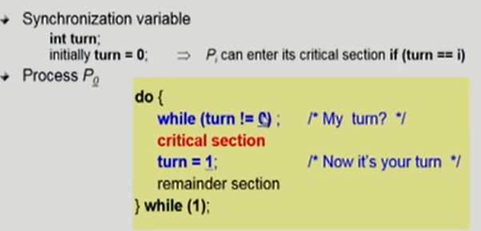
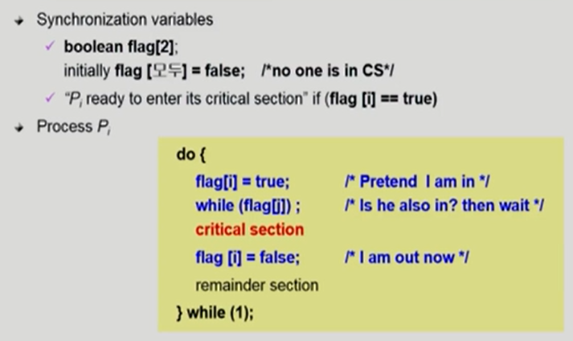
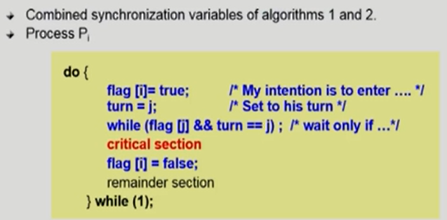
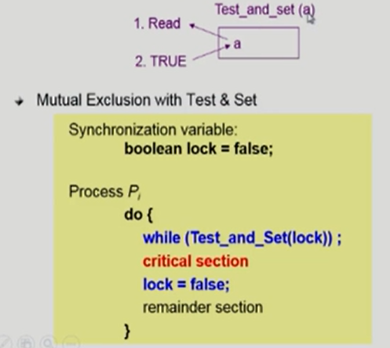
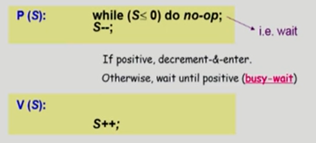
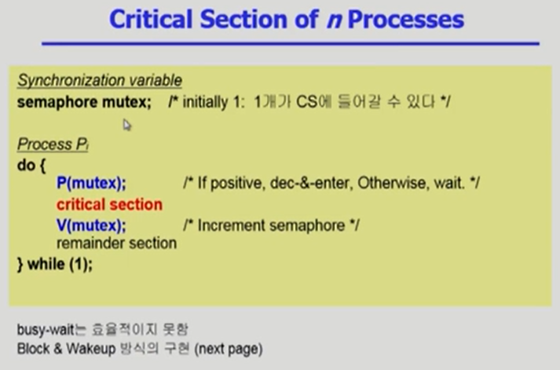
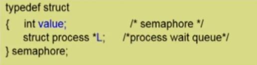
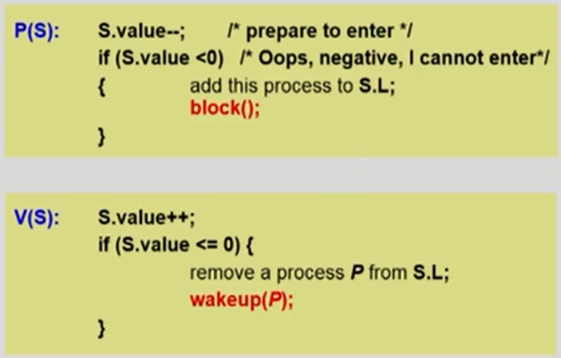

#### 임계구역 문제의 해결 조건

- **상호 배제(Mutual Exclusion)**
  - ✅ 하나의 프로세스가 임계 구역에 들어가 있다면 다른 프로세스는 들어갈 수 없다.
  - 프로세스 P가 critical section 부분을 수행 중이면 다른 모든 프로세스들은 그들의 critical section에 들어가면 안 된다
- **진행(Progress)**
  - ✅ 임계 구역에 들어간 프로세스가 없는 상태에서, 들어가려고 하는 프로세스가 여러 개 있다면 어느 것이 들어갈지를 적절히 결정해줘야 한다
  - 아무도 critical section에 있지 않은 상태에서 critical section에 들어가고자 하는 프로세스가 있다면 critical section에 들어가게 해주어야 한다
- **한정 대기(Bounded Waiting)**
  - ✅ 하나의 프로세스가 들어가서 오랫동안 나오지 않으면 다른 프로세스는 실행시킬 수 없게 된다. 이러한 기아(Starvation) 현상을 방지하기 위해 한 번 임계 구역에 들어간 프로세스는 다음 번 들어갈 때 제한을 둬야 한다.
  - 프로세스가 critical section에 들어가려고 요청한 후부터 그 요청이 허용될 때까지 다른 프로세스들이 critical section에 들어가는 횟수에 한계가 있어야 한다.
- ❗가정 
  - 모든 프로세스의 수행 속도는 0보다 크다
  - 프로세스들 간의 상대적인 수행 속도는 가정하지 않는다

### Race condition이 발생하지 않고 공유데이터에 접근하기 위한 방법

#### Algorithm 1

"Satisfies mutual exclusion, but not progress"

즉, **과잉양보** : 반드시 한 번씩 교대로 들어가야만 함(swap-turn). 그가 ***turn***을 내 값으로 바꿔줘야만 내가 들어갈 수 있음. 

- turn은 내 차례인지, 네 차례인지 알려주는 변수로 작용한다
  - turn이 0 이면 내 차례고, turn이 1이면 상대방 차례라는 뜻
  - turn은 상대방이 바꿔주는 영역.

- ❓ 이게 제대로 동작을 할까 ❓
  - 일단 둘이 동시에 들어가버리는 경우는 생기지 않는다!
  - BUT 엄격하게 너 한 번, 나 한 번 이렇게 돌아가게 되어있다 => 불합리하다! 특정 프로세스는 critical section을 더 자주 사용해야 하고 상대 프로세스는 critical section을 사용하지 않는 경우, 전자 프로세스는 turn이 돌아오지 않는 이상 영원히 critical section을 사용할 수 없다.
    - ***상호배제(Mutual Exclusion)***적이긴 하나 ***진행(Progress)***이 안된다

#### Algorithm 2

"Satisfies mutual exclusion, but not progress requirement"

- ***flag(깃발)***를 들어 들어가고 싶다는 의사를 보인다.
- 상대방의 깃발이 내려지면 critical section에 들어갈 수 있다. 
- 나 역시 critical section을 나올 때 깃발을 내려줘야 상대방이 critical section을 사용할 수 있게 표시를 해준다.

- ❗BUT 둘 다 2행까지 수행 후 끊임 없이 양보하는 상황 발생 가능
  - 깃발만 들어놓고 상대방 눈치 보느라 critical section에 아무도 들어가지 않는 상황도 발생 가능하다

#### Algorithm 3 피터슨 알고리즘 (Peterson's Algorithm)

"Meets all three requirements!" => solves the critical section problem for two processes.

- turn을 상대방 turn으로 만들어 놓고, 깃발과 turn이 모두 상대방일 경우에만 순서를 기다린다.
- 상대방이 깃발을 들었지만 turn이 내 차례이거나 깃발 안든 경우 내가 critical section 사용할 수 있는 경우로 간주
-  깃발을 설정한 후 turn을 설정해야 한다(순서 엄격)

- ❗BUT 프로세스가 많이 몰리게 되면 critical section 앞의 while 문에서 계속 루프를 돌아야 하는 문제가 발생 (자원을 많이 소모해서 비효율적) => **Busy Waiting** ( = **spin lock**!)
  - 계속 CPU와 memory를 쓰면서 임계 영역에 들어갈 수 있을 때까지 아무 작업도 하지 않고 wait 한다는 현상

#### 동기화 하드웨어 (Synchronization Hardware:TestandSet())

- 하드웨어적으로 Test & Modify을 atomic하게 수행할 수 있도록 지원하는 경우 앞의 문제는 간단히 해결
  - atomic : 원자적
- Test & Set : 입력값의 상태를 그대로 반환하고, 입력값은 항상 TRUE로 갱신하는 함수
- 현재 a의 값이 0일지 1일지 먼저 읽어내고, 그 값이 어떤 값이든 상관없이 1로 세팅해주는 이 과정을 atomic하게 수행한다 => 이 과정을 통해 이전 알고리즘들의 복잡한 코드가 필요없어짐!!

---

#### 세마포어 (Semaphores)

✅ 공유된 자원에 여러 개의 프로세스가 동시에 접근하면서 문제가 발생하는 것으로써 공유된 자원 속 **하나의 데이터는 한 번에 하나의 프로세스만 접근할 수 있도록 제한** => 자원 갯수를 관리해줌!

- 앞의 방식들을 추상화시킴
- Semaphore S가 있다고 가정했을 때
  - integer variable => 정수로 정의가 된다 (***자원의 갯수***)
  - 아래의 두 가지 atomic 연산에 의해서만 접근 가능

- **P 연산(=wait())**은 자원을 획득하는 과정, **V 연산(=signal())**은 자원을 반납하는 과정
- 자원이 1인 경우 P 연산은 1뿐인 자원을 획득하면서 lock의 과정으로 볼 수 있다
- 하지만 자원이 5인 경우(자원이 2 이상인 경우)는 P 연산과 V 연산을 각각 lock, unlock 으로 보긴 힘들다! => lock, unlock이 더 큰 범위이기 때문

=> critical section 들어가기 전에 P 연산을 하고 빠져나오고 난 이후에 V 연산을 해준다!

- Block & Wakeup 방식으로 해결 가능하다(자원이 없을 때 block 되었다가 자원 생기면 wakeup)

#### Block / Wakeup Implementation (=Sleep lock)

- 세마포어 변수를 획득하지 못한 프로세스는 block 상태에 두는 것

- Semaphore를 다음과 같이 정의

- block과 wakeup을 다음과 같이 가정
  - **block** 
    - 커널은 block을 호출한 프로세스를 suspend 시킴
    - 이 프로세스의 PCB를 semaphore에 대한 wait queue에 넣음
  - **wakeup(P)** 
    - block된 프로세스 P를 wakeup 시킴
    - 이 프로세스의 PCB를 ready queue로 옮김

- 세마포어를 기다리면서 잠들어 있는 PCB를 연결
- 세마포어를 쓰고 있는 누군가 V 연산으로 반환을 하면 그 뒤의 작업들을 진행
- Semaphore 연산이 이제 다음과 같이 정의됨

- 1을 증가시켰는데도 음수라는 것은 block()된 것이 많다는 뜻이라서 세마포어 변수 리스트에서 하나를 꺼내서 깨워주는(wakeup) 작업이 필요하다. 블럭 -> 레디

#### Busy-wait VS Block/wakeup

- Critical section의 길이가 긴 경우 Block/Wakeup이 적당
- Critical section의 길이가 매우 짧은 경우 Block/Wakeup 
- 일반적으로는 CPU 소모를 줄일 수 있는 Block/wakeup 방식이 더 좋음
  - 그러나 Block/wakeup 방식은 오버헤드가 존재 <= 어떤 Block 프로세스를 wakeup하는 과정에서 ready queue로 배치하거나, 그 반대의 wait queue로 배치하는데 있어서 발생하는 오버헤드

#### Two Types of Semaphores

- **Counting semaphore**
  - 도메인이 0 이상인 임의의 정수값
  - 주로 resource counting에 사용
- **Binary semaphore(=mutex)**
  - 0 또는 1 값만 가질 수 있는 semaphore
  - 주로 mutual exclusion (lock/unlock)에 사용

