> **이전 내용 복습)**
>
> 프로세스 동기화 : 공유데이터를 여럿이 동시에 접근하거나 어떤 데이터를 읽어서 수정하고 다시 저장
>
> ## Semaphores
>
> - 일종의 **추상 자료형**
>
> - Semaphore 변수 S가 있다면
>
>   - 그 변수를 다루는 연산은 P와 V 두 가지 atomic 연산
>     - P (S) : 공유 데이터를 획득하는 과정
>     - V (S): 공유 데이터를 반납하는 과정
>   - 정수 변수
>   - if S = 1, 하나의 프로세스만 공유 데이터에 접근할 수 있음(lock을 검)
>   - 자원의 갯수를 세는 의미로 변수 S가 1보다 큰 정수값이면 여러 개의 자원이 몇 개나 남았는가 여부를 세는 역할
>
> - Semaphore 변수를 안쓴다면
>
>   - ex. P 연산을 해서 하나 남은 자원을 획득하는 도중에 CPU를 빼앗기고 변수가 줄어들지 않았기 때문에 남아있다고 판단해서 실제로 하나 남았더라도 동시에 가져가게 됨
>
> - Semaphore가 지원되면
>
>   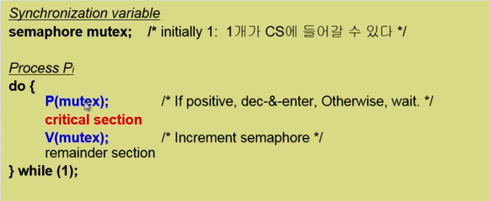
>
>   - critical section처럼 동시에 두 개가 들어가면 안되는 상황에서 
>
>     - P연산을 함 -> critical section에 들어가서 일을 함 -> 빠져나옴 -> V연산 함
>     - P 연산이 불가능할 땐
>     - Process 자체를 잠들게 함 => Block & Wakeup 방식
>
>     

## Deadlock and Starvation

- S와 Q 작업이 있다면 2개 자원 모두 가져야 할 수 있는 작업이라 할 때

  - ex. A라는 테입드라이브 내용을 읽어서 B에 저장

  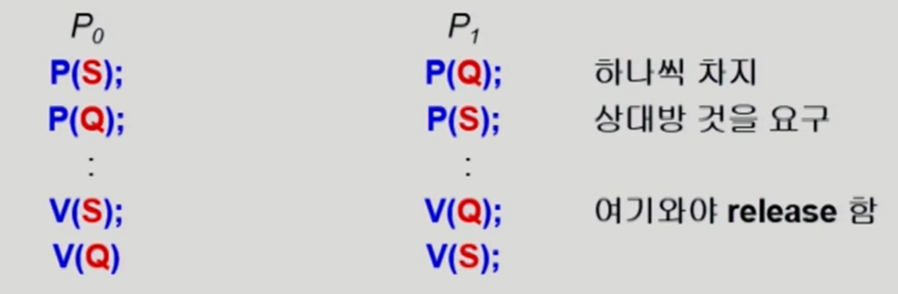

  - 이 때 S 자원을 얻은 상태에서 CPU가 P0에서 P1으로 넘어간다면 P0는 stop 상태 -> P0가 S를 가지고 있으므로 P1도 P(S) 연산 불가 => deadlock : 어느 누구도 진행이 불가능한 상황
    - 각각의 입장에서 본다면 Starvation : 세마포어 큐에서 빠져나갈 수 없는 현상
  - P1도 자원 S, Q 순으로 얻도록 설정 -> deadlock 발생하지 X

## Classical Problem of Synchronization

- Bounded-Buffer Problem (Producer-Consumer Problem)

  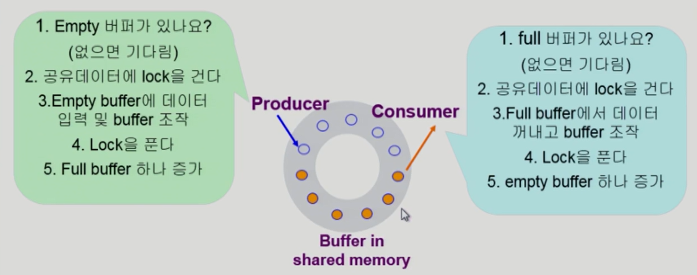

  - 크기가 유한한 공유버퍼
  - 프로세스가 동시에 접근 가능
  - 프로세스 종류 2 가지 : 
    - Producer : 데이터를 만들어 버퍼에 넣어줌
    - Consumer : 데이터 꺼내감
  - 문제 발생
    - 다른 프로듀서가 생겼을 때 동시에 한 버퍼에 데이터를 넣게 될 수 있음
  - 해결방법
    - lock을 걸어서 다른 프로듀서 접근을 막은 후 데이터 집어넣음
    - 비어있는 버퍼 위치를 다음 버퍼 위치로 변경 후 lock 품
  - 생산자 프로세스 입장 : 빈 버퍼가 자원
  - 소비자 프로세스 입장 : 내용이 든 버퍼가 자원
  - 자원의 개수를 세는 데 적당 => semaphore
    - Counting semaphore
      - 내용이 든 버퍼 개수 셈
    - Binary semaphore
      - 공유 버퍼의 lock 걸고 풀어서 동시접근 방지

  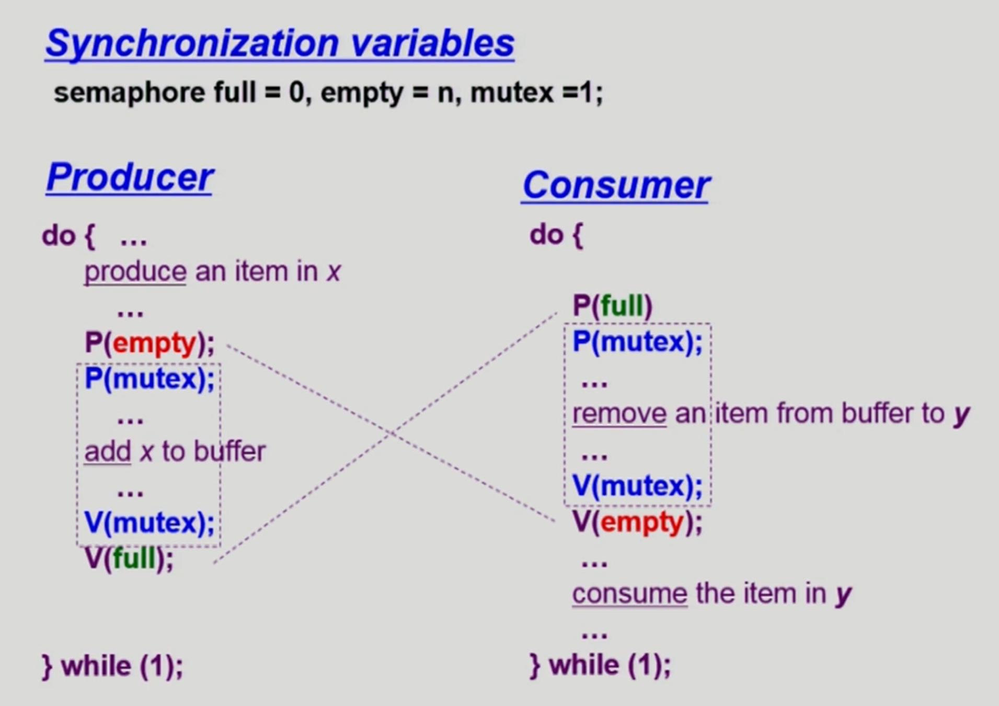

- Readers-Writers Problem

  - 읽는 프로세스 & 쓰는 프로세스
  - 읽거나 쓸 때 DB 접근 막아야겠다
  - reader는 동시에 여럿이, writer는 배타적으로
  - DB에 접근할 때 db로 lock을 걸어서 배타적인 접근하도록 함(reader가 걸었을 땐 다른 reader 접근 가능)
  - readcount > 0 : 다른 reader가 DB에 접근 중인 상태
  - readcount = 0 : 다른 reader가 DB에 접근 X
  - readcount(공유데이터)도 동시접근을 막기 위해 lock이 필요 

  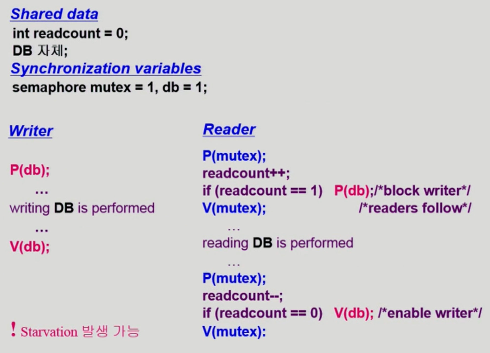

  - writer : DB에 lock을 걸어서 접근 -> 접근이 끝나면 lock 품
  - reader : 동시 접근을 위해 readcount 변수 변경 전에 readcount에 대해 lock을 검 -> 접근이 끝나면 lock을 품
    - 처음 접근하는 reader라면 DB에 lock 걸어야 함
    - 이미 다른 reader가 DB에 lock을 걸었다면 그대로 동시접근하면 됨
    - 마지막으로 빠져나가는 reader라면 DB의 lock을 풀어줌
  - starvation 발생가능! : writer가 무한정 기다릴 수 있음
    - 해결방법 : 일정시간까지 오는 reader들을 읽고 그 이후에 온 reader는 writer에게 기회를 준 후 다음 타임에

- Dining-Philosophers Problem

  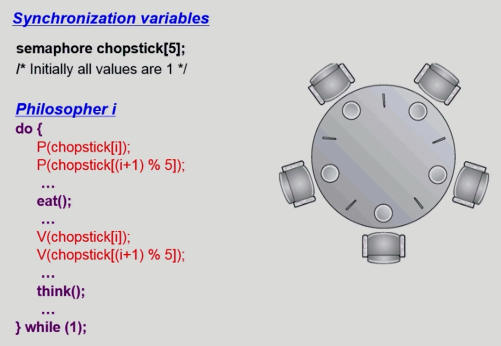

  - 동시접근 안됨(배타적)

  - 밥 먹을 때 왼쪽, 오른쪽 젓가락 동시에 사용

  - 다 먹으면 왼쪽, 오른쪽 젓가락 내려놓음

  - 문제 : deadlock 가능성 있음 (ex. 모두 왼쪽 젓가락 집는 경우)

  - 해결방안 :

    - 4명만 테이블에 동시에 안도록
    - 젓가락 2 개 모두 집을 수 있을 때만 젓가락 집도록
    - 비대칭 (ex. 짝수 철학자는 왼쪽, 홀수 철학자는 오른쪽 젓가락부터 집도록)

    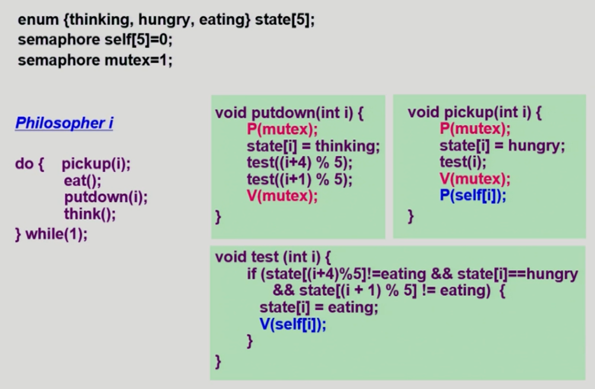

    - semaphore self = 1 : 모두 젓가락 2 개씩 집을 수 있는 상태. 테스트 전에는 0으로 설정. 테스트 후 값 변경해야 한다면 V연산으로. test 코드에서 V연산 못하면 P연산 시 잠들게 됨 
    - semaphore mutex : state 변수에 접근하기 전 lock 검
    - 밥 다 먹고 젓가락 내려놓을 때 본인 상태는 thinking으로 둠 -> 왼쪽, 오른쪽 철학자 테스트함(젓가락 이용 권한 주기 위해)

## Monitor

- Semaphore 문제점

  - 정확성 입증이 어려움

  - 자발적 협력(voluntary cooperation) 필요

  - 한번의 실수가 모든 시스템에 치명적 영향

  - P, V 연산 순서 중요

    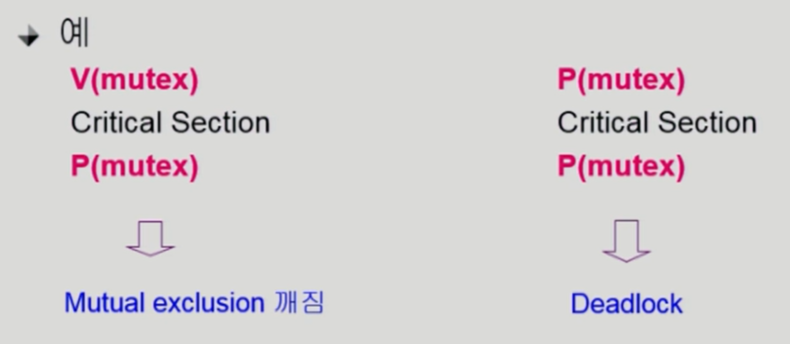

    - V 먼저 하면 동시접근 가능해짐
    - P만 하게 되면 계속 lock 걸려서 deadlock 상태

  => 그러한 문제점을 해결하고자 monitor가 나옴

- 동시 수행중인 프로세스 사이에서 abstract data type의 안전한 공유 보장하기 위한 high-level synchronization construct

  - 고급 프로그래밍 언어 차원에서 제공하는 동기화 수단

  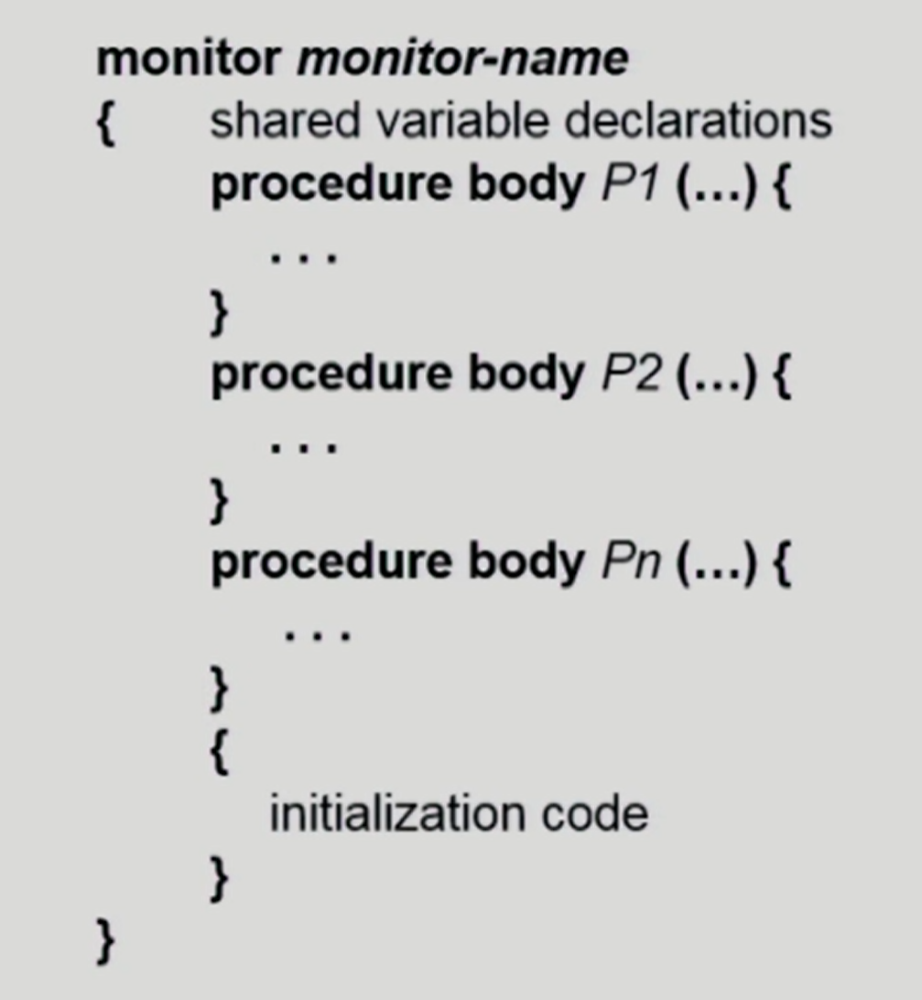

  - monitor 안의 공유데이터, 그 공유데이터를 접근할 때는 프로시져를 통해서 접근하는 구조
    - active 함수는 하나로 제한
  - 공유데이터에 대한 동시접근을 책임짐
    - semaphore는 자원 갯수에 대한 원자적 연산 제공, 접근은 프로그래머 책임(lock 걸고 품)

  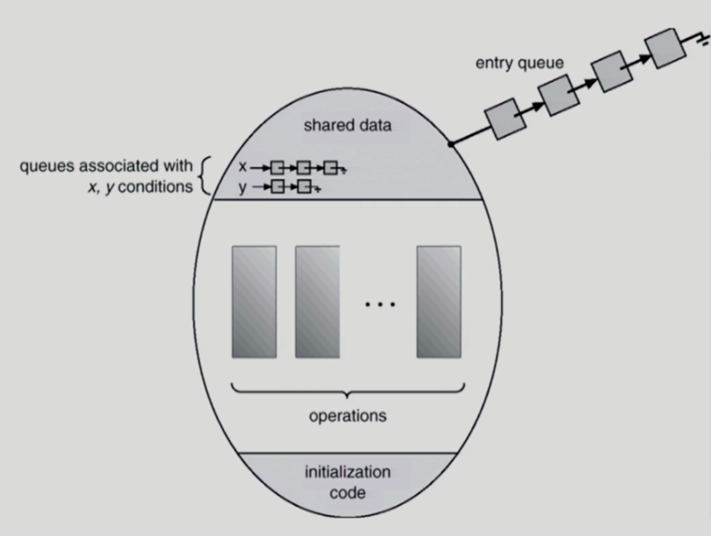

- 자원의 여분이 없는 상황 : 프로세스가 모니터 안에서 기다릴 수 있도록 하기 위해

  - condition variable 사용(semaphore 변수와 비슷)

    - 여분이 없을 때 wait 연산으로 줄서서 잠들게 함

    - 여분이 없어서 잠든 프로세스를 깨울 때 signal 연산

    - 예시 1

      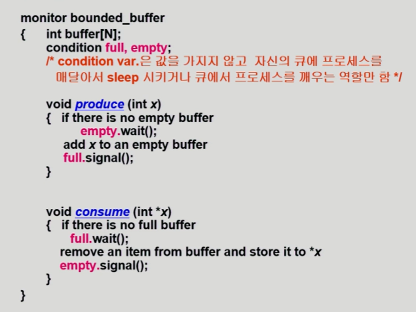

      - 모니터 안에서 활성화된 프로세스가 1 개로 한정됨
      - 빈 버퍼 있는지 체크 후 없으면 빈 버퍼가 생길 때까지 wait (blocked 상태)
      - 줄서서 잠들어 있는 프로세스가 없다면?
        - signal이 할 일이 없으면 아무 일도 일어나지 않음

    - 예시 2

      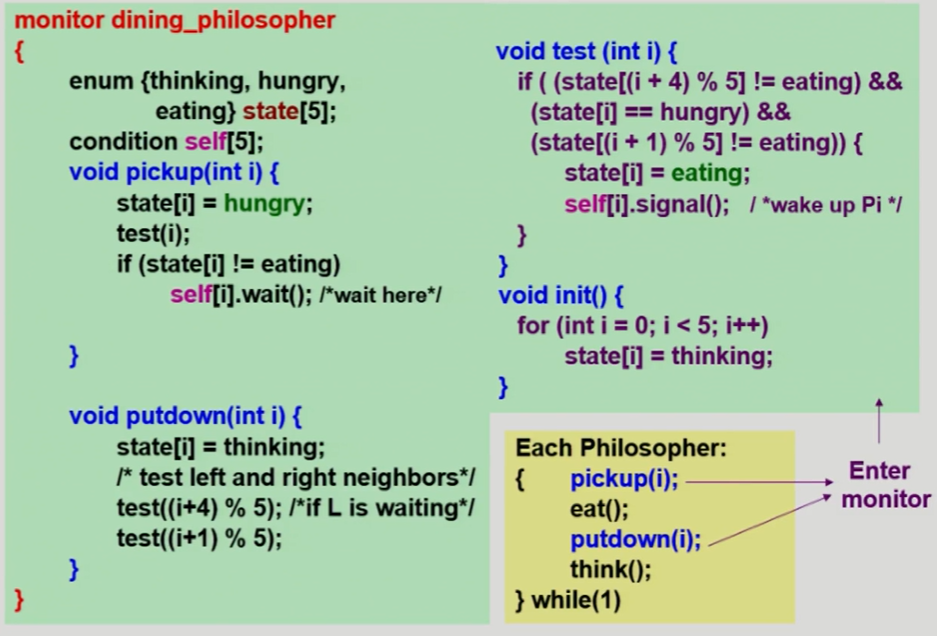

      - 모니터 안에 공유데이터 접근을 정의함 -> 모니터 안의 코드로만 실행되도록
      - 젓가락 잡는 것 직접 구현 X => 잡을 수 있는지 판단 위해 공유변수 둠(state, condition variable : 공유데이터)
      - 테스트 통과 하면 eat
      - 테스트 통과 못하면 hungry 상태로 큐에서 잠들게 됨(wait)

    

    

    

## Deadlock

- deadlock : 일련의 프로세스들이 서로가 가진 자원을 기다리며 blocked 상태

- Resource (자원)

  - semaphore 같은 소프트웨어 자원이거나 tape drive 같은 하드웨어 자원

    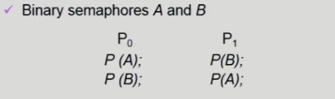

  - 프로세스가 자원을 사용하는 절차

    - Request(요청), Allocate(할당), Use(사용), Release(내놓음)

## Deadlock 발생의 4가지 조건

- Mutual exclusion (상호 배제)
  - 매순간 하나의 프로세스만
- No preemption (비선점)
  - 자원을 강제로 빼앗기지 않음
- Hold and wait (보유 대기)
  - 이미 가진 자원 내놓지 않고 못가진 자원 기다림
- Circular wait (환형 대기)
  - 필요한 자원끼리 사이클 형성

=> 4 가지 모두 충족해야 deadlock 발생

## Resource-Allocation Graph (자원할당그래프)

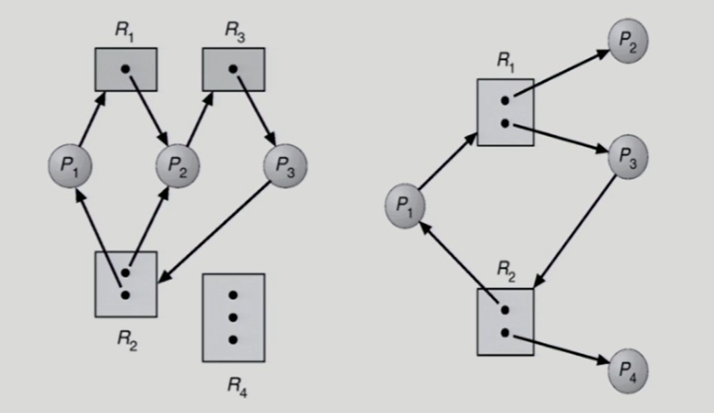

- 사이클이 생김 -> deadlock 발생 가능
- 왼쪽 그래프 : 사이클 2 개 형성 => deadlock
- 오른쪽 그래프 : deadlock X
  - P4가 R2의 인스턴스를 사용 후 반납하면 그 인스턴스를 P3에게 주면 됨 -> 사이클 풀림
- 정리
  - 그래프에 **cycle이 없으면** -> deadlock 아님
  - 그래프에 **cycle이 있으면**
    - 자원 당 하나의 인스턴스만 있다면 deadlock
    - 자원 당 여러 개의 인스턴스가 있다면, 반드시 deadlock은 X

## Deadlock의 처리 방법

- Deadlock Prevention

  - deadlock 발생 4 가지 조건 중 하나를 무산시킴

    - Hold and wait
      1. 프로세스 시작 시 모든 필요 자원 할당받게 함 => 자원낭비 문제 발생
      2. 자원 요청할 때 내가 가진 자원 내놓은 후 다시 요청
    - No Preemption
      - 자원 빼앗을 수 있게 함
      - state를 save & restore할 수 있는 자원은 빼앗을 수 있음(CPU, memory) -> 빼앗을 수 있는 자원 한정되어 있음
    - Circular wait
      - 할당 순서 정해서 순서대로 자원 할당

    => Utilization 저하, throughput 감소, starvation 문제

- Deadlock Avoidance

  - 추가적인 정보 이용해서 막음

  - 프로세스마다 평생 최대 자원을 얼마나 쓰는지 미리 앎 -> 그 정보를 이용해 deadlock 방지

    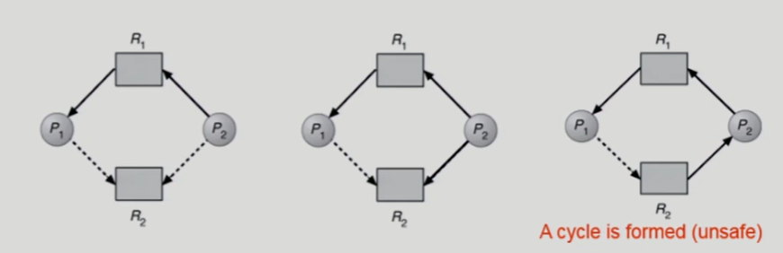

    - 가용자원이 있어도 자원을 주는 데 있어서 엄격히 함(보수적)

- Deadlock Detection and recovery

- Deadlock Ignorance

  - deadlock에 대해 책임지지 않음
