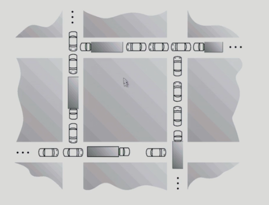
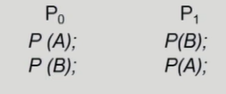
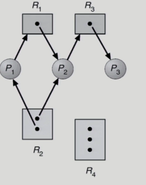
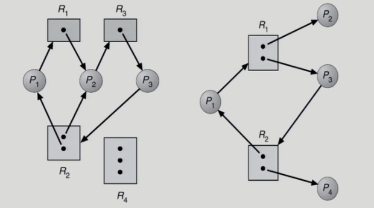
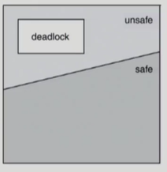
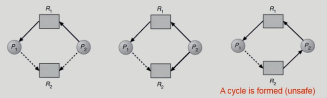
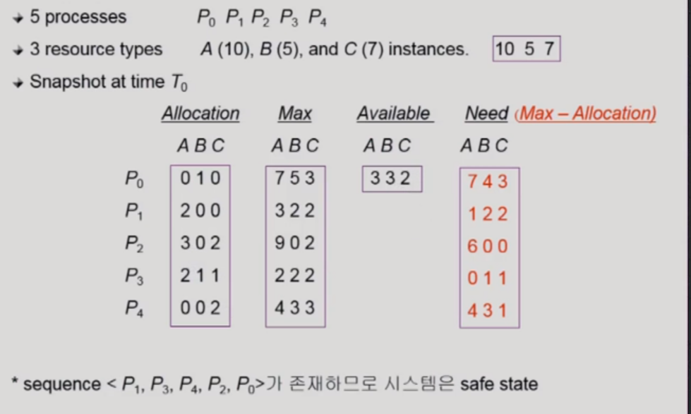
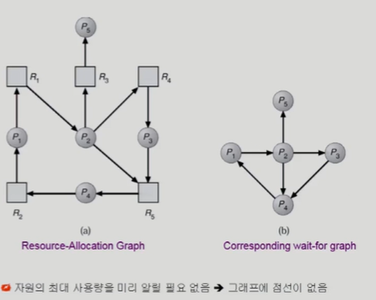
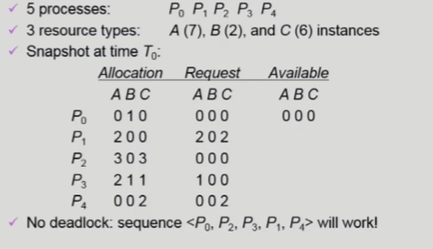

# 7. Deadlocks

### 교착상태(deadlock)

- 한 프로세스가 현재 가지고 있는 자원을 내놓지 않고 다른 자원을 기다릴 때, 다른 프로세스도 동일한 상황이어서 프로세스들이 모두 기다리고 있는 상황 

### The Deadlock Problem

- 💡**Deadlock**

  - <u>일련의 프로세스들이 서로가 가진 자원을 기다리며 block된 상태</u>

- 💡**Resource(자원)**

  - 하드웨어, 소프트웨어 등을 포함하는 개념

  - (예) I/O device, CPU cycle, memory space, semaphore 등

  - 프로세스가 자원을 사용하는 절차

    - Request(요청), Allocate(할당), Use(사용), Release(해방)

  - Deadlock Example 1

    - 시스템에 2개의 tape drive가 있다
    - 프로세스 P~1~과 P~2~ 각각이 하나의 tape drive를 보유한 채 다른 하나를 기다리고 있다

  - Deadlock Example 2

    - Binary semaphores A and B

      

### ⭐Deadlock 발생의 4가지 조건

- **Mutual exclusion**(상호 배제)
  - 매 순간 *하나의 프로세스만이 자원을 사용*할 수 있음
- **No preemption**(비선점)
  - 프로세스는 자원을 스스로 내어놓을 뿐 *강제로 빼앗기지 않음*
- **Hold and wait**(보유 대기)
  - 자원을 가진 프로세스가 *다른 자원을 기다릴 때 보유 자원을 놓지 않고 계속 가지고 있음*
- **Circular wait**(순환 대기)
  - 자원을 기다리는 *프로세스 간에 사이클이 형성*되어야 함
  - 프로세스 P~0~, P~1~, ..., P~n~이 있을 때
  - P~0~은 P~1~이 가진 자원을 기다림
  - P~1~은 P~2~이 가진 자원을 기다림
  - P~n-1~은 P~n~이 가진 자원을 기다림
  - P~n~은 P~0~이 가진 자원을 기다림

### Resource-Allocation Graph (자원 할당 그래프)

- Vertex
  - **Process P** = {P~1~, P~1~, ...,  P~n~}
    - 원으로 표현됨
  - **Resource R** = {R~1~, R~2~, R~m~}
    - 사각형으로 표현됨
- Edge
  - **request edge** P~i~->R~j~
    - 프로세스 P가 자원(R)을 요청한 상태
  - **assignment edge** R~j~ -> P~i~
    - 자원(R)이 프로세스(P)에 점유된 상태

- 그래프에 cycle이 없으면 deadlock이 아니다
- 그래프에 cycle이 있으면
  - 자원에 instance가 한 개씩만 있다면, deadlock이다.
  - 자원에 instance가 여러개라면 deadlock이 발생할 가능성이 있다.

### Deadlock의 처리 방법

- **Deadlock Prevention**
  - 자원 할당 시 *Deadlock의 4가지 필요 조건 중 어느 하나가 만족되지 않도록* 하는 방법
- **Deadlock Avoidance**
  - 자원 요청에 대한 부가적인 정보를 이용해서 *deadlock의 가능성이 없는 경우에만 자원을 할당*
  - 시스템 state가 원래 state로 돌아올 수 있는 경우에만 자원 할당
- **Deadlock Detection and recovery**
  - Deadlock 발생은 *허용*하되 그에 대한 *detection 루틴을 두어 deadlock 발견시 recover*
- **Deadlock Ignorance**
  - *Deadlock을 시스템이 책임지지 않음*
  - UNIX를 포함한 대부분의 OS가 채택

###  💡Deadlock Prevention

- **Mutual Exclusion**
  
  - 공유해서는 안되는 자원의 경우 *반드시 성립*해야 함
  
- **Hold and Wait**
  
  - 프로세스가 자원을 요청할 때 다른 어떤 자원도 가지고 있지 않아야 한다
    1. 프로세스 시작 시 *모든 필요한 자원을 할당*받게 하는 방법
    2. 자원이 필요할 경우 *보유 자원을 모두 놓고 다시 요청*
  
- **No preemption**
  
  - process가 어떤 자원을 기다려야 하는 경우 *이미 보유한 자원이 선점됨*
  - 모든 필요한 자원을 얻을 수 있을 때 그 프로세스는 다시 시작된다
  - state를 쉽게 save하고 restore할 수 있는 자원에서 주로 사용(CPU, memory)
  - 빼앗을 수 있는 자원을 한정되어 있음.
  
- **Circular Wait**
  
  - 모든 자원 유형에 할당 순서를 정하여 *정해진 순서대로만 자원 할당*
  - 예를 들어 순서가 3인 자원 R~1~를 보유 중인 프로세스가 순서가 1인 자원 R~j~을 할당받기 위해서는 우선 R~j~를 release해야 한다
  
  ❗Utilization 저하, throughput 감소, starvation 문제

### 💡Deadlock Avoidance

- *자원 요청에 대한 부가 정보*를 이용해서 자원 할당이 deadlock으로부터 *안전한지 동적으로 조사해서 **안전한 경우**에만 할당*

- 가장 단순하고 일반적인 모델은 프로세스들이 필요로 하는 각 자원별 *최대 사용량을 미리 선언*하도록 하는 방법임

  > **safe state**
  >
  > 시스템 내의 프로세스들에 대한 **safe sequence**가 존재하는 상태
  >
  > => deadlock이 발생하지 않는 상태

  > **safe sequence**
  >
  > - 프로세스 sequence <P~1~, P~2~, ..., P~n~>이 safe하려면 P~i~(1<=i<=n)의 자원 요청이 "가용 자원 + 모든 P~j~(J < i)의 보유 자원"에 의해 충족되어야 함
  >
  > - 조건을 만족하면 다음 방법으로 모든 프로세스의 수행을 보장
  >  - P~i~의 자원 요청이 즉시 충족될 수 없으면 모든 P~j~(j<i)가 종료될 때까지 기다린다
  >   - P~i-1~이 종료되면 P~i~의 자원 요청을 만족시켜 수행한다

- 즉, 시스템이 safe state에 있으면 no deadlock, 시스템이 unsafe state에 있으면 possibility of deadlock

  

  ❓ Deadlock을 회피하기 위한 방법은❓

  - 시스템이 unsafe state에 들어가지 않는 것을 보장
  - 2가지 경우의 avoidance 알고리즘
    - Single instance per resource types - Resource Allocation Graph algorithm 사용
    - Multiple instances per resource types - Banker's Algorithm 사용

### ▶️Resource Allocation Graph algorithm: Single instance per resource types

- 자원당 ***하나의 인스턴스***만 가지고 있을 경우 사용

- 점선을 포함해서 cycle이 발생해서 deadlock이 발생할 가능성이 있다면, 아예 자원을 점유할 수 없도록 하고 *안전한 상태에서 자원을 점유할 수 있도록 함*.

- **Claim edge** P~i~ -> R~j~
  - 프로세스가 P~i~가 자원 R~j~를 *미래에 요청할 수 있음을 뜻함*(**점선**으로 표시)
  - 프로세스가 해당 *자원 요청*시 request edge로 바뀜(**실선**)
  - R~j~가 release되면 assignment edge는 다시 claim edge로 바뀐다
- request edge의 assignment edge 변경시 (점선을 포함하여) ***cycle이 생기지 않는 경우에만*** 요청 자원을 할당한다
- Cycle 생성 여부 조사시 프로세스의 수가 n일 때 O(n^2^) 시간이 걸린다.

1. 프로세스 P~1~과 P~2~ 모두 자원 R~2~를 미래에 요청할 수 있기 때문에 점선(claim edge)

2. 프로세스 P~2~가 먼저 자원 R~2~를 요청(request edge)

3. 자원 R~2~가 프로세스 P~2~에 점유됨(assignment edge)

   - 만약, 프로세스 P~1~이 자원 R~2~를 요청하게 되면 cycle이 생성되어 deadlock에 걸린 가능성이 있음.

   - 그렇게 때문에 3번이 일어나지 않도록 함. 안전한 상황까지 기다리게 함.
   - 1번 프로세스가 자원 R~1~과 R~2~를 모두 사용하고 돌려놨을 때 P~2~가 점유하도록 함.

### ▶️Banker's Alogorithm: Multiple instances per resource types

- 가정

  - 모든 프로세스는 자원의 *최대 사용량을 미리 명시*
  - 프로세스가 요청 자원을 모두 할당받은 경우 유한 시간 안에 이들 자원을 다시 반납한다

- 방법

  - 기본 개념: *자원 요청시 **safe 상태를 유지**할 경우에만 할당*
  - ***총 요청 자원의 수가 가용 자원의 수보다 적은 프로세스를 선택***
    - 그런 프로세스가 없으면 unsafe
    - 그런 프로세스가 있으면 safe
  - safe하다면 그 프로세스에게 자원을 할당

  - 할당 받은 프로세스가 종료되면 모든 자원을 반납
  - 모든 프로세스가 종료될 때까지 이러한 과정 반복

- 예

  - 프로세스가 총 다섯개(P~0~, P~1~, P~2~, P~3~, P~4~) 있고 자원의 종류가 3가지 (A, B, C) 있다.
  - 각각의 자원의 인스턴스의 개수는 10, 5, 7개이다
  - 이러한 상황에서 각각의 프로세스에 A, B, C를 이미 할당(`Allocation`)한 상태라면, 현재 사용 가능한 자원은(`Available`) A 3개, B 3개, C 3개가 있다.
  - 그리고 각각의 프로세스가 최대로 사용할 자원의 개수를 `Max`라고 하고, 추가적으로 요청 가능한 자원은 `Need`(`Max` - `Allocation`)로 구할 수 있다.

  

  - 만약 이 상황에서 P~0~가 자원을 요청하다면 받아들여지지 않는다.

  - 그 이유는 현재 P~0~가 필요할 자원의 최대 수가 `(7, 4, 3)`개인데, 지금 현재 가용 자원은 `(3, 3, 2)`개로 더 적기 때문이다. 

  - 비록 자원의 여유가 있더라도 자원을 최대로 요청했을 때, 가용자원으로 처리되지 않기 때문에(deadlock이 발생할 위험이 있기 때문에) 요청을 받아들이지 않는다.

  - 그러나 P~3~의 요청은 `(0, 1, 1)`개 이기 때문에 받아들여진다.

    => banker's algorithm

  - sequence < P~1~, P~3~, P~4~, P~2~, P~0~>가 존재하므로 시스템은 safe state

    - P~1~ 종료 후 (5, 3, 2)
    - P~3~ 종료 후 (7, 4, 3)
    - P~4~ 종료 후 (7, 4, 5)
    - P~2~ 종료 후 (10, 4, 7)

### 💡 Deadlock Detection and Recovery

- **Deadlock Detection**: 시스템 내부에 deadlock이 생겼는지 여부

  - Resource type 당 single instance인 경우

    - **Resource-Allocation Graph**

      -  cycle이 곧 deadlock을 의미

    - **Wait-for graph** 알고리즘

      - 자원할당 그래프의 변형

        - 자원을 제외하고 프로세스만 가지고 그래프를 형성
        - 프로세스만으로 node 구성
        - P~j~가 가지고 있는 자원을 P~k~가 기다리는 경우 P~k~->P~j~

      - *사이클이 존재하는지를 주기적으로 조사*

      - O(n^2^)

        

  - Resource type 당 multiple instance인 경우

    - Banker's algorithm과 유사한 방법 활용(낙관적인 방법)

      

      - `Allocation` : 현재 할당된 자원의 수
      - `Request` :현재 **실제로** 요청된 자원의 수
      - `Available` : 현재 사용 가능한 자원의 수
      - 최악의 경우가 아닌 현재 요청된 자원의 수로 판단하여 sequence를 만들 수 있다면, deadlock이 없다고 생각.
      - 이 상황에서 P~2~가 C를 하나 요청한다면, deadlock이 발생할 수 밖에 없다.

- **Recovery**

  - 프로세스 종료(**Process termination**)
    - deadlock에 걸린 **모든 프로세스들을 종료**한다
    - deadlock cycle이 사라질 때까지 **한번에 하나의 프로세스를 종료**한다
  - 자원 강제 선점(**Resource Preemption**)
    - **비용을 최소화**할 victim의 선정
    - safe state로 rollback하여 process를 restart
    - **Starvation** 문제
      - 동일한 프로세스가 계속해서 victim으로 선정되는 경우
      - cost factor에 **rollback 횟수**도 같이 고려
        - : 비용을 최소화하는 것도 중요하지만 한 프로세스만 자꾸 종료되는 starvation 문제가 발생할 수 있기 때문에 rollback 횟수도 같이 고려해야한다.

### 💡Deadlock Ignorance

- Deadlock이 일어나지 않는다고 생각하고 아무런 조치도 취하지 않음
  - **Deadlock이 매우 드물게 발생**하므로 deadlock에 대한 조치 자체가 더 큰 overhead일 수 있음
  - 만약, 시스템에 deadlock이 발생한 경우 시스템이 비정상적으로 작동하는 것을 **사람이 느낀 후 직접 process를 죽이는 등의 방법으로 대처**
  - UNIX, Windows 등 대부분의 범용 OS가 채택
