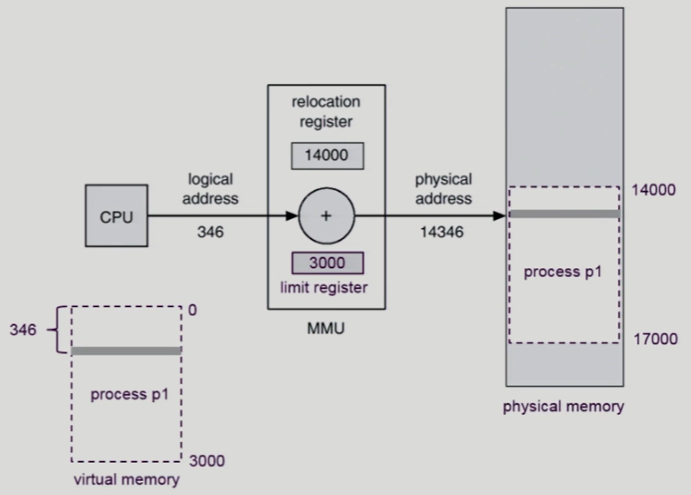
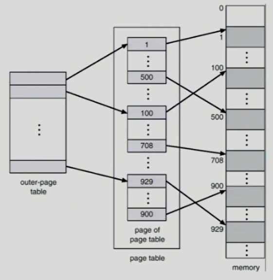

## Allocation of Physical Memory

- 두 영역
  - OS 상주 영역
    - 낮은 주소 영역 사용
  - 사용자 프로세스 영역
    - 높은 주소 영역 사용

- 사용자 프로세스 영역의 할당 방법

  - Contiguous allocation

  - Noncontiguous allocation

    : 프로그램을 구성하는 주소공간이 여러 개로 나눠져 각각이 물리적 메모리의 다른 위치에 올라가는 구조

    - Paging
    - Segmentation
    - Paged Segmentation

## Paging

- 프로세스의 가상 메모리를 동일한 사이즈의 page 단위로 나눔 -> page가 각각 다른 물리적 메모리 위치에 올라갈 수 있게

- 당장 필요한 부분은 물리적 메모리에 올려놓고, 일부는 backing storage에

- Basic Method

  - 물리적 메모리를 동일한 크기의 *frame*으로 나눔

  - 논리적 메모리를 동일한 크기의 *page*(4 킬로바이트씩)로 나눔(frame과 같은 크기)

  - page table을 이용해서 주소변환(logical address -> physical address)

  - External fragmentation 발생 X

    ✔️ 외부 조각 : 공간이 너무 작아서 아무도 못들어가서 낭비되는 공간

    ❗**연속 할당 기법과 비교**❗

    

    - Contiguous allocation : 프로그램의 크기 제각각 
      - 프로그램이 실행완료 후 빠져나가면 빈 공간이 생김 -> 그 빈 공간이 실행될 프로그램보다 작으면 그 공간에 프로그램이 못들어감

    - Paging
      - 같은 크기로 짤랐기 때문에 빈 페이지 frame이 있으면 어떤 page든지 들어갈 수 O

  - Internal fragmentation 발생 O

    ✔️ 내부 조각 : 공간이 프로그램에 할당이 되었지만 남은 공간(프로그램이 사용안하는 공간)

    - 가상 메모리를 page 크기로 나누다보면 마지막 프로그램이 page 크기보다 작을 수 있음

    

  

  - page tabel의 entry (index 같은 것 ex. 0, 1, 2, 3)

  

  - 앞의 page 번호는 page table을 통해 frame 번호로 변환됨

  - 뒤의 d(page 안에서 얼만큼 떨어져있는지에 대한 주소)는 바뀌지 않고 그대로

    

  - logical address의 단위 크기 : 프로그램을 구성하는 논리적인 메모리가 최대 용량 제한하는 것

  - 메모리에 매겨지는 주소 : 바이트 단위로 매겨짐(1 바이트마다 다른 주소)

  - ex. logical address가 1비트 주소 -> 1비트 : 0 or 1이므로 메모리 2 군데(2 바이트) 구분 가능

  - ex. logical address가 2비트 주소 -> 메모리 4 군데(4 바이트) 구분 가능

  - logical address가 32비트 -> 메모리 2^32 가지(4 기가(2^30) 바이트) 구분 가능

  - 4기가바이트/4킬로바이트 = 1메가바이트(100만 개 넘음) -> page table의 entry 약 100만 개 필요함

  

## Implementation of Page Table

- 프로세스마다 page table 존재
- page table 규모가 너무 큼(100만 개) -> register에 넣을 수 X -> **main memory에 들어감**
- page-table base register (PTBR) : page table의 시작 위치 가리킴
- page-table length register (PTLR) : 테이블 크기 보관
- memory 접근 2 번 : 주소 변환 위해 page table 접근 1번 & 데이터 접근 1번 => 속도 2배 느려짐
- translation look-aside buffer (TLB) 라 불리는 고속의 lookup hardware cache 사용(주소 변환 빠르게 함)

- CPU에서 논리적 주소 줌 -> 주소변환 요청 ->  TLB cache가 없을 땐 page table을 통해 주소변환 -> frame 번호 얻음(주소변환 종료) -> 물리적 메모리의 f번째 frame으로 가서 frame 내 d 번째 떨어진 위치에 가면 CPU가 요청한 내용 GET => page table이 메모리에 있어서 메모리 접근 2 번 하게 됨 -> 속도 향상하고자 page table의 일부 정보를 TLB에 담아둠
- TLB에 page P가 있을 땐 주소변환 -> 바로 메모리 접근

❗**TLB vs page table**❗

- page table : 위치와 크기 정보를 가지고 entry 찾기 가능
- TLB : 논리적 page number & 물리적 frame number 정보가 있어야 함(associative register(하드웨어)를 이용해서 병렬적으로 검색)

## Associative Register

- parallel search 가능
- TLB는 context switch 때 flush (remove old entries) => 오버헤드 있을 수 있음

## Effective Access Time

- TLB의 메모리 접근 시간

- 

  - TLB를 통해 주소 변환이 이루어지는 비율

- 

  - TLB 접근 시간

- 메모리 접근 시간 = 1

- 전제 : 메모리 접근 시간 > TLB 접근 시간

- Effective Access Time(EAT)

  

## Two-Level Page Table

- 현대 컴퓨터 : address space가  매우 큰 프로그램 지원
  - 32 bit address 사용시 : 2^32(4G)의 주소 공간
  - page table 공간 낭비가 심함 => 그래서 2단계 page table 사용

- 주소 변환 위해 메모리 접근 1번 더 늘어남 => but 공간상 이득
- 기존 page table : 논리적 메모리에 사용되는 부분 극히 일부 -> page table 낭비
- outer-page table은 page table 하나를 가리킴(1k 개)/ page table은 메모리의 4킬로 바이트 page 가리킴

- page 안에서 offset : 4k 구분함 -> 12 비트
- 전체(4킬로 바이트)/ 엔트리 하나(4바이트) = 1024 개 구분하기 위해 10 비트 필요 => p2는 10 비트 할당
- outer-page table의 시작 위치는 base register가 가지고 있음
- page of page table의 시작 위치는 outer-page table에/ 시작 위치로부터 얼마나 떨어져 있는지에 대한 정보는 p2에

=> **정리 : 1. 서로 다른 위치 2^n군데 구분하고 싶다 -> n 비트 필요  2. n 비트로 구분 가능한 위치가 몇군데? 2^n 가지**

## Multilevel Paging and Performance

- Address space가 커지면 다단계 페이지 테이블 필요
  - 문제 : 공간 크게 줄일 수 있지만 시간이 오래 걸림
- TLB 통해 메모리 접근 시간 줄일 수 있음
- 
  - TLB 접근 시간(20ns) + TLB 접근 실패 후 1, 2, 3, 4 단계 메모리 접근해야 함(400ns) + 실제 메모리 접근 시간(100ns) = 520ns

## Valid(v)/Invalid(i) Bit in a Page Table

- page table의 frame 번호가 disk에 내려가 있을 수도 있음(의미없는 번호) -> 0이면 메모리에 안 올라가있음
- invalid
  - 사용안하는 경우
  - 사용하는데 메모리에 올라가있지 않은 경우(disk에 내려간)