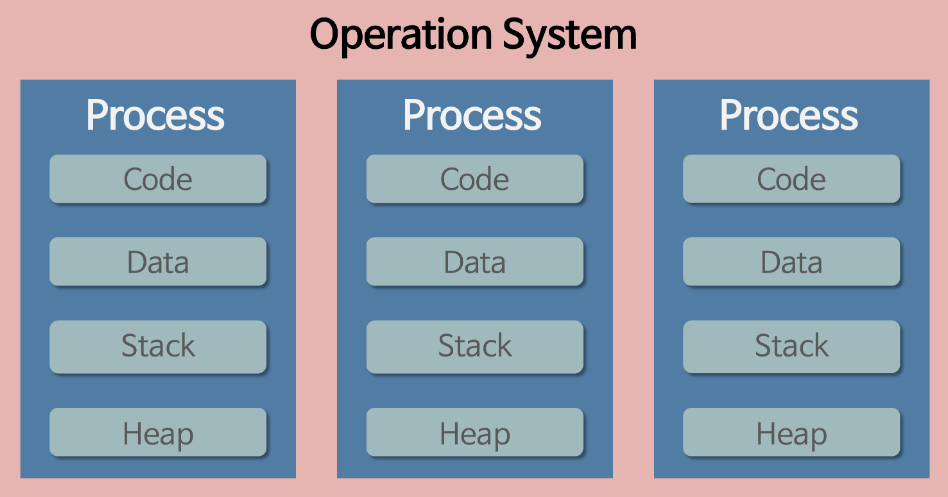
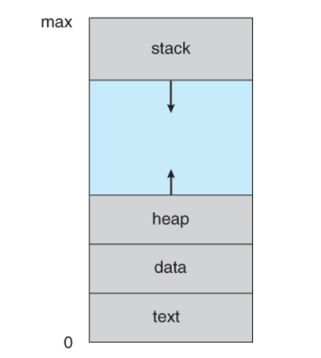
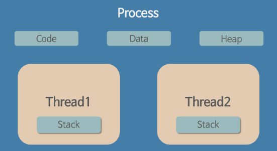
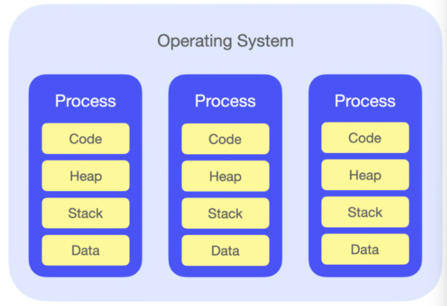
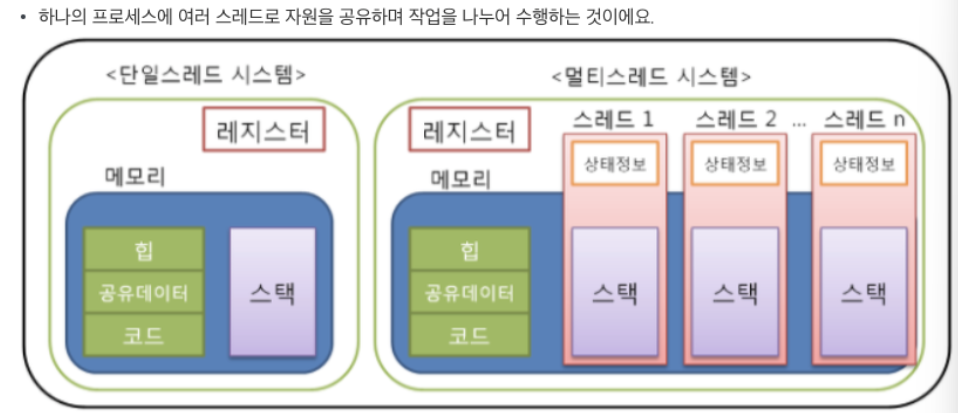

🔅 먼저 프로세스와 스레드의 개념부터 알아보자

#### 프로세스(Process)

- ✅ 사전적 의미 

  - 프로그램이 메모리에 올라와 CPU를 할당받고 `프로그램`이 실행되고 있는 상태. (동적인 개념)
    - `프로그램` : 어떤 작업을 위해 실행할 수 있는 파일. (정적인 개념)
  - 컴퓨터에서 연속적으로 실행되고 있는 컴퓨터 프로그램
  - 스케줄링의 대상이 되는 작업(task)이라는 용어와 거의 같은 의미로 쓰인다.
  - 운영체제로부터 시스템 자원을 할당받는 작업 단위

- 기본적으로 프로세스당 최소 1개의 스레드(메인 스레드)를 가진다

- 프로세스는 독립된 메모리 영역(code, data, stack, heap)을 할당 받는다.

  

  - **code** : 프로그램을 실행시키는 실행 파일 내의 명령어들이 올라가는 공간. 실행할 프로그램의 코드가 저장되고, CPU는 이 영역에서 명령어를 하나씩 가져와 처리한다.
  - **data** : 전역변수와 정적변수가 저장되고 프로그램이 시작될 때 할당되어 프로그램 종료시 소멸된다.
  - **stack** : 매개변수, 리턴값 등 잠시 사용되었다가 사라지는 데이터를 저장하는 영역. 
  - **heap** : 동적 할당을 위한 메모리 영역. 프로그래머가 필요할 때마다 사용하는 영역이다.

- 프로세스는 별도의 주소 공간에서 실행되므로, 다른 프로세스의 주소 공간(변수, 자료구조 등)에 접근할 수 없다.

#### 스레드(Thread)

- ✅ 사전적 의미
  - 프로세스 내에서 실행되는 여러 흐름의 단위
  - 프로세스의 특정한 수행 경로
  - 프로세스가 할당받은 자원을 이용하는 실행의 단위

- 스레드는 프로세스 내에서 stack만 따로 할당 받고, code, data, heap 영역은 공유한다.
- 일반적으로 한 프로그램은 하나의 스레드를 가지고, 둘 이상의 스레드를 동시에 실행한다면 이를 `멀티스레드`라고 한다.
- 프로세스 내의 주소 공간이나 자원들(Heap 공간)을 같은 프로세스 내에 스레드끼리 공유하면서 실행하지만 다른 프로세스의 메모리에 직접 접근할 수 없다.
- 각각의 스레드는 별도의 레지스터와 스택을 갖고 있지만, 힙 메모리는 서로 읽고 쓸 수 있다.

----

❗그래서 멀티 프로세스와 멀티 쓰레드란?!

### 멀티 프로세스

- 사전적 의미
  - 여러 개의 프로세스가 서로 협력적으로 일을 처리하는 것
  - 여러 개의 프로세스가 작업을 병렬처리하는 것
  - 각 프로세스간 메모리 구분이 필요하거나 독립된 주소 공간을 가져야 할 때 사용

- 장점
  - 독립된 구조이기 때문에 안정성이 높다
  - 여러 프로세스가 같이 작업하고 있기 때문에 하나의 프로세스가 죽는다 해도 문제가 확산되지 않는다.
  - 여러 개의 프로세스가 처리되어야 할 때 동일한 데이터를 사용하고, 이러한 데이터를 하나의 디스크에 두고 모든 프로세서(CPU)가 이를 공유하면 비용적으로 저렴해진다.
- 단점
  - 멀티 스레드보다 많은 메모리 공간과 CPU 시간을 차지한다.
  - 독립된 메모리 영역이기 때문에 작업량이 많을수록(context switching이 자주 일어나서 주소 공간의 공유가 잦을 경우) 오버헤드가 발생하여 성능 저하가 발생할 수 있다.
  - `문맥교환(Context Switching)`이란?
    - CPU는 한 번에 하나의 프로세스만 실행 가능
    - CPU에서 여러 프로세스를 돌아가면서 작업을 처리하는데 이 과정을 뜻함
    - 즉, 동작중인 프로세스가 대기하면서 해당 프로세스 상태(context)를 보관하고, 대기하고 있던 다음 순서의 프로세스가 동작하면서 이전에 보관했던 프로세스의 상태를 복구하는 작업

### 멀티 스레드(Multi-Thread)

- 하나의 작업을 위해 프로세스에서 여러 스레드를 생성해 여러 CPU 코어를 사용하기 위한 작업
- 장점
  - 시스템 자원 소모가 감소하여 자원의 효율성이 증대
  - 프로세스를 생성하여 자원을 할당하는 시스템 콜이 줄어 자원을 효율적으로 관리할 수 있다
  - 시스템 처리율 향상(처리 비용 감소)
  - 스레드 간 데이터를 주고받는 것이 간단해지고 시스템 자원 소모가 줄어든다
  - 스레드 사이 작업량이 적어 context switching이 빠름(캐시 메모리를 비울 필요가 없음)
  - 간단한 통신 방법으로 프로그램 응답시간 단축
  - 스레드는 프로세스 내 스택 영역을 제외한 메모리 영역을 공유하기에 통신 비용이 적다
- 단점
  - 자원을 공유하기에 동기화 문제 발생 가능(병목현상, 데드락 등)
  - 하나의 스레드에 문제가 발생하면 전체 프로세스에 영향을 끼친다
  - 주의깊은 설계가 필요하고 디버깅이 어렵다(불필요 부분까지 동기화하면, 대기시간으로 인해 성능 저하 발생)
  - 단일 프로세스 시스템의 경우 효과를 기대하기 어렵다

#### 멀티 프로세스 대신 멀티 스레드를 사용하는 이유?

❗*프로그램을 여러 개 키는 것보다 하나의 프로그램 안에서 여러 작업을 해결하는 것이 더 효율적이다!*

- ***자원의 효율성 증대***
  - 프로세스를 생성하여 자원을 할당하는 시스템 콜이 줄어들어 자원을 효율적으로 관리할 수 있다.
    - 프로세스 간의 문맥 교환(context switching)시 단순히 CPU 레지스터 교체 뿐만 아니라 RAM과 CPU 사이의 캐쉬 메모리에 대한 데이터까지 초기화되므로 오버헤드가 크기 때문
  - 스레드는 프로세스 내의 메모리를 공유하기 때문에 독립적인 프로세스와 달리 스레드 간 데이터를 주고 받는 것이 간단해지고 시스템 자원 소모가 줄어들게 된다.

- ***처리 비용 감소 및 응답 시간 단축***
  - 프로세스 간의 통신(IPC)보다 스레드 간의 통신의 비용이 적으므로 작업들 간의 통신의 부담이 줄어든다.
    - 스레드는 stack 영역을 제외한 모든 메모리를 공유하기 때문
  - 프로세스 간의 전환 속도보다 스레드 간의 전환 속도가 빠르다
    - 문맥 교환(context switching)시 스레드는 stack 영역만 처리하기 때문