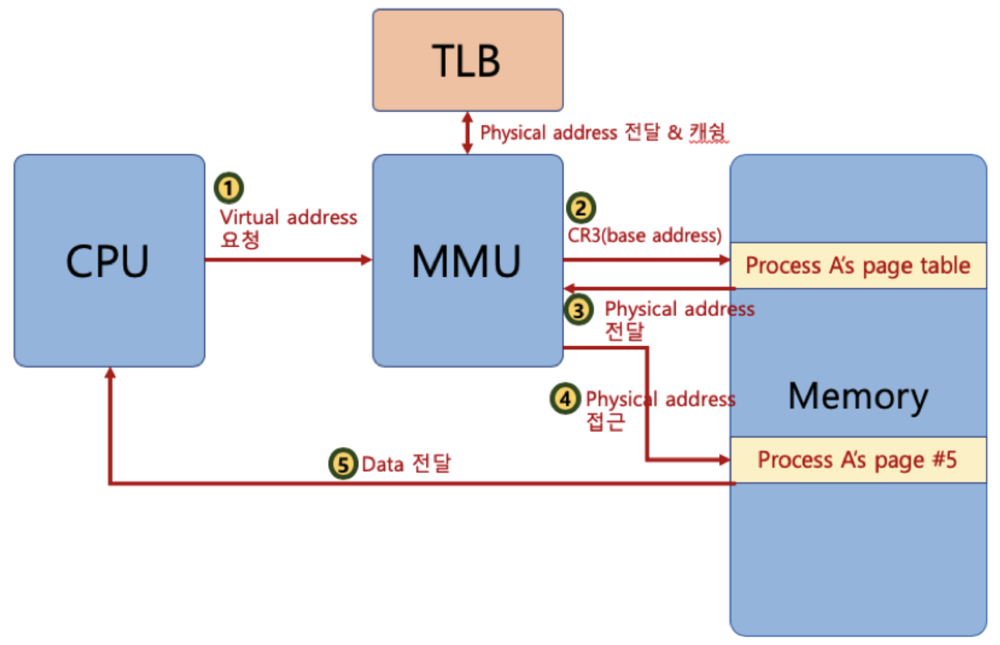

## Q10. 가상메모리와 페이지폴트에 대해 설명해주세요
> ⭐**요약**
>
> **가상메모리**란, <u>보조 기억장치에 비해 상대적으로 작은 크기를 가지고 있는 메인 메모리를 더 효율적으로 사용하기 위해 각 프로그램에 실제 메모리 주소가 아닌 가상의 메모리 주소를 주는 방식</u>을 의미합니다.
>
> 가상 메모리 기법을 사용하게 되면 CPU는 메모리의 실제 주소인 physical address 대신 virtual address로 먼저 접근하고 MMU를 통해 실제 주소로 변경한 다음 해당 메모리에 접근하게 됩니다.
>
> 이러한 가상 메모리를 사용할 때, 특정 시점마다 사용할 메모리를 실제 메모리에 올려 놓기 위해 일정 크기로 자르게 되는데, 이렇게 잘려진 각각의 가상메모리를 페이지라 부르며 이러한 방식을 페이지 단위로 실제 메모리에 올리고 내리는 작업을 페이징 기법이라 부릅니다. 
>
> 그런데 <u>실제 메모리에 사용하고자 하는 페이지가 없을 수 있는데, 이러한 상황</u>을 **페이지 폴트**라 합니다. 이때 실제 메모리에 빈 공간이 있다면 메모리에 해당 페이지를 채우면 되지만 그렇지 않을 경우 페이지 교체 알고리즘을 통해 페이지를 교체하게 됩니다.

**💡가상 메모리**

: 보조 기억장치에 비해 상대적으로 작은 크기를 가지고 있는 메인 메모리를 더 효율적으로 사용하기 위해 각 프로그램에 실제 메모리 주소가 아닌 가상의 메모리 주소를 주는 방식

- 특정 시점마다 *실제 사용하는 메모리는 그렇게 크지 않다*는 점에 착안해서 고안된 기술임

- 가상 메모리를 사용하게 되면 프로세스 간 공간 분리를 하게 되는데 이를 통해 **프로세스 간 메모리 영역 침범 이슈를 방지**할 수 있고, 보조 기억장치를 활용하면서 **메모리 용량 부족에 대한 이슈도 해결**할 수 있음

- ✅**주소 변환 과정**

  - 가상 메모리 기법을 사용하게 되면 CPU는 메모리의 실제 주소인 Physical Address 대신 Virtual address에 먼저 접근하게 된다.

  - 페이지 테이블을 참조하여 Virtual Address를 Physical Address로 변환하여 실제 메모리에 접근하게 된다

    - 변환 과정이 굉장히 빈번하게 일어나고 속도가 굉장히 중요하므로 MMU라는 하드웨어 칩의 지원을 받음

      > **MMU(Memory Management Unit)**
      >
      > : CPU가 코드를 실행하며 가상 메모리 주소에 접근할 때 가상 메모리 주소를 실제 물리적인 주소로 변환해주는 하드웨어 장치

💡**Page**

​	: 가상 메모리 기법을 사용할 때 어느정도의 크기씩 **실제 메모리에 올려놓는 기본 단위** 

- **페이지 단위로 관리하게 되며 페이지 번호를 바탕으로 가상 메모리 주소와 실제 메모리 주소를 매핑하여 페이지 테이블에 기록하고 관리**하게 됨

- 가상 메모리 주소 = (p, d)로 이루어져있고, p는 가상 메모리 페이지, d는 distance로 p 내 offset을 의미.

 

**가상 메모리 기법의 흐름**

- CPU가 명령어를 실행하던 중 가상 메모리 주소를 참조

- 하드웨어 칩셋인 MMU를 거쳐서 실제 메모리에 올라가있는 페이지 테이블을 참조하여 실질적인 메모리 주소로 변환

- 메모리에 접근

  > ❗메모리에 반복적으로 접근하고 데이터를 읽어오게 되는데 이러한 속도는 **CPU나 레지스터 처리 속도에 비하면 굉장히 느린 속도**이기 때문에 **성능 향상을 위해 TLB**라는 하드웨어를 사용.

 

**💡TLB**

: **최근에 접근한 페이지 정보를 기록하는 하드웨어 칩셋**

- 가상 메모리 주소가 한번 물리 주소로 변환되면 **TLB에 기록**하고 그 다음부턴 MMU가 페이지 테이블을 참조하는 것이 아닌 *TLB를 통해 물리 주소를 먼저 찾음.*
- 상대적으로 속도가 느린 메모리에 접근하는 횟수를 줄여 성능을 향상을 꾀함.

 

💡**페이지 폴트(Page fault)**

: 내가 찾는 페이지가 실제 메모리에 현재 적재되어 있지 않는 상황

- 가상 메모리 주소를 통해서 실제 물리 주소를 얻고 메모리에 접근했지만 내가 원하는 페이지가 실제 메모리에 적재되어 있지 않을 수 있음

- 페이지 폴트가 발생하면 보조기억장치에서 지금 내가 필요한 페이지를 가져옴

- ❗보조 기억장치는 메모리보다 속도가 더 느리기 때문에 자주 참조하면 성능이 떨어짐 

  => 페이지 폴트를 줄이기 위해서 다양한 기법들이 사용됨

 

**페이지 교체 알고리즘**

: 새로운 페이지를 가져오고자 할 때, 프레임을 비우고 새로운 페이지로 교체하기 위한 알고리즘 

- 페이지 교체
  - 페이지 폴트가 발생했을 시 물리 메모리에 비어있는 프레임이 있다면, 비어있는 프레임에 원하는 메모리를 보조 기억장치에서 가져오면 됨
  - 프레임이 가득 차 있을 시에는 페이지 교체 알고리즘을 통해 빈 프레임을 만들어주고 보조 기억장치에서 원하는 메모리를 가져와 적재해야 함
- FIFO, LRU 등
  - FIFO는 가장 먼저 물리 메모리에 적재된 페이지를 선택하는 방식
  - LRU는 Least Recent Used의 약자로 가장 오랫동안 사용되지 않았던 페이지를 선택하는 방식

**참고자료**

https://qazyj.tistory.com/355

